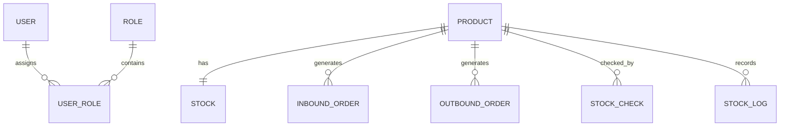

# 超市库存管理系统数据库结构（AI参考版）

> 数据库来源：`market.sql`（supermarket_inventory）  
> 目标：给 AI/代码生成工具提供**一致、可解析、可复用**的数据库结构说明（表、字段、约束、索引、外键、关系）。

---

## 1. 数据库基础信息

- 数据库名：`supermarket_inventory`
- 字符集：`utf8mb4`
- 排序规则：`utf8mb4_unicode_ci`
- 存储引擎：InnoDB（所有表）

---

## 2. 全表关系总览（ER）

> 说明：
> - `product` 是库存相关业务的主数据中心（被多表引用）。
> - `stock` 与 `product` 为 **1:1**（`stock.product_id` UNIQUE）。
> - `user` 与 `role` 为 **M:N**，通过 `user_role` 中间表实现。

---

## 3. 表结构明细（按建表顺序）

> 字段说明格式：`字段名 类型 约束/默认值 备注`

---

### 3.1 `user`（用户表）

**用途**：系统登录、身份认证、操作人信息记录。

**主键**
- `id` BIGINT, PK, AUTO_INCREMENT

**字段**
- `username` VARCHAR(50) NOT NULL
- `password` VARCHAR(100) NOT NULL
- `real_name` VARCHAR(50) NULL
- `status` TINYINT NOT NULL DEFAULT 1  COMMENT '0-禁用 1-启用'
- `create_time` DATETIME NOT NULL DEFAULT CURRENT_TIMESTAMP

**唯一索引**
- `uk_user_username (username)`

**被引用（外键入度）**
- `user_role.user_id` → `user.id`

---

### 3.2 `role`（角色表）

**用途**：角色定义（管理员、仓库管理员等），用于权限控制。

**主键**
- `id` BIGINT, PK, AUTO_INCREMENT

**字段**
- `role_name` VARCHAR(50) NOT NULL
- `role_code` VARCHAR(50) NOT NULL
- `remark` VARCHAR(100) NULL
- `create_time` DATETIME NOT NULL DEFAULT CURRENT_TIMESTAMP

**唯一索引**
- `uk_role_name (role_name)`
- `uk_role_code (role_code)`

**被引用（外键入度）**
- `user_role.role_id` → `role.id`

---

### 3.3 `product`（商品表）

**用途**：商品基础信息主数据；库存、入库、出库、盘点、日志均依赖该表。

**主键**
- `id` BIGINT, PK, AUTO_INCREMENT

**字段**
- `product_code` VARCHAR(50) NOT NULL
- `product_name` VARCHAR(100) NOT NULL
- `category` VARCHAR(50) NOT NULL
- `purchase_price` DECIMAL(10,2) NOT NULL
- `sale_price` DECIMAL(10,2) NOT NULL
- `status` TINYINT NOT NULL DEFAULT 1 COMMENT '0-下架 1-上架'
- `create_time` DATETIME NOT NULL DEFAULT CURRENT_TIMESTAMP

**唯一索引**
- `uk_product_code (product_code)`

**CHECK 约束**
- `purchase_price >= 0`
- `sale_price >= 0`
- `sale_price >= purchase_price`

**被引用（外键入度）**
- `stock.product_id` → `product.id`
- `inbound_order.product_id` → `product.id`
- `outbound_order.product_id` → `product.id`
- `stock_check.product_id` → `product.id`
- `stock_log.product_id` → `product.id`

---

### 3.4 `user_role`（用户-角色关联表）

**用途**：实现 user 与 role 的多对多关联。

**主键**
- `id` BIGINT, PK, AUTO_INCREMENT

**字段**
- `user_id` BIGINT NOT NULL
- `role_id` BIGINT NOT NULL

**唯一索引**
- `uk_user_role (user_id, role_id)`（防止重复分配同一角色）

**外键**
- `fk_user_role_user`: `user_id` → `user(id)`
- `fk_user_role_role`: `role_id` → `role(id)`

---

### 3.5 `stock`（库存表）

**用途**：维护商品的当前库存数量及上下限；与商品 1:1。

**主键**
- `id` BIGINT, PK, AUTO_INCREMENT

**字段**
- `product_id` BIGINT NOT NULL
- `quantity` INT NOT NULL
- `min_stock` INT NOT NULL
- `max_stock` INT NOT NULL
- `update_time` DATETIME NOT NULL DEFAULT CURRENT_TIMESTAMP ON UPDATE CURRENT_TIMESTAMP

**唯一索引**
- `uk_stock_product (product_id)`（保证 1:1）

**外键**
- `fk_stock_product`: `product_id` → `product(id)`

**CHECK 约束**
- `quantity >= 0`
- `min_stock >= 0`
- `max_stock >= min_stock`

---

### 3.6 `inbound_order`（入库单表）

**用途**：记录入库业务凭证；库存增加的业务来源。

**主键**
- `id` BIGINT, PK, AUTO_INCREMENT

**字段**
- `product_id` BIGINT NOT NULL
- `quantity` INT NOT NULL
- `operator` VARCHAR(50) NOT NULL
- `create_time` DATETIME NOT NULL DEFAULT CURRENT_TIMESTAMP

**外键**
- `fk_inbound_product`: `product_id` → `product(id)`

**CHECK 约束**
- `quantity > 0`

---

### 3.7 `outbound_order`（出库单表）

**用途**：记录出库业务凭证；库存减少的业务来源。

**主键**
- `id` BIGINT, PK, AUTO_INCREMENT

**字段**
- `product_id` BIGINT NOT NULL
- `quantity` INT NOT NULL
- `operator` VARCHAR(50) NOT NULL
- `create_time` DATETIME NOT NULL DEFAULT CURRENT_TIMESTAMP

**外键**
- `fk_outbound_product`: `product_id` → `product(id)`

**CHECK 约束**
- `quantity > 0`

---

### 3.8 `stock_check`（库存盘点表）

**用途**：记录盘点时的系统库存、实际库存及差异。

**主键**
- `id` BIGINT, PK, AUTO_INCREMENT

**字段**
- `product_id` BIGINT NOT NULL
- `system_quantity` INT NOT NULL
- `actual_quantity` INT NOT NULL
- `difference` INT NOT NULL
- `check_time` DATETIME NOT NULL DEFAULT CURRENT_TIMESTAMP

**外键**
- `fk_stock_check_product`: `product_id` → `product(id)`

**CHECK 约束**
- `system_quantity >= 0`
- `actual_quantity >= 0`

> 注：`difference` 在 SQL 中未写 CHECK 计算约束，通常建议由业务层/触发器保证：  
> `difference = actual_quantity - system_quantity`

---

### 3.9 `stock_log`（库存变更日志表）

**用途**：记录所有库存变更事件（入库/出库/盘点），用于审计与追溯。

**主键**
- `id` BIGINT, PK, AUTO_INCREMENT

**字段**
- `product_id` BIGINT NOT NULL
- `change_type` VARCHAR(20) NOT NULL COMMENT 'INBOUND / OUTBOUND / CHECK'
- `change_quantity` INT NOT NULL
- `before_quantity` INT NOT NULL
- `after_quantity` INT NOT NULL
- `create_time` DATETIME NOT NULL DEFAULT CURRENT_TIMESTAMP

**外键**
- `fk_stock_log_product`: `product_id` → `product(id)`

**CHECK 约束**
- `after_quantity >= 0`

---

## 4. 外键清单（可直接用于校验/生成代码）

| 外键名 | 子表.字段 | 父表(字段) | 关系含义 |
|---|---|---|---|
| fk_user_role_user | user_role.user_id | user(id) | 用户-角色关联必须指向合法用户 |
| fk_user_role_role | user_role.role_id | role(id) | 用户-角色关联必须指向合法角色 |
| fk_stock_product | stock.product_id | product(id) | 库存必须对应合法商品（且1:1） |
| fk_inbound_product | inbound_order.product_id | product(id) | 入库记录必须对应合法商品 |
| fk_outbound_product | outbound_order.product_id | product(id) | 出库记录必须对应合法商品 |
| fk_stock_check_product | stock_check.product_id | product(id) | 盘点记录必须对应合法商品 |
| fk_stock_log_product | stock_log.product_id | product(id) | 库存日志必须对应合法商品 |

---

## 5. 代码生成/AI使用建议（关键规则）

1. **所有主键均为自增**：插入时不传 `id`，由数据库生成。  
2. `create_time/update_time` 由数据库默认值与 ON UPDATE 维护（除非业务明确覆盖）。  
3. 涉及 `product_id/user_id/role_id` 的关联字段：仅存 ID，不在表结构层存对象。  
4. `stock` 表更新应当是系统的“单一入口”能力（业务层控制），并同步写入 `stock_log`。  
5. 删除策略建议：避免对 `product` 做级联删除（防止影响库存与历史单据/日志）。

---

## 6. 原始建表 SQL（引用）

- 结构源文件：`/mnt/data/market.sql`
