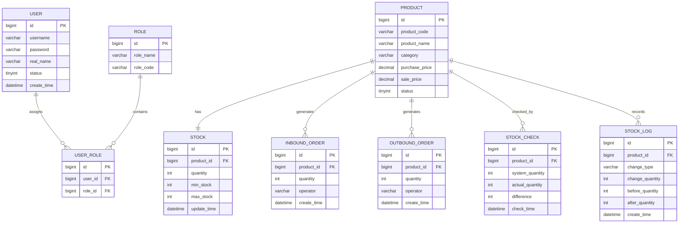

# 3 数据库设计

## 3.1 数据库设计概述

数据库设计是超市库存管理系统实现过程中的关键环节，其设计质量直接影响系统的数据一致性、运行效率以及后期的扩展与维护能力。本系统数据库设计以需求分析为依据，结合系统整体架构与业务模块划分，对系统中涉及的数据实体及其关系进行统一规划。

数据库设计遵循以下原则：

- 以业务需求为导向，确保数据结构能够完整支撑系统功能  
- 遵循单一职责原则，避免表结构职责混乱  
- 合理设置主键与外键，保证数据完整性  
- 核心库存数据集中管理，保证库存数据一致性与可追溯性  

---

## 3.2 数据库总体结构设计

### 3.2.1 数据库逻辑结构划分

根据系统功能模块及业务领域划分，数据库表主要分为以下几类：

1. **基础数据表**
   - 用户表（user）
   - 角色表（role）
   - 用户角色关联表（user_role）
   - 商品表（product）

2. **核心业务表**
   - 库存表（stock）
   - 入库单表（inbound_order）
   - 出库单表（outbound_order）
   - 库存盘点表（stock_check）

3. **业务日志表**
   - 库存变更日志表（stock_log）

该数据库结构与系统后端业务模块划分保持一致，能够有效支撑系统各功能模块的实现。

---

### 3.2.2 实体关系设计（E-R 图）

系统主要实体包括用户、角色、商品、库存、入库单、出库单、库存盘点及库存变更日志等。各实体之间的关系如下：

- 用户与角色之间为多对多关系，通过用户角色关联表实现  
- 商品与库存之间为一对一关系  
- 商品与入库单、出库单、库存盘点及库存变更日志之间为一对多关系  

系统通过库存变更日志表对所有库存数量变化进行统一记录，保证库存数据的可追溯性。

### 3.2.3 系统 E-R 关系图（Mermaid）

---

## 3.3 数据表结构设计

### 3.3.1 用户表（user）
| 字段名         | 数据类型         | 说明   |
| ----------- | ------------ | ---- |
| id          | bigint       | 主键   |
| username    | varchar(50)  | 登录账号 |
| password    | varchar(100) | 登录密码 |
| real_name   | varchar(50)  | 真实姓名 |
| status      | tinyint      | 用户状态 |
| create_time | datetime     | 创建时间 |

---

### 3.3.2 角色表（role） 
| 字段名       | 数据类型         | 说明   |
| --------- | ------------ | ---- |
| id        | bigint       | 主键   |
| role_name | varchar(50)  | 角色名称 |
| role_code | varchar(50)  | 角色标识 |
| remark    | varchar(100) | 备注   |

---

### 3.3.3 用户角色关联表（user_role）
| 字段名     | 数据类型   | 说明   |
| ------- | ------ | ---- |
| id      | bigint | 主键   |
| user_id | bigint | 用户ID |
| role_id | bigint | 角色ID |

---

### 3.3.4 商品表（product）
| 字段名         | 数据类型      | 说明     |
| -------------- | ------------- | -------- |
| id             | bigint        | 主键     |
| product_code   | varchar(50)   | 商品编号 |
| product_name   | varchar(100)  | 商品名称 |
| category       | varchar(50)   | 商品类别 |
| purchase_price | decimal(10,2) | 进价     |
| sale_price     | decimal(10,2) | 售价     |
| status         | tinyint       | 商品状态 |
| create_time    | datetime      | 创建时间 |

---

### 3.3.5 库存表（stock）
| 字段名         | 数据类型     | 说明     |
| ----------- | -------- | ------ |
| id          | bigint   | 主键     |
| product_id  | bigint   | 商品ID   |
| quantity    | int      | 当前库存数量 |
| min_stock   | int      | 库存下限   |
| max_stock   | int      | 库存上限   |
| update_time | datetime | 最近更新时间 |

---

### 3.3.6 入库单表（inbound_order）
| 字段名         | 数据类型        | 说明   |
| ----------- | ----------- | ---- |
| id          | bigint      | 主键   |
| product_id  | bigint      | 商品ID |
| quantity    | int         | 入库数量 |
| operator    | varchar(50) | 操作人  |
| create_time | datetime    | 入库时间 |

---

### 3.3.7 出库单表（outbound_order）
| 字段名         | 数据类型        | 说明   |
| ----------- | ----------- | ---- |
| id          | bigint      | 主键   |
| product_id  | bigint      | 商品ID |
| quantity    | int         | 出库数量 |
| operator    | varchar(50) | 操作人  |
| create_time | datetime    | 出库时间 |

---

### 3.3.8 库存盘点表（stock_check）
| 字段名             | 数据类型     | 说明   |
| --------------- | -------- | ---- |
| id              | bigint   | 主键   |
| product_id      | bigint   | 商品ID |
| system_quantity | int      | 系统库存 |
| actual_quantity | int      | 实际库存 |
| difference      | int      | 差异数量 |
| check_time      | datetime | 盘点时间 |

---

### 3.3.9 库存变更日志表（stock_log）

| 字段名             | 数据类型        | 说明    |
| --------------- | ----------- | ----- |
| id              | bigint      | 主键    |
| product_id      | bigint      | 商品ID  |
| change_type     | varchar(20) | 变更类型  |
| change_quantity | int         | 变更数量  |
| before_quantity | int         | 变更前库存 |
| after_quantity  | int         | 变更后库存 |
| create_time     | datetime    | 记录时间  |

---

## 3.4 数据库设计约束说明

- 库存表作为核心业务表，仅允许通过库存领域服务进行修改
- 入库、出库、盘点操作均通过业务逻辑间接影响库存数据
- 所有库存变更操作必须记录库存变更日志
- 报表模块仅进行数据查询，不允许直接修改业务数据

---

## 3.5 本章小结
本章围绕超市库存管理系统的业务需求与系统架构，对数据库结构进行了系统化设计，明确了各数据表的职责及实体之间的关系，为系统后续的后端开发与业务实现提供了可靠的数据基础。