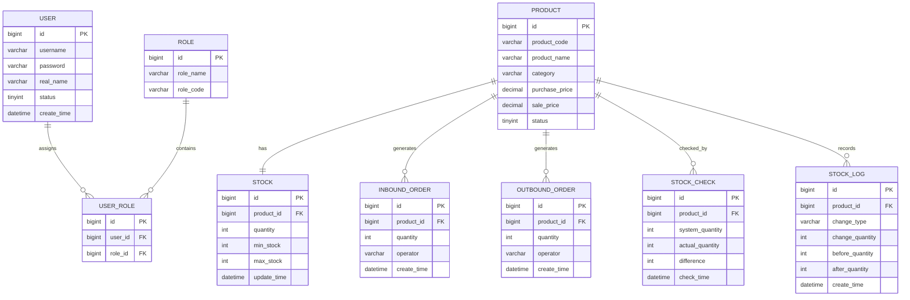
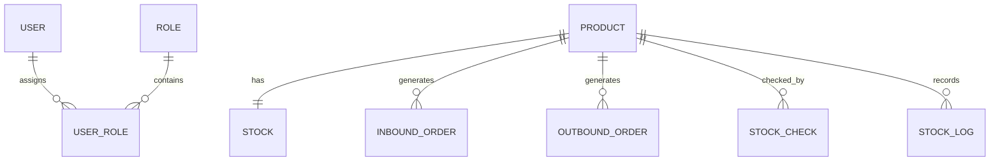

# 数据库设计汇总

> 本文档由多个同类文档合并生成，保留原文内容并按来源文件分节。

## 来源文件
- `2-系统设计/数据库设计/数据库设计.md`
- `2-系统设计/数据库设计/数据库结构_AI参考.md`
- `2-系统设计/数据库设计/1_user.md`
- `2-系统设计/数据库设计/2_role.md`
- `2-系统设计/数据库设计/3_user_role.md`
- `2-系统设计/数据库设计/4_product.md`
- `2-系统设计/数据库设计/5_stock.md`
- `2-系统设计/数据库设计/6_inbound_order.md`
- `2-系统设计/数据库设计/7_outbound_order.md`
- `2-系统设计/数据库设计/8_stock_check.md`
- `2-系统设计/数据库设计/9_stock_log.md`

## 数据库设计

来源：`2-系统设计/数据库设计/数据库设计.md`

# 3 数据库设计

## 3.1 数据库设计概述

数据库设计是超市库存管理系统实现过程中的关键环节，其设计质量直接影响系统的数据一致性、运行效率以及后期的扩展与维护能力。本系统数据库设计以需求分析为依据，结合系统整体架构与业务模块划分，对系统中涉及的数据实体及其关系进行统一规划。

数据库设计遵循以下原则：

- 以业务需求为导向，确保数据结构能够完整支撑系统功能  
- 遵循单一职责原则，避免表结构职责混乱  
- 合理设置主键与外键，保证数据完整性  
- 核心库存数据集中管理，保证库存数据一致性与可追溯性  

---

## 3.2 数据库总体结构设计

### 3.2.1 数据库逻辑结构划分

根据系统功能模块及业务领域划分，数据库表主要分为以下几类：

1. **基础数据表**
   - 用户表（user）
   - 角色表（role）
   - 用户角色关联表（user_role）
   - 商品表（product）

2. **核心业务表**
   - 库存表（stock）
   - 入库单表（inbound_order）
   - 出库单表（outbound_order）
   - 库存盘点表（stock_check）

3. **业务日志表**
   - 库存变更日志表（stock_log）

该数据库结构与系统后端业务模块划分保持一致，能够有效支撑系统各功能模块的实现。

---

### 3.2.2 实体关系设计（E-R 图）

系统主要实体包括用户、角色、商品、库存、入库单、出库单、库存盘点及库存变更日志等。各实体之间的关系如下：

- 用户与角色之间为多对多关系，通过用户角色关联表实现  
- 商品与库存之间为一对一关系  
- 商品与入库单、出库单、库存盘点及库存变更日志之间为一对多关系  

系统通过库存变更日志表对所有库存数量变化进行统一记录，保证库存数据的可追溯性。

### 3.2.3 系统 E-R 关系图（Mermaid）

---

## 3.3 数据表结构设计

### 3.3.1 用户表（user）
| 字段名         | 数据类型         | 说明   |
| ----------- | ------------ | ---- |
| id          | bigint       | 主键   |
| username    | varchar(50)  | 登录账号 |
| password    | varchar(100) | 登录密码 |
| real_name   | varchar(50)  | 真实姓名 |
| status      | tinyint      | 用户状态 |
| create_time | datetime     | 创建时间 |

---

### 3.3.2 角色表（role） 
| 字段名       | 数据类型         | 说明   |
| --------- | ------------ | ---- |
| id        | bigint       | 主键   |
| role_name | varchar(50)  | 角色名称 |
| role_code | varchar(50)  | 角色标识 |
| remark    | varchar(100) | 备注   |

---

### 3.3.3 用户角色关联表（user_role）
| 字段名     | 数据类型   | 说明   |
| ------- | ------ | ---- |
| id      | bigint | 主键   |
| user_id | bigint | 用户ID |
| role_id | bigint | 角色ID |

---

### 3.3.4 商品表（product）
| 字段名         | 数据类型      | 说明     |
| -------------- | ------------- | -------- |
| id             | bigint        | 主键     |
| product_code   | varchar(50)   | 商品编号 |
| product_name   | varchar(100)  | 商品名称 |
| category       | varchar(50)   | 商品类别 |
| purchase_price | decimal(10,2) | 进价     |
| sale_price     | decimal(10,2) | 售价     |
| status         | tinyint       | 商品状态 |
| create_time    | datetime      | 创建时间 |

---

### 3.3.5 库存表（stock）
| 字段名         | 数据类型     | 说明     |
| ----------- | -------- | ------ |
| id          | bigint   | 主键     |
| product_id  | bigint   | 商品ID   |
| quantity    | int      | 当前库存数量 |
| min_stock   | int      | 库存下限   |
| max_stock   | int      | 库存上限   |
| update_time | datetime | 最近更新时间 |

---

### 3.3.6 入库单表（inbound_order）
| 字段名         | 数据类型        | 说明   |
| ----------- | ----------- | ---- |
| id          | bigint      | 主键   |
| product_id  | bigint      | 商品ID |
| quantity    | int         | 入库数量 |
| operator    | varchar(50) | 操作人  |
| create_time | datetime    | 入库时间 |

---

### 3.3.7 出库单表（outbound_order）
| 字段名         | 数据类型        | 说明   |
| ----------- | ----------- | ---- |
| id          | bigint      | 主键   |
| product_id  | bigint      | 商品ID |
| quantity    | int         | 出库数量 |
| operator    | varchar(50) | 操作人  |
| create_time | datetime    | 出库时间 |

---

### 3.3.8 库存盘点表（stock_check）
| 字段名             | 数据类型     | 说明   |
| --------------- | -------- | ---- |
| id              | bigint   | 主键   |
| product_id      | bigint   | 商品ID |
| system_quantity | int      | 系统库存 |
| actual_quantity | int      | 实际库存 |
| difference      | int      | 差异数量 |
| check_time      | datetime | 盘点时间 |

---

### 3.3.9 库存变更日志表（stock_log）

| 字段名             | 数据类型        | 说明    |
| --------------- | ----------- | ----- |
| id              | bigint      | 主键    |
| product_id      | bigint      | 商品ID  |
| change_type     | varchar(20) | 变更类型  |
| change_quantity | int         | 变更数量  |
| before_quantity | int         | 变更前库存 |
| after_quantity  | int         | 变更后库存 |
| create_time     | datetime    | 记录时间  |

---

## 3.4 数据库设计约束说明

- 库存表作为核心业务表，仅允许通过库存领域服务进行修改
- 入库、出库、盘点操作均通过业务逻辑间接影响库存数据
- 所有库存变更操作必须记录库存变更日志
- 报表模块仅进行数据查询，不允许直接修改业务数据

---

## 3.5 本章小结
本章围绕超市库存管理系统的业务需求与系统架构，对数据库结构进行了系统化设计，明确了各数据表的职责及实体之间的关系，为系统后续的后端开发与业务实现提供了可靠的数据基础。

## 数据库结构_AI参考

来源：`2-系统设计/数据库设计/数据库结构_AI参考.md`

# 超市库存管理系统数据库结构（AI参考版）

> 数据库来源：`market.sql`（supermarket_inventory）  
> 目标：给 AI/代码生成工具提供**一致、可解析、可复用**的数据库结构说明（表、字段、约束、索引、外键、关系）。

---

## 1. 数据库基础信息

- 数据库名：`supermarket_inventory`
- 字符集：`utf8mb4`
- 排序规则：`utf8mb4_unicode_ci`
- 存储引擎：InnoDB（所有表）

---

## 2. 全表关系总览（ER）

> 说明：
> - `product` 是库存相关业务的主数据中心（被多表引用）。
> - `stock` 与 `product` 为 **1:1**（`stock.product_id` UNIQUE）。
> - `user` 与 `role` 为 **M:N**，通过 `user_role` 中间表实现。

---

## 3. 表结构明细（按建表顺序）

> 字段说明格式：`字段名 类型 约束/默认值 备注`

---

### 3.1 `user`（用户表）

**用途**：系统登录、身份认证、操作人信息记录。

**主键**
- `id` BIGINT, PK, AUTO_INCREMENT

**字段**
- `username` VARCHAR(50) NOT NULL
- `password` VARCHAR(100) NOT NULL
- `real_name` VARCHAR(50) NULL
- `status` TINYINT NOT NULL DEFAULT 1  COMMENT '0-禁用 1-启用'
- `create_time` DATETIME NOT NULL DEFAULT CURRENT_TIMESTAMP

**唯一索引**
- `uk_user_username (username)`

**被引用（外键入度）**
- `user_role.user_id` → `user.id`

---

### 3.2 `role`（角色表）

**用途**：角色定义（管理员、仓库管理员等），用于权限控制。

**主键**
- `id` BIGINT, PK, AUTO_INCREMENT

**字段**
- `role_name` VARCHAR(50) NOT NULL
- `role_code` VARCHAR(50) NOT NULL
- `remark` VARCHAR(100) NULL
- `create_time` DATETIME NOT NULL DEFAULT CURRENT_TIMESTAMP

**唯一索引**
- `uk_role_name (role_name)`
- `uk_role_code (role_code)`

**被引用（外键入度）**
- `user_role.role_id` → `role.id`

---

### 3.3 `product`（商品表）

**用途**：商品基础信息主数据；库存、入库、出库、盘点、日志均依赖该表。

**主键**
- `id` BIGINT, PK, AUTO_INCREMENT

**字段**
- `product_code` VARCHAR(50) NOT NULL
- `product_name` VARCHAR(100) NOT NULL
- `category` VARCHAR(50) NOT NULL
- `purchase_price` DECIMAL(10,2) NOT NULL
- `sale_price` DECIMAL(10,2) NOT NULL
- `status` TINYINT NOT NULL DEFAULT 1 COMMENT '0-下架 1-上架'
- `create_time` DATETIME NOT NULL DEFAULT CURRENT_TIMESTAMP

**唯一索引**
- `uk_product_code (product_code)`

**CHECK 约束**
- `purchase_price >= 0`
- `sale_price >= 0`
- `sale_price >= purchase_price`

**被引用（外键入度）**
- `stock.product_id` → `product.id`
- `inbound_order.product_id` → `product.id`
- `outbound_order.product_id` → `product.id`
- `stock_check.product_id` → `product.id`
- `stock_log.product_id` → `product.id`

---

### 3.4 `user_role`（用户-角色关联表）

**用途**：实现 user 与 role 的多对多关联。

**主键**
- `id` BIGINT, PK, AUTO_INCREMENT

**字段**
- `user_id` BIGINT NOT NULL
- `role_id` BIGINT NOT NULL

**唯一索引**
- `uk_user_role (user_id, role_id)`（防止重复分配同一角色）

**外键**
- `fk_user_role_user`: `user_id` → `user(id)`
- `fk_user_role_role`: `role_id` → `role(id)`

---

### 3.5 `stock`（库存表）

**用途**：维护商品的当前库存数量及上下限；与商品 1:1。

**主键**
- `id` BIGINT, PK, AUTO_INCREMENT

**字段**
- `product_id` BIGINT NOT NULL
- `quantity` INT NOT NULL
- `min_stock` INT NOT NULL
- `max_stock` INT NOT NULL
- `update_time` DATETIME NOT NULL DEFAULT CURRENT_TIMESTAMP ON UPDATE CURRENT_TIMESTAMP

**唯一索引**
- `uk_stock_product (product_id)`（保证 1:1）

**外键**
- `fk_stock_product`: `product_id` → `product(id)`

**CHECK 约束**
- `quantity >= 0`
- `min_stock >= 0`
- `max_stock >= min_stock`

---

### 3.6 `inbound_order`（入库单表）

**用途**：记录入库业务凭证；库存增加的业务来源。

**主键**
- `id` BIGINT, PK, AUTO_INCREMENT

**字段**
- `product_id` BIGINT NOT NULL
- `quantity` INT NOT NULL
- `operator` VARCHAR(50) NOT NULL
- `create_time` DATETIME NOT NULL DEFAULT CURRENT_TIMESTAMP

**外键**
- `fk_inbound_product`: `product_id` → `product(id)`

**CHECK 约束**
- `quantity > 0`

---

### 3.7 `outbound_order`（出库单表）

**用途**：记录出库业务凭证；库存减少的业务来源。

**主键**
- `id` BIGINT, PK, AUTO_INCREMENT

**字段**
- `product_id` BIGINT NOT NULL
- `quantity` INT NOT NULL
- `operator` VARCHAR(50) NOT NULL
- `create_time` DATETIME NOT NULL DEFAULT CURRENT_TIMESTAMP

**外键**
- `fk_outbound_product`: `product_id` → `product(id)`

**CHECK 约束**
- `quantity > 0`

---

### 3.8 `stock_check`（库存盘点表）

**用途**：记录盘点时的系统库存、实际库存及差异。

**主键**
- `id` BIGINT, PK, AUTO_INCREMENT

**字段**
- `product_id` BIGINT NOT NULL
- `system_quantity` INT NOT NULL
- `actual_quantity` INT NOT NULL
- `difference` INT NOT NULL
- `check_time` DATETIME NOT NULL DEFAULT CURRENT_TIMESTAMP

**外键**
- `fk_stock_check_product`: `product_id` → `product(id)`

**CHECK 约束**
- `system_quantity >= 0`
- `actual_quantity >= 0`

> 注：`difference` 在 SQL 中未写 CHECK 计算约束，通常建议由业务层/触发器保证：  
> `difference = actual_quantity - system_quantity`

---

### 3.9 `stock_log`（库存变更日志表）

**用途**：记录所有库存变更事件（入库/出库/盘点），用于审计与追溯。

**主键**
- `id` BIGINT, PK, AUTO_INCREMENT

**字段**
- `product_id` BIGINT NOT NULL
- `change_type` VARCHAR(20) NOT NULL COMMENT 'INBOUND / OUTBOUND / CHECK'
- `change_quantity` INT NOT NULL
- `before_quantity` INT NOT NULL
- `after_quantity` INT NOT NULL
- `create_time` DATETIME NOT NULL DEFAULT CURRENT_TIMESTAMP

**外键**
- `fk_stock_log_product`: `product_id` → `product(id)`

**CHECK 约束**
- `after_quantity >= 0`

---

## 4. 外键清单（可直接用于校验/生成代码）

| 外键名 | 子表.字段 | 父表(字段) | 关系含义 |
|---|---|---|---|
| fk_user_role_user | user_role.user_id | user(id) | 用户-角色关联必须指向合法用户 |
| fk_user_role_role | user_role.role_id | role(id) | 用户-角色关联必须指向合法角色 |
| fk_stock_product | stock.product_id | product(id) | 库存必须对应合法商品（且1:1） |
| fk_inbound_product | inbound_order.product_id | product(id) | 入库记录必须对应合法商品 |
| fk_outbound_product | outbound_order.product_id | product(id) | 出库记录必须对应合法商品 |
| fk_stock_check_product | stock_check.product_id | product(id) | 盘点记录必须对应合法商品 |
| fk_stock_log_product | stock_log.product_id | product(id) | 库存日志必须对应合法商品 |

---

## 5. 代码生成/AI使用建议（关键规则）

1. **所有主键均为自增**：插入时不传 `id`，由数据库生成。  
2. `create_time/update_time` 由数据库默认值与 ON UPDATE 维护（除非业务明确覆盖）。  
3. 涉及 `product_id/user_id/role_id` 的关联字段：仅存 ID，不在表结构层存对象。  
4. `stock` 表更新应当是系统的“单一入口”能力（业务层控制），并同步写入 `stock_log`。  
5. 删除策略建议：避免对 `product` 做级联删除（防止影响库存与历史单据/日志）。

---

## 6. 原始建表 SQL（引用）

- 结构源文件：`/mnt/data/market.sql`

## 1_user

来源：`2-系统设计/数据库设计/1_user.md`

### 1.user 表的业务定位

user 表是**基础主数据表**，用于：

- 系统登录与身份认证
- 操作人信息记录（入库 / 出库 / 盘点等）
- 权限控制（通过 user_role 表关联角色）

因此，user 表必须满足以下要求：

- 用户身份唯一
- 登录信息完整
- 状态可控（启用 / 禁用）
- 能被其他表安全引用

---

### 2.需包含的约束类型分析

根据数据库完整性原则，user 表涉及的约束主要包括以下几类：

1. **实体完整性约束**：用于唯一标识系统用户  
2. **域完整性约束**：用于限制字段的合法取值范围  
3. **业务完整性约束**：结合业务规则保证数据合理性 

---

### 3.约束设计明细

| 序号 | 字段名 | 约束类型 | 约束定义 | 设计说明 |
|----|------|--------|--------|--------|
| 1 | id | 主键约束（PK） | PRIMARY KEY | 唯一标识系统用户 |
| 2 | id | 自增约束 | AUTO_INCREMENT | 用户ID自动生成，避免人工维护 |
| 3 | username | 唯一约束（UNIQUE） | UNIQUE(username) | 登录账号在系统中必须唯一 |
| 4 | username | 非空约束（NOT NULL） | NOT NULL | 用户必须具备登录账号 |
| 5 | password | 非空约束（NOT NULL） | NOT NULL | 用户必须设置登录密码 |
| 6 | status | 非空约束（NOT NULL） | NOT NULL | 明确用户当前状态 |
| 7 | status | 默认值约束 | DEFAULT 1 | 新建用户默认启用 |
| 8 | status | 取值范围约束 | 0 / 1 | 0 表示禁用，1 表示启用 |
| 9 | create_time | 非空约束（NOT NULL） | NOT NULL | 记录用户创建时间 |
| 10 | username | 长度约束 | VARCHAR(50) | 限制账号长度 |
| 11 | password | 长度约束 | VARCHAR(100) | 适配加密后密码存储 |

---

### 4.关键约束说明

- **用户名唯一约束**：保证系统中用户身份的唯一性  
- **非空约束与默认值设计**：防止产生无效或不完整数据  
- **状态字段设计**：通过状态控制机制实现用户的启用与禁用  
- **无外键设计**：保持基础数据表的独立性，便于系统扩展 

---

### 5.总结

通过对 user 表的约束设计，可以有效保证用户数据的完整性与一致性，为系统的权限控制和业务操作提供可靠的数据基础。

## 2_role

来源：`2-系统设计/数据库设计/2_role.md`

### 1.role表业务定位

role表用于**存储不同的角色**，如管理员、仓库管理员等，以便**权限控制**。每个角色具有一组特定的权限，系统通过 role 表来区分不同用户的功能权限。

- 不需要外键约束
   - 原因：其与 user 表的关系通过 user_role 中间表进行维护，因此无需在 role 表中引入外键。

---

### 2.约束设计分析

role 表涉及的约束类型包括：

1. 实体完整性（Entity Integrity）
	- 保证每个角色的唯一性和正确性

2. 域完整性（Domain Integrity）
	- 保证字段合法性，防止无效或错误数据

3. 业务完整性（Business Integrity）
	- 确保角色相关的业务规则得到实现，避免重复角色或不合理的角色设置

---

### 3.role表约束设计明细

| 序号 | 字段名      | 约束类型                   | 约束定义                  | 设计说明                             |
| ---- | ----------- | -------------------------- | ------------------------- | ------------------------------------ |
| 1    | id          | 主键约束（PK）             | PRIMARY KEY               | 唯一标识系统角色                     |
| 2    | id          | 自增约束（AUTO_INCREMENT） | AUTO_INCREMENT            | 角色ID自动生成，避免人工维护         |
| 3    | role_name   | 唯一约束（UNIQUE）         | UNIQUE(role_name)         | 角色名称在系统中必须唯一             |
| 4    | role_name   | 非空约束（NOT NULL）       | NOT NULL                  | 角色名称不能为空                     |
| 5    | role_code   | 唯一约束（UNIQUE）         | UNIQUE(role_code)         | 角色标识（代码）在系统中必须唯一     |
| 6    | role_code   | 非空约束（NOT NULL）       | NOT NULL                  | 角色代码不能为空                     |
| 7    | remark      | 长度约束                   | VARCHAR(100)              | 备注字段可选，用于描述角色的具体功能 |
| 8    | create_time | 非空约束（NOT NULL）       | NOT NULL                  | 记录角色创建时间                     |
| 9    | create_time | 默认值约束（DEFAULT）      | DEFAULT CURRENT_TIMESTAMP | 默认创建时间为当前时间               |

---

### 4.role 表关键约束说明

1. 唯一约束（UNIQUE）：
	- role_name 和 role_code 均设置了唯一约束，确保每个角色在系统中只有一个对应的标识和名称。

2. 非空约束（NOT NULL）：
	- role_name 和 role_code 是角色的基本信息，必须提供，不允许为空。

3. 自增约束（AUTO_INCREMENT）：

	- id 字段采用自增约束，确保每次新增角色时自动生成唯一的 ID。

4. 时间约束：
	- create_time 字段记录角色的创建时间，自动填充当前时间，确保数据的时效性和可追溯性。

### 5.总结

通过对 `role` 表的约束设计，可以有效确保系统角色数据的唯一性、完整性与合理性。角色表与用户的关联通过 `user_role` 中间表进行，避免了外键约束，从而保证了数据库的独立性和灵活性。

## 3_user_role

来源：`2-系统设计/数据库设计/3_user_role.md`

### 1.user_role表的业务定位

user_role 表用于描述系统中**用户与角色之间的多对多关系**。  
在库存管理系统中，一个用户可以拥有多个角色，一个角色也可以被分配给多个用户，因此需要通过中间表对这种多对多关系进行拆分与维护。

user_role 表不直接参与业务操作，其主要作用是：

- 建立用户与角色之间的关联关系  
- 支撑系统的权限控制与角色分配功能  
- 保证用户角色关系的数据完整性与一致性  

---

### ### 2.外键设计说明

user_role 表**必须设置外键约束**，用于保证关联关系的合法性：

- `user_id` 外键 → `user(id)`
- `role_id` 外键 → `role(id)`

通过外键约束，可以防止以下问题：

- 关联不存在的用户  
- 关联不存在的角色  
- 出现“脏数据”的用户角色关系  

---

### 3.user_role表约束类型分析

user_role 表涉及的约束主要包括：

1. **实体完整性约束**：保证每条关联记录可被唯一标识  
2. **参照完整性约束**：通过外键保证用户与角色存在  
3. **业务完整性约束**：防止重复分配同一角色  

---

### 4.user_role表约束设计明细

| 序号 | 字段名            | 约束类型               | 约束定义                 | 设计说明                      |
| ---- | ----------------- | ---------------------- | ------------------------ | ----------------------------- |
| 1    | id                | 主键约束（PK）         | PRIMARY KEY              | 唯一标识一条用户-角色关联记录 |
| 2    | id                | 自增约束               | AUTO_INCREMENT           | 关联记录ID自动生成            |
| 3    | user_id           | 外键约束（FK）         | REFERENCES user(id)      | 关联的用户必须存在            |
| 4    | role_id           | 外键约束（FK）         | REFERENCES role(id)      | 关联的角色必须存在            |
| 5    | user_id           | 非空约束（NOT NULL）   | NOT NULL                 | 关联记录必须指定用户          |
| 6    | role_id           | 非空约束（NOT NULL）   | NOT NULL                 | 关联记录必须指定角色          |
| 7    | user_id + role_id | 联合唯一约束（UNIQUE） | UNIQUE(user_id, role_id) | 防止同一用户重复分配同一角色  |

---

### 5.关键约束说明

- **外键约束设计**：确保用户角色关系的参照完整性  
- **联合唯一约束设计**：避免同一用户被重复分配同一角色  
- **中间表拆分设计**：规范实现多对多关系，符合数据库设计范式  

---

### 6 总结

通过 user_role 表对用户与角色的多对多关系进行拆分，可以在保证数据一致性的同时，提高系统权限管理的灵活性。  
外键约束与联合唯一约束的引入，有效避免了无效关联和重复数据的产生，为系统权限控制模块提供了可靠的数据支撑。

## 4_product

来源：`2-系统设计/数据库设计/4_product.md`

### 1.product 表的业务定位

product 表用于描述系统中**商品的基础信息**，是库存管理系统中的核心基础业务表之一。  
库存表、入库单表、出库单表、库存盘点表以及库存变更日志表均以 product 表作为业务关联基础。

product 表在系统中的主要作用包括：

- 统一维护商品的基础信息  
- 作为库存管理与业务操作的核心对象  
- 为入库、出库、盘点及统计分析提供数据依据  

---

### 2.外键设计说明

product 表**不设置外键约束**。

原因说明如下：

- product 表属于系统的基础业务主表  
- 其他业务表（如 stock、inbound_order、outbound_order 等）通过外键引用 product 表  
- 保持商品表的独立性，有利于系统扩展和数据维护  
- 避免因外键级联导致核心商品数据被误删除  

---

### 3.product 表约束类型分析

product 表涉及的约束主要包括：

1. **实体完整性约束**：保证商品在系统中的唯一标识  
2. **域完整性约束**：限制商品编号、名称及价格等字段的合法性  
3. **业务完整性约束**：保证商品状态及价格符合业务规则  

---

### 4.product 表约束设计明细

| 序号 | 字段名         | 约束类型             | 约束定义             | 设计说明                 |
| ---- | -------------- | -------------------- | -------------------- | ------------------------ |
| 1    | id             | 主键约束（PK）       | PRIMARY KEY          | 唯一标识系统商品         |
| 2    | id             | 自增约束             | AUTO_INCREMENT       | 商品ID自动生成           |
| 3    | product_code   | 唯一约束（UNIQUE）   | UNIQUE(product_code) | 商品编号在系统中必须唯一 |
| 4    | product_code   | 非空约束（NOT NULL） | NOT NULL             | 商品编号不能为空         |
| 5    | product_name   | 非空约束（NOT NULL） | NOT NULL             | 商品名称不能为空         |
| 6    | category       | 非空约束（NOT NULL） | NOT NULL             | 商品必须归属于某一类别   |
| 7    | purchase_price | 非空约束（NOT NULL） | NOT NULL             | 商品进价不能为空         |
| 8    | sale_price     | 非空约束（NOT NULL） | NOT NULL             | 商品售价不能为空         |
| 9    | purchase_price | 取值范围约束         | ≥ 0                  | 商品进价不能为负数       |
| 10   | sale_price     | 取值范围约束         | ≥ 0                  | 商品售价不能为负数       |
| 11   | sale_price     | 业务逻辑约束         | ≥ purchase_price     | 防止商品售价低于进价     |
| 12   | status         | 非空约束（NOT NULL） | NOT NULL             | 商品状态必须明确         |
| 13   | status         | 默认值约束           | DEFAULT 1            | 商品默认处于上架状态     |
| 14   | status         | 取值范围约束         | 0 / 1                | 0 表示下架，1 表示上架   |
| 15   | create_time    | 非空约束（NOT NULL） | NOT NULL             | 记录商品创建时间         |

---

### 5.关键约束说明

- **商品编号唯一约束**：保证商品在系统中的唯一性，是库存及业务关联的基础  
- **价格合法性约束**：防止出现负价格或不合理定价  
- **商品状态约束**：通过状态字段控制商品是否参与业务操作  
- **无外键设计**：保持商品表作为基础业务表的独立性  

---

### 6 总结

通过对 product 表约束的合理设计，可以有效保证商品数据的完整性与业务合理性，为库存管理、入库出库及统计分析等功能提供稳定可靠的数据基础。

## 5_stock

来源：`2-系统设计/数据库设计/5_stock.md`

### 1.stock 表的业务定位

stock 表用于描述系统中**商品的库存信息**，是库存管理系统的核心业务表。  
每一种商品在系统中仅对应一条库存记录，用于实时反映商品的库存数量及库存状态。

stock 表在系统中的主要作用包括：

- 维护商品的当前库存数量  
- 设置库存上下限，用于库存预警  
- 为入库、出库、盘点等业务操作提供数据支撑  
- 保证库存数据的一致性与准确性  

---

### 2.外键设计说明

stock 表**必须设置外键约束**。

- `product_id` 外键 → `product(id)`

外键设计说明如下：

- 每一条库存记录必须对应一个合法存在的商品  
- 防止出现“无商品对应的库存数据”  
- 保证库存数据与商品数据之间的参照完整性  

---

### 3.stock 表约束类型分析

stock 表涉及的约束主要包括：

1. **实体完整性约束**：保证库存记录的唯一性  
2. **参照完整性约束**：通过外键保证库存与商品之间的合法关联  
3. **业务完整性约束**：保证库存数量及库存范围符合业务规则  

---

### 4.stock 表约束设计明细

| 序号 | 字段名      | 约束类型             | 约束定义               | 设计说明                       |
| ---- | ----------- | -------------------- | ---------------------- | ------------------------------ |
| 1    | id          | 主键约束（PK）       | PRIMARY KEY            | 唯一标识一条库存记录           |
| 2    | id          | 自增约束             | AUTO_INCREMENT         | 库存记录ID自动生成             |
| 3    | product_id  | 外键约束（FK）       | REFERENCES product(id) | 库存必须对应存在的商品         |
| 4    | product_id  | 唯一约束（UNIQUE）   | UNIQUE(product_id)     | 保证商品与库存之间的一对一关系 |
| 5    | product_id  | 非空约束（NOT NULL） | NOT NULL               | 库存记录必须关联商品           |
| 6    | quantity    | 非空约束（NOT NULL） | NOT NULL               | 库存数量不能为空               |
| 7    | quantity    | 取值范围约束         | ≥ 0                    | 库存数量不允许为负数           |
| 8    | min_stock   | 非空约束（NOT NULL） | NOT NULL               | 库存下限必须明确               |
| 9    | min_stock   | 取值范围约束         | ≥ 0                    | 库存下限不能为负数             |
| 10   | max_stock   | 非空约束（NOT NULL） | NOT NULL               | 库存上限必须明确               |
| 11   | max_stock   | 业务逻辑约束         | ≥ min_stock            | 防止库存上限小于下限           |
| 12   | update_time | 非空约束（NOT NULL） | NOT NULL               | 记录库存最近一次更新时间       |

---

### 5.关键约束说明

- **商品与库存一对一约束**：通过 `product_id` 唯一约束，确保每种商品仅对应一条库存记录  
- **库存数量非负约束**：防止库存数据出现逻辑错误  
- **外键约束设计**：保证库存数据与商品数据之间的参照完整性  
- **库存范围约束**：通过上下限字段为库存预警提供数据基础  

---

### 6 总结

通过对 stock 表约束的合理设计，可以有效保证库存数据的准确性、一致性与可维护性。  
作为系统的核心业务表，stock 表为入库、出库、盘点及库存预警等功能提供了可靠的数据基础。

## 6_inbound_order

来源：`2-系统设计/数据库设计/6_inbound_order.md`

### 1.inbound_order 表的业务定位

inbound_order 表用于描述系统中**商品入库业务记录**，记录每一次商品入库的详细信息，是库存管理系统中的重要业务表之一。  
该表主要用于追踪商品的入库行为，并为库存数量的增加提供业务依据。

inbound_order 表在系统中的主要作用包括：

- 记录商品入库的业务过程  
- 作为库存增加操作的业务凭证  
- 支撑库存统计与入库历史查询功能  
- 为库存变更日志提供业务来源  

---

### 2.外键设计说明

inbound_order 表**必须设置外键约束**。

- `product_id` 外键 → `product(id)`

外键设计说明如下：

- 每一条入库记录必须对应一个合法存在的商品  
- 防止出现无效或非法的入库记录  
- 保证入库业务数据与商品数据之间的参照完整性  

---

### 3.inbound_order 表约束类型分析

inbound_order 表涉及的约束主要包括：

1. **实体完整性约束**：保证每条入库记录可被唯一标识  
2. **参照完整性约束**：通过外键保证入库商品的合法性  
3. **业务完整性约束**：保证入库数量及业务时间的合理性  

---

### 4.inbound_order 表约束设计明细

| 序号 | 字段名      | 约束类型             | 约束定义               | 设计说明             |
| ---- | ----------- | -------------------- | ---------------------- | -------------------- |
| 1    | id          | 主键约束（PK）       | PRIMARY KEY            | 唯一标识一条入库记录 |
| 2    | id          | 自增约束             | AUTO_INCREMENT         | 入库记录ID自动生成   |
| 3    | product_id  | 外键约束（FK）       | REFERENCES product(id) | 入库商品必须存在     |
| 4    | product_id  | 非空约束（NOT NULL） | NOT NULL               | 入库记录必须指定商品 |
| 5    | quantity    | 非空约束（NOT NULL） | NOT NULL               | 入库数量不能为空     |
| 6    | quantity    | 取值范围约束         | > 0                    | 入库数量必须为正数   |
| 7    | operator    | 非空约束（NOT NULL） | NOT NULL               | 记录入库操作人       |
| 8    | create_time | 非空约束（NOT NULL） | NOT NULL               | 记录入库操作时间     |

---

### 5.关键约束说明

- **外键约束设计**：确保入库记录所关联商品的合法性  
- **入库数量正数约束**：防止出现无意义或错误的入库操作  
- **业务与库存解耦设计**：入库单表仅记录业务，不直接修改库存  
- **库存变更触发机制**：入库成功后由业务层统一调用库存服务更新库存  

---

### 6 总结

通过对 inbound_order 表约束的合理设计，可以有效保证入库业务数据的完整性与准确性。  
入库单表作为库存增加的重要业务依据，为库存管理及库存变更追溯提供了可靠的数据支撑。

## 7_outbound_order

来源：`2-系统设计/数据库设计/7_outbound_order.md`

### 1.outbound_order 表的业务定位

outbound_order 表用于描述系统中**商品出库业务记录**，记录每一次商品出库的详细信息，是库存管理系统中的重要业务表之一。  
该表主要用于追踪商品的出库行为，并为库存数量的减少提供业务依据。

outbound_order 表在系统中的主要作用包括：

- 记录商品出库的业务过程  
- 作为库存减少操作的业务凭证  
- 支撑库存统计与出库历史查询功能  
- 为库存变更日志提供业务来源  

---

### 2.外键设计说明

outbound_order 表**必须设置外键约束**。

- `product_id` 外键 → `product(id)`

外键设计说明如下：

- 每一条出库记录必须对应一个合法存在的商品  
- 防止出现无效或非法的出库记录  
- 保证出库业务数据与商品数据之间的参照完整性  

---

### 3.outbound_order 表约束类型分析

outbound_order 表涉及的约束主要包括：

1. **实体完整性约束**：保证每条出库记录可被唯一标识  
2. **参照完整性约束**：通过外键保证出库商品的合法性  
3. **业务完整性约束**：保证出库数量及业务规则的合理性  

---

### 4.outbound_order 表约束设计明细

| 序号 | 字段名      | 约束类型             | 约束定义               | 设计说明             |
| ---- | ----------- | -------------------- | ---------------------- | -------------------- |
| 1    | id          | 主键约束（PK）       | PRIMARY KEY            | 唯一标识一条出库记录 |
| 2    | id          | 自增约束             | AUTO_INCREMENT         | 出库记录ID自动生成   |
| 3    | product_id  | 外键约束（FK）       | REFERENCES product(id) | 出库商品必须存在     |
| 4    | product_id  | 非空约束（NOT NULL） | NOT NULL               | 出库记录必须指定商品 |
| 5    | quantity    | 非空约束（NOT NULL） | NOT NULL               | 出库数量不能为空     |
| 6    | quantity    | 取值范围约束         | > 0                    | 出库数量必须为正数   |
| 7    | operator    | 非空约束（NOT NULL） | NOT NULL               | 记录出库操作人       |
| 8    | create_time | 非空约束（NOT NULL） | NOT NULL               | 记录出库操作时间     |

---

### 5.关键约束说明

- **外键约束设计**：确保出库记录所关联商品的合法性  
- **出库数量正数约束**：防止出现无效或错误的出库操作  
- **库存校验业务约束**：出库数量不得大于当前库存（由业务层校验）  
- **业务与库存解耦设计**：出库单表仅记录业务，不直接修改库存  
- **库存变更触发机制**：出库成功后由业务层统一调用库存服务更新库存  

---

### 6 总结

通过对 outbound_order 表约束的合理设计，可以有效保证出库业务数据的完整性与合理性。  
出库单表作为库存减少的重要业务依据，为库存管理及库存变更追溯提供了可靠的数据支撑。

## 8_stock_check

来源：`2-系统设计/数据库设计/8_stock_check.md`

### 1.stock_check 表的业务定位

stock_check 表用于描述系统中**商品库存盘点业务记录**，记录商品在盘点时的系统库存数量、实际库存数量及其差异情况，是库存管理系统中的重要业务表之一。  
该表主要用于反映库存盘点结果，并为库存调整与差异分析提供数据依据。

stock_check 表在系统中的主要作用包括：

- 记录商品库存盘点的业务过程  
- 对比系统库存与实际库存，分析库存差异  
- 为库存调整操作提供业务依据  
- 为库存管理审计与统计分析提供支持  

---

### 2.外键设计说明

stock_check 表**必须设置外键约束**。

- `product_id` 外键 → `product(id)`

外键设计说明如下：

- 每一条库存盘点记录必须对应一个合法存在的商品  
- 防止出现无效或非法的库存盘点数据  
- 保证盘点数据与商品数据之间的参照完整性  

---

### 3.stock_check 表约束类型分析

stock_check 表涉及的约束主要包括：

1. **实体完整性约束**：保证每条库存盘点记录可被唯一标识  
2. **参照完整性约束**：通过外键保证盘点商品的合法性  
3. **业务完整性约束**：保证盘点数量及差异数据的合理性  

---

### 4.stock_check 表约束设计明细

| 序号 | 字段名          | 约束类型             | 约束定义                          | 设计说明                 |
| ---- | --------------- | -------------------- | --------------------------------- | ------------------------ |
| 1    | id              | 主键约束（PK）       | PRIMARY KEY                       | 唯一标识一条库存盘点记录 |
| 2    | id              | 自增约束             | AUTO_INCREMENT                    | 盘点记录ID自动生成       |
| 3    | product_id      | 外键约束（FK）       | REFERENCES product(id)            | 盘点商品必须存在         |
| 4    | product_id      | 非空约束（NOT NULL） | NOT NULL                          | 盘点记录必须指定商品     |
| 5    | system_quantity | 非空约束（NOT NULL） | NOT NULL                          | 记录系统库存数量         |
| 6    | system_quantity | 取值范围约束         | ≥ 0                               | 系统库存数量不能为负数   |
| 7    | actual_quantity | 非空约束（NOT NULL） | NOT NULL                          | 记录实际库存数量         |
| 8    | actual_quantity | 取值范围约束         | ≥ 0                               | 实际库存数量不能为负数   |
| 9    | difference      | 业务逻辑约束         | actual_quantity - system_quantity | 反映库存差异情况         |
| 10   | check_time      | 非空约束（NOT NULL） | NOT NULL                          | 记录库存盘点时间         |

---

### 5.关键约束说明

- **外键约束设计**：确保库存盘点记录与商品数据之间的参照完整性  
- **库存数量非负约束**：防止盘点数据出现逻辑错误  
- **差异字段业务约束**：差异值由系统库存与实际库存计算得出，防止人工随意填写  
- **业务与库存解耦设计**：盘点表仅记录结果，库存调整由业务流程统一控制  

---

### 6 总结

通过对 stock_check 表约束的合理设计，可以有效保证库存盘点数据的准确性与可追溯性。  
库存盘点表为库存调整、审计分析及库存管理优化提供了可靠的数据基础。

## 9_stock_log

来源：`2-系统设计/数据库设计/9_stock_log.md`

### 1.stock_log 表的业务定位

stock_log 表用于描述系统中**商品库存变更的日志记录**，对每一次库存数量变化进行完整追踪，是库存管理系统中用于保证库存数据可追溯性的核心日志表。  
该表不直接参与业务操作，而是用于记录库存变更的全过程。

stock_log 表在系统中的主要作用包括：

- 记录库存数量变化的详细过程  
- 支撑库存变更的审计与追溯  
- 为问题排查与责任定位提供依据  
- 为库存统计与分析提供历史数据支持  

---

### 2.外键设计说明

stock_log 表**必须设置外键约束**。

- `product_id` 外键 → `product(id)`

外键设计说明如下：

- 每一条库存变更日志必须对应一个合法存在的商品  
- 防止出现无商品对应的库存变更记录  
- 保证库存日志数据与商品数据之间的参照完整性  

---

### 3.stock_log 表约束类型分析

stock_log 表涉及的约束主要包括：

1. **实体完整性约束**：保证每条库存变更日志可被唯一标识  
2. **参照完整性约束**：通过外键保证变更商品的合法性  
3. **业务完整性约束**：保证库存变更过程的合理性与可追溯性  

---

### 4.stock_log 表约束设计明细

| 序号 | 字段名          | 约束类型             | 约束定义               | 设计说明                               |
| ---- | --------------- | -------------------- | ---------------------- | -------------------------------------- |
| 1    | id              | 主键约束（PK）       | PRIMARY KEY            | 唯一标识一条库存变更日志记录           |
| 2    | id              | 自增约束             | AUTO_INCREMENT         | 日志记录ID自动生成                     |
| 3    | product_id      | 外键约束（FK）       | REFERENCES product(id) | 变更商品必须存在                       |
| 4    | product_id      | 非空约束（NOT NULL） | NOT NULL               | 日志记录必须关联商品                   |
| 5    | change_type     | 非空约束（NOT NULL） | NOT NULL               | 标识库存变更类型（入库、出库、盘点等） |
| 6    | change_quantity | 非空约束（NOT NULL） | NOT NULL               | 本次库存变更的数量                     |
| 7    | before_quantity | 非空约束（NOT NULL） | NOT NULL               | 变更前库存数量                         |
| 8    | after_quantity  | 非空约束（NOT NULL） | NOT NULL               | 变更后库存数量                         |
| 9    | after_quantity  | 取值范围约束         | ≥ 0                    | 变更后库存数量不能为负数               |
| 10   | create_time     | 非空约束（NOT NULL） | NOT NULL               | 记录库存变更发生时间                   |

---

### 5.关键约束说明

- **外键约束设计**：确保库存变更日志与商品数据之间的参照完整性  
- **库存变更前后数量记录**：完整反映库存变化过程，便于追溯与审计  
- **库存非负约束**：防止库存数据出现逻辑错误  
- **日志强制记录机制**：所有库存变更操作必须生成对应日志记录  

---

### 6 总结

通过对 stock_log 表约束的合理设计，可以实现对库存变更全过程的有效记录与追溯。  
库存变更日志表为系统库存数据的一致性、安全性与可审计性提供了重要保障，是库存管理系统中不可或缺的核心日志表。

