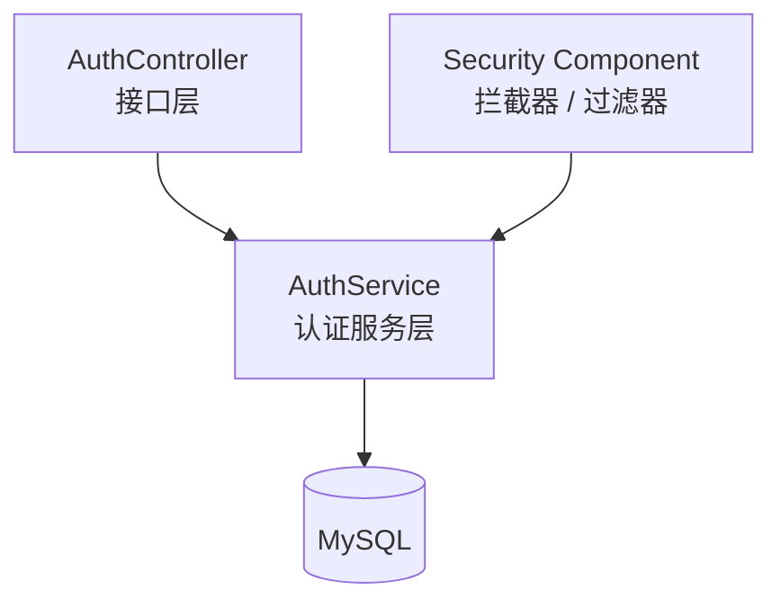

# 认证与权限模块（Auth）详细模块设计说明

---

## 1 模块概述

### 1.1 模块名称  
认证与权限模块（Auth）

### 1.2 模块定位  
认证与权限模块用于对系统访问进行统一控制，负责用户身份认证与接口访问权限校验，是系统的安全入口模块。  
该模块不参与任何业务数据处理，仅作为系统的**访问控制与安全保障模块**。

### 1.3 模块设计目标  

- 实现系统用户身份认证  
- 控制不同角色对系统功能的访问权限  
- 防止未授权用户访问系统资源  
- 与业务模块解耦，作为横切关注点存在  

---

## 2 模块职责说明

### 2.1 核心职责  

认证与权限模块主要承担以下职责：

1. 用户登录与身份校验  
2. 用户会话或 Token 管理  
3. 接口访问权限校验  
4. 统一拦截未授权访问请求  

### 2.2 职责边界约束  

为保证系统结构清晰，认证模块明确以下约束规则：

- **认证模块不参与任何业务流程处理**
- **认证模块不直接访问业务模块的数据**
- 认证逻辑通过拦截器或注解方式生效，而非显式业务调用  

---

## 3 模块依赖关系

### 3.1 模块依赖说明  

认证模块依赖以下模块：

- 用户管理模块（user）

### 3.2 依赖约束说明  

- 认证模块仅依赖用户与角色信息进行身份校验  
- 业务模块不得直接调用认证模块的内部逻辑  
- 认证模块不反向依赖任何业务模块  

---

## 4 模块内部结构设计

认证模块内部采用分层设计，主要包含 Controller、Service 与基础安全组件。

### 4.1 模块内部结构图（Mermaid）

------

## 5 各层详细设计说明

### 5.1 Controller 层设计

Controller 层负责提供认证相关接口，例如登录、登出等操作。

#### 主要功能

- 接收登录请求
- 返回认证结果与访问凭证

------

### 5.2 Service 层设计

Service 层负责具体认证逻辑处理，包括：

- 校验用户身份合法性
- 校验用户状态
- 生成或校验访问凭证

------

### 5.3 安全组件设计

系统通过拦截器或过滤器方式，对所有受保护接口进行统一权限校验：

- 校验用户是否已登录
- 校验用户是否具备访问接口的权限

------

## 6 认证流程设计

### 6.1 登录流程说明

1. 用户提交登录请求
2. 系统校验用户名与密码
3. 认证成功后生成访问凭证
4. 后续请求通过拦截器进行权限校验

------

## 7 本模块小结

认证与权限模块通过统一的身份校验与权限控制机制，为系统提供安全可靠的访问保障。该模块与业务模块完全解耦，确保系统安全控制逻辑的集中管理与可维护性。
