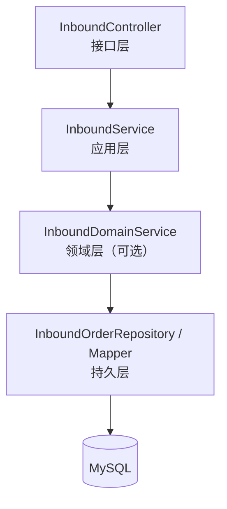
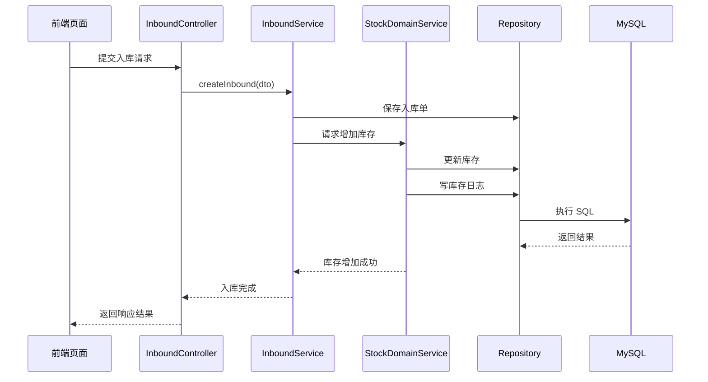

# 入库管理模块（Inbound）详细模块设计说明

---

## 1 模块概述

### 1.1 模块名称  
入库管理模块（Inbound）

### 1.2 模块定位  
入库管理模块用于记录和管理商品的入库业务，描述库存**“为什么增加”**的业务原因。本模块不直接维护库存数量，而是通过调用库存管理模块完成库存的实际变更。

### 1.3 模块设计目标  

- 规范商品入库业务流程  
- 记录每一次入库操作的业务信息  
- 保证入库操作与库存变更的一致性  
- 避免入库模块直接修改库存数据  

---

## 2 模块职责说明

### 2.1 核心职责  

入库管理模块主要承担以下职责：

1. 接收并处理商品入库请求  
2. 生成并保存入库单据  
3. 记录入库数量、时间及操作人员  
4. 调用库存模块完成库存增加操作  

### 2.2 职责边界约束  

为保证系统结构清晰，入库模块明确以下约束规则：

- **入库模块不允许直接修改库存表（stock）**
- **入库模块仅负责“业务记录”，不负责“库存规则判断”**
- 库存数量变更必须由库存模块统一完成  

---

## 3 模块依赖关系

### 3.1 模块依赖说明  

入库模块依赖以下模块：

- 库存管理模块（stock）

### 3.2 依赖约束说明  

- 入库模块只能通过库存模块提供的服务接口进行库存变更  
- 入库模块不反向依赖其他业务模块  
- 入库模块不关心库存变更的具体规则实现  

---

## 4 模块内部结构设计

入库模块内部采用统一的分层架构设计，划分为 Controller、Service、Domain（可选）与 Repository 层。

### 4.1 模块内部结构图（Mermaid）

> 说明：
> 入库模块以业务记录为主，领域规则较少，Domain 层可根据实际复杂度选择是否单独拆分。

---

## 5 各层详细设计说明

### 5.1 Controller 层设计

#### 5.1.1 层职责

Controller 层作为入库模块的接口入口，主要负责：

- 接收前端入库请求
- 参数绑定与参数校验
- 调用 Service 层执行业务流程
- 返回统一格式的响应结果

#### 5.1.2 设计约束

- Controller 层不得直接操作数据库
- Controller 层不得直接调用库存模块

---

### 5.2 Service 层设计

#### 5.2.1 层职责

Service 层负责入库业务流程的整体编排，主要包括：

- 创建并保存入库单
- 调用库存模块增加库存
- 控制入库业务的事务边界

#### 5.2.2 设计说明

Service 层在一次入库操作中，需保证以下操作的原子性：

1. 入库单数据写入成功
2. 库存增加操作成功

若库存变更失败，则入库单操作需回滚。

---

### 5.3 Domain 层设计

#### 5.3.1 层定位

Domain 层用于封装入库业务中的基础规则，例如入库数量合法性校验等。

#### 5.3.2 设计说明

当入库业务规则较为简单时，可将规则直接放入 Service 层；当规则复杂度提升（如多类型入库、审批流程）时，可引入独立的入库领域服务。

---

### 5.4 Repository 层设计

#### 5.4.1 层职责

Repository 层负责入库单数据的持久化操作，包括：

- 插入入库单记录
- 查询入库记录
- 按条件统计入库信息

#### 5.4.2 设计约束

- Repository 层只负责数据读写
- 不包含业务流程或库存规则判断

---

## 6 核心业务流程设计（入库流程）

### 6.1 入库流程说明

1. 前端提交入库请求
2. Controller 层接收并校验参数
3. Service 层创建入库单
4. Service 层调用库存模块增加库存
5. 库存模块完成库存变更并记录日志
6. 入库流程完成并返回结果

### 6.2 入库业务时序图（Mermaid）

---

## 7 异常与边界情况设计

入库模块需重点处理以下异常情况：

- 入库商品不存在异常
- 入库数量非法异常
- 库存模块处理失败异常

所有异常均通过统一异常处理机制返回标准错误信息。

---

## 8 本模块小结

入库管理模块通过记录入库业务信息，并统一调用库存管理模块完成库存变更，实现了业务记录与库存状态维护的解耦设计。该模块结构清晰、职责单一，为系统库存数据一致性提供了重要保障。