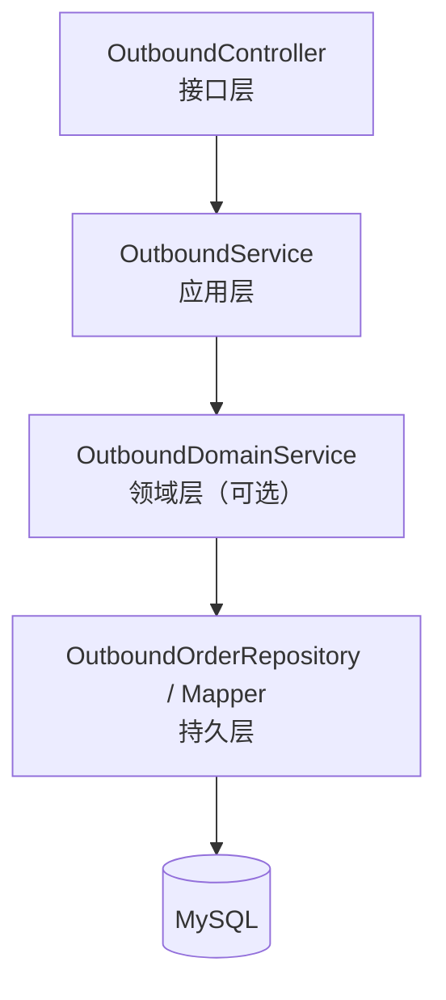
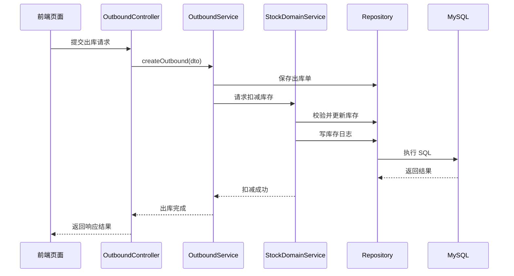

# 出库管理模块（Outbound）详细模块设计说明

---

## 1 模块概述

### 1.1 模块名称  
出库管理模块（Outbound）

### 1.2 模块定位  
出库管理模块用于记录和管理商品的出库业务，描述库存**“为什么减少”**的业务原因。本模块不直接维护库存数量，而是通过调用库存管理模块完成库存的实际扣减操作。

### 1.3 模块设计目标  

- 规范商品出库业务流程  
- 记录每一次出库操作的业务信息  
- 保证出库操作与库存变更的一致性  
- 防止库存被非法或重复扣减  

---

## 2 模块职责说明

### 2.1 核心职责  

出库管理模块主要承担以下职责：

1. 接收并处理商品出库请求  
2. 生成并保存出库单据  
3. 记录出库数量、时间及操作人员  
4. 调用库存模块完成库存扣减操作  

### 2.2 职责边界约束  

为保证系统结构清晰，出库模块明确以下约束规则：

- **出库模块不允许直接修改库存表（stock）**
- **出库模块不负责库存合法性判断**
- 所有库存扣减操作必须通过库存模块完成  

---

## 3 模块依赖关系

### 3.1 模块依赖说明  

出库模块依赖以下模块：

- 库存管理模块（stock）

### 3.2 依赖约束说明  

- 出库模块只能通过库存模块提供的领域服务完成库存扣减  
- 出库模块不反向依赖其他业务模块  
- 出库模块不感知库存规则的具体实现细节  

---

## 4 模块内部结构设计

出库模块内部采用统一的分层架构设计，划分为 Controller、Service、Domain（可选）与 Repository 层。

### 4.1 模块内部结构图（Mermaid）

> 说明：
出库模块以业务记录为主，库存规则集中在库存模块中实现，因此 Domain 层可根据业务复杂度选择性引入。

---

## 5 各层详细设计说明

### 5.1 Controller 层设计

#### 5.1.1 层职责

Controller 层作为出库模块的接口入口，主要负责：

- 接收前端出库请求
- 参数校验与请求封装
- 调用 Service 层执行业务流程
- 返回统一格式的响应结果

#### 5.1.2 设计约束

- Controller 层不得直接操作数据库
- Controller 层不得直接调用库存持久层

---

### 5.2 Service 层设计

#### 5.2.1 层职责

Service 层负责出库业务流程的整体编排，主要包括：

- 创建并保存出库单
- 调用库存模块执行库存扣减
- 控制出库业务的事务一致性

#### 5.2.2 设计说明

在一次出库操作中，Service 层需保证以下操作的原子性：

1. 出库单记录写入成功
2. 库存扣减操作成功

若库存扣减失败（如库存不足），则出库操作需整体回滚。

---

### 5.3 Domain 层设计

#### 5.3.1 层定位

Domain 层用于封装出库业务中的基础规则，例如出库数量合法性校验等。

#### 5.3.2 设计说明

由于库存合法性校验集中在库存模块中完成，出库模块的 Domain 层规则相对较少，可根据业务复杂度决定是否独立拆分。

---

### 5.4 Repository 层设计

#### 5.4.1 层职责

Repository 层负责出库单数据的持久化操作，包括：

- 插入出库单记录
- 查询出库记录
- 按条件统计出库信息

#### 5.4.2 设计约束

- Repository 层仅负责数据读写
- 不包含库存规则或业务流程判断

---

## 6 核心业务流程设计（出库流程）

### 6.1 出库流程说明

1. 前端提交出库请求
2. Controller 层接收并校验参数
3. Service 层创建出库单
4. Service 层调用库存模块执行库存扣减
5. 库存模块校验库存合法性并记录库存日志
6. 出库流程完成并返回结果

---

### 6.2 出库业务时序图（Mermaid）

---

## 7 异常与边界情况设计

出库模块需重点处理以下异常情况：

- 出库商品不存在异常
- 出库数量非法异常
- 库存不足异常
- 库存模块处理失败异常

所有异常统一由全局异常处理机制进行封装返回。

---

## 8 本模块小结

出库管理模块通过记录出库业务信息，并统一调用库存管理模块完成库存扣减操作，实现了业务记录与库存状态维护的解耦设计。该模块与入库模块形成对称结构，共同支撑系统库存变化的完整业务闭环。