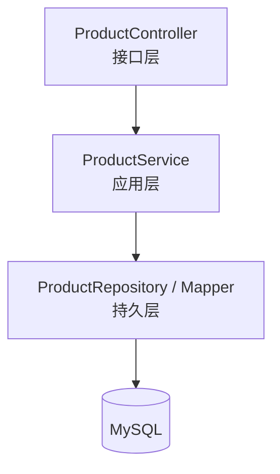
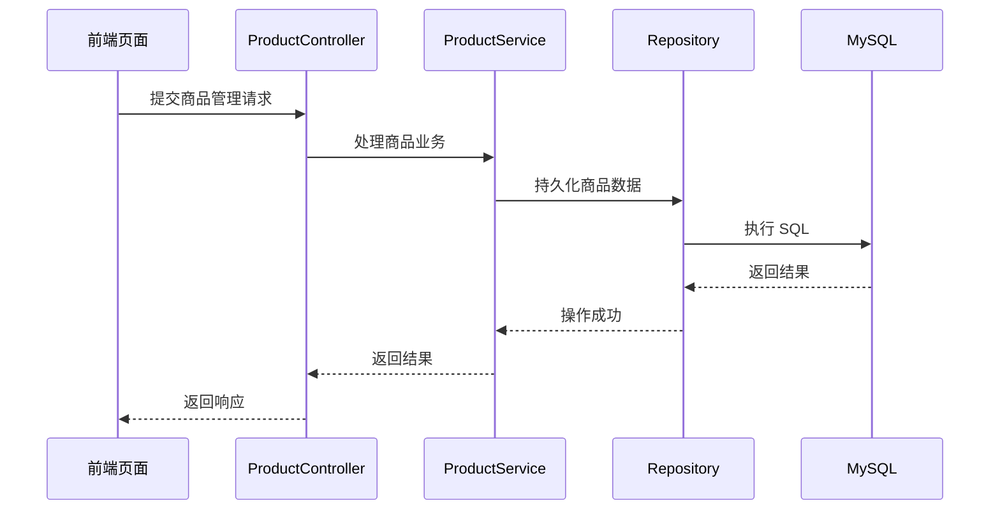

# 商品管理模块（Product）详细模块设计说明

---

## 1 模块概述

### 1.1 模块名称  
商品管理模块（Product）

### 1.2 模块定位  
商品管理模块用于维护系统中的商品基础信息，定义“系统中有哪些商品以及商品的基本属性”。  
该模块属于**基础数据管理模块**，不直接参与库存数量变化等核心业务流程。

### 1.3 模块设计目标  

- 统一维护商品基础信息  
- 为库存、入库、出库等业务模块提供商品数据支撑  
- 保证商品数据的规范性与一致性  
- 避免商品模块与库存模块职责混淆  

---

## 2 模块职责说明

### 2.1 核心职责  

商品管理模块主要承担以下职责：

1. 商品基础信息的新增、修改与查询  
2. 商品状态管理（启用 / 停用）  
3. 商品分类及属性信息维护  
4. 向其他业务模块提供商品基础数据  

### 2.2 职责边界约束  

为保证系统结构清晰，商品模块明确以下约束规则：

- **商品模块不维护库存数量信息**
- **商品模块不直接修改库存表（stock）**
- 商品模块仅负责商品“是什么”，不负责商品“有多少”  

---

## 3 模块依赖关系

### 3.1 模块依赖说明  

商品模块作为基础数据模块，被以下业务模块依赖：

- 库存管理模块（stock）
- 入库管理模块（inbound）
- 出库管理模块（outbound）
- 库存盘点模块（stockcheck）
- 报表统计模块（report）

### 3.2 依赖约束说明  

- 商品模块不反向依赖任何业务模块  
- 商品模块不参与库存变更逻辑  
- 商品模块仅通过提供商品数据支持业务模块运行  

---

## 4 模块内部结构设计

商品管理模块内部采用统一的分层架构设计，结构相对简洁。

### 4.1 模块内部结构图（Mermaid）

> 说明：
>  商品模块不包含 Domain 层，其业务规则较为简单，主要以基础数据维护为主。

------

## 5 各层详细设计说明

------

### 5.1 Controller 层设计

#### 5.1.1 层职责

Controller 层作为商品模块的接口入口，主要负责：

- 接收商品管理相关请求
- 参数校验与请求封装
- 调用 Service 层执行业务处理
- 返回统一格式的响应结果

#### 5.1.2 设计约束

- Controller 层不得直接操作数据库
- Controller 层不得包含库存相关逻辑

------

### 5.2 Service 层设计

#### 5.2.1 层职责

Service 层负责商品管理业务逻辑处理，主要包括：

- 商品信息新增与修改
- 商品状态维护
- 商品信息查询

#### 5.2.2 设计说明

Service 层不参与库存数量计算，仅对商品基础数据进行管理与校验。

------

### 5.3 Repository 层设计

#### 5.3.1 层职责

Repository 层负责商品数据的持久化操作，包括：

- 商品信息的增删改查
- 商品状态字段更新

#### 5.3.2 设计约束

- Repository 层仅负责数据读写
- 不包含业务规则判断

------

## 6 核心业务流程设计（商品管理流程）

### 6.1 商品新增流程说明

1. 前端提交新增商品请求
2. Controller 层接收并校验参数
3. Service 层校验商品信息合法性
4. Repository 层保存商品数据
5. 返回处理结果

------

### 6.2 商品管理业务时序图（Mermaid）

------

## 7 异常与边界情况设计

商品管理模块需重点处理以下异常情况：

- 商品信息非法异常
- 商品重复异常
- 商品不存在异常

所有异常统一通过系统全局异常处理机制进行封装返回。

------

## 8 本模块小结

商品管理模块作为系统的基础数据模块，通过统一维护商品基本信息，为库存及相关业务模块提供可靠的数据支撑。该模块职责单一、结构清晰，有效避免了商品数据与库存数据的职责混淆，为系统整体架构的稳定性提供了保障。
