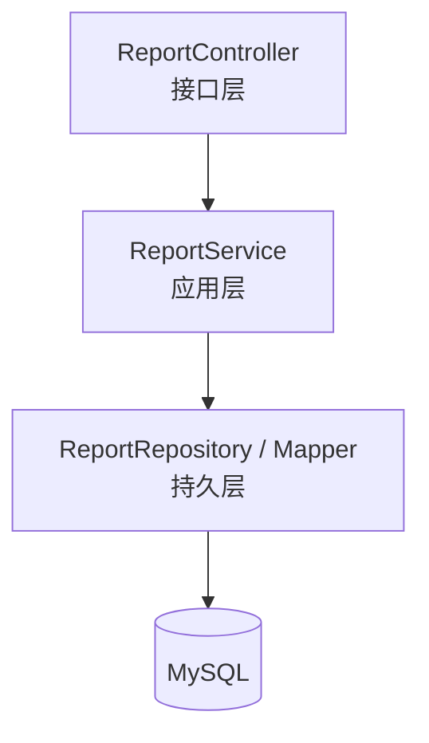
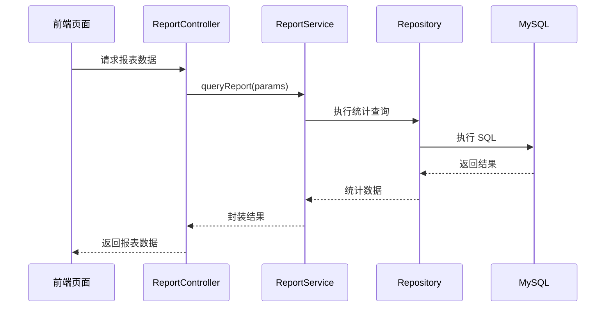

# 报表统计模块（Report）详细模块设计说明

---

## 1 模块概述

### 1.1 模块名称  
报表统计模块（Report）

### 1.2 模块定位  
报表统计模块用于对系统中已有业务数据进行统计分析与结果展示，为管理人员提供库存与业务运行情况的辅助决策支持。  
该模块属于**只读业务模块**，不参与任何业务状态修改操作。

### 1.3 模块设计目标  

- 对库存及业务数据进行统计与汇总  
- 为管理人员提供直观的数据展示结果  
- 避免报表功能对核心业务数据产生副作用  
- 保证报表模块与业务模块之间的低耦合  

---

## 2 模块职责说明

### 2.1 核心职责  

报表统计模块主要承担以下职责：

1. 统计当前库存数据  
2. 汇总入库、出库业务数据  
3. 提供库存变化与业务趋势分析  
4. 向前端提供只读报表数据接口  

### 2.2 职责边界约束  

为保证系统数据安全性与结构清晰性，报表模块明确以下约束规则：

- **报表模块仅允许进行数据查询操作**
- **报表模块不允许修改任何业务数据**
- 报表模块不得直接或间接触发库存变更操作  

---

## 3 模块依赖关系

### 3.1 模块依赖说明  

报表模块依赖以下模块的数据：

- 商品管理模块（product）
- 库存管理模块（stock）
- 入库管理模块（inbound）
- 出库管理模块（outbound）

### 3.2 依赖约束说明  

- 报表模块仅通过查询方式依赖其他业务模块的数据  
- 其他业务模块不得依赖报表模块  
- 报表模块不反向调用任何业务模块的 Service 或 Domain 层  

---

## 4 模块内部结构设计

报表统计模块内部采用统一的分层架构设计，但由于其只读特性，结构相对简化。

### 4.1 模块内部结构图（Mermaid）

---

## 5 各层详细设计说明

### 5.1 Controller 层设计

#### 5.1.1 层职责

Controller 层作为报表模块的接口入口，主要负责：

- 接收前端报表查询请求
- 解析查询条件参数
- 调用 Service 层完成数据统计
- 返回统一格式的报表数据结果

#### 5.1.2 设计约束

- Controller 层不得直接操作数据库
- Controller 层不得参与任何业务逻辑判断

### 5.2 Service 层设计

#### 5.2.1 层职责

Service 层负责报表统计业务的整体处理，主要包括：

- 组织不同类型报表的数据查询逻辑
- 对查询结果进行必要的数据转换与封装
- 保证报表接口的统一性与可扩展性

#### 5.2.2 设计说明

Service 层不参与业务状态变更，仅对已有业务数据进行组合、统计与格式化处理。

### 5.3 Repository 层设计

#### 5.3.1 层职责

Repository 层负责执行具体的数据统计与查询操作，包括：

- 库存统计查询
- 入库、出库数据汇总查询
- 按时间、商品维度进行统计分析

#### 5.3.2 设计约束

- Repository 层仅负责数据查询
- 不包含任何更新、插入或删除操作

## 6 核心报表功能设计

### 6.1 库存统计报表

- 当前库存总量统计
- 各商品库存数量统计
- 库存上下限预警统计

### 6.2 业务统计报表

- 入库业务统计（按时间、商品）
- 出库业务统计（按时间、商品）
- 入库与出库对比分析

## 7 报表查询流程设计

### 7.1 报表查询流程说明

- 前端发起报表查询请求
- Controller 层接收请求并校验参数
- Service 层组织报表查询逻辑
- Repository 层执行统计查询
- 返回统计结果并展示

### 7.2 报表查询时序图（Mermaid）

## 8 异常与边界情况设计

报表模块需重点处理以下异常情况：

- 查询参数非法异常
- 查询结果为空情况
- 数据库查询异常
- 所有异常统一通过系统全局异常处理机制进行封装返回。

## 9 本模块小结

报表统计模块作为系统的只读业务模块，通过对库存及相关业务数据的统计与展示，为管理人员提供了有效的数据支持。该模块不参与任何业务状态修改操作，与核心业务模块解耦设计，有效保证了系统业务数据的安全性与整体架构的稳定性。