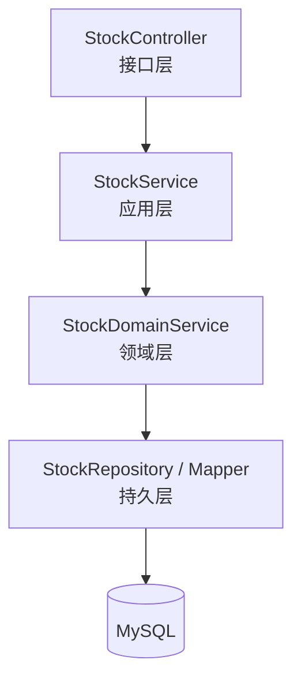
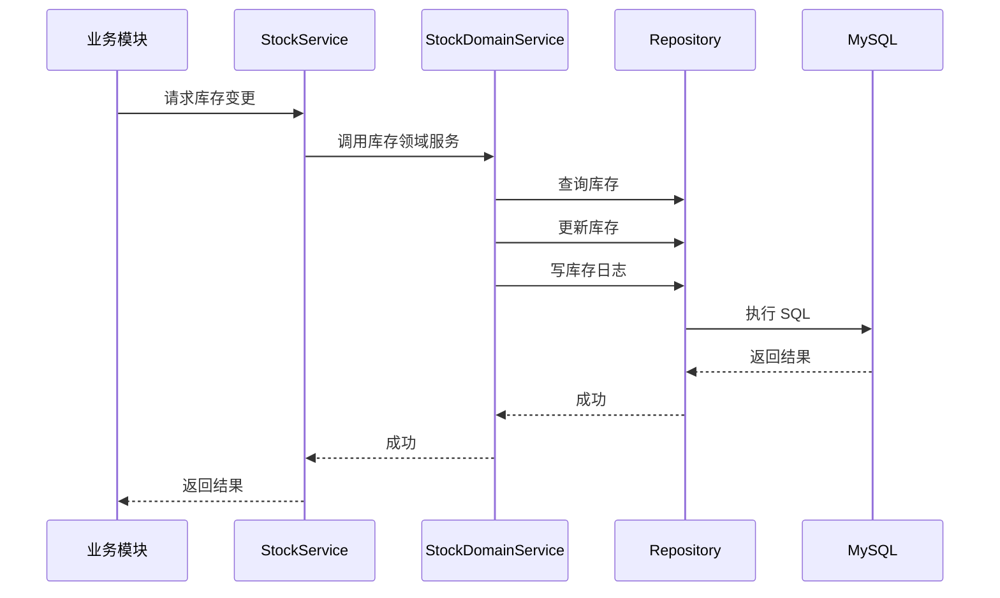

# 库存管理模块（Stock）详细模块设计说明

---

## 1 模块概述

### 1.1 模块名称  
库存管理模块（Stock）

### 1.2 模块定位  
库存管理模块是系统的**核心业务模块**，负责统一维护商品库存数量及库存状态，保证库存数据在入库、出库、盘点等业务操作过程中的一致性与可追溯性。

### 1.3 模块设计目标  

- 统一管理库存数据，防止库存被多处随意修改  
- 对库存变更进行集中校验与控制  
- 记录所有库存变更日志，支持问题追溯  
- 为其他业务模块提供安全、稳定的库存变更能力  

---

## 2 模块职责说明

### 2.1 核心职责  

库存管理模块主要承担以下职责：

1. 维护商品当前库存数量  
2. 校验库存变更的合法性（如库存不足校验）  
3. 执行库存数量的增减与调整操作  
4. 记录库存变更日志  
5. 提供库存查询能力  

### 2.2 职责边界约束  

为保证系统结构清晰，库存模块明确以下约束规则：

- **库存模块是唯一允许直接修改库存表（stock）的模块**
- 入库、出库、盘点模块 **不得直接操作库存表**
- 所有库存变更必须通过库存模块提供的领域服务完成

---

## 3 模块依赖关系

### 3.1 被依赖情况  

库存模块作为核心状态模块，被以下业务模块依赖：

- 入库管理模块（inbound）
- 出库管理模块（outbound）
- 库存盘点模块（stockcheck）

### 3.2 依赖约束说明  

- 库存模块 **不反向依赖** 入库、出库、盘点模块  
- 库存模块只关心“库存如何变化”，不关心“为什么变化”

---

## 4 模块内部结构设计

库存模块内部采用**分层架构设计**，自上而下划分为 Controller、Service、Domain 与 Repository 层。

### 4.1 模块内部结构图（Mermaid）

---

 ## 5 各层详细设计说明

 ### 5.1 Controller 层设计

 #### 5.1.1 层职责

 Controller 层作为库存模块的接口入口，主要负责：

- 接收前端请求
- 进行参数校验
- 调用 Service 层完成业务处理
- 返回统一格式的 JSON 响应

#### 5.1.2 设计约束

- Controller 层 不允许 直接操作数据库
- Controller 层 不包含 任何库存业务判断逻辑

---

### 5.2 Service 层设计
#### 5.2.1 层职责

Service 层负责库存相关业务流程的编排，主要包括：

- 库存查询业务流程
- 调用库存领域服务执行库存变更
- 事务边界控制

#### 5.2.2 设计说明

Service 层不直接修改库存数据，而是统一调用库存领域服务完成库存增减或调整操作，从而保证库存变更逻辑的集中控制。

---

### 5.3 Domain 层设计（核心设计）

#### 5.3.1 层定位

Domain 层是库存模块的核心业务规则层，用于封装所有与库存变更相关的业务规则。

#### 5.3.2 核心职责

库存领域服务主要负责：

- 校验库存变更合法性
- 执行库存数量变更
- 记录库存变更日志
- 保证库存变更的原子性

#### 5.3.3 领域规则示例

- 出库操作时，库存数量不得小于 0
- 库存调整必须记录库存变更日志
- 同一商品的库存变更操作需保证一致性

> **设计原则：**
> 凡是影响库存正确性的业务规则，必须集中在库存领域服务中实现，禁止分散在其他模块。

---

### 5.4 Repository 层设计

#### 5.4.1 层职责

Repository 层负责库存相关数据的持久化操作，包括：

- 查询库存信息
- 更新库存数量
- 插入库存变更日志

#### 5.4.2 设计约束

- Repository 层仅负责 CRUD 操作
- 不包含任何业务逻辑判断

---

### 6 核心业务流程设计（库存变更）

#### 6.1 库存增加流程说明

1. 业务模块（如入库模块）请求库存增加
2. Service 层接收请求并开启事务
3. Domain 层校验库存变更合法性
4. 更新库存表（stock）
5. 记录库存变更日志（stock_log）
6. 返回处理结果

#### 6.2 库存变更时序图（Mermaid）

---

### 7 异常与边界情况设计

库存模块需重点处理以下异常情况：

- 库存不足异常
- 商品不存在异常
- 数据并发修改异常

所有异常均通过统一异常机制向上抛出，并由全局异常处理器进行封装返回。

---

## 8 本模块小结

库存管理模块作为系统核心模块，通过统一的领域服务对库存变更进行集中控制，确保库存数据的一致性、安全性与可追溯性。该模块为入库、出库、盘点等业务模块提供了可靠的基础支撑，是整个库存管理系统稳定运行的关键。

---