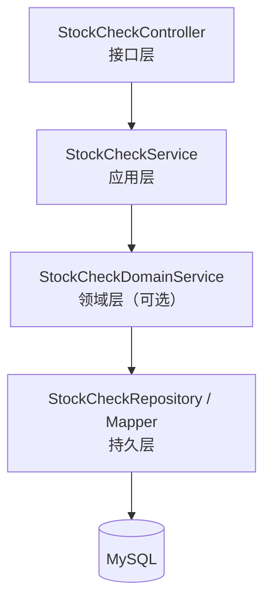
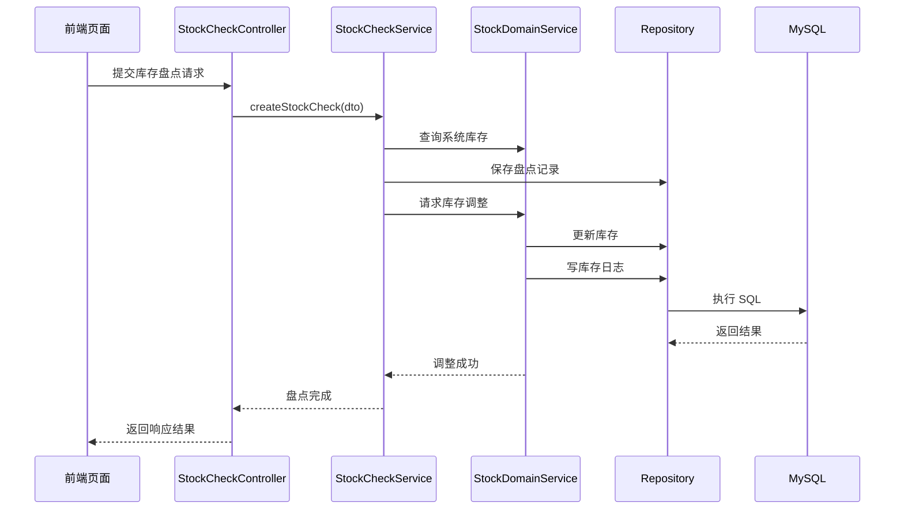

# 库存盘点模块（StockCheck）详细模块设计说明

---

## 1 模块概述

### 1.1 模块名称  
库存盘点模块（StockCheck）

### 1.2 模块定位  
库存盘点模块用于对系统记录的库存数量与实际库存数量进行对比核对，记录盘点结果及库存差异情况，描述库存**“是否准确”**的问题。本模块不直接维护库存数量，而是通过调用库存管理模块对库存进行统一调整。

### 1.3 模块设计目标  

- 支持对商品库存进行定期或不定期盘点  
- 记录系统库存与实际库存之间的差异  
- 保证库存调整操作的规范性与可追溯性  
- 避免通过直接修改库存表的方式修正数据  

---

## 2 模块职责说明

### 2.1 核心职责  

库存盘点模块主要承担以下职责：

1. 发起库存盘点操作  
2. 记录系统库存数量与实际库存数量  
3. 计算并保存库存差异结果  
4. 通过库存模块完成库存调整操作  

### 2.2 职责边界约束  

为保证系统结构清晰，库存盘点模块明确以下约束规则：

- **库存盘点模块不允许直接修改库存表（stock）**
- **库存盘点模块仅负责“发现差异”，不负责“直接修正库存”**
- 库存数量调整必须通过库存管理模块统一完成  

---

## 3 模块依赖关系

### 3.1 模块依赖说明  

库存盘点模块依赖以下模块：

- 库存管理模块（stock）

### 3.2 依赖约束说明  

- 库存盘点模块只能通过库存模块提供的领域服务完成库存调整  
- 库存盘点模块不反向依赖入库、出库模块  
- 库存盘点模块不关心库存调整的具体规则实现  

---

## 4 模块内部结构设计

库存盘点模块内部采用统一的分层架构设计，划分为 Controller、Service、Domain（可选）与 Repository 层。

### 4.1 模块内部结构图（Mermaid）

> 说明：
盘点模块以差异记录为主，库存一致性规则集中在库存模块中实现，因此 Domain 层可根据业务复杂度选择是否独立拆分。

---

## 5 各层详细设计说明

### 5.1 Controller 层设计

#### 5.1.1 层职责

Controller 层作为库存盘点模块的接口入口，主要负责：

- 接收前端库存盘点请求
- 参数校验与请求封装
- 调用 Service 层执行业务流程
- 返回统一格式的响应结果

#### 5.1.2 设计约束

- Controller 层不得直接操作数据库
- Controller 层不得直接调用库存模块的持久化层

---

### 5.2 Service 层设计

#### 5.2.1 层职责

Service 层负责库存盘点业务流程的整体编排，主要包括：

- 查询当前系统库存数量
- 记录盘点数据并计算库存差异
- 调用库存模块执行库存调整
- 控制盘点业务的事务一致性

#### 5.2.2 设计说明

Service 层在一次盘点操作中，需保证以下操作的原子性：

1. 盘点记录写入成功
2. 库存调整操作成功

若库存调整失败，则盘点操作需整体回滚。

---

### 5.3 Domain 层设计

#### 5.3.1 层定位

Domain 层用于封装库存盘点业务中的基础规则，例如：

- 实际库存数量合法性校验
- 差异数量计算规则

#### 5.3.2 设计说明

由于库存调整规则集中在库存模块中实现，盘点模块的 Domain 层规则相对简单，可根据后续业务复杂度决定是否独立拆分。

---

### 5.4 Repository 层设计

#### 5.4.1 层职责

Repository 层负责库存盘点数据的持久化操作，包括：

- 插入库存盘点记录
- 查询历史盘点记录
- 按条件统计盘点结果

#### 5.4.2 设计约束

- Repository 层仅负责数据读写
- 不包含库存调整或业务规则判断

---

## 6 核心业务流程设计（库存盘点流程）

### 6.1 库存盘点流程说明

1. 前端提交库存盘点请求
2. Controller 层接收并校验参数
3. Service 层查询系统库存数量
4. Service 层计算库存差异并保存盘点记录
5. Service 层调用库存模块执行库存调整
6. 库存模块记录库存变更日志
7. 盘点流程完成并返回结果

---

### 6.2 库存盘点业务时序图（Mermaid）

---

## 7 异常与边界情况设计

库存盘点模块需重点处理以下异常情况：

- 盘点商品不存在异常
- 实际库存数量非法异常
- 库存模块处理失败异常
- 并发盘点冲突异常

所有异常统一由全局异常处理机制进行封装返回。

---

## 8 本模块小结

库存盘点模块通过记录系统库存与实际库存之间的差异，并统一调用库存管理模块完成库存调整操作，实现了库存数据校验与修正过程的规范化管理。该模块与入库、出库模块共同构成库存变更的完整业务闭环，为系统库存数据的准确性提供了重要保障。