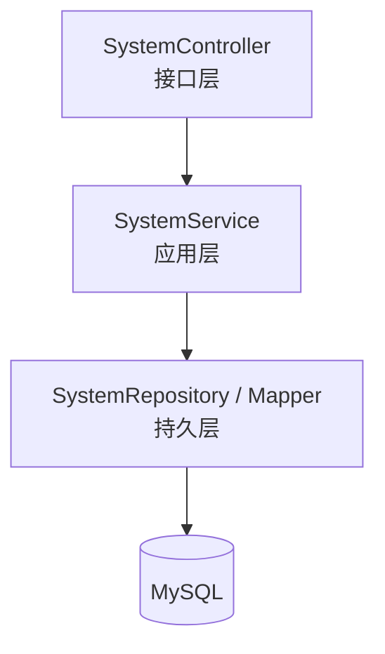

# 系统管理模块（System）详细模块设计说明

---

## 1 模块概述

### 1.1 模块名称  
系统管理模块（System）

### 1.2 模块定位  
系统管理模块用于提供系统运行所需的**通用管理与运维支持能力**，包括系统配置、操作日志等功能。  
该模块不参与具体业务流程处理，属于系统级支撑模块。

### 1.3 模块设计目标  

- 提供系统级通用管理功能  
- 支撑系统稳定运行与后期维护  
- 记录关键操作行为，便于审计与问题追溯  
- 与具体业务模块解耦，避免业务逻辑污染  

---

## 2 模块职责说明

### 2.1 核心职责  

系统管理模块主要承担以下职责：

1. 系统基础配置管理  
2. 系统运行参数维护  
3. 用户操作日志记录与查询  
4. 为系统运维与管理提供辅助支持  

### 2.2 职责边界约束  

为保证系统结构清晰，系统管理模块明确以下约束规则：

- **系统管理模块不参与任何业务数据处理**
- **系统管理模块不直接修改库存、商品等业务数据**
- 系统管理模块仅提供系统级通用能力支持  

---

## 3 模块依赖关系

### 3.1 模块依赖说明  

系统管理模块依赖以下基础模块：

- 用户管理模块（user）

### 3.2 依赖约束说明  

- 系统管理模块仅用于记录与查询系统行为  
- 业务模块不得依赖系统管理模块完成核心业务逻辑  
- 系统管理模块不反向依赖业务模块  

---

## 4 模块内部结构设计

系统管理模块内部采用统一的分层架构设计，结构相对简洁。

### 4.1 模块内部结构图（Mermaid）

>说明：
系统管理模块不包含领域层（Domain），所有功能均为系统级管理与记录，不涉及复杂业务规则。

---

## 5 各层详细设计说明

------

### 5.1 Controller 层设计

#### 5.1.1 层职责

Controller 层作为系统管理模块的接口入口，主要负责：

- 接收系统管理相关请求
- 参数解析与校验
- 调用 Service 层执行业务处理
- 返回统一格式的响应结果

#### 5.1.2 设计约束

- Controller 层不允许直接操作数据库
- Controller 层不参与任何业务逻辑判断

------

### 5.2 Service 层设计

#### 5.2.1 层职责

Service 层负责系统管理相关业务处理，主要包括：

- 系统配置的读取与维护
- 操作日志的记录与查询
- 系统级功能的统一封装

#### 5.2.2 设计说明

Service 层不直接参与业务流程，仅为系统运行提供必要的管理与辅助能力。

------

### 5.3 Repository 层设计

#### 5.3.1 层职责

Repository 层负责系统管理相关数据的持久化操作，包括：

- 系统配置数据的读写
- 系统操作日志的查询

#### 5.3.2 设计约束

- Repository 层仅负责数据读写
- 不包含任何业务规则或流程控制

------

## 6 核心功能设计说明

### 6.1 系统配置管理

系统管理模块支持对系统基础配置参数进行维护，例如：

- 系统名称
- 系统运行状态
- 业务参数配置

配置数据可通过数据库或配置文件进行管理。

------

### 6.2 操作日志管理

系统通过系统管理模块记录关键操作行为，包括：

- 用户登录与登出
- 重要业务操作（如入库、出库）
- 系统配置变更操作

操作日志用于后续审计与问题追溯。

------

## 7 系统管理流程说明

### 7.1 操作日志记录流程

1. 系统发生关键操作
2. 系统管理模块记录操作信息
3. 日志数据持久化存储
4. 管理人员可查询日志信息

------

## 8 异常与边界情况设计

系统管理模块需重点处理以下异常情况：

- 配置参数非法异常
- 日志查询条件非法异常
- 数据库访问异常

所有异常统一通过系统全局异常处理机制进行封装返回。

------

## 9 本模块小结

系统管理模块作为系统级支撑模块，为系统运行提供必要的管理与运维能力支持。通过将系统管理功能与具体业务模块解耦设计，系统在保持业务逻辑清晰的同时，具备良好的可维护性与扩展性。
