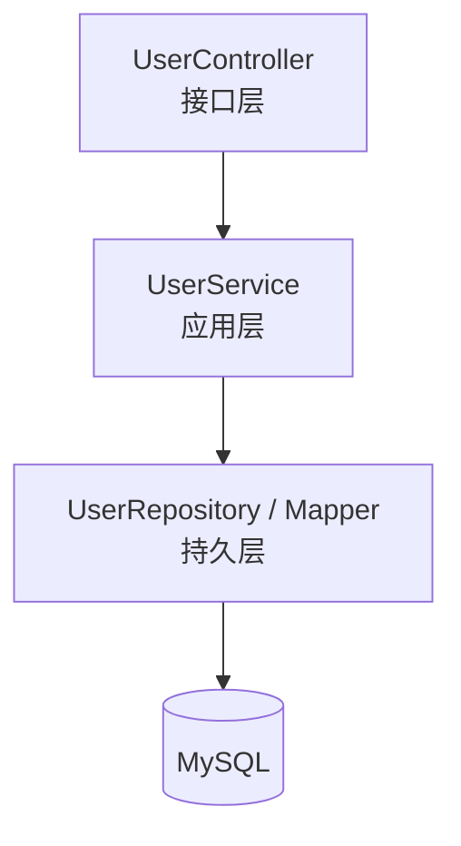

# 用户管理模块（User）详细模块设计说明

------

## 1 模块概述

### 1.1 模块名称

用户管理模块（User）

### 1.2 模块定位

用户管理模块用于维护系统中的用户信息及用户角色关系，为认证与权限模块提供基础数据支持。

### 1.3 模块设计目标

- 管理系统用户基本信息
- 管理用户状态与角色分配
- 为系统权限控制提供可靠的数据支撑

------

## 2 模块职责说明

### 2.1 核心职责

用户管理模块主要承担以下职责：

1. 用户信息的增删改查
2. 用户状态管理
3. 用户与角色关系维护
4. 向认证模块提供用户数据支持

### 2.2 职责边界约束

- **用户模块不参与权限校验逻辑**
- **用户模块不控制业务访问规则**
- 用户模块不参与库存等业务流程

------

## 3 模块依赖关系

### 3.1 模块依赖说明

用户模块依赖以下基础数据：

- 角色信息（role）

### 3.2 依赖约束说明

- 用户模块仅维护用户与角色关系
- 权限控制逻辑由认证模块统一处理

------

## 4 模块内部结构设计

用户模块内部采用统一分层架构设计。

### 4.1 模块内部结构图（Mermaid）

------

## 5 各层详细设计说明

### 5.1 Controller 层设计

Controller 层负责用户管理相关接口的接入与响应。

------

### 5.2 Service 层设计

Service 层负责用户管理业务逻辑，包括：

- 用户创建与更新
- 用户状态控制
- 用户角色分配

------

### 5.3 Repository 层设计

Repository 层负责用户与角色数据的持久化操作。

------

## 6 核心业务流程设计

### 6.1 用户创建流程

1. 管理员提交新增用户请求
2. 系统校验用户信息合法性
3. 保存用户信息与角色关系
4. 返回处理结果

------

## 7 异常与边界情况设计

- 用户不存在异常
- 用户状态非法异常
- 角色分配异常

所有异常统一通过系统全局异常处理机制进行封装返回。

------

## 8 本模块小结

用户管理模块通过统一维护系统用户信息与角色关系，为认证与权限模块提供基础数据支持。该模块职责清晰、结构简单，是系统安全体系的重要组成部分。