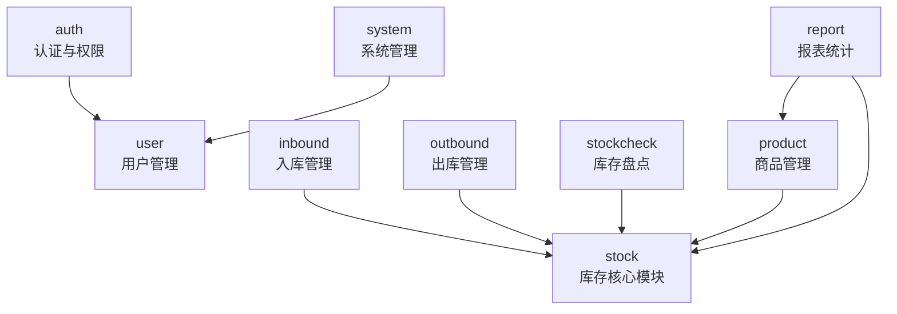

### 一、系统模块全景图
```sql
auth        用户是谁、能不能进系统
user        用户信息与角色
product     商品是什么
stock       商品现在有多少（核心）
inbound     为什么库存增加
outbound    为什么库存减少
stockcheck  实际库存与系统库存是否一致
report      数据统计与展示
system      系统级配置与日志
```

---

### 二、每一个模块的职责

#### 1. auth模块（认知与权限）

> **auth 模块负责确认“你是谁、你能不能访问系统”。**

它主要关心

- 登录 / 登出
- Token / 会话
- 权限校验（是否允许访问接口）

它绝对不应该

- 管库存
- 管商品
- 写业务数据

👉**auth是系统的门禁**

---

#### 2. user模块

> **user 模块负责管理“系统中有哪些用户，以及他们的角色”。**

它主要关心

- 用户基本信息
- 用户状态（启用 / 禁用）
- 用户与角色的关系

它不应该

- 判断权限规则本身
- 参与业务流程（入库/出库）

👉 **user 是“人员档案室”**

---

#### 3. product 模块（商品管理）

> **product 模块负责定义“商品是什么”。**

它主要关心

- 商品编号、名称、类别、价格
- 商品是否可用

它不应该

- 关心库存数量
- 修改库存

👉 **product 只描述“商品属性”，不描述“商品状态”**

---

#### 4. stock 模块（库存管理 · 核心模块）

> **stock 模块负责统一维护“商品当前库存状态”，并保证库存数据一致性。**

### 它主要关心

- 当前库存数量
- 库存上下限
- 库存变更是否合法
- 库存变更日志

### 它**是系统的核心**

- 入库、出库、盘点 **都必须依赖它**
- **只有它可以直接修改 stock 表**

👉 **stock 是系统的“中枢神经”**

---

#### 5. inbound 模块（入库管理）

> **inbound 模块负责记录“库存为什么增加”。**

### 它主要关心

- 入库单
- 入库时间、数量、操作人

### 它**不能**

- 自己改库存

### 正确做法

- 写入入库单
- **调用 stock 模块增加库存**

👉 **inbound 是“原因说明”，不是“执行者”**

---

#### 6. outbound 模块（出库管理）

> **outbound 模块负责记录“库存为什么减少”。**

### 它主要关心

- 出库单
- 出库原因、数量、操作人

### 它**不能**

- 自己扣库存

### 正确做法

- 写出库单
- **调用 stock 模块减少库存**

👉 inbound / outbound 是一对“对称模块”

---

#### 7. stockcheck 模块（库存盘点）

> **stockcheck 模块负责校验“系统库存和现实库存是否一致”。**

### 它主要关心

- 系统库存
- 实际库存
- 差异原因

### 它**不能**

- 直接改库存

### 正确做法

- 记录盘点结果
- **由 stock 模块执行库存调整**

👉 **盘点是“发现问题”，不是“随便修数据”**

---

#### 8. report 模块（报表统计）

> **report 模块负责对业务数据进行统计与展示。**

### 它主要关心

- 查询
- 汇总
- 趋势分析

### 它**必须遵守**

- ❌ 不允许修改任何业务数据

👉 **report 是“看数据的”，不是“改数据的”**

---

#### 9. system 模块（系统管理）

> **system 模块负责系统级配置与运维辅助功能。**

### 它可能包含

- 系统参数
- 操作日志
- 基础配置

👉 **system 是“后台管理人员用的工具箱”**

---

### 三、模块之间的「依赖总规则」

### ✅ 允许的依赖

- inbound → stock
- outbound → stock
- stockcheck → stock

### ❌ 不允许的依赖

- inbound ❌→ outbound
- report ❌→ stock（改数据）
- product ❌→ stock（直接改库存）

---

### 四、模块依赖总览图



> 📌 **说明**：  
> - 箭头 `A --> B` 表示：**A 依赖 B（A 会调用 B）**  
> - 没有箭头 ≠ 没关系，而是“**不允许直接依赖**”

> 本系统采用按业务领域拆分模块的设计方式，  
> 以库存模块作为核心状态模块，  
> 入库、出库、盘点等原因模块通过依赖库存模块统一完成库存变更，  
> 报表模块仅进行数据查询，不参与业务状态修改，  
> 从而有效保证库存数据的一致性与系统结构的清晰性。