# 详细模块设计汇总

> 本文档由多个同类文档合并生成，保留原文内容并按来源文件分节。

## 来源文件
- `2-系统设计/详细模块设计/总览.md`
- `2-系统设计/详细模块设计/详细模块设计说明.md`
- `2-系统设计/详细模块设计/核心模块设计小结.md`
- `2-系统设计/详细模块设计/auth.md`
- `2-系统设计/详细模块设计/user.md`
- `2-系统设计/详细模块设计/system.md`
- `2-系统设计/详细模块设计/product.md`
- `2-系统设计/详细模块设计/stock.md`
- `2-系统设计/详细模块设计/inbound.md`
- `2-系统设计/详细模块设计/outbound.md`
- `2-系统设计/详细模块设计/stockcheck.md`
- `2-系统设计/详细模块设计/report.md`

## 总览

来源：`2-系统设计/详细模块设计/总览.md`

### 一、系统模块全景图
```sql
auth        用户是谁、能不能进系统
user        用户信息与角色
product     商品是什么
stock       商品现在有多少（核心）
inbound     为什么库存增加
outbound    为什么库存减少
stockcheck  实际库存与系统库存是否一致
report      数据统计与展示
system      系统级配置与日志
```

---

### 二、每一个模块的职责

#### 1. auth模块（认知与权限）

> **auth 模块负责确认“你是谁、你能不能访问系统”。**

它主要关心

- 登录 / 登出
- Token / 会话
- 权限校验（是否允许访问接口）

它绝对不应该

- 管库存
- 管商品
- 写业务数据

👉**auth是系统的门禁**

---

#### 2. user模块

> **user 模块负责管理“系统中有哪些用户，以及他们的角色”。**

它主要关心

- 用户基本信息
- 用户状态（启用 / 禁用）
- 用户与角色的关系

它不应该

- 判断权限规则本身
- 参与业务流程（入库/出库）

👉 **user 是“人员档案室”**

---

#### 3. product 模块（商品管理）

> **product 模块负责定义“商品是什么”。**

它主要关心

- 商品编号、名称、类别、价格
- 商品是否可用

它不应该

- 关心库存数量
- 修改库存

👉 **product 只描述“商品属性”，不描述“商品状态”**

---

#### 4. stock 模块（库存管理 · 核心模块）

> **stock 模块负责统一维护“商品当前库存状态”，并保证库存数据一致性。**

### 它主要关心

- 当前库存数量
- 库存上下限
- 库存变更是否合法
- 库存变更日志

### 它**是系统的核心**

- 入库、出库、盘点 **都必须依赖它**
- **只有它可以直接修改 stock 表**

👉 **stock 是系统的“中枢神经”**

---

#### 5. inbound 模块（入库管理）

> **inbound 模块负责记录“库存为什么增加”。**

### 它主要关心

- 入库单
- 入库时间、数量、操作人

### 它**不能**

- 自己改库存

### 正确做法

- 写入入库单
- **调用 stock 模块增加库存**

👉 **inbound 是“原因说明”，不是“执行者”**

---

#### 6. outbound 模块（出库管理）

> **outbound 模块负责记录“库存为什么减少”。**

### 它主要关心

- 出库单
- 出库原因、数量、操作人

### 它**不能**

- 自己扣库存

### 正确做法

- 写出库单
- **调用 stock 模块减少库存**

👉 inbound / outbound 是一对“对称模块”

---

#### 7. stockcheck 模块（库存盘点）

> **stockcheck 模块负责校验“系统库存和现实库存是否一致”。**

### 它主要关心

- 系统库存
- 实际库存
- 差异原因

### 它**不能**

- 直接改库存

### 正确做法

- 记录盘点结果
- **由 stock 模块执行库存调整**

👉 **盘点是“发现问题”，不是“随便修数据”**

---

#### 8. report 模块（报表统计）

> **report 模块负责对业务数据进行统计与展示。**

### 它主要关心

- 查询
- 汇总
- 趋势分析

### 它**必须遵守**

- ❌ 不允许修改任何业务数据

👉 **report 是“看数据的”，不是“改数据的”**

---

#### 9. system 模块（系统管理）

> **system 模块负责系统级配置与运维辅助功能。**

### 它可能包含

- 系统参数
- 操作日志
- 基础配置

👉 **system 是“后台管理人员用的工具箱”**

---

### 三、模块之间的「依赖总规则」

### ✅ 允许的依赖

- inbound → stock
- outbound → stock
- stockcheck → stock

### ❌ 不允许的依赖

- inbound ❌→ outbound
- report ❌→ stock（改数据）
- product ❌→ stock（直接改库存）

---

### 四、模块依赖总览图

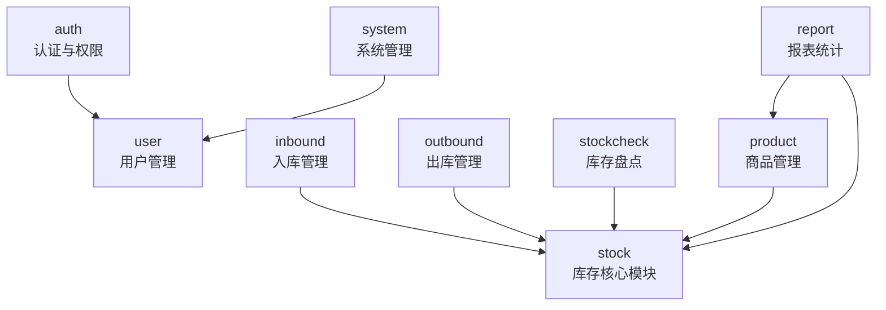

> 📌 **说明**：  
> - 箭头 `A --> B` 表示：**A 依赖 B（A 会调用 B）**  
> - 没有箭头 ≠ 没关系，而是“**不允许直接依赖**”

> 本系统采用按业务领域拆分模块的设计方式，  
> 以库存模块作为核心状态模块，  
> 入库、出库、盘点等原因模块通过依赖库存模块统一完成库存变更，  
> 报表模块仅进行数据查询，不参与业务状态修改，  
> 从而有效保证库存数据的一致性与系统结构的清晰性。

## 详细模块设计说明

来源：`2-系统设计/详细模块设计/详细模块设计说明.md`

# 详细模块设计说明

---

## 1 模块设计总览

（总览.md 的内容）

---

## 2 认证与用户管理模块

### 2.1 认证与权限模块（Auth）

（auth.md 全部内容）

---

### 2.2 用户管理模块（User）

（user.md 全部内容）

---

## 3 基础数据管理模块

### 3.1 商品管理模块（Product）

（product.md 全部内容）

---

## 4 核心业务模块设计

### 4.1 库存管理模块（Stock）

（stock.md 全部内容）

---

### 4.2 入库管理模块（Inbound）

（inbound.md 全部内容）

---

### 4.3 出库管理模块（Outbound）

（outbound.md 全部内容）

---

### 4.4 库存盘点模块（StockCheck）

（stockcheck.md 全部内容）

---

### 4.5 核心业务模块设计小结

（核心模块设计小结.md 全部内容）

---

## 5 报表统计模块

### 5.1 报表统计模块（Report）

（report.md 全部内容）

---

## 6 系统管理模块

### 6.1 系统管理模块（System）

（system.md 全部内容）

## 核心模块设计小结

来源：`2-系统设计/详细模块设计/核心模块设计小结.md`

# 核心业务模块设计小结

---

## 1 核心业务模块总体说明

本系统围绕超市库存管理这一核心业务目标，对库存相关功能进行了统一规划与模块化设计。系统将所有涉及库存变化的业务拆分为多个职责明确、边界清晰的业务模块，通过模块协作的方式完成库存数据的维护与管理。

库存相关核心业务模块主要包括：

- 库存管理模块（stock）
- 入库管理模块（inbound）
- 出库管理模块（outbound）
- 库存盘点模块（stockcheck）

上述模块共同构成系统库存管理的核心业务体系。

---

## 2 核心模块设计思想

### 2.1 统一库存控制思想

库存数据属于系统的核心业务数据，其正确性直接影响系统整体运行的可靠性。因此，本系统采用**统一库存控制**的设计思想：

- 库存管理模块作为唯一的库存状态维护模块  
- 所有库存数量的变更操作必须通过库存管理模块完成  
- 其他业务模块不得直接修改库存数据  

通过集中控制库存变更逻辑，有效避免了库存数据被多处修改而导致的不一致问题。

---

### 2.2 “原因模块”与“状态模块”解耦设计

在模块划分过程中，系统明确区分了以下两类业务模块：

- **状态模块**：负责维护业务状态（如库存当前数量）  
- **原因模块**：负责描述业务状态变化的原因（如入库、出库、盘点）

具体表现为：

- stock 模块：维护“库存现在是多少”  
- inbound 模块：描述“库存为什么增加”  
- outbound 模块：描述“库存为什么减少”  
- stockcheck 模块：描述“库存是否准确以及如何修正”  

原因模块通过调用状态模块完成业务处理，而状态模块不反向依赖任何原因模块，从而保证系统结构的清晰性与稳定性。

---

## 3 核心模块协作关系说明

### 3.1 模块协作方式

在实际业务处理中，各核心模块按照既定职责协同工作：

1. 入库、出库或盘点业务由对应业务模块发起  
2. 业务模块记录自身业务数据（入库单、出库单、盘点记录）  
3. 业务模块调用库存管理模块完成库存变更或调整  
4. 库存管理模块统一校验库存规则并记录库存变更日志  

该协作方式确保了业务记录与库存状态维护之间的解耦。

---

### 3.2 模块依赖关系总结

核心业务模块之间的依赖关系如下：

- inbound → stock  
- outbound → stock  
- stockcheck → stock  

库存管理模块不反向依赖任何业务模块，仅对外提供库存查询与库存变更能力，从而保证其作为核心状态模块的独立性。

---

## 4 核心业务流程闭环说明

通过入库、出库与库存盘点三个业务模块，系统实现了库存管理业务的完整闭环：

- 入库模块负责库存增加业务  
- 出库模块负责库存减少业务  
- 库存盘点模块负责库存校验与修正  

所有库存变化最终均通过库存管理模块统一执行，并记录库存变更日志，确保库存变化过程的可追溯性。

---

## 5 核心模块设计优势分析

通过上述模块化设计，本系统在库存管理方面具备以下优势：

1. **结构清晰**：各模块职责明确，功能边界清楚  
2. **数据安全**：库存数据集中管理，防止非法或重复修改  
3. **易于维护**：库存规则集中在库存模块中，便于统一调整  
4. **易于扩展**：新增库存变更类型时，仅需新增原因模块即可  

该设计为系统后续功能扩展与维护提供了良好的结构基础。

---

## 6 本节小结

本节对系统库存相关核心业务模块的设计进行了整体总结。通过以库存管理模块为核心，配合入库、出库与库存盘点等业务模块的协同设计，系统实现了库存业务的模块化拆分与统一管理，为超市库存管理系统的稳定运行与长期扩展奠定了坚实基础。

## auth

来源：`2-系统设计/详细模块设计/auth.md`

# 认证与权限模块（Auth）详细模块设计说明

---

## 1 模块概述

### 1.1 模块名称  
认证与权限模块（Auth）

### 1.2 模块定位  
认证与权限模块用于对系统访问进行统一控制，负责用户身份认证与接口访问权限校验，是系统的安全入口模块。  
该模块不参与任何业务数据处理，仅作为系统的**访问控制与安全保障模块**。

### 1.3 模块设计目标  

- 实现系统用户身份认证  
- 控制不同角色对系统功能的访问权限  
- 防止未授权用户访问系统资源  
- 与业务模块解耦，作为横切关注点存在  

---

## 2 模块职责说明

### 2.1 核心职责  

认证与权限模块主要承担以下职责：

1. 用户登录与身份校验  
2. 用户会话或 Token 管理  
3. 接口访问权限校验  
4. 统一拦截未授权访问请求  

### 2.2 职责边界约束  

为保证系统结构清晰，认证模块明确以下约束规则：

- **认证模块不参与任何业务流程处理**
- **认证模块不直接访问业务模块的数据**
- 认证逻辑通过拦截器或注解方式生效，而非显式业务调用  

---

## 3 模块依赖关系

### 3.1 模块依赖说明  

认证模块依赖以下模块：

- 用户管理模块（user）

### 3.2 依赖约束说明  

- 认证模块仅依赖用户与角色信息进行身份校验  
- 业务模块不得直接调用认证模块的内部逻辑  
- 认证模块不反向依赖任何业务模块  

---

## 4 模块内部结构设计

认证模块内部采用分层设计，主要包含 Controller、Service 与基础安全组件。

### 4.1 模块内部结构图（Mermaid）

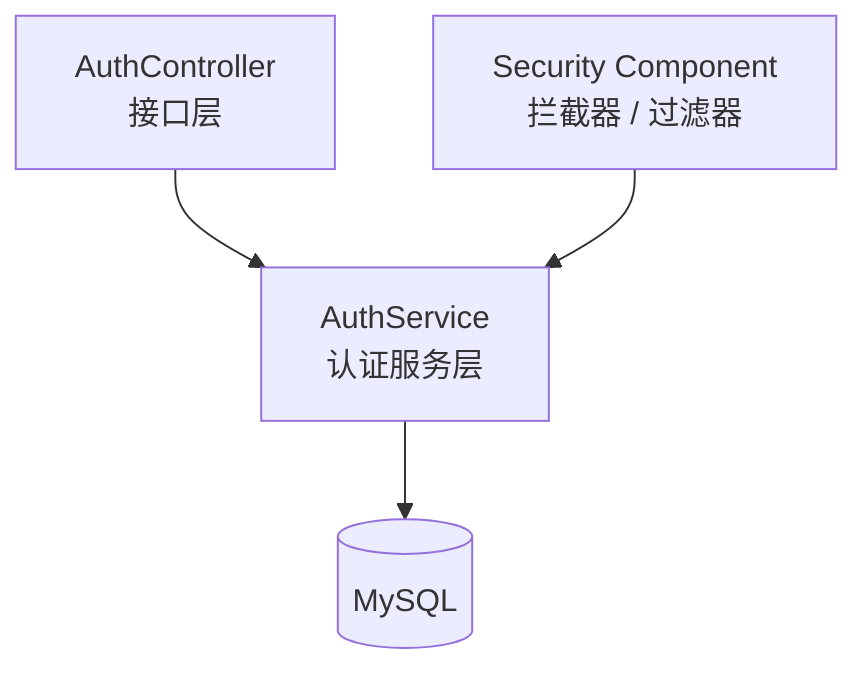

------

## 5 各层详细设计说明

### 5.1 Controller 层设计

Controller 层负责提供认证相关接口，例如登录、登出等操作。

#### 主要功能

- 接收登录请求
- 返回认证结果与访问凭证

------

### 5.2 Service 层设计

Service 层负责具体认证逻辑处理，包括：

- 校验用户身份合法性
- 校验用户状态
- 生成或校验访问凭证

------

### 5.3 安全组件设计

系统通过拦截器或过滤器方式，对所有受保护接口进行统一权限校验：

- 校验用户是否已登录
- 校验用户是否具备访问接口的权限

------

## 6 认证流程设计

### 6.1 登录流程说明

1. 用户提交登录请求
2. 系统校验用户名与密码
3. 认证成功后生成访问凭证
4. 后续请求通过拦截器进行权限校验

------

## 7 本模块小结

认证与权限模块通过统一的身份校验与权限控制机制，为系统提供安全可靠的访问保障。该模块与业务模块完全解耦，确保系统安全控制逻辑的集中管理与可维护性。

## user

来源：`2-系统设计/详细模块设计/user.md`

# 用户管理模块（User）详细模块设计说明

------

## 1 模块概述

### 1.1 模块名称

用户管理模块（User）

### 1.2 模块定位

用户管理模块用于维护系统中的用户信息及用户角色关系，为认证与权限模块提供基础数据支持。

### 1.3 模块设计目标

- 管理系统用户基本信息
- 管理用户状态与角色分配
- 为系统权限控制提供可靠的数据支撑

------

## 2 模块职责说明

### 2.1 核心职责

用户管理模块主要承担以下职责：

1. 用户信息的增删改查
2. 用户状态管理
3. 用户与角色关系维护
4. 向认证模块提供用户数据支持

### 2.2 职责边界约束

- **用户模块不参与权限校验逻辑**
- **用户模块不控制业务访问规则**
- 用户模块不参与库存等业务流程

------

## 3 模块依赖关系

### 3.1 模块依赖说明

用户模块依赖以下基础数据：

- 角色信息（role）

### 3.2 依赖约束说明

- 用户模块仅维护用户与角色关系
- 权限控制逻辑由认证模块统一处理

------

## 4 模块内部结构设计

用户模块内部采用统一分层架构设计。

### 4.1 模块内部结构图（Mermaid）

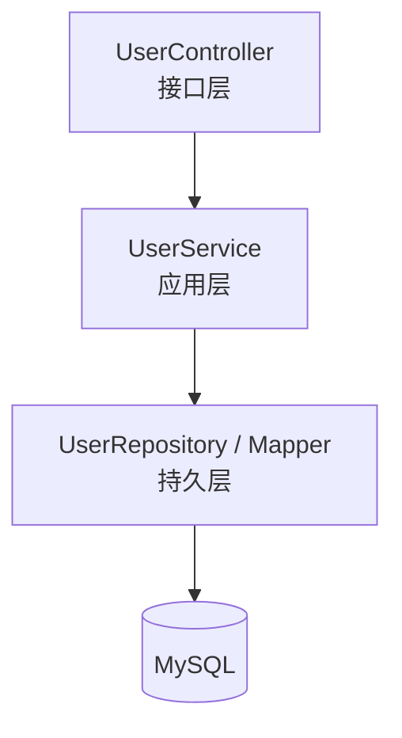

------

## 5 各层详细设计说明

### 5.1 Controller 层设计

Controller 层负责用户管理相关接口的接入与响应。

------

### 5.2 Service 层设计

Service 层负责用户管理业务逻辑，包括：

- 用户创建与更新
- 用户状态控制
- 用户角色分配

------

### 5.3 Repository 层设计

Repository 层负责用户与角色数据的持久化操作。

------

## 6 核心业务流程设计

### 6.1 用户创建流程

1. 管理员提交新增用户请求
2. 系统校验用户信息合法性
3. 保存用户信息与角色关系
4. 返回处理结果

------

## 7 异常与边界情况设计

- 用户不存在异常
- 用户状态非法异常
- 角色分配异常

所有异常统一通过系统全局异常处理机制进行封装返回。

------

## 8 本模块小结

用户管理模块通过统一维护系统用户信息与角色关系，为认证与权限模块提供基础数据支持。该模块职责清晰、结构简单，是系统安全体系的重要组成部分。

## system

来源：`2-系统设计/详细模块设计/system.md`

# 系统管理模块（System）详细模块设计说明

---

## 1 模块概述

### 1.1 模块名称  
系统管理模块（System）

### 1.2 模块定位  
系统管理模块用于提供系统运行所需的**通用管理与运维支持能力**，包括系统配置、操作日志等功能。  
该模块不参与具体业务流程处理，属于系统级支撑模块。

### 1.3 模块设计目标  

- 提供系统级通用管理功能  
- 支撑系统稳定运行与后期维护  
- 记录关键操作行为，便于审计与问题追溯  
- 与具体业务模块解耦，避免业务逻辑污染  

---

## 2 模块职责说明

### 2.1 核心职责  

系统管理模块主要承担以下职责：

1. 系统基础配置管理  
2. 系统运行参数维护  
3. 用户操作日志记录与查询  
4. 为系统运维与管理提供辅助支持  

### 2.2 职责边界约束  

为保证系统结构清晰，系统管理模块明确以下约束规则：

- **系统管理模块不参与任何业务数据处理**
- **系统管理模块不直接修改库存、商品等业务数据**
- 系统管理模块仅提供系统级通用能力支持  

---

## 3 模块依赖关系

### 3.1 模块依赖说明  

系统管理模块依赖以下基础模块：

- 用户管理模块（user）

### 3.2 依赖约束说明  

- 系统管理模块仅用于记录与查询系统行为  
- 业务模块不得依赖系统管理模块完成核心业务逻辑  
- 系统管理模块不反向依赖业务模块  

---

## 4 模块内部结构设计

系统管理模块内部采用统一的分层架构设计，结构相对简洁。

### 4.1 模块内部结构图（Mermaid）

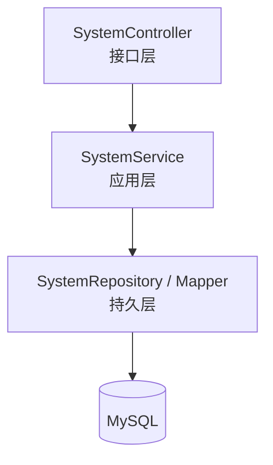
>说明：
系统管理模块不包含领域层（Domain），所有功能均为系统级管理与记录，不涉及复杂业务规则。

---

## 5 各层详细设计说明

------

### 5.1 Controller 层设计

#### 5.1.1 层职责

Controller 层作为系统管理模块的接口入口，主要负责：

- 接收系统管理相关请求
- 参数解析与校验
- 调用 Service 层执行业务处理
- 返回统一格式的响应结果

#### 5.1.2 设计约束

- Controller 层不允许直接操作数据库
- Controller 层不参与任何业务逻辑判断

------

### 5.2 Service 层设计

#### 5.2.1 层职责

Service 层负责系统管理相关业务处理，主要包括：

- 系统配置的读取与维护
- 操作日志的记录与查询
- 系统级功能的统一封装

#### 5.2.2 设计说明

Service 层不直接参与业务流程，仅为系统运行提供必要的管理与辅助能力。

------

### 5.3 Repository 层设计

#### 5.3.1 层职责

Repository 层负责系统管理相关数据的持久化操作，包括：

- 系统配置数据的读写
- 系统操作日志的查询

#### 5.3.2 设计约束

- Repository 层仅负责数据读写
- 不包含任何业务规则或流程控制

------

## 6 核心功能设计说明

### 6.1 系统配置管理

系统管理模块支持对系统基础配置参数进行维护，例如：

- 系统名称
- 系统运行状态
- 业务参数配置

配置数据可通过数据库或配置文件进行管理。

------

### 6.2 操作日志管理

系统通过系统管理模块记录关键操作行为，包括：

- 用户登录与登出
- 重要业务操作（如入库、出库）
- 系统配置变更操作

操作日志用于后续审计与问题追溯。

------

## 7 系统管理流程说明

### 7.1 操作日志记录流程

1. 系统发生关键操作
2. 系统管理模块记录操作信息
3. 日志数据持久化存储
4. 管理人员可查询日志信息

------

## 8 异常与边界情况设计

系统管理模块需重点处理以下异常情况：

- 配置参数非法异常
- 日志查询条件非法异常
- 数据库访问异常

所有异常统一通过系统全局异常处理机制进行封装返回。

------

## 9 本模块小结

系统管理模块作为系统级支撑模块，为系统运行提供必要的管理与运维能力支持。通过将系统管理功能与具体业务模块解耦设计，系统在保持业务逻辑清晰的同时，具备良好的可维护性与扩展性。

## product

来源：`2-系统设计/详细模块设计/product.md`

# 商品管理模块（Product）详细模块设计说明

---

## 1 模块概述

### 1.1 模块名称  
商品管理模块（Product）

### 1.2 模块定位  
商品管理模块用于维护系统中的商品基础信息，定义“系统中有哪些商品以及商品的基本属性”。  
该模块属于**基础数据管理模块**，不直接参与库存数量变化等核心业务流程。

### 1.3 模块设计目标  

- 统一维护商品基础信息  
- 为库存、入库、出库等业务模块提供商品数据支撑  
- 保证商品数据的规范性与一致性  
- 避免商品模块与库存模块职责混淆  

---

## 2 模块职责说明

### 2.1 核心职责  

商品管理模块主要承担以下职责：

1. 商品基础信息的新增、修改与查询  
2. 商品状态管理（启用 / 停用）  
3. 商品分类及属性信息维护  
4. 向其他业务模块提供商品基础数据  

### 2.2 职责边界约束  

为保证系统结构清晰，商品模块明确以下约束规则：

- **商品模块不维护库存数量信息**
- **商品模块不直接修改库存表（stock）**
- 商品模块仅负责商品“是什么”，不负责商品“有多少”  

---

## 3 模块依赖关系

### 3.1 模块依赖说明  

商品模块作为基础数据模块，被以下业务模块依赖：

- 库存管理模块（stock）
- 入库管理模块（inbound）
- 出库管理模块（outbound）
- 库存盘点模块（stockcheck）
- 报表统计模块（report）

### 3.2 依赖约束说明  

- 商品模块不反向依赖任何业务模块  
- 商品模块不参与库存变更逻辑  
- 商品模块仅通过提供商品数据支持业务模块运行  

---

## 4 模块内部结构设计

商品管理模块内部采用统一的分层架构设计，结构相对简洁。

### 4.1 模块内部结构图（Mermaid）

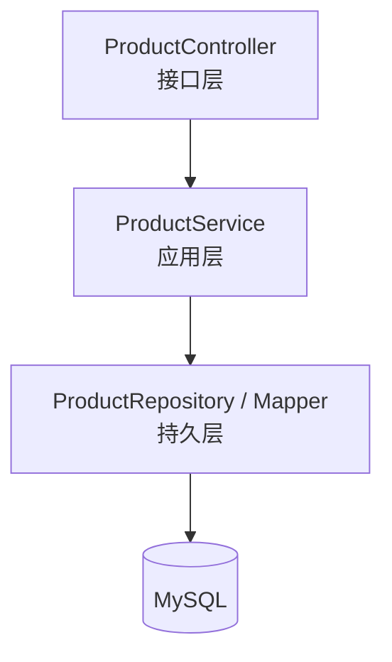

> 说明：
>  商品模块不包含 Domain 层，其业务规则较为简单，主要以基础数据维护为主。

------

## 5 各层详细设计说明

------

### 5.1 Controller 层设计

#### 5.1.1 层职责

Controller 层作为商品模块的接口入口，主要负责：

- 接收商品管理相关请求
- 参数校验与请求封装
- 调用 Service 层执行业务处理
- 返回统一格式的响应结果

#### 5.1.2 设计约束

- Controller 层不得直接操作数据库
- Controller 层不得包含库存相关逻辑

------

### 5.2 Service 层设计

#### 5.2.1 层职责

Service 层负责商品管理业务逻辑处理，主要包括：

- 商品信息新增与修改
- 商品状态维护
- 商品信息查询

#### 5.2.2 设计说明

Service 层不参与库存数量计算，仅对商品基础数据进行管理与校验。

------

### 5.3 Repository 层设计

#### 5.3.1 层职责

Repository 层负责商品数据的持久化操作，包括：

- 商品信息的增删改查
- 商品状态字段更新

#### 5.3.2 设计约束

- Repository 层仅负责数据读写
- 不包含业务规则判断

------

## 6 核心业务流程设计（商品管理流程）

### 6.1 商品新增流程说明

1. 前端提交新增商品请求
2. Controller 层接收并校验参数
3. Service 层校验商品信息合法性
4. Repository 层保存商品数据
5. 返回处理结果

------

### 6.2 商品管理业务时序图（Mermaid）

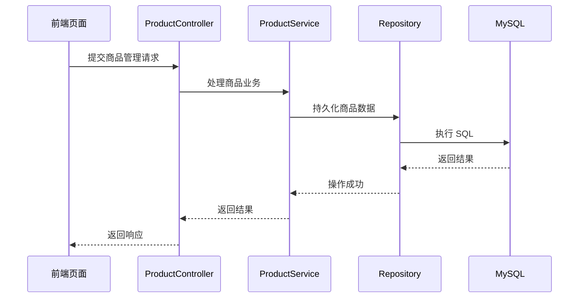

------

## 7 异常与边界情况设计

商品管理模块需重点处理以下异常情况：

- 商品信息非法异常
- 商品重复异常
- 商品不存在异常

所有异常统一通过系统全局异常处理机制进行封装返回。

------

## 8 本模块小结

商品管理模块作为系统的基础数据模块，通过统一维护商品基本信息，为库存及相关业务模块提供可靠的数据支撑。该模块职责单一、结构清晰，有效避免了商品数据与库存数据的职责混淆，为系统整体架构的稳定性提供了保障。

## stock

来源：`2-系统设计/详细模块设计/stock.md`

# 库存管理模块（Stock）详细模块设计说明

---

## 1 模块概述

### 1.1 模块名称  
库存管理模块（Stock）

### 1.2 模块定位  
库存管理模块是系统的**核心业务模块**，负责统一维护商品库存数量及库存状态，保证库存数据在入库、出库、盘点等业务操作过程中的一致性与可追溯性。

### 1.3 模块设计目标  

- 统一管理库存数据，防止库存被多处随意修改  
- 对库存变更进行集中校验与控制  
- 记录所有库存变更日志，支持问题追溯  
- 为其他业务模块提供安全、稳定的库存变更能力  

---

## 2 模块职责说明

### 2.1 核心职责  

库存管理模块主要承担以下职责：

1. 维护商品当前库存数量  
2. 校验库存变更的合法性（如库存不足校验）  
3. 执行库存数量的增减与调整操作  
4. 记录库存变更日志  
5. 提供库存查询能力  

### 2.2 职责边界约束  

为保证系统结构清晰，库存模块明确以下约束规则：

- **库存模块是唯一允许直接修改库存表（stock）的模块**
- 入库、出库、盘点模块 **不得直接操作库存表**
- 所有库存变更必须通过库存模块提供的领域服务完成

---

## 3 模块依赖关系

### 3.1 被依赖情况  

库存模块作为核心状态模块，被以下业务模块依赖：

- 入库管理模块（inbound）
- 出库管理模块（outbound）
- 库存盘点模块（stockcheck）

### 3.2 依赖约束说明  

- 库存模块 **不反向依赖** 入库、出库、盘点模块  
- 库存模块只关心“库存如何变化”，不关心“为什么变化”

---

## 4 模块内部结构设计

库存模块内部采用**分层架构设计**，自上而下划分为 Controller、Service、Domain 与 Repository 层。

### 4.1 模块内部结构图（Mermaid）

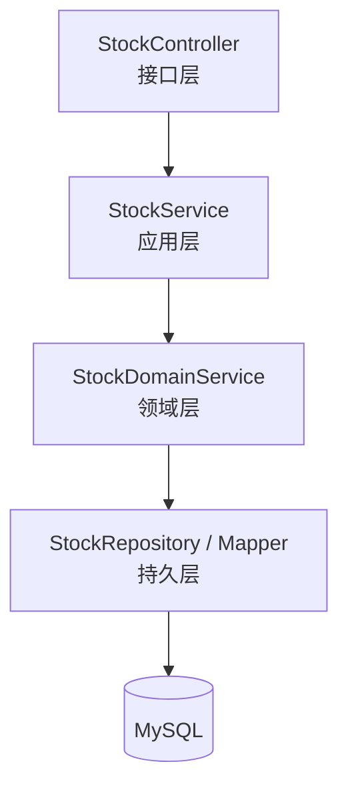

---

 ## 5 各层详细设计说明

 ### 5.1 Controller 层设计

 #### 5.1.1 层职责

 Controller 层作为库存模块的接口入口，主要负责：

- 接收前端请求
- 进行参数校验
- 调用 Service 层完成业务处理
- 返回统一格式的 JSON 响应

#### 5.1.2 设计约束

- Controller 层 不允许 直接操作数据库
- Controller 层 不包含 任何库存业务判断逻辑

---

### 5.2 Service 层设计
#### 5.2.1 层职责

Service 层负责库存相关业务流程的编排，主要包括：

- 库存查询业务流程
- 调用库存领域服务执行库存变更
- 事务边界控制

#### 5.2.2 设计说明

Service 层不直接修改库存数据，而是统一调用库存领域服务完成库存增减或调整操作，从而保证库存变更逻辑的集中控制。

---

### 5.3 Domain 层设计（核心设计）

#### 5.3.1 层定位

Domain 层是库存模块的核心业务规则层，用于封装所有与库存变更相关的业务规则。

#### 5.3.2 核心职责

库存领域服务主要负责：

- 校验库存变更合法性
- 执行库存数量变更
- 记录库存变更日志
- 保证库存变更的原子性

#### 5.3.3 领域规则示例

- 出库操作时，库存数量不得小于 0
- 库存调整必须记录库存变更日志
- 同一商品的库存变更操作需保证一致性

> **设计原则：**
> 凡是影响库存正确性的业务规则，必须集中在库存领域服务中实现，禁止分散在其他模块。

---

### 5.4 Repository 层设计

#### 5.4.1 层职责

Repository 层负责库存相关数据的持久化操作，包括：

- 查询库存信息
- 更新库存数量
- 插入库存变更日志

#### 5.4.2 设计约束

- Repository 层仅负责 CRUD 操作
- 不包含任何业务逻辑判断

---

### 6 核心业务流程设计（库存变更）

#### 6.1 库存增加流程说明

1. 业务模块（如入库模块）请求库存增加
2. Service 层接收请求并开启事务
3. Domain 层校验库存变更合法性
4. 更新库存表（stock）
5. 记录库存变更日志（stock_log）
6. 返回处理结果

#### 6.2 库存变更时序图（Mermaid）

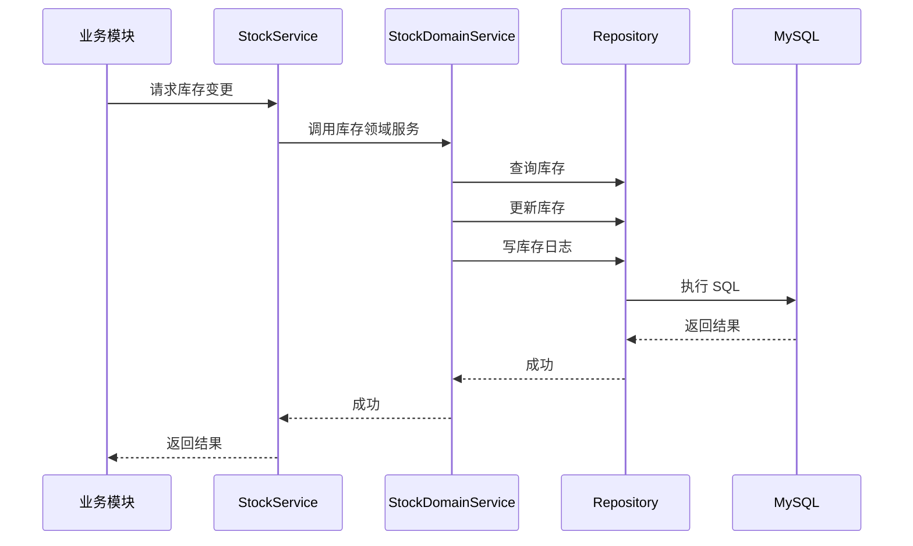

---

### 7 异常与边界情况设计

库存模块需重点处理以下异常情况：

- 库存不足异常
- 商品不存在异常
- 数据并发修改异常

所有异常均通过统一异常机制向上抛出，并由全局异常处理器进行封装返回。

---

## 8 本模块小结

库存管理模块作为系统核心模块，通过统一的领域服务对库存变更进行集中控制，确保库存数据的一致性、安全性与可追溯性。该模块为入库、出库、盘点等业务模块提供了可靠的基础支撑，是整个库存管理系统稳定运行的关键。

---

## inbound

来源：`2-系统设计/详细模块设计/inbound.md`

# 入库管理模块（Inbound）详细模块设计说明

---

## 1 模块概述

### 1.1 模块名称  
入库管理模块（Inbound）

### 1.2 模块定位  
入库管理模块用于记录和管理商品的入库业务，描述库存**“为什么增加”**的业务原因。本模块不直接维护库存数量，而是通过调用库存管理模块完成库存的实际变更。

### 1.3 模块设计目标  

- 规范商品入库业务流程  
- 记录每一次入库操作的业务信息  
- 保证入库操作与库存变更的一致性  
- 避免入库模块直接修改库存数据  

---

## 2 模块职责说明

### 2.1 核心职责  

入库管理模块主要承担以下职责：

1. 接收并处理商品入库请求  
2. 生成并保存入库单据  
3. 记录入库数量、时间及操作人员  
4. 调用库存模块完成库存增加操作  

### 2.2 职责边界约束  

为保证系统结构清晰，入库模块明确以下约束规则：

- **入库模块不允许直接修改库存表（stock）**
- **入库模块仅负责“业务记录”，不负责“库存规则判断”**
- 库存数量变更必须由库存模块统一完成  

---

## 3 模块依赖关系

### 3.1 模块依赖说明  

入库模块依赖以下模块：

- 库存管理模块（stock）

### 3.2 依赖约束说明  

- 入库模块只能通过库存模块提供的服务接口进行库存变更  
- 入库模块不反向依赖其他业务模块  
- 入库模块不关心库存变更的具体规则实现  

---

## 4 模块内部结构设计

入库模块内部采用统一的分层架构设计，划分为 Controller、Service、Domain（可选）与 Repository 层。

### 4.1 模块内部结构图（Mermaid）

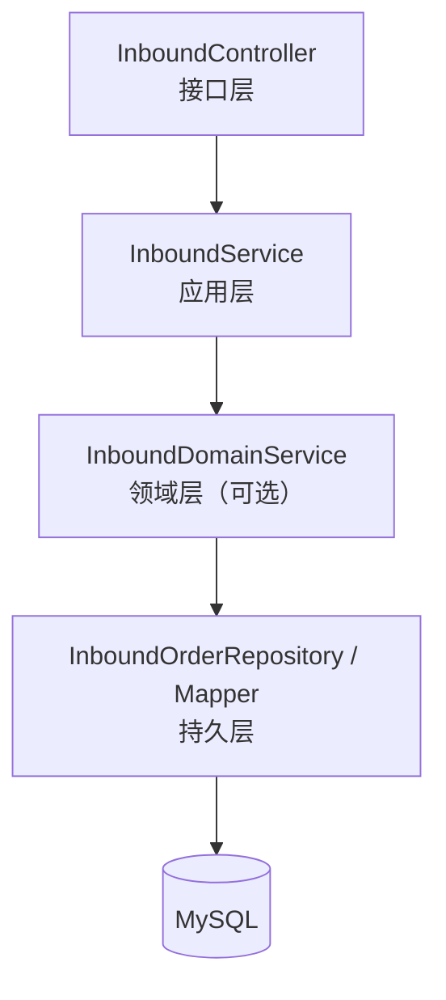
> 说明：
> 入库模块以业务记录为主，领域规则较少，Domain 层可根据实际复杂度选择是否单独拆分。

---

## 5 各层详细设计说明

### 5.1 Controller 层设计

#### 5.1.1 层职责

Controller 层作为入库模块的接口入口，主要负责：

- 接收前端入库请求
- 参数绑定与参数校验
- 调用 Service 层执行业务流程
- 返回统一格式的响应结果

#### 5.1.2 设计约束

- Controller 层不得直接操作数据库
- Controller 层不得直接调用库存模块

---

### 5.2 Service 层设计

#### 5.2.1 层职责

Service 层负责入库业务流程的整体编排，主要包括：

- 创建并保存入库单
- 调用库存模块增加库存
- 控制入库业务的事务边界

#### 5.2.2 设计说明

Service 层在一次入库操作中，需保证以下操作的原子性：

1. 入库单数据写入成功
2. 库存增加操作成功

若库存变更失败，则入库单操作需回滚。

---

### 5.3 Domain 层设计

#### 5.3.1 层定位

Domain 层用于封装入库业务中的基础规则，例如入库数量合法性校验等。

#### 5.3.2 设计说明

当入库业务规则较为简单时，可将规则直接放入 Service 层；当规则复杂度提升（如多类型入库、审批流程）时，可引入独立的入库领域服务。

---

### 5.4 Repository 层设计

#### 5.4.1 层职责

Repository 层负责入库单数据的持久化操作，包括：

- 插入入库单记录
- 查询入库记录
- 按条件统计入库信息

#### 5.4.2 设计约束

- Repository 层只负责数据读写
- 不包含业务流程或库存规则判断

---

## 6 核心业务流程设计（入库流程）

### 6.1 入库流程说明

1. 前端提交入库请求
2. Controller 层接收并校验参数
3. Service 层创建入库单
4. Service 层调用库存模块增加库存
5. 库存模块完成库存变更并记录日志
6. 入库流程完成并返回结果

### 6.2 入库业务时序图（Mermaid）

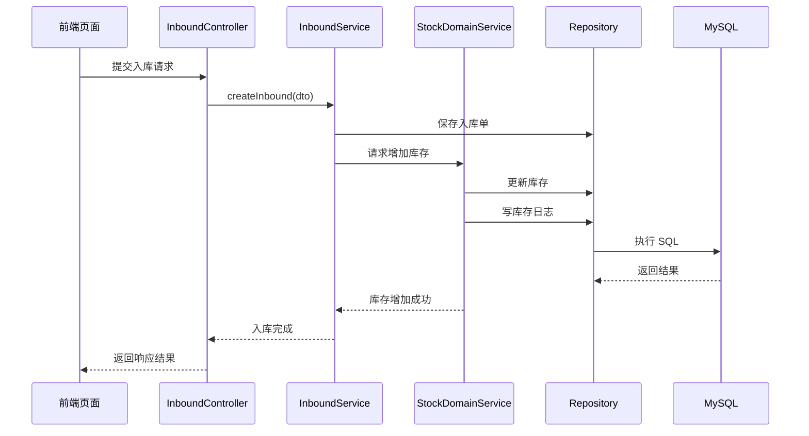

---

## 7 异常与边界情况设计

入库模块需重点处理以下异常情况：

- 入库商品不存在异常
- 入库数量非法异常
- 库存模块处理失败异常

所有异常均通过统一异常处理机制返回标准错误信息。

---

## 8 本模块小结

入库管理模块通过记录入库业务信息，并统一调用库存管理模块完成库存变更，实现了业务记录与库存状态维护的解耦设计。该模块结构清晰、职责单一，为系统库存数据一致性提供了重要保障。

## outbound

来源：`2-系统设计/详细模块设计/outbound.md`

# 出库管理模块（Outbound）详细模块设计说明

---

## 1 模块概述

### 1.1 模块名称  
出库管理模块（Outbound）

### 1.2 模块定位  
出库管理模块用于记录和管理商品的出库业务，描述库存**“为什么减少”**的业务原因。本模块不直接维护库存数量，而是通过调用库存管理模块完成库存的实际扣减操作。

### 1.3 模块设计目标  

- 规范商品出库业务流程  
- 记录每一次出库操作的业务信息  
- 保证出库操作与库存变更的一致性  
- 防止库存被非法或重复扣减  

---

## 2 模块职责说明

### 2.1 核心职责  

出库管理模块主要承担以下职责：

1. 接收并处理商品出库请求  
2. 生成并保存出库单据  
3. 记录出库数量、时间及操作人员  
4. 调用库存模块完成库存扣减操作  

### 2.2 职责边界约束  

为保证系统结构清晰，出库模块明确以下约束规则：

- **出库模块不允许直接修改库存表（stock）**
- **出库模块不负责库存合法性判断**
- 所有库存扣减操作必须通过库存模块完成  

---

## 3 模块依赖关系

### 3.1 模块依赖说明  

出库模块依赖以下模块：

- 库存管理模块（stock）

### 3.2 依赖约束说明  

- 出库模块只能通过库存模块提供的领域服务完成库存扣减  
- 出库模块不反向依赖其他业务模块  
- 出库模块不感知库存规则的具体实现细节  

---

## 4 模块内部结构设计

出库模块内部采用统一的分层架构设计，划分为 Controller、Service、Domain（可选）与 Repository 层。

### 4.1 模块内部结构图（Mermaid）

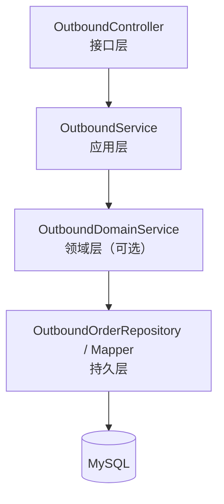

> 说明：
出库模块以业务记录为主，库存规则集中在库存模块中实现，因此 Domain 层可根据业务复杂度选择性引入。

---

## 5 各层详细设计说明

### 5.1 Controller 层设计

#### 5.1.1 层职责

Controller 层作为出库模块的接口入口，主要负责：

- 接收前端出库请求
- 参数校验与请求封装
- 调用 Service 层执行业务流程
- 返回统一格式的响应结果

#### 5.1.2 设计约束

- Controller 层不得直接操作数据库
- Controller 层不得直接调用库存持久层

---

### 5.2 Service 层设计

#### 5.2.1 层职责

Service 层负责出库业务流程的整体编排，主要包括：

- 创建并保存出库单
- 调用库存模块执行库存扣减
- 控制出库业务的事务一致性

#### 5.2.2 设计说明

在一次出库操作中，Service 层需保证以下操作的原子性：

1. 出库单记录写入成功
2. 库存扣减操作成功

若库存扣减失败（如库存不足），则出库操作需整体回滚。

---

### 5.3 Domain 层设计

#### 5.3.1 层定位

Domain 层用于封装出库业务中的基础规则，例如出库数量合法性校验等。

#### 5.3.2 设计说明

由于库存合法性校验集中在库存模块中完成，出库模块的 Domain 层规则相对较少，可根据业务复杂度决定是否独立拆分。

---

### 5.4 Repository 层设计

#### 5.4.1 层职责

Repository 层负责出库单数据的持久化操作，包括：

- 插入出库单记录
- 查询出库记录
- 按条件统计出库信息

#### 5.4.2 设计约束

- Repository 层仅负责数据读写
- 不包含库存规则或业务流程判断

---

## 6 核心业务流程设计（出库流程）

### 6.1 出库流程说明

1. 前端提交出库请求
2. Controller 层接收并校验参数
3. Service 层创建出库单
4. Service 层调用库存模块执行库存扣减
5. 库存模块校验库存合法性并记录库存日志
6. 出库流程完成并返回结果

---

### 6.2 出库业务时序图（Mermaid）
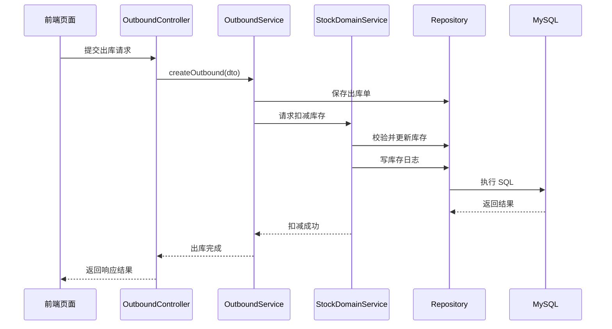

---

## 7 异常与边界情况设计

出库模块需重点处理以下异常情况：

- 出库商品不存在异常
- 出库数量非法异常
- 库存不足异常
- 库存模块处理失败异常

所有异常统一由全局异常处理机制进行封装返回。

---

## 8 本模块小结

出库管理模块通过记录出库业务信息，并统一调用库存管理模块完成库存扣减操作，实现了业务记录与库存状态维护的解耦设计。该模块与入库模块形成对称结构，共同支撑系统库存变化的完整业务闭环。

## stockcheck

来源：`2-系统设计/详细模块设计/stockcheck.md`

# 库存盘点模块（StockCheck）详细模块设计说明

---

## 1 模块概述

### 1.1 模块名称  
库存盘点模块（StockCheck）

### 1.2 模块定位  
库存盘点模块用于对系统记录的库存数量与实际库存数量进行对比核对，记录盘点结果及库存差异情况，描述库存**“是否准确”**的问题。本模块不直接维护库存数量，而是通过调用库存管理模块对库存进行统一调整。

### 1.3 模块设计目标  

- 支持对商品库存进行定期或不定期盘点  
- 记录系统库存与实际库存之间的差异  
- 保证库存调整操作的规范性与可追溯性  
- 避免通过直接修改库存表的方式修正数据  

---

## 2 模块职责说明

### 2.1 核心职责  

库存盘点模块主要承担以下职责：

1. 发起库存盘点操作  
2. 记录系统库存数量与实际库存数量  
3. 计算并保存库存差异结果  
4. 通过库存模块完成库存调整操作  

### 2.2 职责边界约束  

为保证系统结构清晰，库存盘点模块明确以下约束规则：

- **库存盘点模块不允许直接修改库存表（stock）**
- **库存盘点模块仅负责“发现差异”，不负责“直接修正库存”**
- 库存数量调整必须通过库存管理模块统一完成  

---

## 3 模块依赖关系

### 3.1 模块依赖说明  

库存盘点模块依赖以下模块：

- 库存管理模块（stock）

### 3.2 依赖约束说明  

- 库存盘点模块只能通过库存模块提供的领域服务完成库存调整  
- 库存盘点模块不反向依赖入库、出库模块  
- 库存盘点模块不关心库存调整的具体规则实现  

---

## 4 模块内部结构设计

库存盘点模块内部采用统一的分层架构设计，划分为 Controller、Service、Domain（可选）与 Repository 层。

### 4.1 模块内部结构图（Mermaid）

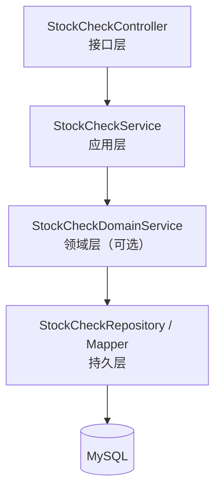

> 说明：
盘点模块以差异记录为主，库存一致性规则集中在库存模块中实现，因此 Domain 层可根据业务复杂度选择是否独立拆分。

---

## 5 各层详细设计说明

### 5.1 Controller 层设计

#### 5.1.1 层职责

Controller 层作为库存盘点模块的接口入口，主要负责：

- 接收前端库存盘点请求
- 参数校验与请求封装
- 调用 Service 层执行业务流程
- 返回统一格式的响应结果

#### 5.1.2 设计约束

- Controller 层不得直接操作数据库
- Controller 层不得直接调用库存模块的持久化层

---

### 5.2 Service 层设计

#### 5.2.1 层职责

Service 层负责库存盘点业务流程的整体编排，主要包括：

- 查询当前系统库存数量
- 记录盘点数据并计算库存差异
- 调用库存模块执行库存调整
- 控制盘点业务的事务一致性

#### 5.2.2 设计说明

Service 层在一次盘点操作中，需保证以下操作的原子性：

1. 盘点记录写入成功
2. 库存调整操作成功

若库存调整失败，则盘点操作需整体回滚。

---

### 5.3 Domain 层设计

#### 5.3.1 层定位

Domain 层用于封装库存盘点业务中的基础规则，例如：

- 实际库存数量合法性校验
- 差异数量计算规则

#### 5.3.2 设计说明

由于库存调整规则集中在库存模块中实现，盘点模块的 Domain 层规则相对简单，可根据后续业务复杂度决定是否独立拆分。

---

### 5.4 Repository 层设计

#### 5.4.1 层职责

Repository 层负责库存盘点数据的持久化操作，包括：

- 插入库存盘点记录
- 查询历史盘点记录
- 按条件统计盘点结果

#### 5.4.2 设计约束

- Repository 层仅负责数据读写
- 不包含库存调整或业务规则判断

---

## 6 核心业务流程设计（库存盘点流程）

### 6.1 库存盘点流程说明

1. 前端提交库存盘点请求
2. Controller 层接收并校验参数
3. Service 层查询系统库存数量
4. Service 层计算库存差异并保存盘点记录
5. Service 层调用库存模块执行库存调整
6. 库存模块记录库存变更日志
7. 盘点流程完成并返回结果

---

### 6.2 库存盘点业务时序图（Mermaid）

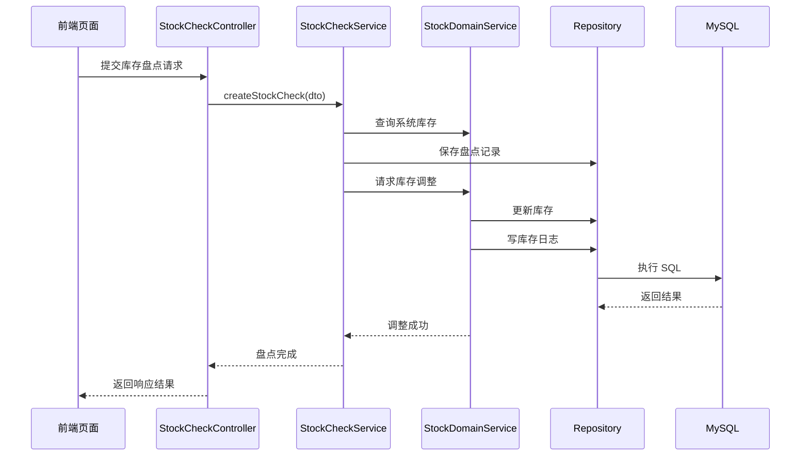

---

## 7 异常与边界情况设计

库存盘点模块需重点处理以下异常情况：

- 盘点商品不存在异常
- 实际库存数量非法异常
- 库存模块处理失败异常
- 并发盘点冲突异常

所有异常统一由全局异常处理机制进行封装返回。

---

## 8 本模块小结

库存盘点模块通过记录系统库存与实际库存之间的差异，并统一调用库存管理模块完成库存调整操作，实现了库存数据校验与修正过程的规范化管理。该模块与入库、出库模块共同构成库存变更的完整业务闭环，为系统库存数据的准确性提供了重要保障。

## report

来源：`2-系统设计/详细模块设计/report.md`

# 报表统计模块（Report）详细模块设计说明

---

## 1 模块概述

### 1.1 模块名称  
报表统计模块（Report）

### 1.2 模块定位  
报表统计模块用于对系统中已有业务数据进行统计分析与结果展示，为管理人员提供库存与业务运行情况的辅助决策支持。  
该模块属于**只读业务模块**，不参与任何业务状态修改操作。

### 1.3 模块设计目标  

- 对库存及业务数据进行统计与汇总  
- 为管理人员提供直观的数据展示结果  
- 避免报表功能对核心业务数据产生副作用  
- 保证报表模块与业务模块之间的低耦合  

---

## 2 模块职责说明

### 2.1 核心职责  

报表统计模块主要承担以下职责：

1. 统计当前库存数据  
2. 汇总入库、出库业务数据  
3. 提供库存变化与业务趋势分析  
4. 向前端提供只读报表数据接口  

### 2.2 职责边界约束  

为保证系统数据安全性与结构清晰性，报表模块明确以下约束规则：

- **报表模块仅允许进行数据查询操作**
- **报表模块不允许修改任何业务数据**
- 报表模块不得直接或间接触发库存变更操作  

---

## 3 模块依赖关系

### 3.1 模块依赖说明  

报表模块依赖以下模块的数据：

- 商品管理模块（product）
- 库存管理模块（stock）
- 入库管理模块（inbound）
- 出库管理模块（outbound）

### 3.2 依赖约束说明  

- 报表模块仅通过查询方式依赖其他业务模块的数据  
- 其他业务模块不得依赖报表模块  
- 报表模块不反向调用任何业务模块的 Service 或 Domain 层  

---

## 4 模块内部结构设计

报表统计模块内部采用统一的分层架构设计，但由于其只读特性，结构相对简化。

### 4.1 模块内部结构图（Mermaid）

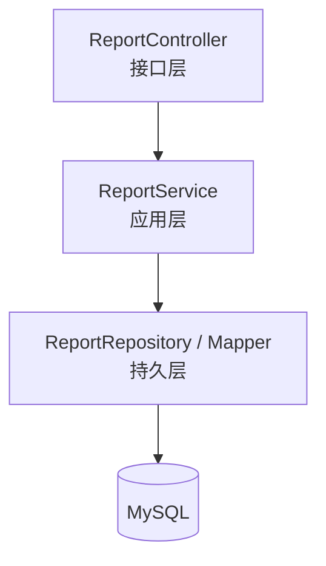

---

## 5 各层详细设计说明

### 5.1 Controller 层设计

#### 5.1.1 层职责

Controller 层作为报表模块的接口入口，主要负责：

- 接收前端报表查询请求
- 解析查询条件参数
- 调用 Service 层完成数据统计
- 返回统一格式的报表数据结果

#### 5.1.2 设计约束

- Controller 层不得直接操作数据库
- Controller 层不得参与任何业务逻辑判断

### 5.2 Service 层设计

#### 5.2.1 层职责

Service 层负责报表统计业务的整体处理，主要包括：

- 组织不同类型报表的数据查询逻辑
- 对查询结果进行必要的数据转换与封装
- 保证报表接口的统一性与可扩展性

#### 5.2.2 设计说明

Service 层不参与业务状态变更，仅对已有业务数据进行组合、统计与格式化处理。

### 5.3 Repository 层设计

#### 5.3.1 层职责

Repository 层负责执行具体的数据统计与查询操作，包括：

- 库存统计查询
- 入库、出库数据汇总查询
- 按时间、商品维度进行统计分析

#### 5.3.2 设计约束

- Repository 层仅负责数据查询
- 不包含任何更新、插入或删除操作

## 6 核心报表功能设计

### 6.1 库存统计报表

- 当前库存总量统计
- 各商品库存数量统计
- 库存上下限预警统计

### 6.2 业务统计报表

- 入库业务统计（按时间、商品）
- 出库业务统计（按时间、商品）
- 入库与出库对比分析

## 7 报表查询流程设计

### 7.1 报表查询流程说明

- 前端发起报表查询请求
- Controller 层接收请求并校验参数
- Service 层组织报表查询逻辑
- Repository 层执行统计查询
- 返回统计结果并展示

### 7.2 报表查询时序图（Mermaid）

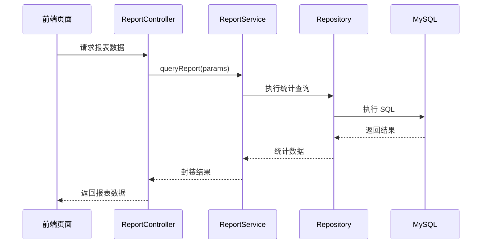

## 8 异常与边界情况设计

报表模块需重点处理以下异常情况：

- 查询参数非法异常
- 查询结果为空情况
- 数据库查询异常
- 所有异常统一通过系统全局异常处理机制进行封装返回。

## 9 本模块小结

报表统计模块作为系统的只读业务模块，通过对库存及相关业务数据的统计与展示，为管理人员提供了有效的数据支持。该模块不参与任何业务状态修改操作，与核心业务模块解耦设计，有效保证了系统业务数据的安全性与整体架构的稳定性。

