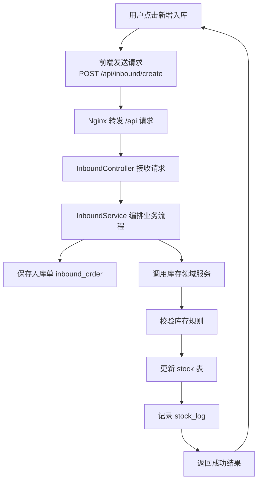

### 一、系统全景调用链

```yaml
[用户浏览器]
    |
    | 1. 访问你的域名（例如 http://xxx.com）
    v
[Nginx（云服务器上的统一入口）]
    |\
    | \ 2a. 请求的是页面资源（/、/assets/*、/index.html…）
    |  \------> 返回 Vue 构建后的静态文件（dist）
    |
    | 2b. 请求的是接口（/api/**）
    v
[Spring Boot 后端服务（Jar 运行起来的 HTTP 服务）]
    |
    | 3. Controller 接收请求（只做参数接收与校验）
    v
[Service 应用层（业务流程编排 + 事务控制）]
    |
    | 4. Domain 领域层（核心业务规则 + 一致性）
    v
[Repository/Mapper 持久层（只做数据库读写）]
    |
    v
[MySQL 数据库（你已经建好表）]
```

---

### 二、每一层干什么

#### 1）浏览器（用户端）

- **干什么**：显示页面、点击按钮、发请求
- **它不干什么**：不写业务逻辑，不直接连数据库

---

#### 2）Nginx（入口层 / 网关层）

##### 2.1 托管前端静态资源

- Vue 项目构建后生成 dist/
- Nginx 直接把 dist/ 当作网站返回给浏览器

##### 2.2 反向代理后端接口

- 前端所有接口统一走 /api/**
- Nginx 把 /api/** 转发到 Spring Boot

---

#### 3）Spring Boot（后端 HTTP 服务）

可以把 Spring Boot 理解为：

“一个一直运行的程序，监听端口，专门处理 /api/** 的请求，并返回 JSON”。

 内部分层：Controller / Service / Domain / Repository。

---

#### 4）Controller（接口层）

- 干什么：接收请求、参数绑定、参数校验、返回统一 JSON
- 禁止干什么：写业务逻辑、直接操作数据库

---

#### 5）Service（应用层）

- 干什么：把一个“业务用例流程”串起来（比如创建入库单 → 增加库存 → 写日志）
- 还干什么：事务控制（哪些操作必须一起成功/一起失败）
- 不建议干什么：写很细的库存一致性规则（那是 Domain 的事）

---

#### 6）Domain（领域层）

> **设计原则：** Domain 层用于封装系统核心业务规则，统一约束库存等关键数据的修改行为。

最典型的 Domain 就是库存领域服务：
- 入库、出库、盘点都不能直接改 stock 表
- 必须统一调用库存领域服务（单一入口）
- 由领域服务负责：合法性校验 + 变更库存 + 记录 stock_log + 触发预警（可选）

---

#### 7）Repository/Mapper（持久层）

- 干什么：只做 CRUD（增删改查）
- 禁止干什么：写业务判断（比如“库存够不够”不应该写在 SQL 层）

---

#### 8）MySQL（数据库）

- 干什么：存数据
- 它不干什么：不理解业务流程，只执行读写

---

### 三、具体业务流程示例

**用户操作：在前端点击“新增入库”**

调用链：
