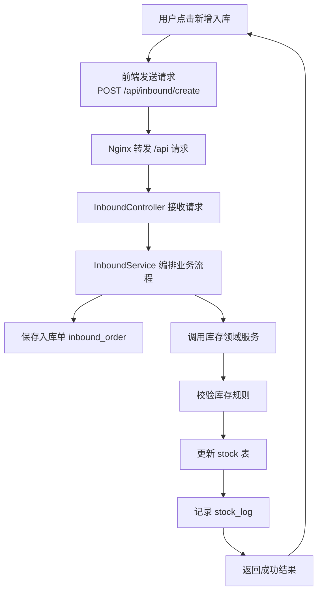

# 项目开发规划与步骤汇总

> 本文档由多个同类文档合并生成，保留原文内容并按来源文件分节。

## 来源文件
- `3-项目开发/开发规划/后续开发规划书.md`
- `3-项目开发/开发规划/系统调用逻辑.md`
- `3-项目开发/开发步骤/库存管理系统开发执行清单.md`
- `3-项目开发/开发步骤/库存管理系统开发步骤说明版.md`

## 后续开发规划书

来源：`3-项目开发/开发规划/后续开发规划书.md`

### 1.重新认识系统认知与架构

**目标**

1. 了解系统由哪些部分组成
2. 了解每一部分负责什么
3. 了解它们之间如何协作

**需要完成的事情**

- 明确系统整体由哪些“工程级组件构成”
- 明确前端、后端、数据库、Nginx 各自职责
- 明确“一个项目”和“一个模块”的区别

**阶段产出**

- 自己能画出**系统组成结构图**
- 能描述系统由什么组成

---

### 2.后端详细模块设计

**目标**

把系统拆解成**可实现、可编码的模块**

**本阶段应关注：**
- 模块边界
- 职责划分
- 调用关系

**模块设计顺序：**
1. auth/user模块
2. product模块
3. stock模块
4. inbound/outbound/stock
5. report（只读）

**每个模块都应关注**
- 模块职责
- 对外提供哪些接口
- 是否修改库存
- 是否依赖其它模块

**阶段产出**
- 《模块设计说明》
- 模块接口清单

---

### 3.后端技术骨架确认

**需要确认：**
- 一个Spring Boot Maven项目
- 模块靠包结构隔离
- 最小依赖集（Web+DB+校验）

**阶段产出**
- 能启动、能连接数据库的Sping Boot空项目
- pom.xml中的依赖都能说清楚“为什么要”

---

### 4.核心业务模块编码

**编码顺序**
1. stock + stock_log
2. product
3. inbound / outbound（调用库存领域服务）

**原则**
- 不追求功能全
- 追求结构对、调用对

---

### 5.前端与部署

## 系统调用逻辑

来源：`3-项目开发/开发规划/系统调用逻辑.md`

### 一、系统全景调用链

```yaml
[用户浏览器]
    |
    | 1. 访问你的域名（例如 http://xxx.com）
    v
[Nginx（云服务器上的统一入口）]
    |\
    | \ 2a. 请求的是页面资源（/、/assets/*、/index.html…）
    |  \------> 返回 Vue 构建后的静态文件（dist）
    |
    | 2b. 请求的是接口（/api/**）
    v
[Spring Boot 后端服务（Jar 运行起来的 HTTP 服务）]
    |
    | 3. Controller 接收请求（只做参数接收与校验）
    v
[Service 应用层（业务流程编排 + 事务控制）]
    |
    | 4. Domain 领域层（核心业务规则 + 一致性）
    v
[Repository/Mapper 持久层（只做数据库读写）]
    |
    v
[MySQL 数据库（你已经建好表）]
```

---

### 二、每一层干什么

#### 1）浏览器（用户端）

- **干什么**：显示页面、点击按钮、发请求
- **它不干什么**：不写业务逻辑，不直接连数据库

---

#### 2）Nginx（入口层 / 网关层）

##### 2.1 托管前端静态资源

- Vue 项目构建后生成 dist/
- Nginx 直接把 dist/ 当作网站返回给浏览器

##### 2.2 反向代理后端接口

- 前端所有接口统一走 /api/**
- Nginx 把 /api/** 转发到 Spring Boot

---

#### 3）Spring Boot（后端 HTTP 服务）

可以把 Spring Boot 理解为：

“一个一直运行的程序，监听端口，专门处理 /api/** 的请求，并返回 JSON”。

 内部分层：Controller / Service / Domain / Repository。

---

#### 4）Controller（接口层）

- 干什么：接收请求、参数绑定、参数校验、返回统一 JSON
- 禁止干什么：写业务逻辑、直接操作数据库

---

#### 5）Service（应用层）

- 干什么：把一个“业务用例流程”串起来（比如创建入库单 → 增加库存 → 写日志）
- 还干什么：事务控制（哪些操作必须一起成功/一起失败）
- 不建议干什么：写很细的库存一致性规则（那是 Domain 的事）

---

#### 6）Domain（领域层）

> **设计原则：** Domain 层用于封装系统核心业务规则，统一约束库存等关键数据的修改行为。

最典型的 Domain 就是库存领域服务：
- 入库、出库、盘点都不能直接改 stock 表
- 必须统一调用库存领域服务（单一入口）
- 由领域服务负责：合法性校验 + 变更库存 + 记录 stock_log + 触发预警（可选）

---

#### 7）Repository/Mapper（持久层）

- 干什么：只做 CRUD（增删改查）
- 禁止干什么：写业务判断（比如“库存够不够”不应该写在 SQL 层）

---

#### 8）MySQL（数据库）

- 干什么：存数据
- 它不干什么：不理解业务流程，只执行读写

---

### 三、具体业务流程示例

**用户操作：在前端点击“新增入库”**

调用链：


## 库存管理系统开发执行清单

来源：`3-项目开发/开发步骤/库存管理系统开发执行清单.md`

# 超市库存管理系统开发执行清单

## 1. 使用说明

本文依据以下文档整理：

- `Document/项目书.md`
- `Document/文档整理与需求基线.md`

本文不是解释性文档，而是后续开发时可直接对照执行的清单。

---

## 2. 开发前准备清单

### 2.1 基础软件准备

- [x] 安装 `Git`
- [x] 安装 `JDK 21`
- [x] 安装 `Maven 3.9.14`
- [x] 安装 `Node.js 24.14.0`
- [x] 安装 `MySQL 8.0.44`
- [x] 安装 `IDEA`
- [x] 安装 `VS Code` 或确定使用 `IDEA` 进行前端开发

### 2.2 调试与辅助工具准备

- [x] 安装数据库工具，如 `Navicat` 或 `DataGrip`
- [x] 安装接口调试工具，如 `Postman` 或 `Apifox`
- [x] 准备浏览器用于前端调试

### 2.3 项目基线确认

- [x] 再次确认开发以 `Document/项目书.md` 为最高优先级依据
- [x] 再次确认开发以 `Document/文档整理与需求基线.md` 为范围和结构依据
- [x] 再次确认数据库以 `market.sql` 为唯一正式依据
- [x] 再次确认 `purchase`、供应商管理仅作为可选扩展项，不纳入默认主线实现
- [x] 再次确认不开发 POS、移动端、多仓库、财务对账、复杂审批流等范围外内容

---

## 3. 项目目录创建清单

### 3.1 根目录整理

- [x] 确认项目根目录保留 `Document/`
- [x] 在项目根目录创建 `sql/`
- [x] 在项目根目录准备 `frontend/`
- [x] 在项目根目录准备 `backend/`
- [x] 在项目根目录准备 `README.md`

### 3.2 根目录创建方式说明

- [x] `Document/` 使用手动保留或手动创建方式
- [x] `sql/` 使用手动创建方式
- [x] `frontend/` 使用 Vue 项目脚手架创建方式
- [x] `backend/` 使用 IDEA 创建 Spring Boot 项目方式

### 3.3 SQL 资料整理

- [x] 将正式数据库脚本保留一份到 `sql/`
- [x] 确保 `sql/` 中保存的是正式版本脚本，而不是早期建议稿

---

## 4. 前端项目创建清单

### 4.1 项目创建

- [x] 使用 Vue 3 创建 `frontend/` 项目
- [x] 确认前端项目能够正常安装依赖
- [x] 确认前端项目能够本地启动
- [x] 确认前端项目能够正常打包

### 4.2 前端结构补齐

- [x] 创建 `src/api/`
- [x] 创建 `src/assets/`
- [x] 创建 `src/components/`
- [x] 创建 `src/layout/`
- [x] 创建 `src/router/`
- [x] 创建 `src/stores/`
- [x] 创建 `src/utils/`
- [x] 创建 `src/views/`

### 4.3 views 目录补齐

- [x] 创建 `src/views/login/`
- [x] 创建 `src/views/user/`
- [x] 创建 `src/views/product/`
- [x] 创建 `src/views/stock/`
- [x] 创建 `src/views/inbound/`
- [x] 创建 `src/views/outbound/`
- [x] 创建 `src/views/stockcheck/`
- [x] 创建 `src/views/report/`
- [x] 创建 `src/views/system/`

### 4.4 前端创建方式结论

- [x] 记住：前端项目整体用脚手架创建
- [x] 记住：前端业务目录在项目内部手动创建

---

## 5. 后端项目创建清单

### 5.1 项目创建

- [x] 使用 IDEA 创建 `backend/` Spring Boot 项目
- [x] 选择 `Maven`
- [x] 确认 JDK 使用 `21`
- [x] 确认 Maven 使用 `3.9.14`
- [x] 确认后端项目能够正常启动

### 5.2 resources 结构准备

- [x] 创建或确认 `application.yml`
- [x] 创建或确认 `application-dev.yml`
- [x] 创建或确认 `application-prod.yml`
- [x] 创建 `resources/mapper/`
- [x] 创建 `resources/static/`

### 5.3 后端公共包创建

- [x] 创建 `config`
- [x] 创建 `common`
- [x] 创建 `common/exception`
- [x] 创建 `common/response`
- [x] 创建 `common/util`
- [x] 创建 `common/constant`

### 5.4 后端业务模块创建

- [x] 创建 `auth`
- [x] 创建 `user`
- [x] 创建 `product`
- [x] 创建 `stock`
- [x] 创建 `inbound`
- [x] 创建 `outbound`
- [x] 创建 `stockcheck`
- [x] 创建 `report`
- [x] 创建 `system`
- [x] 在 `auth` 模块中创建 `password`

### 5.5 模块内部统一结构

对大多数模块：

- [x] 创建 `controller`
- [x] 创建 `service`
- [x] 创建 `mapper`
- [x] 创建 `entity`
- [x] 创建 `dto`
- [x] 创建 `vo`
- [x] 创建 `enums`

对 `stock` 模块额外增加：

- [x] 创建 `domain`

### 5.6 后端创建方式结论

- [x] 记住：后端项目整体用 IDEA 创建 Spring Boot 项目
- [x] 记住：后端模块和内部层次在项目内部手动创建 package

### 5.7 版本基线确认

- [x] 确认后端开发环境为 `JDK 21`
- [x] 确认 Maven 版本为 `3.9.14`
- [x] 确认前端开发环境为 `Node.js 24.14.0`

### 5.8 密码安全实现确认

- [x] 确认 `user.password` 字段长度支持哈希摘要存储
- [x] 确认 `user.password` 只保存哈希摘要，不保存明文密码
- [x] 确认当前密码方案采用 `BCrypt`
- [x] 确认 `auth` 模块通过统一 `PasswordEncoder` 或 `PasswordService` 封装密码能力
- [ ] 确认当前底层实现采用 `BCryptPasswordEncoder`
- [ ] 确认后续如升级为 `Argon2id` 时通过统一密码策略迁移
- [ ] 确认前端提交原始密码的认证链路强制使用 `HTTPS`
- [x] 确认用户新增时先哈希再入库
- [ ] 确认用户重置密码时先哈希再入库
- [ ] 确认登录时使用哈希校验，不做可逆解密
- [x] 确认用户列表接口不返回密码字段
- [ ] 确认用户详情接口不返回密码字段
- [ ] 确认登录响应不返回明文密码或密码哈希摘要
- [x] 确认用户新增响应不返回明文密码或密码哈希摘要
- [ ] 确认日志与调试输出不打印密码字段

---

## 6. Git 初始化与分支管理清单

### 6.1 Git 初始化确认

- [x] 确认项目已经启用 Git
- [x] 确认当前存在稳定主分支 `main`
- [x] 确认 `main` 用于保存可运行、可演示的稳定版本

### 6.2 Git 分支策略确认

- [x] 采用 `main + feature/*` 分支策略
- [x] 不强制引入复杂的 `develop`、`release`、`hotfix`
- [x] 每个独立模块或阶段尽量使用单独分支开发

### 6.3 推荐分支预案

- [x] `feature/project-init`
- [ ] `feature/auth`
- [ ] `feature/user`
- [ ] `feature/product`
- [ ] `feature/stock-core`
- [ ] `feature/inbound`
- [ ] `feature/outbound`
- [ ] `feature/stockcheck`
- [ ] `feature/report`
- [ ] `feature/system`
- [ ] `feature/deploy-docs`

### 6.4 何时创建分支

- [x] 开始一个独立模块前创建分支
- [x] 不要把多个完全不同的模块长期混在同一个分支里

### 6.5 何时提交 commit

- [x] 项目骨架完成后提交一次
- [x] 一个接口完成并测试通过后提交一次
- [x] 一个页面完成并可展示后提交一次
- [x] 一个模块完成后提交一次
- [x] 修复一个明确 bug 后提交一次
- [x] 更新文档或配置后视情况提交一次

### 6.6 何时合并分支

- [x] 模块核心功能已完成
- [x] 本地能够运行
- [x] 已至少完成一轮自测
- [x] 合并后不会破坏 `main` 稳定性

### 6.7 合并后处理

- [x] 合并到 `main`
- [x] 确认 `main` 可以正常运行
- [x] 删除已完成的功能分支

---

## 7. 开发顺序执行清单

## 7.1 第一步：项目初始化

建议分支：

- `feature/project-init`

执行项：

- [x] 创建根目录推荐结构
- [x] 创建前端项目
- [x] 创建后端项目
- [x] 整理 `sql/`
- [x] 初始化 `README.md`
- [x] 完成首次提交
- [x] 合并回 `main`

## 7.2 第二步：认证模块 auth

建议分支：

- `feature/auth`

执行项：

- [ ] 完成登录接口
- [ ] 完成登出接口
- [ ] 完成 Token 生成与校验
- [ ] 在 `auth/password` 中完成统一密码服务封装
- [ ] 完成 `BCrypt` 密码编码与匹配逻辑
- [ ] 确认登录链路在部署环境中通过 `HTTPS`
- [ ] 完成密码哈希校验逻辑
- [ ] 确认登录响应不返回密码相关字段
- [ ] 完成接口认证基础逻辑
- [ ] 使用接口工具完成自测
- [ ] 提交 commit
- [ ] 合并回 `main`

## 7.3 第三步：用户模块 user

建议分支：

- `feature/user`

执行项：

- [x] 完成用户新增
- [x] 完成用户查询
- [ ] 完成用户修改
- [ ] 完成用户删除
- [x] 完成用户启用与禁用
- [ ] 完成用户角色分配
- [x] 确认新增时使用 `BCrypt` 执行哈希处理
- [x] 确认查询接口不返回密码字段
- [ ] 确认新增、修改等响应不返回密码相关字段
- [x] 确认接口安全性验证
- [x] 完成接口测试
- [ ] 提交 commit
- [ ] 合并回 `main`

## 7.4 第四步：商品模块 product

建议分支：

- `feature/product`

执行项：

- [x] 完成商品新增
- [x] 完成商品查询
- [x] 完成商品编码唯一校验
- [x] 完成价格合法性校验
- [ ] 完成商品修改
- [ ] 完成商品删除
- [x] 完成商品上下架
- [x] 确认接口安全性验证
- [ ] 完成接口测试
- [ ] 提交 commit
- [ ] 合并回 `main`

## 7.5 第五步：库存核心模块 stock

建议分支：

- `feature/stock-core`

执行项：

- [x] 完成库存查询
- [x] 完成库存上下限维护
- [x] 完成库存合法性校验
- [x] 完成库存日志记录
- [x] 完成统一库存变更逻辑
- [x] 确认只有 `stock` 模块能直接修改库存
- [ ] 完成接口测试
- [ ] 提交 commit
- [ ] 合并回 `main`

## 7.6 第六步：入库模块 inbound

建议分支：

- `feature/inbound`

执行项：

- [x] 完成新增入库记录
- [x] 完成入库记录查询
- [x] 调用 `stock` 模块增加库存
- [x] 写入库存日志
- [x] 保证事务一致性
- [ ] 完成接口测试
- [ ] 提交 commit
- [ ] 合并回 `main`

## 7.7 第七步：出库模块 outbound

建议分支：

- `feature/outbound`

执行项：

- [x] 完成新增出库记录
- [x] 完成出库记录查询
- [x] 调用 `stock` 模块减少库存
- [x] 完成库存不足校验
- [x] 写入库存日志
- [x] 保证事务一致性
- [ ] 完成接口测试
- [ ] 提交 commit
- [ ] 合并回 `main`

## 7.8 第八步：盘点模块 stockcheck

建议分支：

- `feature/stockcheck`

执行项：

- [x] 完成盘点记录新增
- [x] 完成盘点记录查询
- [x] 完成库存差异计算
- [x] 调用 `stock` 模块调整库存
- [x] 写入库存日志
- [x] 保证事务一致性
- [x] 完成接口测试
- [ ] 提交 commit
- [ ] 合并回 `main`

## 7.9 第九步：前端页面开发与联调

可以按模块拆小分支，也可以配合后端分支同步推进。

执行项：

- [ ] 完成登录页
- [ ] 完成用户管理页
- [ ] 完成商品管理页
- [ ] 完成库存管理页
- [ ] 完成入库管理页
- [ ] 完成出库管理页
- [ ] 完成盘点管理页
- [ ] 完成接口联调
- [ ] 修复联调问题
- [ ] 提交 commit

## 7.10 第十步：报表模块 report

建议分支：

- `feature/report`

执行项：

- [ ] 完成库存统计接口
- [ ] 完成入库统计接口
- [ ] 完成出库统计接口
- [ ] 完成库存预警接口
- [ ] 完成前端报表展示
- [ ] 确认报表模块只读
- [ ] 完成测试
- [ ] 提交 commit
- [ ] 合并回 `main`

## 7.11 第十一步：系统模块 system

建议分支：

- `feature/system`

执行项：

- [ ] 完成系统基础信息接口
- [ ] 完成系统说明页面
- [ ] 提供辅助管理入口
- [ ] 确认不扩展不存在的复杂系统表
- [ ] 完成测试
- [ ] 提交 commit
- [ ] 合并回 `main`

## 7.12 第十二步：测试与部署

建议分支：

- `feature/deploy-docs`

执行项：

- [ ] 完成登录测试
- [ ] 完成用户模块测试
- [ ] 完成商品模块测试
- [ ] 完成库存模块测试
- [ ] 完成入库测试
- [ ] 完成出库测试
- [ ] 完成盘点测试
- [ ] 完成报表测试
- [ ] 准备前端打包文件
- [ ] 准备后端 Jar 包
- [ ] 准备服务器环境
- [ ] 配置 Nginx
- [ ] 部署到华为云 ECS
- [ ] 完成功能验证
- [ ] 整理部署说明
- [ ] 提交 commit
- [ ] 合并回 `main`

---

## 8. 毕业设计实现约束检查清单

- [x] `stock` 是唯一允许直接修改库存的模块
- [x] `inbound`、`outbound`、`stockcheck` 通过 `stock` 变更库存
- [ ] `report` 只查询，不写业务数据
- [ ] `product` 只维护商品信息，不维护库存数量
- [ ] `system` 保持轻量化
- [ ] `user.password` 只保存密码哈希摘要，不保存明文密码
- [ ] 当前密码方案采用 `BCrypt`，后续可按统一策略升级为 `Argon2id`
- [ ] 前端提交原始密码时，认证链路必须走 `HTTPS`
- [ ] 用户列表与详情接口不返回密码字段
- [ ] 登录、用户新增、用户修改等响应不返回密码字段或密码哈希摘要
- [ ] 所有实现与 `market.sql` 一致
- [ ] 所有实现与当前项目书一致
- [ ] 所有实现与当前需求基线一致

---

## 9. 推荐提交信息清单

- [ ] `chore: 初始化项目目录结构`
- [ ] `feat: 创建 Spring Boot 后端项目骨架`
- [ ] `feat: 创建 Vue3 前端项目骨架`
- [ ] `feat: 完成认证登录接口`
- [ ] `feat: 完成用户管理模块`
- [ ] `feat: 完成商品管理模块`
- [ ] `feat: 完成库存核心模块`
- [ ] `feat: 完成入库模块并接入库存变更`
- [ ] `feat: 完成出库模块并增加库存不足校验`
- [ ] `feat: 完成盘点模块并记录库存日志`
- [ ] `feat: 完成报表统计模块`
- [ ] `feat: 完成系统信息模块`
- [ ] `docs: 更新部署说明与开发文档`
- [ ] `fix: 修复联调或库存逻辑问题`

---

## 10. 最后执行提醒

- [ ] 不要超出当前文档基线随意扩展功能范围
- [ ] 不要在 `main` 上直接长期堆叠未完成代码
- [ ] 不要让库存逻辑分散到多个模块里直接修改
- [ ] 每完成一个阶段都尽量保留一次稳定版本
- [ ] 每完成一个模块都同步更新文档与测试记录

如果后续开发严格按照本清单推进，项目结构、实现顺序、版本控制和毕业设计文档表达会比较统一，也更适合后续论文撰写与答辩展示。

## 库存管理系统开发步骤说明版

来源：`3-项目开发/开发步骤/库存管理系统开发步骤说明版.md`

# 超市库存管理系统开发步骤说明

## 1. 文档说明

本文依据以下内容整理：

- `Document/项目书.md`
- `Document/文档整理与需求基线.md`

本文目标是把后续开发过程整理成一份可执行的开发说明，重点回答以下问题：

- 后续开发各阶段需要用到哪些软件
- 各文件夹应该如何创建
- 在毕业设计场景下如何使用 Git 分支进行开发

---

## 2. 项目开发总原则

本项目已经进入正式定版阶段，后续开发应统一遵循以下原则：

- 以 `项目书.md` 和 `文档整理与需求基线.md` 作为最高优先级依据
- 范围内模块仅包括 `auth`、`user`、`product`、`stock`、`inbound`、`outbound`、`stockcheck`、`report`、`system`
- `purchase` 模块与供应商管理作为可选扩展项保留，不纳入默认主线实现
- 多仓库、POS、移动端、财务对账、复杂审批流不纳入本次实现
- `stock` 模块是唯一允许直接修改库存数据的模块
- `inbound`、`outbound`、`stockcheck` 必须通过 `stock` 模块变更库存
- `report` 模块只读，不得修改业务数据
- `system` 模块保持轻量化，不虚构数据库中不存在的复杂业务表
- 所有数据库设计与开发实现都应以 `market.sql` 为准
- `user.password` 只允许保存密码哈希摘要，不允许保存明文密码
- 用户查询类接口、列表接口、详情接口都不应返回密码字段
- 当前密码方案正式采用 `BCrypt`，后续如有需要再升级为 `Argon2id`
- 前端提交用户输入的原始密码时，整个认证链路必须走 `HTTPS`
- 后端只保存密码哈希摘要，并通过安全匹配函数完成登录校验

---

## 3. 推荐开发阶段

### 3.1 第一阶段：整理项目目录与项目骨架

目标如下：

- 建立符合文档基线的项目目录结构
- 创建前端与后端的可运行项目骨架

推荐目录结构如下：

```text
InventoryManagementSystem
├─ Document/
├─ frontend/
├─ backend/
├─ sql/
└─ README.md
```

建议如下：

- `Document/` 保留现有文档资料
- `sql/` 存放正式数据库脚本，建议保留 `market.sql`
- `frontend/` 作为 Vue 3 前端项目
- `backend/` 作为 Spring Boot 后端项目

### 3.2 第二阶段：后端基础能力开发

优先开发：

1. `auth`
2. `user`

这一阶段建议完成以下内容：

- Spring Boot 项目可正常启动
- 数据库连接配置完成
- 统一返回结构
- 全局异常处理
- 登录与登出接口
- Token 校验
- 用户管理基础接口
- 密码哈希存储与登录校验能力

### 3.3 第三阶段：商品模块开发

开发 `product` 模块，主要包括：

- 商品新增
- 商品修改
- 商品删除
- 商品查询
- 商品上下架

### 3.4 第四阶段：库存核心模块开发

开发 `stock` 模块，主要包括：

- 库存查询
- 库存上下限维护
- 库存合法性校验
- 库存变更日志记录
- 统一库存变更服务

这是整个系统最关键的阶段，因为后续入库、出库、盘点都依赖该模块。

### 3.5 第五阶段：入库、出库、盘点模块开发

开发顺序建议如下：

1. `inbound`
2. `outbound`
3. `stockcheck`

开发时必须坚持以下规则：

- 不直接修改库存表
- 通过 `stock` 模块统一修改库存
- 保证事务一致性
- 同步写入库存日志

### 3.6 第六阶段：前端页面开发与联调

建议按业务模块逐步完成前端页面：

- 登录页
- 用户管理页
- 商品管理页
- 库存管理页
- 入库管理页
- 出库管理页
- 盘点管理页
- 报表页
- 系统信息页

### 3.7 第七阶段：报表模块与系统模块开发

开发 `report` 与 `system` 模块。

注意如下：

- `report` 只负责统计与展示
- `system` 只做轻量化信息展示与辅助管理入口

### 3.8 第八阶段：测试、部署与毕业设计收尾

建议完成以下内容：

- 功能测试
- 接口测试
- 联调测试
- 部署到华为云 ECS
- 整理部署说明
- 整理答辩展示材料
- 整理论文撰写所需截图与设计说明

---

## 4. 各阶段所需软件整理

### 4.1 基础开发环境

后续开发建议至少准备以下软件：

- `Git`
- `JDK 21`
- `Maven 3.9.14`
- `Node.js 24.14.0`
- `MySQL 8.0.44`
- `IDEA`
- `VS Code`

其中建议分工如下：

- `IDEA` 主要用于后端开发
- `VS Code` 主要用于前端开发
- 若个人习惯统一使用 `IDEA`，也可以前后端都在 IDEA 中开发

### 4.2 数据库与接口调试工具

建议准备：

- `Navicat` 或 `DataGrip`
- `Postman` 或 `Apifox`

作用如下：

- 数据库工具用于查看表结构、执行 SQL、检查数据
- 接口调试工具用于测试登录、用户、商品、库存等后端接口

### 4.3 部署阶段软件

部署到服务器时需要的软件如下：

- `Nginx`
- `JDK 21`
- `Maven 3.9.14`
- `Node.js 24.14.0`
- `MySQL 8.0.44`
- `Git`
- `Redis`（可选）
- 远程连接工具，如 `Xshell`、`MobaXterm`、`FinalShell`
- 文件上传工具，如 `WinSCP` 或 `FinalShell`

---

## 5. 文件夹创建方式说明

这一部分专门回答“文件夹应该如何创建”。

### 5.1 根目录下的公共目录

以下目录建议手动创建：

- `Document/`
- `sql/`

原因如下：

- 这类目录不是程序项目
- 不需要脚手架
- 手动创建最直接

### 5.2 frontend 目录

`frontend/` 建议通过 Vue 脚手架创建，而不是纯手动创建完整项目。

推荐方式如下：

1. 在项目根目录中创建或直接生成 `frontend/`
2. 使用 Vue 3 + Vite 创建前端项目

原因如下：

- 可以自动生成 `package.json`
- 可以自动生成 `src/`、`public/`、`vite.config.js`
- 后续运行、打包与部署更规范

结论如下：

- `frontend/` 作为项目目录，应使用“创建项目”的方式创建
- 前端项目创建完成后，其内部的业务目录再手动创建

### 5.3 backend 目录

`backend/` 建议通过 IDEA 创建 Spring Boot 项目，而不是完全手动搭目录。

推荐方式如下：

1. 在项目根目录中准备 `backend/`
2. 使用 IDEA 创建 Spring Boot + Maven 项目

原因如下：

- IDEA 会自动生成标准项目结构
- 自动生成 `pom.xml`
- 自动生成 `src/main/java`、`src/main/resources`、`src/test/java`
- 更适合毕业设计答辩时展示规范结构

结论如下：

- `backend/` 应使用“创建项目”的方式创建
- 后端模块目录和包结构在项目生成后再手动补充

### 5.4 前端项目内部目录

前端项目创建完成后，以下目录建议手动创建：

- `src/api/`
- `src/assets/`
- `src/components/`
- `src/layout/`
- `src/router/`
- `src/stores/`
- `src/utils/`
- `src/views/`

以及 `views` 下的：

- `login/`
- `user/`
- `product/`
- `stock/`
- `inbound/`
- `outbound/`
- `stockcheck/`
- `report/`
- `system/`

这些目录属于业务结构，不需要重新建项目，直接在现有前端项目中手动创建即可。

### 5.5 后端项目内部目录

后端项目创建完成后，以下内容建议在 IDEA 中手动创建为包结构：

- `config`
- `common`
- `auth`
- `user`
- `product`
- `stock`
- `inbound`
- `outbound`
- `stockcheck`
- `report`
- `system`

每个模块内部再按需要创建：

- `controller`
- `service`
- `mapper`
- `entity`
- `dto`
- `vo`
- `enums`

其中 `stock` 模块额外保留：

- `domain`

其中 `auth` 模块建议额外保留：

- `password`

注意如下：

- 这些更适合在 IDEA 中创建 `package`
- 不建议直接在资源管理器里随意手工拼接 Java 包目录

---

## 6. Git 版本控制使用建议

### 6.1 是否需要分支开发

需要。

虽然本项目是毕业设计，但非常适合借此练习规范的版本控制流程。由于你是个人开发者，因此不需要采用很复杂的团队协作流程，建议使用轻量化分支策略。

### 6.2 推荐分支模型

建议使用如下策略：

- `main`：稳定主分支
- `feature/*`：功能开发分支

不建议在本项目一开始就引入过于复杂的：

- `develop`
- `release`
- `hotfix`

对于毕业设计，`main + feature/*` 已经足够。

### 6.3 建议的分支命名

可参考以下命名：

- `feature/project-init`
- `feature/auth`
- `feature/user`
- `feature/product`
- `feature/stock-core`
- `feature/inbound`
- `feature/outbound`
- `feature/stockcheck`
- `feature/report`
- `feature/system`
- `feature/deploy-docs`

如果希望合并部分模块，也可以使用：

- `feature/auth-user`
- `feature/report-system`

### 6.4 什么时候创建分支

建议在“准备开始一个相对独立的模块开发”时创建分支。

例如：

- 要做商品模块时，创建 `feature/product`
- 要做库存核心模块时，创建 `feature/stock-core`
- 要做盘点模块时，创建 `feature/stockcheck`

### 6.5 什么时候合并分支

当一个模块满足以下条件时，建议合并回 `main`：

- 功能基本完成
- 本地能够运行
- 已完成至少一次自测
- 不会破坏当前主线稳定性

例如：

- 商品模块的增删改查完成并可测试后，合并 `feature/product`
- 库存模块的查询、上下限维护、日志功能完成后，合并 `feature/stock-core`

### 6.6 什么时候提交 commit

建议按“小功能完成一次提交”的节奏进行。

适合提交的场景如下：

- 项目骨架创建完成
- 一个接口完成并测试通过
- 一个页面完成并可以正常展示
- 一个模块完成
- 修复一个明确 bug
- 调整一个重要配置
- 更新一部分设计文档

不建议：

- 改一两行就提交一次，过于零碎
- 攒很多模块一起提交，导致历史不清晰

### 6.7 推荐提交信息风格

建议使用清晰简洁的提交说明，例如：

- `chore: 初始化项目目录结构`
- `feat: 创建 Spring Boot 后端项目骨架`
- `feat: 创建 Vue3 前端项目骨架`
- `feat: 完成认证登录接口`
- `feat: 完成用户管理模块`
- `feat: 完成商品管理模块`
- `feat: 完成库存核心模块`
- `feat: 完成入库模块并接入库存变更`
- `feat: 完成出库模块并增加库存不足校验`
- `feat: 完成盘点模块并记录库存日志`
- `feat: 完成报表统计模块`
- `feat: 完成系统信息页`
- `docs: 更新部署说明与开发文档`
- `fix: 修复库存变更日志错误`

### 6.8 适合本项目的 Git 工作流

推荐工作流如下：

1. 保持 `main` 为稳定可运行状态
2. 从 `main` 创建新的 `feature/*` 分支
3. 在该分支上完成一个独立模块开发
4. 本地测试通过后合并回 `main`
5. 删除已完成的功能分支
6. 再从 `main` 创建下一个功能分支

---

## 7. 推荐开发顺序与分支对应关系

### 7.1 初始化阶段

- 分支：`feature/project-init`
- 内容：项目目录、前后端项目骨架、README、SQL 目录整理

### 7.2 认证与用户阶段

- 分支：`feature/auth`
- 分支：`feature/user`

或合并为：

- 分支：`feature/auth-user`

### 7.3 商品阶段

- 分支：`feature/product`

### 7.4 库存核心阶段

- 分支：`feature/stock-core`

该阶段最重要，建议单独维护分支。

### 7.5 入库阶段

- 分支：`feature/inbound`

### 7.6 出库阶段

- 分支：`feature/outbound`

### 7.7 盘点阶段

- 分支：`feature/stockcheck`

### 7.8 报表与系统阶段

- 分支：`feature/report`
- 分支：`feature/system`

如果开发时间较紧，也可合并为：

- 分支：`feature/report-system`

### 7.9 部署与文档阶段

- 分支：`feature/deploy-docs`

---

## 8. 最终执行建议

对于本项目，建议采用如下最简洁、最适合毕业设计的开发方式：

- `Document/` 与 `sql/` 手动创建或保留
- `frontend/` 使用 Vue 3 脚手架创建
- `backend/` 使用 IDEA 创建 Spring Boot 项目
- 前端内部业务目录手动创建
- 后端模块内部包结构在 IDEA 中手动创建
- Git 使用 `main + feature/*` 的轻量化分支策略
- 每完成一个模块就合并回 `main`
- 每完成一个小功能或明确修改点就提交一次 commit

这样既能保证开发过程清晰，也能够让你的毕业设计体现出较好的软件工程规范性。

---

## 9. 密码安全实现约束

针对 `user` 表与认证模块，后续开发时建议统一遵循以下实现约束：

- `user.password` 字段只存储密码哈希摘要，不存储原始密码
- 当前阶段正式采用 `BCrypt`
- 后续若需要更高强度方案，可升级为 `Argon2id`
- 在 `auth` 模块中通过统一的 `PasswordEncoder` 或 `PasswordService` 封装密码能力
- 当前底层实现建议使用 `BCryptPasswordEncoder`
- 后续升级到 `Argon2id` 时，尽量保持上层接口与调用方式不变，只替换统一密码服务的底层实现
- 用户新增、导入、重置密码时，必须先完成哈希处理再入库
- 前端提交原始密码时，整个认证链路必须运行在 `HTTPS` 之上
- 登录时应通过密码校验函数安全比对原始密码与哈希摘要，不允许自行做可逆解密
- `GET /api/users`、用户详情接口、用户列表接口、日志打印、调试输出中都不得返回密码字段
- 登录响应、用户新增响应、用户修改响应等所有响应中都不得返回明文密码或密码哈希摘要
- 前端页面中不得展示任何密码明文或可逆内容

建议在开发时按如下步骤落实：

1. 在 `auth/password` 中定义统一密码服务接口或封装类
2. 当前使用 `BCrypt` 实现编码与匹配
3. 在登录、新增用户、重置密码等场景全部复用同一套密码服务
4. 在用户查询、详情、列表、日志输出中统一排除密码字段

---

## 10. 当前版本基线补充说明

根据当前项目书与本次调整，开发环境版本基线统一如下：

- `JDK 21`
- `Maven 3.9.14`
- `Node.js 24.14.0`

兼容性说明如下：

- `JDK 21` 适合作为当前 Spring Boot 项目的开发与部署版本
- `Maven 3.9.14` 与 `JDK 21` 搭配没有明显冲突，适合作为构建工具版本
- `Node.js 24.14.0` 可用于 Vue 3 前端项目的依赖安装、开发调试与打包

因此本次版本调整可直接作为统一基线使用，无需回退到更低版本。

