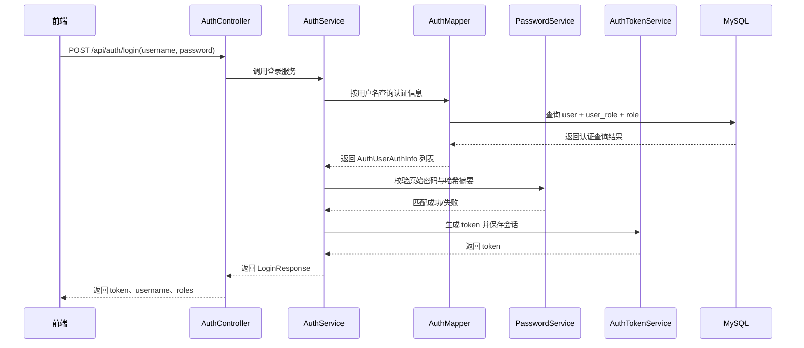
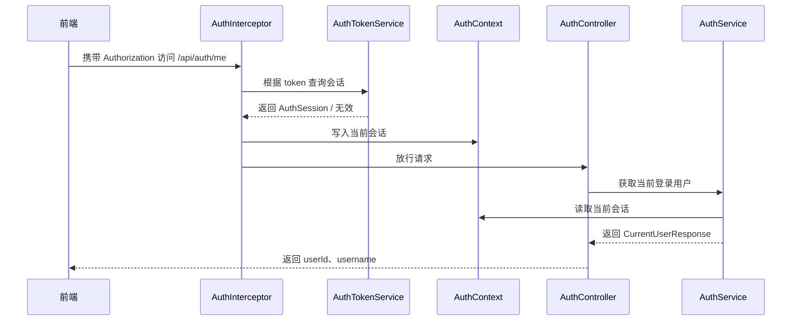

# 后端模块开发记录汇总

> 本文档由多个同类文档合并生成，保留原文内容并按来源文件分节。

## 来源文件
- `4-开发记录/backend/auth模块实现说明.md`
- `4-开发记录/backend/inbound模块/inbound模块对象层设计参考.md`
- `4-开发记录/backend/inbound模块/inbound模块接口测试文档.md`
- `4-开发记录/backend/inbound模块/inbound模块开发注意事项.md`
- `4-开发记录/backend/inbound模块/inbound模块设计总览.md`
- `4-开发记录/backend/inbound模块/inbound模块实现说明.md`
- `4-开发记录/backend/inbound模块/inbound模块项目书对照校验.md`
- `4-开发记录/backend/inbound模块/inbound模块Controller_API设计参考.md`
- `4-开发记录/backend/inbound模块/inbound模块Mapper能力设计参考.md`
- `4-开发记录/backend/inbound模块/inbound模块Service流程设计参考.md`
- `4-开发记录/backend/inbound模块/README.md`
- `4-开发记录/backend/outbound模块/outbound模块对象层设计参考.md`
- `4-开发记录/backend/outbound模块/outbound模块接口测试文档.md`
- `4-开发记录/backend/outbound模块/outbound模块开发注意事项.md`
- `4-开发记录/backend/outbound模块/outbound模块设计总览.md`
- `4-开发记录/backend/outbound模块/outbound模块实现说明.md`
- `4-开发记录/backend/outbound模块/outbound模块项目书对照校验.md`
- `4-开发记录/backend/outbound模块/outbound模块Controller_API设计参考.md`
- `4-开发记录/backend/outbound模块/outbound模块Mapper能力设计参考.md`
- `4-开发记录/backend/outbound模块/outbound模块Service流程设计参考.md`
- `4-开发记录/backend/outbound模块/README.md`
- `4-开发记录/backend/product模块/product模块对象层设计参考.md`
- `4-开发记录/backend/product模块/product模块开发注意事项.md`
- `4-开发记录/backend/product模块/product模块设计总览.md`
- `4-开发记录/backend/product模块/product模块实现说明.md`
- `4-开发记录/backend/product模块/product模块Controller_API设计参考.md`
- `4-开发记录/backend/product模块/product模块Mapper能力设计参考.md`
- `4-开发记录/backend/product模块/product模块Service流程设计参考.md`
- `4-开发记录/backend/product模块/README.md`
- `4-开发记录/backend/stock模块/README.md`
- `4-开发记录/backend/stock模块/stock模块对象层设计参考.md`
- `4-开发记录/backend/stock模块/stock模块接口测试文档.md`
- `4-开发记录/backend/stock模块/stock模块开发注意事项.md`
- `4-开发记录/backend/stock模块/stock模块设计总览.md`
- `4-开发记录/backend/stock模块/stock模块实现说明.md`
- `4-开发记录/backend/stock模块/stock模块Controller_API设计参考.md`
- `4-开发记录/backend/stock模块/stock模块Mapper能力设计参考.md`
- `4-开发记录/backend/stock模块/stock模块Service流程设计参考.md`
- `4-开发记录/backend/stockcheck模块/README.md`
- `4-开发记录/backend/stockcheck模块/stockcheck模块对象层设计参考.md`
- `4-开发记录/backend/stockcheck模块/stockcheck模块接口测试文档.md`
- `4-开发记录/backend/stockcheck模块/stockcheck模块开发注意事项.md`
- `4-开发记录/backend/stockcheck模块/stockcheck模块设计总览.md`
- `4-开发记录/backend/stockcheck模块/stockcheck模块实现说明.md`
- `4-开发记录/backend/stockcheck模块/stockcheck模块项目书对照校验.md`
- `4-开发记录/backend/stockcheck模块/stockcheck模块Controller_API设计参考.md`
- `4-开发记录/backend/stockcheck模块/stockcheck模块Mapper能力设计参考.md`
- `4-开发记录/backend/stockcheck模块/stockcheck模块Service流程设计参考.md`
- `4-开发记录/backend/user模块/README.md`
- `4-开发记录/backend/user模块/user模块对象层设计参考.md`
- `4-开发记录/backend/user模块/user模块开发注意事项.md`
- `4-开发记录/backend/user模块/user模块设计总览.md`
- `4-开发记录/backend/user模块/user模块实现说明.md`
- `4-开发记录/backend/user模块/user模块Controller_API设计参考.md`
- `4-开发记录/backend/user模块/user模块Mapper能力设计参考.md`
- `4-开发记录/backend/user模块/user模块Service流程设计参考.md`

## auth模块实现说明

来源：`4-开发记录/backend/auth模块实现说明.md`

# Auth 模块实现说明

## 一、模块概述（Module Overview）

`auth` 模块是超市库存管理系统中的认证基础模块，主要负责系统登录身份识别、Token 发放与校验、当前登录用户识别，以及登录会话失效处理。

本模块当前已经完成的工作如下：

- 用户登录
- 用户登出
- Token 生成
- Token 有效性校验
- 当前登录用户识别
- 密码哈希匹配

本模块当前**不负责**的内容如下：

- 不负责商品、库存、入库、出库、盘点等业务处理
- 不负责用户资料维护的完整业务流程
- 不负责复杂权限控制与菜单权限控制
- 不负责 JWT、Redis、OAuth2 等重型认证方案

因此，本模块当前定位为：

**一个面向毕业设计阶段、实现清晰、结构轻量、可支撑后续模块认证链路的基础认证模块。**

---

## 二、相关数据表设计（Database Dependency）

`auth` 模块依赖以下 3 张数据表：

### 1. `user`

作用：

- 保存登录账号
- 保存密码哈希摘要
- 保存用户状态

当前认证中使用的关键字段：

- `id`
- `username`
- `password`
- `status`

说明：

- `password` 字段只保存密码哈希摘要，不保存明文密码
- `status` 用于控制用户是否可登录，当前约定 `1` 为启用，`0` 为禁用

### 2. `role`

作用：

- 保存角色名称与角色编码

当前认证中使用的关键字段：

- `id`
- `role_code`
- `role_name`

说明：

- 当前登录成功后会返回当前用户拥有的角色编码列表
- 当前阶段角色主要用于表达“用户身份信息”，还没有进入细粒度权限控制阶段

### 3. `user_role`

作用：

- 建立用户与角色的关联关系

当前认证中使用的关键字段：

- `user_id`
- `role_id`

说明：

- 通过 `user`、`user_role`、`role` 联表查询，系统可以获取某个用户的认证信息及角色列表

---

## 三、核心功能说明（Core Functions）

### 1. 登录认证

用户通过用户名和密码调用登录接口后，系统会先根据用户名查询数据库中的认证信息，再使用统一密码服务对原始密码与数据库中的密码哈希摘要进行匹配。若匹配成功，则生成 token 并返回给前端。

### 2. 登出失效

用户调用登出接口后，系统会将当前 token 对应的内存会话移除。这样一来，该 token 后续再访问受保护接口时，就会被判定为未登录或认证失败。

### 3. Token 校验

系统当前采用轻量级内存 token 方案。每次登录成功后，系统在内存中保存 token 与当前登录会话的映射关系。访问受保护接口时，拦截器会先校验 token 是否存在、是否有效，校验通过后才允许继续访问。

### 4. 当前用户识别

在 token 校验通过后，系统会把当前登录会话写入 `AuthContext`。这样业务层就可以在不直接读取请求头的前提下，拿到当前用户的 `userId` 和 `username`，从而识别“当前是谁在访问系统”。

### 5. 用户禁用拦截

登录时如果查询到用户状态不是启用状态，则系统直接拒绝登录，并返回 `403` 语义的业务异常。这体现了系统对账号状态的基本控制能力。

---

## 四、认证流程设计（Authentication Flow）

当前系统对“识别当前用户”的处理流程如下。

### 1. 登录流程



### 2. 访问受保护接口流程



### 3. 系统如何识别当前用户

系统识别当前用户的关键不在于再次查数据库，而在于以下链路：

1. 用户登录成功时生成 token
2. token 与 `AuthSession` 保存在内存中
3. 请求访问受保护接口时，由 `AuthInterceptor` 校验 token
4. 校验成功后，将当前会话写入 `AuthContext`
5. 后续业务逻辑通过 `AuthContext` 获取当前用户信息

这种方式结构简单，便于毕业设计阶段实现与展示。

---

## 五、密码安全设计（Password Security）

### 1. 当前方案

当前密码方案正式采用 `BCrypt`，并通过统一的 `PasswordService` 进行封装。

### 2. 为什么不保存明文密码

如果数据库泄露，明文密码会直接暴露用户原始口令，风险极高。因此系统只保存密码哈希摘要，不保存原始密码。

### 3. 为什么统一走 PasswordService

为了避免密码加密逻辑散落在登录、用户新增、密码重置等不同位置，系统统一通过 `PasswordService` 完成：

- 密码编码
- 密码匹配

这样做的好处是：

- 逻辑集中
- 便于维护
- 后续升级算法时修改点少

### 4. 后续升级空间

当前虽然使用的是 `BCrypt`，但系统已经通过 `PasswordService` 做了抽象。后续如果需要升级到 `Argon2id`，可以在不大量修改业务代码的情况下完成替换。

### 5. 密码返回控制

当前模块严格遵循以下规则：

- 登录响应不返回密码
- 当前用户接口不返回密码
- 内部认证查询结果不直接返回前端
- 业务代码中不打印原始密码

---

## 六、系统架构与分层设计（Architecture Design）

当前 `auth` 模块采用轻量分层设计，重点是职责清晰。

### 1. `controller`

作用：

- 接收 HTTP 请求
- 做请求参数绑定
- 调用服务层
- 返回统一响应结构

当前类：

- `AuthController`

### 2. `service`

作用：

- 编排认证业务流程
- 控制登录、登出、当前用户获取
- 管理 Token 生命周期

当前类：

- `AuthService`
- `AuthServiceImpl`
- `AuthTokenService`

### 3. `mapper`

作用：

- 负责数据库查询
- 当前只负责认证所需的联表读取

当前类：

- `AuthMapper`

### 4. `password`

作用：

- 封装密码哈希逻辑
- 保持算法实现与业务代码解耦

当前类：

- `PasswordService`
- `BcryptPasswordService`

### 5. `interceptor`

作用：

- 对受保护接口进行 token 校验
- 成功后建立当前请求会话上下文

当前类：

- `AuthInterceptor`

### 6. `context`

作用：

- 保存当前请求线程中的登录会话

当前类：

- `AuthContext`

### 7. `model`

作用：

- 保存模块内部使用的认证模型
- 不直接面向前端

当前类：

- `AuthSession`
- `AuthUserAuthInfo`

### 8. `dto`

作用：

- 接收请求参数

当前类：

- `LoginRequest`

### 9. `vo`

作用：

- 返回给前端的响应对象

当前类：

- `LoginResponse`
- `CurrentUserResponse`

---

## 七、接口设计说明（API Design）

### 1. `POST /api/auth/login`

功能：

- 用户登录

输入：

- `username`
- `password`

输出：

- `token`
- `username`
- `roles`

说明：

- 密码错误时返回 `401`
- 用户不存在时返回 `401`
- 用户被禁用时返回 `403`
- 不返回密码明文和哈希摘要

### 2. `POST /api/auth/logout`

功能：

- 用户登出并失效 token

输入：

- 请求头中的 `Authorization`

输出：

- 统一成功响应

说明：

- token 失效后，再访问受保护接口应返回 `401`

### 3. `GET /api/auth/me`

功能：

- 获取当前登录用户信息

输入：

- 请求头中的 `Authorization`

输出：

- `userId`
- `username`

说明：

- 这是当前 `auth` 模块的受保护接口
- token 有效时可获取当前会话中的用户信息
- token 无效或缺失时返回 `401`

---

## 八、异常处理与响应结构（Error Handling）

### 1. 统一响应结构

当前系统统一采用如下结构：

```json
{
  "code": 0,
  "message": "success",
  "data": {}
}
```

### 2. 当前使用的状态语义

- `0`：成功
- `400`：请求参数错误
- `401`：未登录或认证失败
- `403`：已登录但无权限，或当前用户被禁用
- `500`：系统内部异常

### 3. 当前 auth 模块中的异常处理方式

- 登录用户名不存在：抛出 `BusinessException(401, "用户名或密码错误")`
- 登录密码错误：抛出 `BusinessException(401, "用户名或密码错误")`
- 用户禁用：抛出 `BusinessException(403, "当前用户已被禁用")`
- token 无效或未携带：抛出 `BusinessException(401, "未登录或认证失败")`

所有异常最终由全局异常处理器统一转换为 `ApiResponse` 返回给前端。

---

## 九、测试与验证（Testing）

当前已经完成的测试包括：

### 1. 登录成功测试

验证点：

- 正确用户名密码可登录成功
- 能正常返回 token、username、roles

### 2. 用户不存在测试

验证点：

- 用户名不存在时返回 `401`

### 3. 密码错误测试

验证点：

- 密码错误时返回 `401`

### 4. 用户禁用测试

验证点：

- 用户状态为禁用时返回 `403`

### 5. 当前用户接口测试

验证点：

- 携带有效 token 时，`/api/auth/me` 返回当前用户信息
- 不带 token 时，`/api/auth/me` 返回 `401`
- token 无效时，`/api/auth/me` 返回 `401`

### 6. 登出失效测试

验证点：

- 登出后原 token 失效
- 原 token 再访问 `/api/auth/me` 返回 `401`

### 7. 哈希生成测试

验证点：

- 可通过 `PasswordEncodeTest` 生成测试使用的 `BCrypt` 哈希值

### 8. 编译与测试验证

当前已通过：

- Maven 编译验证
- `auth` 模块相关测试执行验证

说明：

- 当前测试以服务层测试和 Web 层测试为主
- 由于当前 token 使用内存方案，因此测试链路简单、可控

---

## 十、当前实现特点与设计取舍（Design Decisions）

### 1. 为什么当前使用内存 token

这是毕业设计阶段的轻量化取舍。

优点：

- 实现简单
- 便于理解
- 便于答辩展示

缺点：

- 服务重启后会话失效
- 不适合分布式部署

### 2. 为什么没有直接上 Spring Security 全套框架

当前项目明确不追求企业级重型认证方案，而是追求：

- 可控
- 清晰
- 够用

因此选择自定义轻量实现，更适合当前毕业设计复杂度。

### 3. 为什么把会话写入 AuthContext

这样业务层在识别当前用户时，不需要每次都重新解析请求头，也不需要让 Controller 直接处理认证细节，层次更清晰。

### 4. 为什么把内部认证查询模型单独放在 model

这样可以避免 DTO、VO 与内部查询模型混用，增强结构清晰度，也更符合分层职责。

### 5. 为什么密码服务单独封装

这是为了保证密码逻辑的统一性，并为后续升级 `Argon2id` 预留空间。

---

## 十一、存在的不足与后续优化方向（Future Work）

当前 `auth` 模块虽然已经具备基本可用能力，但仍存在以下不足：

### 1. Token 方案仍为轻量内存实现

不足：

- 服务重启后 token 会失效
- 不能跨实例共享

后续优化方向：

- 若项目后期确有需要，可升级到 Redis 或 JWT 方案

### 2. 当前只有认证，没有细粒度权限控制

不足：

- 当前只做到“是否登录”
- 还未做到“角色是否可访问某接口”

后续优化方向：

- 增加角色级接口权限校验

### 3. 当前缺少 token 过期时间与刷新机制

不足：

- token 目前没有主动过期控制

后续优化方向：

- 为 token 增加生命周期管理

### 4. 当前没有接入完整用户模块密码复用链路

不足：

- 当前密码服务已经具备，但用户新增、重置密码等完整场景仍需在后续 `user` 模块中复用

后续优化方向：

- 在 `user` 模块中统一复用 `PasswordService`

### 5. HTTPS 目前属于部署要求

不足：

- 本地开发阶段未强制启用 HTTPS

后续优化方向：

- 在部署说明与最终上线环境中明确强制使用 HTTPS

---

## 结语

当前 `auth` 模块已经形成一条完整的基础认证链路：

- 能登录
- 能登出
- 能生成 token
- 能校验 token
- 能识别当前登录用户
- 能统一处理密码哈希
- 能通过统一响应与异常处理保持接口规范

这使得 `auth` 模块已经可以作为后续其它业务模块访问控制的基础支撑模块，同时又保持了适合毕业设计阶段的实现复杂度与可讲解性。

## inbound模块对象层设计参考

来源：`4-开发记录/backend/inbound模块/inbound模块对象层设计参考.md`

# Inbound 模块对象层设计参考

## 1. 文档目的

本文档用于明确 `inbound` 模块当前阶段对象层设计范围，为后续 Mapper、Service、Controller 设计和实现提供直接参考。

当前阶段只做对象层设计，不进入代码实现。

## 2. 当前设计范围

当前只围绕以下接口设计对象层：

1. `POST /api/inbounds`
2. `GET /api/inbounds`

## 3. 当前阶段不处理什么

当前阶段暂不纳入以下对象扩展：

- 入库详情接口扩展对象
- 分页查询对象
- 条件筛选对象
- 统计报表对象
- 库存日志对象作为 `inbound` 返回对象
- 直接库存修改请求对象

## 4. 对象层设计原则

当前阶段必须遵守以下原则：

1. Entity 用于数据库映射
2. DTO 用于接收请求
3. VO 用于返回前端
4. 不允许直接返回 Entity
5. `inbound` 对象不承担库存核心规则
6. `inbound` 模块不设计 `domain` 层对象

## 5. Entity 设计

### 5.1 InboundOrder

用途：

- 映射 `inbound_order` 表

建议字段如下：

- `Long id`
- `Long productId`
- `Integer quantity`
- `String operator`
- `LocalDateTime createTime`

字段说明：

- `id`：入库记录主键
- `productId`：关联商品主键
- `quantity`：本次入库数量
- `operator`：操作人
- `createTime`：入库时间

设计要求：

- 字段严格对应数据库表
- 不添加业务字段
- 不编写业务方法

## 6. DTO 设计

### 6.1 InboundCreateRequest

用途：

- 接收“新增入库记录”请求参数

建议字段如下：

- `Long productId`
- `Integer quantity`
- `String operator`

说明要求：

- `productId` 后续应加非空约束
- `quantity` 后续应加非空与大于 `0` 约束
- `operator` 后续应加非空约束

## 7. VO 设计

### 7.1 InboundListItemResponse

用途：

- 用于返回入库列表中的单条入库记录

建议字段如下：

- `Long id`
- `Long productId`
- `String productCode`
- `String productName`
- `Integer quantity`
- `String operator`
- `LocalDateTime createTime`

### 7.2 InboundDetailResponse

用途：

- 当前阶段主要用于新增入库成功后的返回对象
- 后续如果增加详情接口，也可复用

建议字段：

- 与 `InboundListItemResponse` 保持一致

说明要求：

- VO 只返回入库记录及最小商品信息
- 不包含库存数量
- 不包含库存日志字段
- 不包含出库、盘点相关信息

## 8. Enums 设计

当前阶段结论如下：

- 按项目书保留 `enums/` 目录
- 当前阶段不主动设计项目书未明确要求的业务枚举
- 如后续实现确有需要，再根据项目书与实现范围补充

## 9. 对象清单汇总

### 9.1 Entity

- `InboundOrder`
  - 入库表映射对象

### 9.2 DTO

- `InboundCreateRequest`
  - 入库新增请求对象

### 9.3 VO

- `InboundListItemResponse`
  - 入库列表返回对象
- `InboundDetailResponse`
  - 入库详情/创建结果返回对象

### 9.4 Enums

- 当前阶段只保留目录，不新增具体业务枚举

## 10. 本阶段结论

`inbound` 模块第一阶段对象层范围已经明确。

后续编码时应严格按本文件中的 Entity、DTO、VO 边界推进，不提前引入库存规则对象、分页筛选对象或项目书未定义的枚举设计。

## inbound模块接口测试文档

来源：`4-开发记录/backend/inbound模块/inbound模块接口测试文档.md`

# Inbound 模块接口测试文档

## 1. 文档目的

本文档用于记录 `inbound` 模块第一阶段公开接口的 Postman 测试内容，统一测试入口、请求内容、预期结果和实际响应记录位置。

当前阶段只覆盖已经实现的 2 个公开接口：

1. `POST /api/inbounds`
2. `GET /api/inbounds`

## 2. 测试环境说明

- 后端服务地址：`http://localhost:8080`
- 测试工具：`Postman`
- 数据库：使用当前项目 `market.sql` 初始化后的本地数据库
- 认证方式：`Authorization: Bearer <token>`

## 3. 认证说明

所有 `inbound` 模块公开接口都属于受保护接口，必须先通过登录接口获取 token，再在 Postman 中添加请求头：

```http
Authorization: Bearer {{token}}
```

未携带 token 或 token 无效时，预期返回：

```json
{
  "code": 401,
  "message": "未登录或认证失败",
  "data": null
}
```

## 4. 前置数据准备

测试前建议准备以下数据：

1. 已存在的登录账号和有效 token
2. 已存在的商品数据
3. 已存在的库存记录
4. 至少一个可正常入库的商品 ID
5. 至少一个不存在的商品 ID
6. 至少一个存在商品但不存在库存记录的商品 ID（如需要验证库存记录不存在场景）

建议示例数据：

- 有效 `productId`：`1`
- 无效 `productId`：`999999`
- 操作人：`管理员`

## 5. 接口测试清单

当前阶段建议覆盖以下测试用例：

1. 新增入库记录成功
2. 新增入库记录未登录访问
3. 新增入库记录商品不存在
4. 新增入库记录数量非法
5. 新增入库记录库存记录不存在
6. 入库记录列表正常查询
7. 入库记录列表未登录访问

## 6. 测试用例详情

### 6.1 新增入库记录成功

- 请求名称：新增入库记录成功
- 请求方式：`POST`
- URL：`{{baseUrl}}/api/inbounds`
- 请求头：

```http
Authorization: Bearer {{token}}
Content-Type: application/json
```

- Path 参数：无
- Body 示例：

```json
{
  "productId": 1,
  "quantity": 50,
  "operator": "管理员"
}
```

- Postman 请求内容：

```http
POST {{baseUrl}}/api/inbounds
Authorization: Bearer {{token}}
Content-Type: application/json

{
  "productId": 1,
  "quantity": 50,
  "operator": "管理员"
}
```

- 预期结果：
  - 返回 `200`
  - 响应结构为 `ApiResponse<InboundDetailResponse>`
  - `code = 0`
  - `inbound_order` 新增一条记录
  - 对应 `stock.quantity` 增加 `50`
  - `stock_log` 新增一条 `INBOUND` 记录

响应结果：


数据库校验记录：


测试结论：


### 6.2 新增入库记录未登录访问

- 请求名称：新增入库记录未登录访问
- 请求方式：`POST`
- URL：`{{baseUrl}}/api/inbounds`
- 请求头：

```http
Content-Type: application/json
```

- Path 参数：无
- Body 示例：

```json
{
  "productId": 1,
  "quantity": 50,
  "operator": "管理员"
}
```

- Postman 请求内容：

```http
POST {{baseUrl}}/api/inbounds
Content-Type: application/json

{
  "productId": 1,
  "quantity": 50,
  "operator": "管理员"
}
```

- 预期结果：
  - 返回 `401`
  - 响应结构为 `ApiResponse<Void>`
  - `message = "未登录或认证失败"`

响应结果：


测试结论：


### 6.3 新增入库记录商品不存在

- 请求名称：新增入库记录商品不存在
- 请求方式：`POST`
- URL：`{{baseUrl}}/api/inbounds`
- 请求头：

```http
Authorization: Bearer {{token}}
Content-Type: application/json
```

- Path 参数：无
- Body 示例：

```json
{
  "productId": 999999,
  "quantity": 50,
  "operator": "管理员"
}
```

- Postman 请求内容：

```http
POST {{baseUrl}}/api/inbounds
Authorization: Bearer {{token}}
Content-Type: application/json

{
  "productId": 999999,
  "quantity": 50,
  "operator": "管理员"
}
```

- 预期结果：
  - 返回 `404`
  - 响应结构为 `ApiResponse<Void>`
  - `message = "商品不存在"`
  - 不写入 `inbound_order`
  - 不修改 `stock`
  - 不写入 `stock_log`

响应结果：


数据库校验记录：


测试结论：


### 6.4 新增入库记录数量非法

- 请求名称：新增入库记录数量非法
- 请求方式：`POST`
- URL：`{{baseUrl}}/api/inbounds`
- 请求头：

```http
Authorization: Bearer {{token}}
Content-Type: application/json
```

- Path 参数：无
- Body 示例：

```json
{
  "productId": 1,
  "quantity": 0,
  "operator": "管理员"
}
```

- Postman 请求内容：

```http
POST {{baseUrl}}/api/inbounds
Authorization: Bearer {{token}}
Content-Type: application/json

{
  "productId": 1,
  "quantity": 0,
  "operator": "管理员"
}
```

- 预期结果：
  - 返回 `400`
  - 响应结构为 `ApiResponse<Void>`
  - `message = "请求参数错误"` 或 `message = "入库数量必须大于0"`
  - 不写入 `inbound_order`
  - 不修改 `stock`

响应结果：


数据库校验记录：


测试结论：


### 6.5 新增入库记录库存记录不存在

- 请求名称：新增入库记录库存记录不存在
- 请求方式：`POST`
- URL：`{{baseUrl}}/api/inbounds`
- 请求头：

```http
Authorization: Bearer {{token}}
Content-Type: application/json
```

- Path 参数：无
- Body 示例：

```json
{
  "productId": 2,
  "quantity": 50,
  "operator": "管理员"
}
```

- Postman 请求内容：

```http
POST {{baseUrl}}/api/inbounds
Authorization: Bearer {{token}}
Content-Type: application/json

{
  "productId": 2,
  "quantity": 50,
  "operator": "管理员"
}
```

- 预期结果：
  - 返回 `404`
  - 响应结构为 `ApiResponse<Void>`
  - `message = "库存记录不存在"`
  - `inbound_order` 写入应回滚
  - 不写入 `stock_log`

响应结果：


数据库校验记录：


测试结论：


### 6.6 入库记录列表正常查询

- 请求名称：入库记录列表正常查询
- 请求方式：`GET`
- URL：`{{baseUrl}}/api/inbounds`
- 请求头：

```http
Authorization: Bearer {{token}}
Content-Type: application/json
```

- Path 参数：无
- Body：无
- Postman 请求内容：

```http
GET {{baseUrl}}/api/inbounds
Authorization: Bearer {{token}}
```

- 预期结果：
  - 返回 `200`
  - 响应结构为 `ApiResponse<List<InboundListItemResponse>>`
  - `code = 0`
  - 返回字段包含 `id`、`productId`、`productCode`、`productName`、`quantity`、`operator`、`createTime`

响应结果：


测试结论：


### 6.7 入库记录列表未登录访问

- 请求名称：入库记录列表未登录访问
- 请求方式：`GET`
- URL：`{{baseUrl}}/api/inbounds`
- 请求头：

```http
Content-Type: application/json
```

- Path 参数：无
- Body：无
- Postman 请求内容：

```http
GET {{baseUrl}}/api/inbounds
```

- 预期结果：
  - 返回 `401`
  - 响应结构为 `ApiResponse<Void>`
  - `message = "未登录或认证失败"`

响应结果：


测试结论：


## 7. 测试记录说明

- 本文档中的“响应结果”区域用于粘贴 Postman 实际响应正文
- “数据库校验记录”区域用于记录 `inbound_order`、`stock`、`stock_log` 的实际核对结果
- 如有需要，可在测试结论区域补充截图路径、数据库校验结果或异常说明
- 当前阶段文档先提供标准测试模板，实际执行后再补录结果

## inbound模块开发注意事项

来源：`4-开发记录/backend/inbound模块/inbound模块开发注意事项.md`

# Inbound 模块开发注意事项

## 1. 文档目的

本文档用于在 `inbound` 模块正式编码前，统一确认该模块的职责范围、数据库依赖、字段约束、对象设计边界、分层结构、开发顺序与测试准备要求。

当前阶段不直接开始编码，而是先把模块边界、层次职责和与 `stock` 的协作关系定清楚，避免后续出现“入库模块直接改库存”这类违背项目书的实现。

## 2. 模块职责与边界

`inbound` 模块当前负责：

- 记录入库信息
- 新增入库单据
- 查询入库记录
- 调用 `stock` 模块完成库存增加

`inbound` 模块当前不负责：

- 商品基础资料维护
- 登录认证
- token 处理
- 用户管理
- 直接修改库存表
- 直接写库存日志
- 出库业务
- 盘点业务

边界说明：

- `product` 管“入库的是什么商品”
- `inbound` 管“为什么库存增加，以及入库单据是什么”
- `stock` 管“库存增加后的结果状态是什么”
- `stock_log` 由 `stock` 模块在库存变更时统一记录
- `auth / user` 管“谁在操作系统”

必须强调：

- `inbound` 不能直接修改 `stock.quantity`
- `inbound` 不能绕过 `stock` 模块直接写 `stock_log`
- `inbound` 只负责业务记录与流程编排，不承担库存核心规则

## 3. 数据库结构确认

根据项目书和当前数据库结构，`inbound` 模块第一阶段主要涉及以下表：

- `inbound_order`

业务上会依赖：

- `stock`
- `stock_log`

但当前阶段必须明确：

- `inbound` 自己只直接写 `inbound_order`
- `stock` 与 `stock_log` 的写入由 `stock` 模块负责

### 3.1 inbound_order 表

当前 `inbound_order` 表字段如下：

- `id`
- `product_id`
- `quantity`
- `operator`
- `create_time`

关键约束如下：

1. `product_id` 非空
2. `quantity` 非空，且必须大于 `0`
3. `operator` 非空
4. `create_time` 为入库时间

开发要求：

- 所有设计必须以当前数据库结构和项目书为准
- 不允许擅自扩表
- 不允许擅自变更字段含义

## 4. 第一批接口范围（限制范围）

根据项目书，`inbound` 模块第一阶段只纳入以下接口：

1. `POST /api/inbounds`
2. `GET /api/inbounds`

当前阶段暂不纳入：

- 入库详情接口
- 删除入库记录
- 修改入库记录
- 分页查询
- 条件筛选查询
- 入库统计报表

这样限制范围的原因是：

- 项目书当前只明确要求新增入库记录和查询入库记录
- 入库模块当前阶段重点是“记录原因 + 调用库存模块”
- 不提前扩展报表、分页、筛选等附加能力

## 5. 对象设计要求

当前阶段从设计角度，后续至少应准备以下对象：

### 5.1 Entity

- `InboundOrder`

### 5.2 DTO

- `InboundCreateRequest`

### 5.3 VO

- `InboundListItemResponse`
- `InboundDetailResponse`

### 5.4 Enums

- 保留 `enums/` 目录
- 当前阶段不主动创造项目书未定义的业务枚举类

对象层约束如下：

1. Entity 只用于数据库映射
2. DTO 只用于接收请求
3. VO 只用于返回前端
4. 不允许直接返回 Entity
5. 不要把库存表字段直接混入 `inbound` VO
6. 不要把 `stock_log` 设计成 `inbound` 的直接返回对象

## 6. 模块内各层职责

根据项目书，`inbound` 模块只保留以下常规分层：

- `controller`
- `service`
- `mapper`
- `entity`
- `dto`
- `vo`
- `enums`

必须强调：

- `inbound` 模块不引入 `domain`
- `domain` 只在 `stock` 模块中保留

### 6.1 controller

- 接收请求
- 参数校验
- 调用 Service
- 返回统一响应
- 不解析 token
- 不直接访问 Mapper

### 6.2 service

- 业务流程编排
- 事务控制
- 入库单据组装
- 调用 `stock` 完成库存增加
- 返回对象组装

### 6.3 mapper

- 数据库访问
- 只负责 `inbound_order` 数据访问
- 不负责库存增加
- 最终按项目书采用 MyBatis XML 映射文件实现

### 6.4 entity / dto / vo / enums

- `entity`：表映射对象
- `dto`：请求对象
- `vo`：返回对象
- `enums`：保留目录，供后续需要时按项目书扩展

## 7. 业务规则与字段约束

根据项目书和数据库约束，`inbound` 模块当前阶段需要重点遵守以下规则：

1. 入库数量必须大于 `0`
2. 商品必须存在
3. 入库记录保存成功后，必须通过 `stock` 模块增加库存
4. 入库单写入与库存增加必须保持事务一致性
5. `inbound` 不允许直接写库存表

规则分类说明：

### 7.1 参数校验

- `productId` 非空
- `quantity` 非空
- `operator` 非空

### 7.2 业务校验

- 商品是否存在
- 库存记录是否存在或是否满足库存模块前置要求
- 入库数量是否大于 `0`
- 入库单与库存增加是否处于同一事务

结论说明：

- DTO 层负责基础非空校验
- Service 层负责真正的业务规则兜底

## 8. Service 流程准备要求

当前阶段只做流程准备说明，不展开具体实现。

对于“新增入库记录”，后续流程应至少包括：

1. 接收入库请求
2. 校验参数
3. 校验商品与库存前置条件
4. 保存 `inbound_order`
5. 调用 `stockService.increaseStock(productId, quantity)`
6. 事务提交

对于“查询入库记录”，后续流程应至少包括：

1. 查询入库单据列表
2. 组装返回对象
3. 返回结果

必须强调：

- 入库模块负责记录原因
- 库存实际增加由 `stock` 模块完成

## 9. 事务边界初步判断

对当前第一批接口的事务边界，初步判断如下：

- 新增入库记录：必须使用事务
- 查询入库记录：不需要事务

事务原因说明：

- `inbound_order` 保存和库存增加属于同一业务动作
- 任一步失败都不能留下部分成功的数据

## 10. 查询返回字段约束

当前阶段 `inbound` 模块返回字段应尽量聚焦入库记录本身。

建议优先返回：

- `id`
- `productId`
- `quantity`
- `operator`
- `createTime`

如列表展示确实需要商品基础信息，也只允许最小引用：

- `productCode`
- `productName`

必须强调：

- 不要把当前库存数量直接作为 `inbound` 记录对象的核心字段
- 不要把库存日志内容混入 `inbound` 返回结果

## 11. 测试数据准备

在 `inbound` 模块正式测试前，建议准备以下数据：

1. 已存在的商品数据
2. 已存在的库存记录
3. 有效登录账号与 token
4. 可用于正常入库的商品 ID
5. 可用于非法数量测试的数据样例

当前阶段测试准备应与第一批范围匹配：

- 不提前要求出库单数据
- 不提前要求盘点单数据
- 不提前要求报表数据

## 12. 开发顺序要求

`inbound` 模块必须按以下顺序推进：

1. 先写开发注意事项
2. 再做对象层设计
3. 再做 Mapper 能力设计
4. 再做 Service 流程设计
5. 再做 Controller / API 设计
6. 最后进入编码实现与测试

必须强调：

- 不允许直接从 Controller 开始写
- 不允许跳过设计阶段直接写代码

## 13. 本阶段结论

当前阶段 `inbound` 模块最重要的是先统一职责边界、数据库依赖、事务边界和与 `stock` 的协作方式。

本文件将作为后续 `inbound` 模块设计与实现的基线。

## inbound模块设计总览

来源：`4-开发记录/backend/inbound模块/inbound模块设计总览.md`

# Inbound 模块设计总览

## 1. 文档目的

本文档是 `inbound` 模块第一阶段开发设计的统一入口文档，用于集中说明当前阶段的开发范围、模块边界、关键设计结论、文档引用关系以及项目书对照摘要。

## 2. 当前开发范围

当前第一阶段接口只包括：

1. `POST /api/inbounds`
2. `GET /api/inbounds`

当前阶段聚焦入库记录主线能力，不提前扩展详情、修改、删除、分页、筛选和统计报表。

## 3. 模块职责与边界总结

### 3.1 inbound 模块的长期职责

`inbound` 模块长期负责以下内容：

- 记录入库信息
- 维护入库业务单据
- 作为库存增加原因的业务入口

### 3.2 inbound 模块第一阶段实际范围

当前第一阶段实际范围仅包括：

1. 新增入库记录
2. 查询入库记录列表

### 3.3 当前阶段边界结论

当前阶段需要明确：

- `product` 负责商品基础资料
- `inbound` 负责入库原因与入库单据
- `stock` 负责库存实际增加与库存日志
- `auth / user` 负责认证与操作人体系

必须强调：

- `inbound` 不直接修改 `stock.quantity`
- `inbound` 不直接写 `stock_log`
- `inbound` 必须通过 `stock` 完成库存增加

## 4. 统一约束总结

当前阶段必须统一遵守以下规则：

1. 所有设计以当前 `inbound_order` 结构和项目书为准
2. 不允许擅自扩表
3. `inbound` 模块不引入 `domain`
4. Controller 不允许直接访问 Mapper
5. Service 负责流程编排与事务控制
6. Mapper 只负责 `inbound_order` 数据库访问
7. `stock` 负责库存增加和库存日志写入

## 5. 模块内结构与各层职责

根据项目书，`inbound` 模块内部结构如下：

- `controller`
- `service`
- `mapper`
- `entity`
- `dto`
- `vo`
- `enums`

各层职责如下：

- `controller`
  - 接收请求
  - 参数校验
  - 调用 Service
  - 返回统一响应
- `service`
  - 业务流程编排
  - 事务控制
  - 调用 `stock` 完成库存增加
  - 组装返回对象
- `mapper`
  - `inbound_order` 数据库访问
  - 不承载库存逻辑
- `entity`
  - 表映射对象
- `dto`
  - 请求对象
- `vo`
  - 返回对象
- `enums`
  - 保留目录，按需要再扩展

## 6. 对象层结论摘要

### 6.1 Entity

- `InboundOrder`

### 6.2 DTO

- `InboundCreateRequest`

### 6.3 VO

- `InboundListItemResponse`
- `InboundDetailResponse`

### 6.4 当前阶段对象结论

- `InboundOrder` 严格映射 `inbound_order`
- DTO 只承载新增请求
- VO 只返回入库记录与最小商品信息
- 不引入库存字段作为 `inbound` 核心返回字段

## 7. Mapper 结论摘要

当前阶段 `InboundOrderMapper` 的最小能力包括：

- `insert`
- `findAll`
- `findById`（可选保留）

当前阶段说明如下：

- 正式实现方式按项目书采用 MyBatis XML
- `InboundOrderMapper.xml` 位于 `resources/mapper/`
- `Mapper` 不负责库存增加
- 当前阶段不做分页
- 当前阶段不做筛选

## 8. Service 结论摘要

当前阶段 `InboundService` 的核心方法包括：

- `createInbound`
- `listInbounds`

### 8.1 createInbound 关键结论

主要流程包括：

- 校验参数
- 保存 `inbound_order`
- 调用 `stockService.increaseStock(productId, quantity)`
- 同一事务提交

### 8.2 listInbounds 关键结论

- 当前阶段只做简单列表查询与 VO 转换
- 不做分页
- 不做筛选

### 8.3 事务结论

- `createInbound` 必须使用事务
- `listInbounds` 不需要事务

## 9. API 结论摘要

当前阶段接口包括：

1. `POST /api/inbounds`
2. `GET /api/inbounds`

统一约束如下：

- 两个接口都必须经过 `auth` 模块认证
- Controller 不解析 token
- 当前阶段不做分页
- 当前阶段不做复杂查询
- 不扩展详情、删除、修改接口

## 10. 当前阶段未纳入范围的内容

当前阶段暂不纳入：

- 入库详情接口
- 入库记录删除
- 入库记录修改
- 分页查询
- 条件筛选查询
- 入库统计报表

## 11. 文档引用关系

本总览文档对应以下详细设计文档：

1. `inbound模块开发注意事项.md`
2. `inbound模块对象层设计参考.md`
3. `inbound模块Mapper能力设计参考.md`
4. `inbound模块Service流程设计参考.md`
5. `inbound模块Controller_API设计参考.md`
6. `inbound模块项目书对照校验.md`

使用方式说明：

- 总览文档用于快速查看整体设计结论
- 详细文档用于后续编码前逐项核对

## 12. 项目书对照摘要

当前设计与项目书保持一致的关键点如下：

1. `inbound` 模块只保留常规分层，不增加 `domain`
2. 关联主表为 `inbound_order`
3. 对外接口只包括 `POST /api/inbounds` 和 `GET /api/inbounds`
4. 业务流程为“保存入库记录 -> 调用库存模块增加库存 -> 由库存模块更新 `stock` 与写入 `stock_log`”
5. 入库写操作必须保证事务一致性

完整逐条校验见：

- `inbound模块项目书对照校验.md`

## 13. 开发顺序

当前阶段建议的开发顺序为：

1. 开发注意事项
2. 对象层设计
3. Mapper 能力设计
4. Service 流程设计
5. Controller / API 设计
6. 进入编码实现与测试

必须强调：

- 不允许跳过顺序
- 不允许直接从 Controller 开始开发

## 14. 本阶段结论

`inbound` 模块第一阶段设计已经完成收口，并已完成代码落地到 Controller 层，当前已形成设计与实现一致的统一基线。

当前第一阶段设计已完成落地，并已完成结构检查与编译验证，`InboundOrderMapper.xml` 已按项目书要求落地。

## 15. 本文件作用

本文档用于快速查看 `inbound` 模块当前阶段整体设计结论。

编码前应优先从本文件开始，再按需查看对象层、Mapper、Service、Controller / API 与项目书对照校验文档。

## inbound模块实现说明

来源：`4-开发记录/backend/inbound模块/inbound模块实现说明.md`

# Inbound 模块实现说明

## 1. 模块概述

`inbound` 模块负责系统中的入库单据管理能力，当前阶段主要承担新增入库记录、查询入库记录以及通过 `stock` 模块完成库存增加等功能。

本模块在系统中的作用是：

- 记录库存增加的业务原因
- 维护入库单据主数据
- 作为库存增加流程的业务入口
- 为后续库存流转链路提供可追溯的入库记录

与其他模块的关系如下：

- `auth`：负责认证与 token 校验
- `user`：负责用户与操作人体系管理
- `product`：负责商品基础数据
- `inbound`：负责入库单据和入库流程编排
- `stock`：负责真实库存增加与库存日志记录
- `outbound / stockcheck`：负责其他库存变化原因与业务单据

## 2. 数据结构说明

当前阶段 `inbound` 模块主要涉及以下数据表：

- `inbound_order`

业务流程上依赖：

- `stock`
- `stock_log`

当前阶段重点使用的字段如下：

### 2.1 inbound_order

- `id`
  - 入库记录主键
- `product_id`
  - 关联商品主键
- `quantity`
  - 本次入库数量
- `operator`
  - 操作人
- `create_time`
  - 入库时间

补充说明：

- 当前入库列表展示时，会最小化关联 `product` 表中的 `product_code`、`product_name`
- `stock` 与 `stock_log` 由 `stock` 模块负责写入，`inbound` 不直接操作这两张表

## 3. 本阶段实现功能

当前阶段已经实现以下功能：

1. 新增入库记录 `createInbound`
2. 查询入库记录列表 `listInbounds`

## 4. 核心实现说明

### 4.1 模块职责边界

- `inbound` 负责记录入库单据
- `inbound` 通过 `stockService.increaseStock(...)` 完成库存增加
- `inbound` 不直接修改 `stock.quantity`
- `inbound` 不直接写入 `stock_log`

### 4.2 新增入库流程

当前阶段新增入库记录采用以下流程：

1. 校验请求参数
2. 校验商品是否存在
3. 写入 `inbound_order`
4. 调用 `stockService.increaseStock(productId, quantity)`
5. 回查新增记录并返回

### 4.3 查询策略

当前阶段入库查询采用以下策略：

- 以 `inbound_order` 为主表查询
- 最小联表 `product` 读取 `productCode`、`productName`
- 不做分页
- 不做筛选
- 不混入库存日志和库存统计信息

### 4.4 事务处理

- `createInbound` 已加事务
- 入库单写入和库存增加处于同一事务中
- 如果库存增加失败，`inbound_order` 不保留

### 4.5 分层职责

- Controller：接收请求、参数校验、返回统一响应
- Service：流程编排、业务校验、事务控制、返回对象组装
- Mapper：`inbound_order` 数据库访问

### 4.6 Mapper 实现方式

- `inbound` 模块 Mapper 最终按项目书采用 MyBatis XML 映射
- 当前已实现：
  - `InboundOrderMapper.xml`

## 5. 接口说明

### 5.1 POST /api/inbounds

- 输入参数：`InboundCreateRequest`
- 返回结构：`ApiResponse<InboundDetailResponse>`
- 是否需要认证：是

### 5.2 GET /api/inbounds

- 输入参数：无
- 返回结构：`ApiResponse<List<InboundListItemResponse>>`
- 是否需要认证：是

## 6. 测试结果总结

当前阶段已确认以下结果：

- 代码实现已完成
- 模块结构检查已完成
- 项目编译验证已通过
- `/api/inbounds` 和 `/api/inbounds/**` 已纳入认证拦截范围
- Postman 接口测试文档模板已补充

基于当前实现，以下场景已经具备明确的代码支持：

- 新增入库记录
- 查询入库记录列表
- 商品不存在校验
- 入库数量非法校验
- 库存记录不存在时事务回滚
- 调用 `stock` 模块增加库存
- 通过 `stock` 模块写入库存日志
- 未登录访问返回 `401`

补充说明：

- 当前阶段已完成代码实现、结构检查与编译验证
- Postman 测试请求内容已经整理完成
- 实际响应结果与测试结论预留在接口测试文档中，待后续联调时填写
- 因此本阶段不将“接口测试完成”标记为已完成

## 7. 已知限制（当前未实现）

当前阶段尚未实现以下内容：

- 入库详情接口
- 入库记录删除
- 入库记录修改
- 分页查询
- 条件筛选查询
- 入库统计报表
- 实际接口测试结果记录

## 8. 当前结论

`inbound` 模块第一阶段开发完成，已具备基础入库管理能力，并已按项目书要求接入 `stock` 模块完成库存增加，可支撑后续库存流转相关模块开发。

## inbound模块项目书对照校验

来源：`4-开发记录/backend/inbound模块/inbound模块项目书对照校验.md`

# Inbound 模块项目书对照校验

## 1. 文档目的

本文档用于将 `inbound` 模块当前设计文档与项目书逐条对照，确认模块职责、结构、表依赖、接口、流程和事务结论均符合项目书要求。

项目书始终为最高优先级依据。

## 2. 对照结论总览

当前 `inbound` 模块设计与项目书结论总体一致。

当前未发现需要以项目书为准重新推翻的设计冲突，关键边界已经保持统一：

- `inbound` 只负责入库单据和流程编排
- `stock` 负责库存增加和库存日志
- `inbound` 不引入 `domain`
- 正式 Mapper 实现方式采用 MyBatis XML

## 3. 逐项对照

### 3.1 模块职责

项目书要求：

- 记录入库信息
- 增加库存

文档设计结论：

- `inbound` 负责记录入库信息
- `inbound` 通过 `stock` 模块完成库存增加

是否一致：

- 一致

备注：

- 设计文档没有把库存增加误写为 `inbound` 直接改库存表，而是按项目书“统一库存控制”思想，通过 `stock` 完成

### 3.2 模块结构

项目书要求：

- `inbound` 模块结构为：
  - `controller`
  - `service`
  - `mapper`
  - `entity`
  - `dto`
  - `vo`
  - `enums`

文档设计结论：

- 所有设计文档均按以上结构定义
- 未给 `inbound` 设计 `domain`

是否一致：

- 一致

备注：

- `domain` 明确保留在 `stock` 模块，未扩散到 `inbound`

### 3.3 关联数据表

项目书要求：

- `inbound_order`
- `stock`
- `stock_log`

文档设计结论：

- `inbound` 直接操作 `inbound_order`
- 业务流程依赖 `stock`、`stock_log`
- `stock` 与 `stock_log` 的写入职责仍归 `stock`

是否一致：

- 一致

备注：

- 设计文档明确了表依赖和职责边界，没有把 `stock_log` 误分配给 `inbound mapper`

### 3.4 API

项目书要求：

- `POST /api/inbounds`
- `GET /api/inbounds`

文档设计结论：

- Controller / API 设计文档仅保留这两个接口

是否一致：

- 一致

备注：

- 未扩展 `GET /api/inbounds/{id}`、删除、修改、分页、筛选接口

### 3.5 业务流程

项目书要求：

- 提交入库请求
- 保存 `inbound_order`
- 调用库存模块增加库存
- 更新 `stock`
- 写入 `stock_log`
- 事务提交

文档设计结论：

- `createInbound` 流程按上述顺序设计
- `inbound` 保存单据
- `stock` 执行库存增加并写日志

是否一致：

- 一致

备注：

- 文档中把“更新 `stock`、写入 `stock_log`”明确归到 `stock` 模块，符合项目书统一库存控制原则

### 3.6 事务一致性

项目书要求：

- 入库、出库、盘点等写操作应保证事务一致性

文档设计结论：

- `createInbound` 必须使用事务
- `inbound_order` 保存与库存增加必须在同一事务中完成

是否一致：

- 一致

备注：

- 查询接口 `listInbounds` 明确不需要事务，也符合常规设计

### 3.7 与 stock 的职责边界

项目书要求：

- `stock` 是唯一允许直接修改库存数据的核心模块
- `inbound` 通过 `stock` 完成库存增加

文档设计结论：

- 所有 `inbound` 文档均明确：
  - 不直接修改 `stock.quantity`
  - 不直接写 `stock_log`
  - 通过 `stockService.increaseStock(...)` 完成库存增加

是否一致：

- 一致

备注：

- 这是当前设计中最重要的边界，已在注意事项、Service 设计和总览中重复固定

### 3.8 Mapper 实现方式

项目书要求：

- `resources/mapper/InboundOrderMapper.xml`

文档设计结论：

- `InboundOrderMapper` 最终按 MyBatis XML 实现
- `InboundOrderMapper.xml` 位于 `resources/mapper/`

是否一致：

- 一致

备注：

- 已避免出现注解 SQL 与项目书冲突的设计口径

## 4. 冲突检查结果

当前未发现以下冲突：

- 未发现多设计 `domain` 层
- 未发现扩展项目书之外的公开接口
- 未发现把库存修改职责错误放到 `inbound`
- 未发现把 `stock_log` 直接设计为 `inbound mapper` 写入职责

## 5. 最终结论

当前 `inbound` 模块设计文档已与项目书完成对照校验，结论为：

- 当前设计完全符合项目书要求
- 当前未发现需要回退或重做的设计冲突
- 后续编码阶段应继续以本目录文档和项目书为双重基线推进，其中项目书优先级最高

## inbound模块Controller_API设计参考

来源：`4-开发记录/backend/inbound模块/inbound模块Controller_API设计参考.md`

# Inbound 模块 Controller / API 设计参考

## 1. 文档目的

本文档用于明确 `inbound` 模块第一阶段对外 API 设计，为后续编写 Controller 提供直接参考。

当前阶段只整理 API 设计，不写代码。

## 2. 当前设计范围

当前阶段只设计以下接口：

1. `POST /api/inbounds`
2. `GET /api/inbounds`

## 3. 当前阶段不处理什么

当前阶段不纳入以下 API：

- `GET /api/inbounds/{id}`
- 入库记录删除接口
- 入库记录修改接口
- 分页与筛选查询接口
- 报表接口

## 4. 统一接口规范

当前阶段统一遵守以下规则：

1. 所有接口统一使用 `ApiResponse<T>`
2. 成功返回统一使用 `ApiResponse.success(...)`
3. 失败由全局异常处理器处理
4. 所有接口路径统一前缀：
   - `/api/inbounds`
5. 所有接口均需要认证：
   - 必须经过 `auth` 模块拦截器
   - Controller 不解析 token

## 5. 接口清单设计

### 5.1 新增入库记录

接口：

- `POST /api/inbounds`

请求体：

- `InboundCreateRequest`

返回：

- `ApiResponse<InboundDetailResponse>`

说明：

- 使用 `@PostMapping`
- 使用 `@RequestBody`
- 使用 `@Valid`
- Controller 不写业务逻辑
- 由 Service 完成入库单写入和库存增加流程编排

### 5.2 查询入库记录列表

接口：

- `GET /api/inbounds`

请求参数：

- 无

返回：

- `ApiResponse<List<InboundListItemResponse>>`

说明：

- 使用 `@GetMapping`
- 当前阶段无分页、无筛选
- 只返回入库记录及最小商品信息

## 6. 参数校验说明

当前阶段参数校验口径如下：

1. 使用 `@Valid` 进行基础校验
2. DTO 层负责非空校验
3. Service 层负责业务规则校验

## 7. 认证与拦截说明

当前阶段必须明确：

1. 所有 `inbound` 接口均为受保护接口
2. 认证由拦截器完成
3. Controller 不解析 `Authorization`
4. 未登录访问应返回 `401`

## 8. 响应字段约束

当前阶段返回 VO 只应包含：

- `id`
- `productId`
- `productCode`
- `productName`
- `quantity`
- `operator`
- `createTime`

必须强调：

- 不返回库存数量作为入库主响应字段
- 不返回 `stock_log` 字段
- 不返回项目书未定义的扩展字段

## 9. 接口设计总结

当前设计特点如下：

- 简单 REST 风格
- 入库单据主线
- 与 `stock` 模块协作完成库存增加
- 无分页
- 无复杂查询
- 与现有模块文档风格一致

## 10. 本阶段结论

`inbound` 模块第一阶段 API 设计已经明确。

后续编码时应严格只实现项目书已定义的两个接口，不提前扩展详情、删除、修改、分页和筛选能力。

## inbound模块Mapper能力设计参考

来源：`4-开发记录/backend/inbound模块/inbound模块Mapper能力设计参考.md`

# Inbound 模块 Mapper 能力设计参考

## 1. 文档目的

本文档用于明确 `inbound` 模块当前阶段最小 Mapper 能力，为后续编写 Mapper 接口与 XML 映射文件提供直接参考。

当前阶段只做能力设计，不写 SQL 和代码实现。

## 2. 当前设计范围

当前只围绕以下接口设计 Mapper 能力：

1. `POST /api/inbounds`
2. `GET /api/inbounds`

## 3. 当前阶段不处理什么

当前阶段不纳入以下 Mapper 设计范围：

- 入库详情查询扩展
- 分页查询
- 条件筛选查询
- 统计报表查询
- 库存日志查询
- 直接库存更新

## 4. 设计约束

当前阶段必须遵守以下约束：

1. Mapper 只负责数据库访问
2. Mapper 不负责业务校验
3. Mapper 不负责库存增加
4. Mapper 不负责事务控制
5. Mapper 不直接返回 VO
6. 正式实现方式按项目书采用 MyBatis XML

## 5. Mapper 划分建议

根据项目书，`inbound` 模块当前阶段只需要：

- `InboundOrderMapper`

原因如下：

- `inbound` 当前阶段只直接操作 `inbound_order`
- `stock` 和 `stock_log` 的写操作属于 `stock` 模块职责
- `inbound` 不应额外声明库存表写入 Mapper 能力

## 6. 方法清单

### 6.1 插入入库记录

建议方法名：

- `insert`

输入：

- `InboundOrder inboundOrder`

输出：

- `int`

用途：

- 插入入库主数据
- 后续实现时必须支持主键回填

### 6.2 查询入库列表

建议方法名：

- `findAll`

输入：

- 无

输出：

- `List<InboundOrderView>` 或等价的内部查询结果模型

用途：

- 查询入库记录列表
- 如列表需要展示商品编码、商品名称，可做最小商品信息关联查询

### 6.3 根据主键查询入库记录

建议方法名：

- `findById`

输入：

- `Long id`

输出：

- `InboundOrderView` 或 `InboundOrder`

用途：

- 新增成功后回显完整结果时复用

说明：

- 若实现阶段确认无需单独回查，可保留为可选方法
- 设计文档中先允许保留，不强制要求最终一定实现

## 7. 查询方案说明

当前阶段 `GET /api/inbounds` 的查询方案可采用：

- 以 `inbound_order` 为主表
- 按展示需要最小化关联 `product` 读取 `productCode`、`productName`

必须强调：

- 这是入库展示层面的最小信息补充
- 不代表 `inbound` 模块承担商品或库存管理职责
- 不联动 `stock_log`
- 不做分页
- 不做条件筛选

## 8. XML 映射要求

根据项目书，后续正式实现应采用 MyBatis XML：

- `InboundOrderMapper.xml`

位置应在：

- `src/main/resources/mapper/`

必须保证：

- `namespace` 与 Mapper 接口一致
- 方法名与接口方法一致
- 参数名与 XML 中使用的参数名一致

## 9. 主键回填要求

`insert(InboundOrder inboundOrder)` 后续实现时必须支持主键回填。

原因如下：

- 新增入库记录成功后，可能需要回显新增结果
- Service 层需要具备拿到新记录主键的能力

## 10. 本阶段结论

`inbound` 模块第一阶段当前只需要一个 `InboundOrderMapper`。

该 Mapper 只负责 `inbound_order` 的读写，不承担库存增加与库存日志记录职责。后续实现时必须继续保持“入库记录归 `inbound`，库存变更归 `stock`”的边界。

## inbound模块Service流程设计参考

来源：`4-开发记录/backend/inbound模块/inbound模块Service流程设计参考.md`

# Inbound 模块 Service 流程设计参考

## 1. 文档目的

本文档用于明确 `inbound` 模块当前阶段 Service 层流程设计，为后续实现 `InboundService` 及其实现类提供直接参考。

当前阶段只做流程设计，不写代码。

## 2. 当前设计范围

当前只设计以下接口对应的 Service 流程：

1. `POST /api/inbounds`
2. `GET /api/inbounds`

## 3. 当前阶段不处理什么

当前阶段不纳入以下 Service 流程设计：

- 入库详情接口
- 入库删除
- 入库修改
- 分页查询
- 条件筛选
- 报表统计

## 4. InboundService 方法清单

当前阶段建议提供以下方法：

1. `createInbound(InboundCreateRequest request)`
   - 返回：`InboundDetailResponse`
2. `listInbounds()`
   - 返回：`List<InboundListItemResponse>`

## 5. 新增入库记录（createInbound）流程设计

### 5.1 流程目标

新增一条入库记录，并通过 `stock` 模块完成库存增加。

### 5.2 业务流程

1. 接收 `InboundCreateRequest`
2. 校验基础参数：
   - `productId` 非空
   - `quantity` 非空
   - `operator` 非空
3. 校验业务规则：
   - `quantity > 0`
   - 商品存在
   - 库存前置条件满足
4. 组装 `InboundOrder`
5. 调用 `InboundOrderMapper.insert(inboundOrder)`
6. 调用 `stockService.increaseStock(productId, quantity)`
7. 如有必要，根据主键查询完整入库记录
8. 组装 `InboundDetailResponse`
9. 返回结果

### 5.3 关键职责边界

- `inbound` 负责保存入库单据
- `stock` 负责真正的库存增加与库存日志记录
- `inbound` 不直接更新库存数量

### 5.4 事务要求

`createInbound` 必须加事务。

原因如下：

- 写入 `inbound_order` 和增加库存属于一个完整业务动作
- 任一步失败都必须整体回滚

### 5.5 异常语义建议

至少覆盖：

- 商品不存在
- 入库数量非法
- 库存记录不存在或库存前置条件不满足

## 6. 查询入库列表（listInbounds）流程设计

### 6.1 流程目标

查询当前阶段的入库记录列表。

### 6.2 业务流程

1. 调用 `InboundOrderMapper.findAll()`
2. 如果结果为空，直接返回空列表
3. 遍历查询结果
4. 组装 `List<InboundListItemResponse>`
5. 返回结果

### 6.3 查询原则

- 当前阶段不做分页
- 当前阶段不做筛选
- 当前阶段只返回入库记录及最小商品信息
- 不混入库存日志
- 不返回库存数量作为主展示内容

### 6.4 事务要求

`listInbounds` 不需要事务。

## 7. 业务规则与校验点总结

当前阶段 Service 层至少需要保证以下规则：

1. 入库数量必须大于 `0`
2. 商品必须存在
3. 入库记录写入与库存增加必须同事务提交
4. `inbound` 不直接改库存表

规则分类如下：

### 7.1 参数校验

- `productId` 非空
- `quantity` 非空
- `operator` 非空

### 7.2 业务校验

- `quantity > 0`
- 商品存在
- 库存前置条件满足
- 库存增加由 `stock` 执行

## 8. 事务边界总结

### 8.1 createInbound

- 必须使用事务
- `inbound_order` 保存与库存增加必须在同一事务中完成

### 8.2 listInbounds

- 不需要事务

## 9. 职责边界总结

### 9.1 Controller 负责

- 接收请求
- 参数校验
- 调用 Service
- 返回统一响应

### 9.2 Service 负责

- 业务流程编排
- 事务控制
- 入库单据组装
- 调用 `stock` 完成库存增加
- VO 组装

### 9.3 Mapper 负责

- `inbound_order` 数据库访问

### 9.4 stock 模块负责

- 真正的库存增加
- 库存规则校验
- 库存日志写入

## 10. 本阶段结论

`inbound` 模块第一阶段 Service 流程已经明确。

后续编码时必须严格坚持以下原则：

- `inbound` 记录原因与单据
- `stock` 修改库存与记录库存日志
- 两者通过 Service 编排实现同一事务一致性

## README

来源：`4-开发记录/backend/inbound模块/README.md`

# Inbound 模块文档说明

本目录用于统一存放 `inbound` 模块第一阶段设计与实现文档。

统一入口文档：

- `inbound模块设计总览.md`

详细文档：

- `inbound模块开发注意事项.md`
- `inbound模块对象层设计参考.md`
- `inbound模块Mapper能力设计参考.md`
- `inbound模块Service流程设计参考.md`
- `inbound模块Controller_API设计参考.md`
- `inbound模块项目书对照校验.md`
- `inbound模块实现说明.md`
- `inbound模块接口测试文档.md`

补充说明：

- 本模块第一阶段已完成开发
- 实现说明见 `inbound模块实现说明.md`
- Postman 测试记录模板见 `inbound模块接口测试文档.md`
- 后续扩展需基于当前设计与实现基线推进

## outbound模块对象层设计参考

来源：`4-开发记录/backend/outbound模块/outbound模块对象层设计参考.md`

# Outbound 模块对象层设计参考

## 1. 文档目的

本文档用于明确 `outbound` 模块当前阶段对象层设计范围，为后续 Mapper、Service、Controller 设计和实现提供直接参考。

当前阶段只做对象层设计，不进入代码实现。

## 2. 当前设计范围

当前只围绕以下接口设计对象层：

1. `POST /api/outbounds`
2. `GET /api/outbounds`

## 3. 当前阶段不处理什么

当前阶段暂不纳入以下对象扩展：

- 出库详情接口扩展对象
- 分页查询对象
- 条件筛选对象
- 统计报表对象
- 库存日志对象作为 `outbound` 返回对象
- 直接库存修改请求对象

## 4. 对象层设计原则

当前阶段必须遵守以下原则：

1. Entity 用于数据库映射
2. DTO 用于接收请求
3. VO 用于返回前端
4. 不允许直接返回 Entity
5. `outbound` 对象不承担库存核心规则
6. `outbound` 模块不设计 `domain` 层对象

## 5. Entity 设计

### 5.1 OutboundOrder

用途：

- 映射 `outbound_order` 表

建议字段如下：

- `Long id`
- `Long productId`
- `Integer quantity`
- `String operator`
- `LocalDateTime createTime`

字段说明：

- `id`：出库记录主键
- `productId`：关联商品主键
- `quantity`：本次出库数量
- `operator`：操作人
- `createTime`：出库时间

设计要求：

- 字段严格对应数据库表
- 不添加业务字段
- 不编写业务方法

## 6. DTO 设计

### 6.1 OutboundCreateRequest

用途：

- 接收“新增出库记录”请求参数

建议字段如下：

- `Long productId`
- `Integer quantity`
- `String operator`

说明要求：

- `productId` 后续应加非空约束
- `quantity` 后续应加非空与大于 `0` 约束
- `operator` 后续应加非空约束

## 7. VO 设计

### 7.1 OutboundListItemResponse

用途：

- 用于返回出库列表中的单条出库记录

建议字段如下：

- `Long id`
- `Long productId`
- `String productCode`
- `String productName`
- `Integer quantity`
- `String operator`
- `LocalDateTime createTime`

### 7.2 OutboundDetailResponse

用途：

- 当前阶段主要用于新增出库成功后的返回对象
- 后续如果增加详情接口，也可复用

建议字段：

- 与 `OutboundListItemResponse` 保持一致

说明要求：

- VO 只返回出库记录及最小商品信息
- 不包含库存数量
- 不包含库存日志字段
- 不包含入库、盘点相关信息

## 8. Enums 设计

当前阶段结论如下：

- 按项目书保留 `enums/` 目录
- 当前阶段不主动设计项目书未明确要求的业务枚举
- 如后续实现确有需要，再根据项目书与实现范围补充

## 9. 对象清单汇总

### 9.1 Entity

- `OutboundOrder`
  - 出库表映射对象

### 9.2 DTO

- `OutboundCreateRequest`
  - 出库新增请求对象

### 9.3 VO

- `OutboundListItemResponse`
  - 出库列表返回对象
- `OutboundDetailResponse`
  - 出库详情/创建结果返回对象

### 9.4 Enums

- 当前阶段只保留目录，不新增具体业务枚举

## 10. 本阶段结论

`outbound` 模块第一阶段对象层范围已经明确。

后续编码时应严格按本文件中的 Entity、DTO、VO 边界推进，不提前引入库存规则对象、分页筛选对象或项目书未定义的枚举设计。

## outbound模块接口测试文档

来源：`4-开发记录/backend/outbound模块/outbound模块接口测试文档.md`

# Outbound 模块接口测试文档

## 1. 文档目的

本文档用于记录 `outbound` 模块第一阶段公开接口的 Postman 测试内容，统一测试入口、请求内容、预期结果和实际响应记录位置。

当前阶段只覆盖已经实现的 2 个公开接口：

1. `POST /api/outbounds`
2. `GET /api/outbounds`

## 2. 测试环境说明

- 后端服务地址：`http://localhost:8080`
- 测试工具：`Postman`
- 数据库：使用当前项目 `market.sql` 初始化后的本地数据库
- 认证方式：`Authorization: Bearer <token>`

## 3. 认证说明

所有 `outbound` 模块公开接口都属于受保护接口，必须先通过登录接口获取 token，再在 Postman 中添加请求头：

```http
Authorization: Bearer {{token}}
```

未携带 token 或 token 无效时，预期返回：

```json
{
  "code": 401,
  "message": "未登录或认证失败",
  "data": null
}
```

## 4. 前置数据准备

测试前建议准备以下数据：

1. 已存在的登录账号和有效 token
2. 已存在的商品数据
3. 已存在的库存记录
4. 至少一条库存数量充足的商品记录
5. 至少一条可用于库存不足测试的商品记录
6. 至少一个不存在的商品 ID

建议 Postman 环境变量：

- `baseUrl = http://localhost:8080`
- `token = 登录后获取的 token`
- `productId = 有库存记录且库存充足的商品 ID`
- `missingProductId = 999999`

## 5. 接口测试清单

当前阶段建议覆盖以下测试用例：

1. 登录获取 token
2. 新增出库成功
3. 查询出库列表成功
4. 新增出库未登录访问
5. 查询出库列表未登录访问
6. 商品不存在
7. 出库数量非法
8. 操作人为空
9. 库存记录不存在
10. 库存不足
11. JSON 参数格式错误

## 6. 测试用例详情

### 6.1 登录获取 token

- 请求名称：登录获取 token
- 请求方式：`POST`
- URL：`{{baseUrl}}/api/auth/login`
- 请求头：

```http
Content-Type: application/json
```

- Path 参数：无
- Body 示例：

```json
{
  "username": "admin",
  "password": "123456"
}
```

- Postman 请求内容：

```http
POST {{baseUrl}}/api/auth/login
Content-Type: application/json

{
  "username": "admin",
  "password": "123456"
}
```

- 预期结果：
  - 返回 `200`
  - `code = 0`
  - `data.token` 不为空

响应结果：


测试结论：


### 6.2 新增出库成功

- 请求名称：新增出库成功
- 请求方式：`POST`
- URL：`{{baseUrl}}/api/outbounds`
- 请求头：

```http
Authorization: Bearer {{token}}
Content-Type: application/json
```

- Path 参数：无
- Body 示例：

```json
{
  "productId": {{productId}},
  "quantity": 5,
  "operator": "admin"
}
```

- Postman 请求内容：

```http
POST {{baseUrl}}/api/outbounds
Authorization: Bearer {{token}}
Content-Type: application/json

{
  "productId": {{productId}},
  "quantity": 5,
  "operator": "admin"
}
```

- 预期结果：
  - 返回 `200`
  - `code = 0`
  - 响应结构为 `ApiResponse<OutboundDetailResponse>`
  - `outbound_order` 新增记录
  - `stock.quantity` 正确减少
  - `stock_log` 新增一条 `OUTBOUND` 记录

响应结果：


测试结论：


### 6.3 查询出库列表成功

- 请求名称：查询出库列表成功
- 请求方式：`GET`
- URL：`{{baseUrl}}/api/outbounds`
- 请求头：

```http
Authorization: Bearer {{token}}
Content-Type: application/json
```

- Path 参数：无
- Body：无
- Postman 请求内容：

```http
GET {{baseUrl}}/api/outbounds
Authorization: Bearer {{token}}
```

- 预期结果：
  - 返回 `200`
  - `code = 0`
  - 响应结构为 `ApiResponse<List<OutboundListItemResponse>>`
  - 返回出库记录和最小商品信息
  - 不返回当前库存数量
  - 不返回库存日志明细

响应结果：


测试结论：


### 6.4 新增出库未登录访问

- 请求名称：新增出库未登录访问
- 请求方式：`POST`
- URL：`{{baseUrl}}/api/outbounds`
- 请求头：

```http
Content-Type: application/json
```

- Path 参数：无
- Body 示例：

```json
{
  "productId": {{productId}},
  "quantity": 5,
  "operator": "admin"
}
```

- Postman 请求内容：

```http
POST {{baseUrl}}/api/outbounds
Content-Type: application/json

{
  "productId": {{productId}},
  "quantity": 5,
  "operator": "admin"
}
```

- 预期结果：
  - 返回 `401`
  - 响应结构为 `ApiResponse<Void>`
  - `message = "未登录或认证失败"`

响应结果：


测试结论：


### 6.5 查询出库列表未登录访问

- 请求名称：查询出库列表未登录访问
- 请求方式：`GET`
- URL：`{{baseUrl}}/api/outbounds`
- 请求头：

```http
Content-Type: application/json
```

- Path 参数：无
- Body：无
- Postman 请求内容：

```http
GET {{baseUrl}}/api/outbounds
```

- 预期结果：
  - 返回 `401`
  - 响应结构为 `ApiResponse<Void>`
  - `message = "未登录或认证失败"`

响应结果：


测试结论：


### 6.6 商品不存在

- 请求名称：商品不存在
- 请求方式：`POST`
- URL：`{{baseUrl}}/api/outbounds`
- 请求头：

```http
Authorization: Bearer {{token}}
Content-Type: application/json
```

- Path 参数：无
- Body 示例：

```json
{
  "productId": {{missingProductId}},
  "quantity": 1,
  "operator": "admin"
}
```

- Postman 请求内容：

```http
POST {{baseUrl}}/api/outbounds
Authorization: Bearer {{token}}
Content-Type: application/json

{
  "productId": {{missingProductId}},
  "quantity": 1,
  "operator": "admin"
}
```

- 预期结果：
  - 返回业务失败
  - `code = 404`
  - `message = "商品不存在"`
  - 不写入 `outbound_order`

响应结果：


测试结论：


### 6.7 出库数量非法

- 请求名称：出库数量非法
- 请求方式：`POST`
- URL：`{{baseUrl}}/api/outbounds`
- 请求头：

```http
Authorization: Bearer {{token}}
Content-Type: application/json
```

- Path 参数：无
- Body 示例：

```json
{
  "productId": {{productId}},
  "quantity": 0,
  "operator": "admin"
}
```

- Postman 请求内容：

```http
POST {{baseUrl}}/api/outbounds
Authorization: Bearer {{token}}
Content-Type: application/json

{
  "productId": {{productId}},
  "quantity": 0,
  "operator": "admin"
}
```

- 预期结果：
  - 返回业务失败
  - `code = 400`
  - `message = "出库数量必须大于0"`
  - 不写入 `outbound_order`

响应结果：


测试结论：


### 6.8 操作人为空

- 请求名称：操作人为空
- 请求方式：`POST`
- URL：`{{baseUrl}}/api/outbounds`
- 请求头：

```http
Authorization: Bearer {{token}}
Content-Type: application/json
```

- Path 参数：无
- Body 示例：

```json
{
  "productId": {{productId}},
  "quantity": 1,
  "operator": ""
}
```

- Postman 请求内容：

```http
POST {{baseUrl}}/api/outbounds
Authorization: Bearer {{token}}
Content-Type: application/json

{
  "productId": {{productId}},
  "quantity": 1,
  "operator": ""
}
```

- 预期结果：
  - 返回业务失败
  - `code = 400`
  - `message = "操作人不能为空"`
  - 不写入 `outbound_order`

响应结果：


测试结论：


### 6.9 库存记录不存在

- 请求名称：库存记录不存在
- 请求方式：`POST`
- URL：`{{baseUrl}}/api/outbounds`
- 请求头：

```http
Authorization: Bearer {{token}}
Content-Type: application/json
```

- Path 参数：无
- Body 示例：

```json
{
  "productId": {{productIdWithoutStock}},
  "quantity": 1,
  "operator": "admin"
}
```

- Postman 请求内容：

```http
POST {{baseUrl}}/api/outbounds
Authorization: Bearer {{token}}
Content-Type: application/json

{
  "productId": {{productIdWithoutStock}},
  "quantity": 1,
  "operator": "admin"
}
```

- 预期结果：
  - 返回业务失败
  - `code = 404`
  - `message = "库存记录不存在"`
  - `outbound_order` 不保留本次失败记录
  - `stock_log` 不新增记录

响应结果：


测试结论：


### 6.10 库存不足

- 请求名称：库存不足
- 请求方式：`POST`
- URL：`{{baseUrl}}/api/outbounds`
- 请求头：

```http
Authorization: Bearer {{token}}
Content-Type: application/json
```

- Path 参数：无
- Body 示例：

```json
{
  "productId": {{productId}},
  "quantity": 999999,
  "operator": "admin"
}
```

- Postman 请求内容：

```http
POST {{baseUrl}}/api/outbounds
Authorization: Bearer {{token}}
Content-Type: application/json

{
  "productId": {{productId}},
  "quantity": 999999,
  "operator": "admin"
}
```

- 预期结果：
  - 返回业务失败
  - `code = 400`
  - 当前代码 message 为库存相关业务错误，例如 `"库存数量非法"`
  - `outbound_order` 不保留本次失败记录
  - `stock.quantity` 不被扣成负数
  - `stock_log` 不新增 `OUTBOUND` 记录

响应结果：


测试结论：


### 6.11 JSON 参数格式错误

- 请求名称：JSON 参数格式错误
- 请求方式：`POST`
- URL：`{{baseUrl}}/api/outbounds`
- 请求头：

```http
Authorization: Bearer {{token}}
Content-Type: application/json
```

- Path 参数：无
- Body 示例：

```json
{
  "productId": "abc",
  "quantity": 1,
  "operator": "admin"
}
```

- Postman 请求内容：

```http
POST {{baseUrl}}/api/outbounds
Authorization: Bearer {{token}}
Content-Type: application/json

{
  "productId": "abc",
  "quantity": 1,
  "operator": "admin"
}
```

- 预期结果：
  - 返回业务失败
  - `code = 400`
  - `message = "请求参数格式错误"`
  - 不写入 `outbound_order`

响应结果：


测试结论：


## 7. 测试记录说明

- 本文档中的“响应结果”区域用于粘贴 Postman 实际响应正文
- 如有需要，可在“测试结论”区域补充截图路径、数据库校验结果或异常说明
- 当前阶段文档先提供标准测试模板，实际执行后再补录结果

## outbound模块开发注意事项

来源：`4-开发记录/backend/outbound模块/outbound模块开发注意事项.md`

# Outbound 模块开发注意事项

## 1. 文档目的

本文档用于在 `outbound` 模块正式编码前，统一确认该模块的职责范围、数据库依赖、字段约束、对象设计边界、分层结构、开发顺序与测试准备要求。

当前阶段不直接开始编码，而是先把模块边界、层次职责、库存不足规则和与 `stock` 的协作关系定清楚，避免后续出现“出库模块直接改库存”或“库存不足仍允许出库”这类违背项目书的实现。

## 2. 模块职责与边界

`outbound` 模块当前负责：

- 记录出库信息
- 新增出库单据
- 查询出库记录
- 调用 `stock` 模块完成库存扣减

`outbound` 模块当前不负责：

- 商品基础资料维护
- 登录认证
- token 处理
- 用户管理
- 直接修改库存表
- 直接写库存日志
- 入库业务
- 盘点业务

边界说明：

- `product` 管“出库的是什么商品”
- `outbound` 管“为什么库存减少，以及出库单据是什么”
- `stock` 管“库存减少后的结果状态是什么”
- `stock_log` 由 `stock` 模块在库存变更时统一记录
- `auth / user` 管“谁在操作系统”

必须强调：

- `outbound` 不能直接修改 `stock.quantity`
- `outbound` 不能绕过 `stock` 模块直接写 `stock_log`
- 库存不足时必须拒绝出库
- `outbound` 只负责业务记录与流程编排，不承担库存核心规则

## 3. 数据库结构确认

根据项目书和当前数据库结构，`outbound` 模块第一阶段主要涉及以下表：

- `outbound_order`

业务上会依赖：

- `stock`
- `stock_log`

但当前阶段必须明确：

- `outbound` 自己只直接写 `outbound_order`
- `stock` 与 `stock_log` 的写入由 `stock` 模块负责

### 3.1 outbound_order 表

当前 `outbound_order` 表字段如下：

- `id`
- `product_id`
- `quantity`
- `operator`
- `create_time`

关键约束如下：

1. `product_id` 非空
2. `quantity` 非空，且必须大于 `0`
3. `operator` 非空
4. `create_time` 为出库时间

开发要求：

- 所有设计必须以当前数据库结构和项目书为准
- 不允许擅自扩表
- 不允许擅自变更字段含义

## 4. 第一批接口范围（限制范围）

根据项目书，`outbound` 模块第一阶段只纳入以下接口：

1. `POST /api/outbounds`
2. `GET /api/outbounds`

当前阶段暂不纳入：

- 出库详情接口
- 删除出库记录
- 修改出库记录
- 分页查询
- 条件筛选查询
- 出库统计报表
- 对外库存调整接口

这样限制范围的原因是：

- 项目书当前只明确要求新增出库记录和查询出库记录
- 出库模块当前阶段重点是“记录原因 + 调用库存模块”
- 不提前扩展报表、分页、筛选等附加能力

## 5. 对象设计要求

当前阶段从设计角度，后续至少应准备以下对象：

### 5.1 Entity

- `OutboundOrder`

### 5.2 DTO

- `OutboundCreateRequest`

### 5.3 VO

- `OutboundListItemResponse`
- `OutboundDetailResponse`

### 5.4 Enums

- 保留 `enums/` 目录
- 当前阶段不主动创造项目书未定义的业务枚举类

对象层约束如下：

1. Entity 只用于数据库映射
2. DTO 只用于接收请求
3. VO 只用于返回前端
4. 不允许直接返回 Entity
5. 不要把库存表字段直接混入 `outbound` VO
6. 不要把 `stock_log` 设计成 `outbound` 的直接返回对象

## 6. 模块内各层职责

根据项目书，`outbound` 模块只保留以下常规分层：

- `controller`
- `service`
- `mapper`
- `entity`
- `dto`
- `vo`
- `enums`

必须强调：

- `outbound` 模块不引入 `domain`
- `domain` 只在 `stock` 模块中保留

### 6.1 controller

- 接收请求
- 参数校验
- 调用 Service
- 返回统一响应
- 不解析 token
- 不直接访问 Mapper
- 不处理库存不足规则

### 6.2 service

- 业务流程编排
- 事务控制
- 出库单据组装
- 调用 `stock` 完成库存扣减
- 返回对象组装

### 6.3 mapper

- 数据库访问
- 只负责 `outbound_order` 数据访问
- 不负责库存扣减
- 不负责库存不足判断
- 最终按项目书采用 MyBatis XML 映射文件实现

### 6.4 entity / dto / vo / enums

- `entity`：表映射对象
- `dto`：请求对象
- `vo`：返回对象
- `enums`：保留目录，供后续需要时按项目书扩展

## 7. 业务规则与字段约束

根据项目书和数据库约束，`outbound` 模块当前阶段需要重点遵守以下规则：

1. 出库数量必须大于 `0`
2. 商品必须存在
3. 库存不足时必须拒绝出库
4. 出库记录保存成功后，必须通过 `stock` 模块扣减库存
5. 出库单写入与库存扣减必须保持事务一致性
6. `outbound` 不允许直接写库存表

规则分类说明：

### 7.1 参数校验

- `productId` 非空
- `quantity` 非空
- `operator` 非空

### 7.2 业务校验

- 商品是否存在
- 出库数量是否大于 `0`
- 库存是否充足
- 库存记录是否存在或是否满足库存模块前置要求
- 出库单与库存扣减是否处于同一事务

结论说明：

- DTO 层负责基础非空校验
- Service 层负责流程编排与业务规则兜底
- 库存不足判断最终由 `stock` 模块统一兜底

## 8. Service 流程准备要求

当前阶段只做流程准备说明，不展开具体实现。

对于“新增出库记录”，后续流程应至少包括：

1. 接收出库请求
2. 校验参数
3. 校验商品与库存前置条件
4. 保存 `outbound_order`
5. 调用 `stockService.decreaseStock(productId, quantity)` 校验并扣减库存
6. 事务提交

对于“查询出库记录”，后续流程应至少包括：

1. 查询出库单据列表
2. 组装返回对象
3. 返回结果

必须强调：

- 出库模块负责记录原因
- 库存实际扣减由 `stock` 模块完成
- 库存不足时整个出库流程失败

## 9. 事务边界初步判断

对当前第一批接口的事务边界，初步判断如下：

- 新增出库记录：必须使用事务
- 查询出库记录：不需要事务

事务原因说明：

- `outbound_order` 保存和库存扣减属于一个完整业务动作
- 任一步失败都不能留下部分成功的数据
- 库存不足时通过事务回滚保证不保留出库记录

## 10. 查询返回字段约束

当前阶段 `outbound` 模块返回字段应尽量聚焦出库记录本身。

建议优先返回：

- `id`
- `productId`
- `quantity`
- `operator`
- `createTime`

如列表展示确实需要商品基础信息，也只允许最小引用：

- `productCode`
- `productName`

必须强调：

- 不要把当前库存数量直接作为 `outbound` 记录对象的核心字段
- 不要把库存日志内容混入 `outbound` 返回结果

## 11. 测试数据准备

在 `outbound` 模块正式测试前，建议准备以下数据：

1. 已存在的商品数据
2. 已存在的库存记录
3. 有效登录账号与 token
4. 可用于正常出库的商品 ID
5. 可用于库存不足测试的数据样例
6. 可用于非法数量测试的数据样例

当前阶段测试准备应与第一批范围匹配：

- 不提前要求入库单数据
- 不提前要求盘点单数据
- 不提前要求报表数据

## 12. 开发顺序要求

`outbound` 模块必须按以下顺序推进：

1. 先写开发注意事项
2. 再做对象层设计
3. 再做 Mapper 能力设计
4. 再做 Service 流程设计
5. 再做 Controller / API 设计
6. 最后进入编码实现与测试

必须强调：

- 不允许直接从 Controller 开始写
- 不允许跳过设计阶段直接写代码

## 13. 本阶段结论

当前阶段 `outbound` 模块最重要的是先统一职责边界、数据库依赖、库存不足规则、事务边界和与 `stock` 的协作方式。

本文件将作为后续 `outbound` 模块设计与实现的基线。

## outbound模块设计总览

来源：`4-开发记录/backend/outbound模块/outbound模块设计总览.md`

# Outbound 模块设计总览

## 1. 文档目的

本文档是 `outbound` 模块第一阶段开发设计的统一入口文档，用于集中说明当前阶段的开发范围、模块边界、关键设计结论、文档引用关系以及项目书对照摘要。

## 2. 当前开发范围

当前第一阶段接口只包括：

1. `POST /api/outbounds`
2. `GET /api/outbounds`

当前阶段聚焦出库记录主线能力，不提前扩展详情、修改、删除、分页、筛选和统计报表。

## 3. 模块职责与边界总结

### 3.1 outbound 模块的长期职责

`outbound` 模块长期负责以下内容：

- 记录出库信息
- 维护出库业务单据
- 作为库存减少原因的业务入口
- 库存不足时拒绝出库

### 3.2 outbound 模块第一阶段实际范围

当前第一阶段实际范围仅包括：

1. 新增出库记录
2. 查询出库记录列表

### 3.3 当前阶段边界结论

当前阶段需要明确：

- `product` 负责商品基础资料
- `outbound` 负责出库原因与出库单据
- `stock` 负责库存实际扣减、库存不足校验与库存日志
- `auth / user` 负责认证与操作人体系

必须强调：

- `outbound` 不直接修改 `stock.quantity`
- `outbound` 不直接写 `stock_log`
- `outbound` 必须通过 `stock` 完成库存扣减
- 库存不足时必须拒绝出库

## 4. 统一约束总结

当前阶段必须统一遵守以下规则：

1. 所有设计以当前 `outbound_order` 结构和项目书为准
2. 不允许擅自扩表
3. `outbound` 模块不引入 `domain`
4. Controller 不允许直接访问 Mapper
5. Service 负责流程编排与事务控制
6. Mapper 只负责 `outbound_order` 数据库访问
7. `stock` 负责库存扣减、库存不足校验和库存日志写入

## 5. 模块内结构与各层职责

根据项目书，`outbound` 模块内部结构如下：

- `controller`
- `service`
- `mapper`
- `entity`
- `dto`
- `vo`
- `enums`

各层职责如下：

- `controller`
  - 接收请求
  - 参数校验
  - 调用 Service
  - 返回统一响应
- `service`
  - 业务流程编排
  - 事务控制
  - 调用 `stock` 完成库存扣减
  - 组装返回对象
- `mapper`
  - `outbound_order` 数据库访问
  - 不承载库存逻辑
- `entity`
  - 表映射对象
- `dto`
  - 请求对象
- `vo`
  - 返回对象
- `enums`
  - 保留目录，按需要再扩展

## 6. 对象层结论摘要

### 6.1 Entity

- `OutboundOrder`

### 6.2 DTO

- `OutboundCreateRequest`

### 6.3 VO

- `OutboundListItemResponse`
- `OutboundDetailResponse`

### 6.4 当前阶段对象结论

- `OutboundOrder` 严格映射 `outbound_order`
- DTO 只承载新增请求
- VO 只返回出库记录与最小商品信息
- 不引入库存字段作为 `outbound` 核心返回字段

## 7. Mapper 结论摘要

当前阶段 `OutboundOrderMapper` 的最小能力包括：

- `insert`
- `findAll`
- `findById`（可选保留）

当前阶段说明如下：

- 正式实现方式按项目书采用 MyBatis XML
- `OutboundOrderMapper.xml` 位于 `resources/mapper/`
- `Mapper` 不负责库存扣减
- `Mapper` 不负责库存不足判断
- 当前阶段不做分页
- 当前阶段不做筛选

## 8. Service 结论摘要

当前阶段 `OutboundService` 的核心方法包括：

- `createOutbound`
- `listOutbounds`

### 8.1 createOutbound 关键结论

主要流程包括：

- 校验参数
- 校验商品存在
- 保存 `outbound_order`
- 通过 `stockService.decreaseStock(productId, quantity)` 完成库存扣减与库存不足校验
- 同一事务提交

### 8.2 listOutbounds 关键结论

- 当前阶段只做简单列表查询与 VO 转换
- 不做分页
- 不做筛选

### 8.3 事务结论

- `createOutbound` 必须使用事务
- `listOutbounds` 不需要事务

## 9. API 结论摘要

当前阶段接口包括：

1. `POST /api/outbounds`
2. `GET /api/outbounds`

统一约束如下：

- 两个接口都必须经过 `auth` 模块认证
- Controller 不解析 token
- 当前阶段不做分页
- 当前阶段不做复杂查询
- 不扩展详情、删除、修改接口

## 10. 当前阶段未纳入范围的内容

当前阶段暂不纳入：

- 出库详情接口
- 出库记录删除
- 出库记录修改
- 分页查询
- 条件筛选查询
- 出库统计报表
- 对外库存调整接口

## 11. 文档引用关系

本总览文档对应以下详细设计文档：

1. `outbound模块开发注意事项.md`
2. `outbound模块对象层设计参考.md`
3. `outbound模块Mapper能力设计参考.md`
4. `outbound模块Service流程设计参考.md`
5. `outbound模块Controller_API设计参考.md`
6. `outbound模块项目书对照校验.md`

使用方式说明：

- 总览文档用于快速查看整体设计结论
- 详细文档用于后续编码前逐项核对

## 12. 项目书对照摘要

当前设计与项目书保持一致的关键点如下：

1. `outbound` 模块只保留常规分层，不增加 `domain`
2. 关联主表为 `outbound_order`
3. 对外接口只包括 `POST /api/outbounds` 和 `GET /api/outbounds`
4. 业务流程为“校验出库请求 -> 保存出库记录 -> 调用库存模块扣减库存 -> 由库存模块更新 `stock` 与写入 `stock_log`，失败则整体回滚”
5. 库存不足时必须拒绝出库
6. 出库写操作必须保证事务一致性

完整逐条校验见：

- `outbound模块项目书对照校验.md`

## 13. 开发顺序

当前阶段建议的开发顺序为：

1. 开发注意事项
2. 对象层设计
3. Mapper 能力设计
4. Service 流程设计
5. Controller / API 设计
6. 进入编码实现与测试

必须强调：

- 不允许跳过顺序
- 不允许直接从 Controller 开始开发

## 14. 本阶段结论

`outbound` 模块第一阶段设计已经完成收口，当前已形成可进入编码阶段的统一设计基线。

后续编码应严格依据本目录中的设计文档推进，并以项目书为最高优先级依据。

## 15. 本文件作用

本文档用于快速查看 `outbound` 模块当前阶段整体设计结论。

编码前应优先从本文件开始，再按需查看对象层、Mapper、Service、Controller / API 与项目书对照校验文档。

## 16. 阶段落地状态

当前第一阶段设计已完成落地，代码已实现到 Controller。

当前实现状态如下：

- 已实现 `POST /api/outbounds`
- 已实现 `GET /api/outbounds`
- `OutboundOrderMapper.xml` 已按项目书口径采用 MyBatis XML
- `/api/outbounds` 与 `/api/outbounds/**` 已纳入认证拦截范围
- 出库库存扣减通过 `stockService.decreaseStock(...)` 完成
- `outbound` 不直接修改 `stock.quantity`
- `outbound` 不直接写入 `stock_log`
- 项目编译验证已通过

后续扩展应继续以项目书和本目录设计文档为最高优先级依据。

## outbound模块实现说明

来源：`4-开发记录/backend/outbound模块/outbound模块实现说明.md`

# Outbound 模块实现说明

## 1. 模块概述

`outbound` 模块负责系统中的出库单据管理能力，当前阶段主要承担新增出库记录、查询出库记录列表，以及通过 `stock` 模块完成库存扣减等功能。

本模块在系统中的作用是：

- 记录库存减少的业务原因
- 维护出库单据主数据
- 作为库存减少流程的业务入口
- 为后续库存流转、库存追溯和出库统计提供基础记录

与其他模块的关系如下：

- `auth`：负责认证与 token 校验
- `user`：负责用户与操作人体系管理
- `product`：负责商品基础数据
- `outbound`：负责出库单据和出库流程编排
- `stock`：负责真实库存扣减、库存不足校验与库存日志记录
- `inbound / stockcheck`：负责其他库存变化原因与业务单据

## 2. 数据结构说明

当前阶段 `outbound` 模块主要涉及以下数据表：

- `outbound_order`

业务流程上依赖：

- `stock`
- `stock_log`

当前阶段重点使用的字段如下：

### 2.1 outbound_order

- `id`
  - 出库记录主键
- `product_id`
  - 关联商品主键
- `quantity`
  - 本次出库数量
- `operator`
  - 操作人
- `create_time`
  - 出库时间

补充说明：

- 当前出库列表展示时，会最小化关联 `product` 表中的 `product_code`、`product_name`
- `stock` 与 `stock_log` 由 `stock` 模块负责写入，`outbound` 不直接操作这两张表

## 3. 本阶段实现功能

当前阶段已经实现以下功能：

1. 新增出库记录 `createOutbound`
2. 查询出库记录列表 `listOutbounds`

## 4. 核心实现说明

### 4.1 模块职责边界

- `outbound` 负责记录出库单据
- `outbound` 通过 `stockService.decreaseStock(...)` 完成库存扣减
- `outbound` 不直接修改 `stock.quantity`
- `outbound` 不直接写入 `stock_log`
- 库存不足校验由 `stock` 模块统一兜底

### 4.2 新增出库流程

当前阶段新增出库记录采用以下流程：

1. 校验请求参数
2. 校验商品是否存在
3. 写入 `outbound_order`
4. 调用 `stockService.decreaseStock(productId, quantity)`
5. 由 `stock` 模块完成库存扣减与 `stock_log` 写入
6. 回查新增记录并返回

如果库存扣减失败，例如库存记录不存在或库存不足，则整个事务回滚，已写入的 `outbound_order` 不会保留。

### 4.3 查询策略

当前阶段出库查询采用以下策略：

- 以 `outbound_order` 为主表查询
- 最小联表 `product` 读取 `productCode`、`productName`
- 不做分页
- 不做筛选
- 不混入库存日志和库存统计信息
- 不返回当前库存数量作为出库记录主响应字段

### 4.4 事务处理

- `createOutbound` 已加事务
- 出库单写入和库存扣减处于同一事务中
- 如果库存扣减失败，`outbound_order` 不保留
- `listOutbounds` 不需要事务

### 4.5 分层职责

- Controller：接收请求、参数校验、返回统一响应
- Service：流程编排、业务校验、事务控制、返回对象组装
- Mapper：`outbound_order` 数据库访问
- Stock Service：真实库存扣减、库存不足校验、库存日志写入

### 4.6 Mapper 实现方式

- `outbound` 模块 Mapper 按项目书采用 MyBatis XML 映射
- 当前已实现：
  - `OutboundOrderMapper.xml`

## 5. 接口说明

### 5.1 POST /api/outbounds

- 输入参数：`OutboundCreateRequest`
- 返回结构：`ApiResponse<OutboundDetailResponse>`
- 是否需要认证：是
- 作用：新增出库记录，并通过 `stock` 模块扣减库存

### 5.2 GET /api/outbounds

- 输入参数：无
- 返回结构：`ApiResponse<List<OutboundListItemResponse>>`
- 是否需要认证：是
- 作用：查询出库记录列表

## 6. 测试结果总结

当前阶段已确认以下结果：

- 代码实现已完成
- 模块结构检查已完成
- 项目编译验证已通过
- `/api/outbounds` 和 `/api/outbounds/**` 已纳入认证拦截范围
- Postman 接口测试文档模板已补充
- 全局参数异常 message 已支持返回 DTO 校验中的具体错误信息

基于当前实现，以下场景已经具备明确的代码支持：

- 新增出库记录
- 查询出库记录列表
- 商品不存在校验
- 出库数量非法校验
- 库存记录不存在时事务回滚
- 库存不足时事务回滚
- 调用 `stock` 模块扣减库存
- 通过 `stock` 模块写入库存日志
- 未登录访问返回 `401`

补充说明：

- 当前阶段已完成代码实现、结构检查与编译验证
- Postman 测试请求内容已经整理完成
- 实际响应结果与测试结论预留在接口测试文档中，供后续联调时填写
- 如实际 Postman 响应尚未完整记录，不应将“接口测试完成”标记为已完成

## 7. 已知限制（当前未实现）

当前阶段尚未实现以下内容：

- 出库详情接口
- 出库记录删除
- 出库记录修改
- 分页查询
- 条件筛选查询
- 出库统计报表
- 对外库存调整接口
- 实际接口测试结果记录

## 8. 当前结论

`outbound` 模块第一阶段代码开发完成，已具备基础出库管理能力，并已按项目书要求通过 `stock` 模块完成库存扣减、库存不足校验与库存日志记录，可支撑后续 `stockcheck / report` 等模块开发。

## outbound模块项目书对照校验

来源：`4-开发记录/backend/outbound模块/outbound模块项目书对照校验.md`

# Outbound 模块项目书对照校验

## 1. 文档目的

本文档用于将 `outbound` 模块当前设计文档与项目书逐条对照，确认模块职责、结构、表依赖、接口、流程、库存不足规则和事务结论均符合项目书要求。

项目书始终为最高优先级依据。

## 2. 对照结论总览

当前 `outbound` 模块设计与项目书结论总体一致。

当前未发现需要以项目书为准重新推翻的设计冲突，关键边界已经保持统一：

- `outbound` 只负责出库单据和流程编排
- `stock` 负责库存扣减、库存不足校验和库存日志
- `outbound` 不引入 `domain`
- 正式 Mapper 实现方式采用 MyBatis XML

## 3. 逐项对照

### 3.1 模块职责

项目书要求：

- 记录出库信息
- 减少库存

文档设计结论：

- `outbound` 负责记录出库信息
- `outbound` 通过 `stock` 模块完成库存减少

是否一致：

- 一致

备注：

- 设计文档没有把库存减少误写为 `outbound` 直接改库存表，而是按项目书“统一库存控制”思想，通过 `stock` 完成

### 3.2 模块结构

项目书要求：

- `outbound` 模块结构为：
  - `controller`
  - `service`
  - `mapper`
  - `entity`
  - `dto`
  - `vo`
  - `enums`

文档设计结论：

- 所有设计文档均按以上结构定义
- 未给 `outbound` 设计 `domain`

是否一致：

- 一致

备注：

- `domain` 明确保留在 `stock` 模块，未扩散到 `outbound`

### 3.3 关联数据表

项目书要求：

- `outbound_order`
- `stock`
- `stock_log`

文档设计结论：

- `outbound` 直接操作 `outbound_order`
- 业务流程依赖 `stock`、`stock_log`
- `stock` 与 `stock_log` 的写入职责仍归 `stock`

是否一致：

- 一致

备注：

- 设计文档明确了表依赖和职责边界，没有把 `stock_log` 误分配给 `outbound mapper`

### 3.4 API

项目书要求：

- `POST /api/outbounds`
- `GET /api/outbounds`

文档设计结论：

- Controller / API 设计文档仅保留这两个接口

是否一致：

- 一致

备注：

- 未扩展 `GET /api/outbounds/{id}`、删除、修改、分页、筛选接口

### 3.5 业务流程

项目书要求：

- 提交出库请求
- 校验库存是否充足
- 保存 `outbound_order`
- 调用库存模块扣减库存
- 更新 `stock`
- 写入 `stock_log`
- 事务提交

文档设计结论：

- `createOutbound` 流程按上述要求设计
- `outbound` 保存单据
- `stock` 执行库存扣减、库存不足校验并写日志

是否一致：

- 一致

备注：

- 文档中把“更新 `stock`、写入 `stock_log`、库存不足校验”明确归到 `stock` 模块，符合项目书统一库存控制原则

### 3.6 库存不足规则

项目书要求：

- 库存不足时必须拒绝出库

文档设计结论：

- `createOutbound` 必须通过 `stockService.decreaseStock(...)` 完成库存扣减
- 库存不足由 `stock` 模块统一兜底
- 库存不足时不保存出库记录

是否一致：

- 一致

备注：

- 设计文档已经在注意事项、Service 设计和总览中固定该规则

### 3.7 事务一致性

项目书要求：

- 入库、出库、盘点等写操作应保证事务一致性

文档设计结论：

- `createOutbound` 必须使用事务
- `outbound_order` 保存与库存扣减必须在同一事务中完成

是否一致：

- 一致

备注：

- 查询接口 `listOutbounds` 明确不需要事务，也符合常规设计

### 3.8 与 stock 的职责边界

项目书要求：

- `stock` 是唯一允许直接修改库存数据的核心模块
- `outbound` 通过 `stock` 完成库存扣减

文档设计结论：

- 所有 `outbound` 文档均明确：
  - 不直接修改 `stock.quantity`
  - 不直接写 `stock_log`
  - 通过 `stockService.decreaseStock(...)` 完成库存扣减

是否一致：

- 一致

备注：

- 这是当前设计中最重要的边界，已在注意事项、Service 设计和总览中重复固定

### 3.9 Mapper 实现方式

项目书要求：

- `resources/mapper/OutboundOrderMapper.xml`

文档设计结论：

- `OutboundOrderMapper` 最终按 MyBatis XML 实现
- `OutboundOrderMapper.xml` 位于 `resources/mapper/`

是否一致：

- 一致

备注：

- 已避免出现注解 SQL 与项目书冲突的设计口径

## 4. 冲突检查结果

当前未发现以下冲突：

- 未发现多设计 `domain` 层
- 未发现扩展项目书之外的公开接口
- 未发现把库存修改职责错误放到 `outbound`
- 未发现把 `stock_log` 直接设计为 `outbound mapper` 写入职责
- 未发现弱化库存不足拒绝出库规则

## 5. 最终结论

当前 `outbound` 模块设计文档已与项目书完成对照校验，结论为：

- 当前设计完全符合项目书要求
- 当前未发现需要回退或重做的设计冲突
- 后续编码阶段应继续以本目录文档和项目书为双重基线推进，其中项目书优先级最高

## outbound模块Controller_API设计参考

来源：`4-开发记录/backend/outbound模块/outbound模块Controller_API设计参考.md`

# Outbound 模块 Controller / API 设计参考

## 1. 文档目的

本文档用于明确 `outbound` 模块第一阶段对外 API 设计，为后续编写 Controller 提供直接参考。

当前阶段只整理 API 设计，不写代码。

## 2. 当前设计范围

当前阶段只设计以下接口：

1. `POST /api/outbounds`
2. `GET /api/outbounds`

## 3. 当前阶段不处理什么

当前阶段不纳入以下 API：

- `GET /api/outbounds/{id}`
- 出库记录删除接口
- 出库记录修改接口
- 分页与筛选查询接口
- 报表接口
- 对外库存调整接口

## 4. 统一接口规范

当前阶段统一遵守以下规则：

1. 所有接口统一使用 `ApiResponse<T>`
2. 成功返回统一使用 `ApiResponse.success(...)`
3. 失败由全局异常处理器处理
4. 所有接口路径统一前缀：
   - `/api/outbounds`
5. 所有接口均需要认证：
   - 必须经过 `auth` 模块拦截器
   - Controller 不解析 token

## 5. 接口清单设计

### 5.1 新增出库记录

接口：

- `POST /api/outbounds`

请求体：

- `OutboundCreateRequest`

返回：

- `ApiResponse<OutboundDetailResponse>`

说明：

- 使用 `@PostMapping`
- 使用 `@RequestBody`
- 使用 `@Valid`
- Controller 不写业务逻辑
- 由 Service 完成出库单写入和库存扣减流程编排

### 5.2 查询出库记录列表

接口：

- `GET /api/outbounds`

请求参数：

- 无

返回：

- `ApiResponse<List<OutboundListItemResponse>>`

说明：

- 使用 `@GetMapping`
- 当前阶段无分页、无筛选
- 只返回出库记录及最小商品信息

## 6. 参数校验说明

当前阶段参数校验口径如下：

1. 使用 `@Valid` 进行基础校验
2. DTO 层负责非空校验
3. Service 层负责业务规则校验

## 7. 认证与拦截说明

当前阶段必须明确：

1. 所有 `outbound` 接口均为受保护接口
2. 认证由拦截器完成
3. Controller 不解析 `Authorization`
4. 未登录访问应返回 `401`

## 8. 响应字段约束

当前阶段返回 VO 只应包含：

- `id`
- `productId`
- `productCode`
- `productName`
- `quantity`
- `operator`
- `createTime`

必须强调：

- 不返回库存数量作为出库主响应字段
- 不返回 `stock_log` 字段
- 不返回项目书未定义的扩展字段

## 9. 接口设计总结

当前设计特点如下：

- 简单 REST 风格
- 出库单据主线
- 与 `stock` 模块协作完成库存扣减
- 库存不足时拒绝出库
- 无分页
- 无复杂查询
- 与现有模块文档风格一致

## 10. 本阶段结论

`outbound` 模块第一阶段 API 设计已经明确。

后续编码时应严格只实现项目书已定义的两个接口，不提前扩展详情、删除、修改、分页、筛选和报表能力。

## outbound模块Mapper能力设计参考

来源：`4-开发记录/backend/outbound模块/outbound模块Mapper能力设计参考.md`

# Outbound 模块 Mapper 能力设计参考

## 1. 文档目的

本文档用于明确 `outbound` 模块当前阶段最小 Mapper 能力，为后续编写 Mapper 接口与 XML 映射文件提供直接参考。

当前阶段只做能力设计，不写 SQL 和代码实现。

## 2. 当前设计范围

当前只围绕以下接口设计 Mapper 能力：

1. `POST /api/outbounds`
2. `GET /api/outbounds`

## 3. 当前阶段不处理什么

当前阶段不纳入以下 Mapper 设计范围：

- 出库详情查询扩展
- 分页查询
- 条件筛选查询
- 统计报表查询
- 库存日志查询
- 直接库存更新

## 4. 设计约束

当前阶段必须遵守以下约束：

1. Mapper 只负责数据库访问
2. Mapper 不负责业务校验
3. Mapper 不负责库存扣减
4. Mapper 不负责库存不足判断
5. Mapper 不负责事务控制
6. Mapper 不直接返回 VO
7. 正式实现方式按项目书采用 MyBatis XML

## 5. Mapper 划分建议

根据项目书，`outbound` 模块当前阶段只需要：

- `OutboundOrderMapper`

原因如下：

- `outbound` 当前阶段只直接操作 `outbound_order`
- `stock` 和 `stock_log` 的写操作属于 `stock` 模块职责
- `outbound` 不应额外声明库存表写入 Mapper 能力

## 6. 方法清单

### 6.1 插入出库记录

建议方法名：

- `insert`

输入：

- `OutboundOrder outboundOrder`

输出：

- `int`

用途：

- 插入出库主数据
- 后续实现时必须支持主键回填

### 6.2 查询出库列表

建议方法名：

- `findAll`

输入：

- 无

输出：

- `List<OutboundOrderView>` 或等价的内部查询结果模型

用途：

- 查询出库记录列表
- 如列表需要展示商品编码、商品名称，可做最小商品信息关联查询

### 6.3 根据主键查询出库记录

建议方法名：

- `findById`

输入：

- `Long id`

输出：

- `OutboundOrderView` 或 `OutboundOrder`

用途：

- 新增成功后回显完整结果时复用

说明：

- 若实现阶段确认无需单独回查，可保留为可选方法
- 设计文档中先允许保留，不强制要求最终一定实现

## 7. 查询方案说明

当前阶段 `GET /api/outbounds` 的查询方案可采用：

- 以 `outbound_order` 为主表
- 按展示需要最小化关联 `product` 读取 `productCode`、`productName`

必须强调：

- 这是出库展示层面的最小信息补充
- 不代表 `outbound` 模块承担商品或库存管理职责
- 不联动 `stock_log`
- 不做分页
- 不做条件筛选

## 8. XML 映射要求

根据项目书，后续正式实现应采用 MyBatis XML：

- `OutboundOrderMapper.xml`

位置应在：

- `src/main/resources/mapper/`

必须保证：

- `namespace` 与 Mapper 接口一致
- 方法名与接口方法一致
- 参数名与 XML 中使用的参数名一致

## 9. 主键回填要求

`insert(OutboundOrder outboundOrder)` 后续实现时必须支持主键回填。

原因如下：

- 新增出库记录成功后，可能需要回显新增结果
- Service 层需要具备拿到新记录主键的能力

## 10. 本阶段结论

`outbound` 模块第一阶段当前只需要一个 `OutboundOrderMapper`。

该 Mapper 只负责 `outbound_order` 的读写，不承担库存扣减、库存不足判断与库存日志记录职责。后续实现时必须继续保持“出库记录归 `outbound`，库存变更归 `stock`”的边界。

## outbound模块Service流程设计参考

来源：`4-开发记录/backend/outbound模块/outbound模块Service流程设计参考.md`

# Outbound 模块 Service 流程设计参考

## 1. 文档目的

本文档用于明确 `outbound` 模块当前阶段 Service 层流程设计，为后续实现 `OutboundService` 及其实现类提供直接参考。

当前阶段只做流程设计，不写代码。

## 2. 当前设计范围

当前只设计以下接口对应的 Service 流程：

1. `POST /api/outbounds`
2. `GET /api/outbounds`

## 3. 当前阶段不处理什么

当前阶段不纳入以下 Service 流程设计：

- 出库详情接口
- 出库删除
- 出库修改
- 分页查询
- 条件筛选
- 报表统计

## 4. OutboundService 方法清单

当前阶段建议提供以下方法：

1. `createOutbound(OutboundCreateRequest request)`
   - 返回：`OutboundDetailResponse`
2. `listOutbounds()`
   - 返回：`List<OutboundListItemResponse>`

## 5. 新增出库记录（createOutbound）流程设计

### 5.1 流程目标

新增一条出库记录，并通过 `stock` 模块完成库存扣减。

### 5.2 业务流程

1. 接收 `OutboundCreateRequest`
2. 校验基础参数：
   - `productId` 非空
   - `quantity` 非空
   - `operator` 非空
3. 校验业务规则：
   - `quantity > 0`
   - 商品存在
   - 库存记录存在
   - 库存充足
4. 组装 `OutboundOrder`
5. 调用 `OutboundOrderMapper.insert(outboundOrder)` 保存出库记录
6. 调用 `stockService.decreaseStock(productId, quantity)` 完成库存扣减
7. 如有必要，根据主键查询完整出库记录
8. 组装 `OutboundDetailResponse`
9. 返回结果

### 5.3 关键职责边界

- `outbound` 负责保存出库单据
- `stock` 负责真正的库存扣减、库存不足校验与库存日志记录
- `outbound` 不直接更新库存数量

### 5.4 事务要求

`createOutbound` 必须加事务。

原因如下：

- 写入 `outbound_order` 和扣减库存属于一个完整业务动作
- 任一步失败都必须整体回滚
- 库存不足时通过事务回滚保证不保留出库记录

### 5.5 异常语义建议

至少覆盖：

- 商品不存在
- 出库数量非法
- 库存记录不存在
- 库存不足

## 6. 查询出库列表（listOutbounds）流程设计

### 6.1 流程目标

查询当前阶段的出库记录列表。

### 6.2 业务流程

1. 调用 `OutboundOrderMapper.findAll()`
2. 如果结果为空，直接返回空列表
3. 遍历查询结果
4. 组装 `List<OutboundListItemResponse>`
5. 返回结果

### 6.3 查询原则

- 当前阶段不做分页
- 当前阶段不做筛选
- 当前阶段只返回出库记录及最小商品信息
- 不混入库存日志
- 不返回库存数量作为主展示内容

### 6.4 事务要求

`listOutbounds` 不需要事务。

## 7. 业务规则与校验点总结

当前阶段 Service 层至少需要保证以下规则：

1. 出库数量必须大于 `0`
2. 商品必须存在
3. 库存不足时必须拒绝出库
4. 出库记录写入与库存扣减必须同事务提交
5. `outbound` 不直接改库存表

规则分类如下：

### 7.1 参数校验

- `productId` 非空
- `quantity` 非空
- `operator` 非空

### 7.2 业务校验

- `quantity > 0`
- 商品存在
- 库存记录存在
- 库存充足
- 库存扣减由 `stock` 执行

## 8. 事务边界总结

### 8.1 createOutbound

- 必须使用事务
- `outbound_order` 保存与库存扣减必须在同一事务中完成

### 8.2 listOutbounds

- 不需要事务

## 9. 职责边界总结

### 9.1 Controller 负责

- 接收请求
- 参数校验
- 调用 Service
- 返回统一响应

### 9.2 Service 负责

- 业务流程编排
- 事务控制
- 出库单据组装
- 调用 `stock` 完成库存扣减
- VO 组装

### 9.3 Mapper 负责

- `outbound_order` 数据库访问

### 9.4 stock 模块负责

- 真正的库存扣减
- 库存不足校验
- 库存规则校验
- 库存日志写入

## 10. 本阶段结论

`outbound` 模块第一阶段 Service 流程已经明确。

后续编码时必须严格坚持以下原则：

- `outbound` 记录原因与单据
- `stock` 修改库存与记录库存日志
- 库存不足时拒绝出库
- 两者通过 Service 编排实现同一事务一致性

## README

来源：`4-开发记录/backend/outbound模块/README.md`

# Outbound 模块文档说明

本目录用于统一存放 `outbound` 模块第一阶段设计、实现与接口测试文档。

统一入口文档：

- `outbound模块设计总览.md`

详细文档：

- `outbound模块开发注意事项.md`
- `outbound模块对象层设计参考.md`
- `outbound模块Mapper能力设计参考.md`
- `outbound模块Service流程设计参考.md`
- `outbound模块Controller_API设计参考.md`
- `outbound模块项目书对照校验.md`
- `outbound模块实现说明.md`
- `outbound模块接口测试文档.md`

补充说明：

- 本模块第一阶段已完成代码开发
- 实现说明见 `outbound模块实现说明.md`
- Postman 测试记录模板见 `outbound模块接口测试文档.md`
- 后续扩展需基于当前设计与实现基线推进

## product模块对象层设计参考

来源：`4-开发记录/backend/product模块/product模块对象层设计参考.md`

# Product 模块对象层设计参考

## 1. 文档目的

本文档用于明确 `product` 模块第一批接口所需的对象层设计，包括 Entity、DTO、VO 的名单、字段范围与职责边界。

当前阶段先完成对象设计，不进入 `Mapper`、`Service`、`Controller` 的实现。

## 2. 当前设计范围

当前只为以下接口准备对象层设计：

1. 新增商品
2. 查询商品列表
3. 上架/下架商品

## 3. 当前阶段不处理什么

当前阶段暂不为以下内容扩展对象：

- 删除商品
- 修改商品完整信息
- 商品图片
- 库存数量
- 入库/出库统计
- 分页查询对象
- 条件筛选对象

## 4. 对象层设计原则

当前阶段必须统一遵守以下原则：

1. Entity 用于数据库映射
2. DTO 用于接收请求
3. VO 用于返回前端
4. 不允许直接返回 Entity
5. `product` 模块对象中不要混入库存相关字段
6. 第一阶段保持对象简单，不引入过度嵌套结构

## 5. Entity 设计

### 5.1 Product

用途说明：

- 映射 `product` 表，用于承载商品基础数据

字段建议：

- `Long id`
- `String productCode`
- `String productName`
- `String category`
- `BigDecimal purchasePrice`
- `BigDecimal salePrice`
- `Integer status`
- `LocalDateTime createTime`

字段用途说明：

- `id`：商品主键
- `productCode`：商品编码，用于唯一标识商品
- `productName`：商品名称，用于业务展示与识别
- `category`：商品分类，用于基础分类归属
- `purchasePrice`：进价，用于表示商品采购成本
- `salePrice`：售价，用于表示商品对外销售价格
- `status`：商品状态，`0` 为下架，`1` 为上架
- `createTime`：商品创建时间

边界说明：

- 字段应严格对应数据库表结构
- 不添加业务字段
- 不编写业务方法

## 6. DTO 设计

### 6.1 ProductCreateRequest

用途说明：

- 用于接收“新增商品”请求参数

字段建议：

- `String productCode`
- `String productName`
- `String category`
- `BigDecimal purchasePrice`
- `BigDecimal salePrice`

设计说明：

- 当前阶段建议不要把 `status` 放入新增请求
- 新增商品的初始状态可在后续 Service 层统一设置
- 后续应重点对以下字段增加非空约束：
  - `productCode`
  - `productName`
  - `category`
  - `purchasePrice`
  - `salePrice`

### 6.2 ProductStatusUpdateRequest

用途说明：

- 用于接收“上架/下架商品”请求参数

字段建议：

- `Long productId`
- `Integer status`

设计说明：

- 该 DTO 只负责状态更新
- 不混入商品名称、价格、分类等字段

## 7. VO 设计

### 7.1 ProductListItemResponse

用途说明：

- 用于返回商品列表中的单个商品展示项

字段建议：

- `Long id`
- `String productCode`
- `String productName`
- `String category`
- `BigDecimal purchasePrice`
- `BigDecimal salePrice`
- `Integer status`
- `LocalDateTime createTime`

设计说明：

- 当前阶段仅返回商品基础展示字段
- 不混入库存数量
- 不混入图片、统计信息与扩展属性

### 7.2 ProductDetailResponse

用途说明：

- 当前阶段主要用于“新增商品成功后的返回对象”
- 后续如果增加商品详情接口，也可以继续复用

字段建议：

- 与 `ProductListItemResponse` 保持一致即可

设计说明：

- 当前阶段不需要额外复杂字段
- 不要加入库存字段
- 不要加入图片、统计信息或扩展属性

## 8. 对象清单汇总

### 8.1 Entity 清单

- `Product`
  - 用于映射 `product` 表，承载商品基础数据

### 8.2 DTO 清单

- `ProductCreateRequest`
  - 用于接收新增商品请求参数
- `ProductStatusUpdateRequest`
  - 用于接收商品上架/下架状态更新请求参数

### 8.3 VO 清单

- `ProductListItemResponse`
  - 用于返回商品列表中的单个展示项
- `ProductDetailResponse`
  - 用于返回新增商品成功后的商品详情结果

## 9. 本阶段结论

当前 `product` 模块第一批接口的对象层设计已经明确。

后续编码时应严格按照本文件中的 `Entity / DTO / VO` 范围推进，并保持当前阶段对象简单，不提前引入库存联动与复杂扩展字段。

## product模块开发注意事项

来源：`4-开发记录/backend/product模块/product模块开发注意事项.md`

# Product 模块开发注意事项

## 1. 文档目的

本文档用于在 `product` 模块正式编码前，统一确认该模块的职责范围、数据库依赖、字段约束、对象设计边界、开发顺序与测试准备要求。

当前阶段不直接开始编码，而是先把规则与边界统一下来，避免后续实现过程中出现职责混乱、字段理解不一致或开发顺序失控的问题。

## 2. 模块职责与边界

`product` 模块当前负责：

- 商品新增
- 商品查询
- 商品修改
- 商品上下架状态管理

`product` 模块当前不负责：

- 登录认证
- token 处理
- 库存数量变动
- 入库
- 出库
- 盘点

边界说明：

- 商品基础数据归 `product` 模块维护
- 库存数量与库存变动归 `stock`、`inbound`、`outbound`、`stockcheck` 等模块处理
- `product` 模块不应提前承担库存联动职责

## 3. 数据库结构确认

当前 `product` 模块第一阶段仅依赖以下数据表：

- `product`

基于当前 `market.sql`，该表关键字段与约束如下：

- `id`
- `product_code`
- `product_name`
- `category`
- `purchase_price`
- `sale_price`
- `status`
- `create_time`

关键约束说明：

1. `product_code` 唯一
2. `product_name` 非空
3. `category` 非空
4. `purchase_price >= 0`
5. `sale_price >= 0`
6. `sale_price >= purchase_price`
7. `status`：`0` 为下架，`1` 为上架
8. `create_time` 由数据库默认生成

开发要求：

- 所有设计必须以当前数据库表结构为准
- 不允许擅自扩表
- 不允许擅自修改字段含义

## 4. 第一批接口范围（限制范围）

为控制开发复杂度，`product` 模块第一阶段建议只纳入以下基础能力：

1. 新增商品
2. 查询商品列表
3. 上架/下架商品

当前阶段暂不纳入：

- 删除商品
- 修改商品完整信息
- 商品分类管理扩展
- 商品图片
- 分页与筛选
- 库存联动

这样限制范围的原因是：

- 先完成商品基础数据主线能力
- 避免第一阶段把商品管理做成大而杂的扩展模块
- 为后续 `stock` 模块与库存主线保留清晰边界

## 5. 对象设计要求

在正式开发前，需要先明确以下对象：

### 5.1 Entity

- `Product`

### 5.2 DTO

- `ProductCreateRequest`
- `ProductStatusUpdateRequest`

### 5.3 VO

- `ProductListItemResponse`
- `ProductDetailResponse`

对象层约束如下：

1. Entity 用于数据库映射
2. DTO 只用于接收请求
3. VO 只用于返回前端
4. 不允许直接返回 Entity
5. 不允许把库存字段混入 `product` 模块 VO

## 6. 业务规则与字段约束

`product` 模块当前阶段需要重点遵守以下业务规则：

1. 商品编码必须唯一
2. 商品名称不能为空
3. 分类不能为空
4. 进价不能小于 `0`
5. 售价不能小于 `0`
6. 售价不能低于进价
7. `status` 只能为 `0` 或 `1`

规则分类说明：

### 6.1 参数校验

以下规则可优先通过 DTO 参数校验表达：

- 商品编码非空
- 商品名称非空
- 分类非空
- 进价非空
- 售价非空
- `status` 非空

### 6.2 业务校验

以下规则更适合在 Service 层中统一保证：

- 商品编码唯一
- 进价与售价的合法关系
- `status` 取值只能为 `0` 或 `1`

结论说明：

- 参数层负责基础格式与空值约束
- Service 层负责真正的业务规则兜底

## 7. Service 流程准备要求

当前阶段先对第一批接口的未来流程做准备性梳理，不在本文件中展开具体实现细节。

以“新增商品”为例，后续 Service 层至少需要包含以下步骤：

1. 校验商品编码是否重复
2. 校验价格与分类等字段是否合法
3. 组装 `Product`
4. 写入 `product` 表
5. 返回不含多余字段的响应对象

补充说明：

- 当前阶段只是提前说明流程准备要求
- 真正详细流程将在后续 Service 设计文档中展开

## 8. 事务边界初步判断

基于当前第一批接口范围，初步判断如下：

- 新增商品：单表写入，通常不需要复杂事务编排
- 查询商品列表：不需要事务
- 上架/下架商品：单表更新，不需要事务

补充说明：

- 如果后续商品模块与分类、图片、库存等能力发生联动，再视业务扩展重新评估事务边界

## 9. 查询返回字段约束

当前阶段，商品列表或详情接口允许返回以下字段：

- `id`
- `productCode`
- `productName`
- `category`
- `purchasePrice`
- `salePrice`
- `status`
- `createTime`

必须强调：

- 当前阶段不要混入库存数量
- 不要混入入库统计信息
- 不要混入出库统计信息

## 10. 测试数据准备

在 `product` 模块正式测试前，建议准备以下测试数据：

1. 干净的 `product` 表测试环境
2. 可用于验证唯一性的商品编码样例
3. 合法价格组合样例
4. 非法价格组合样例
5. 可验证状态更新的商品数据

示例测试场景可包括：

- 商品编码重复
- 售价低于进价
- 商品正常新增
- 商品上下架状态切换

## 11. 开发顺序要求

`product` 模块必须按以下顺序推进：

1. 先写开发注意事项
2. 再做对象层设计
3. 再做 Mapper 能力设计
4. 再做 Service 流程设计
5. 再做 Controller / API 设计
6. 最后进入编码实现与测试

必须强调：

- 不允许直接从 Controller 开始写
- 不允许跳过设计阶段直接写代码

## 12. 本阶段结论

当前阶段 `product` 模块最重要的是先统一职责边界、字段规则与开发顺序。

本文件将作为后续 `product` 模块设计、实现与测试文档的基线。

## product模块设计总览

来源：`4-开发记录/backend/product模块/product模块设计总览.md`

# Product 模块设计总览

## 1. 文档目的

本文档是 `product` 模块第一阶段开发设计的统一入口文档，用于集中说明当前阶段的开发范围、模块边界、关键设计结论与相关文档的引用关系。

## 2. 当前开发范围

当前第一批接口只包括：

1. 新增商品
2. 查询商品列表
3. 上架/下架商品

当前阶段聚焦商品基础数据主线能力，不提前引入库存联动与复杂扩展能力。

## 3. 模块职责与边界总结

### 3.1 product 模块的长期职责

`product` 模块长期负责以下内容：

- 商品新增
- 商品查询
- 商品修改
- 商品上下架状态管理

### 3.2 product 模块第一阶段实际实现范围

当前第一阶段实际范围仅包括：

1. 新增商品
2. 查询商品列表
3. 上架/下架商品

### 3.3 当前阶段边界结论

当前阶段需要明确：

- 登录、token、认证不属于 `product` 模块
- 库存数量不属于 `product` 模块
- 入库、出库、盘点不属于 `product` 模块
- 库存相关能力归 `stock`、`inbound`、`outbound`、`stockcheck` 等模块处理

## 4. 统一约束总结

当前阶段必须统一遵守以下规则：

1. 所有设计以当前 `product` 表结构为准
2. 不允许擅自扩表
3. DTO 只用于接收请求
4. VO 只返回商品基础信息
5. 不允许把库存字段混入 `product` 模块 VO
6. Controller 不允许直接访问 Mapper
7. Service 负责业务校验与 VO 组装
8. Mapper 只负责数据库访问

## 5. 对象层结论摘要

### 5.1 Entity

- `Product`

### 5.2 DTO

- `ProductCreateRequest`
- `ProductStatusUpdateRequest`

### 5.3 VO

- `ProductListItemResponse`
- `ProductDetailResponse`

### 5.4 当前阶段对象结论

- `ProductCreateRequest` 当前阶段不包含 `status`
- 新增商品的默认 `status` 由 Service 层统一设置
- `Product` 相关 VO 不包含库存字段
- `Product` 相关 VO 不包含图片
- `Product` 相关 VO 不包含统计信息

## 6. Mapper 结论摘要

当前阶段 `ProductMapper` 的最小能力包括：

- `findByProductCode`
- `insert`
- `findAll`
- `findById`
- `updateStatusById`

当前阶段说明如下：

- 当前阶段只需要一个 `ProductMapper`
- 当前阶段列表查询可以直接使用单表查询
- 当前阶段不做分页
- 当前阶段不做筛选

## 7. Service 结论摘要

当前阶段 `ProductService` 的核心方法包括：

- `createProduct`
- `listProducts`
- `updateProductStatus`

### 7.1 createProduct 关键结论

主要校验点包括：

- 商品编码唯一
- 价格合法性
- 售价不能低于进价

### 7.2 listProducts 关键结论

- 当前阶段只做简单的 VO 转换
- 当前阶段不需要复杂聚合逻辑

### 7.3 updateProductStatus 关键结论

- 当前阶段只更新 `status`
- 不混入商品名称、价格、分类等字段修改

### 7.4 事务结论

- 当前第一阶段接口基于单表主线，不引入复杂事务编排
- 若后续扩展商品图片、分类扩展表、库存初始化等能力，再重新评估事务需求

## 8. API 结论摘要

当前阶段接口包括：

1. `POST /api/products`
2. `GET /api/products`
3. `PUT /api/products/status`

统一约束如下：

- 三个接口都必须经过 `auth` 模块认证
- Controller 不解析 token
- 当前阶段不做分页
- 当前阶段不做筛选
- 当前阶段不做复杂查询

## 9. 当前阶段未纳入范围的内容

当前阶段暂不纳入：

- 删除商品
- 修改商品完整信息
- 商品图片
- 分页查询
- 条件筛选查询
- 库存联动
- 分类扩展

## 10. 文档引用关系

本总览文档对应以下详细设计文档：

1. `product模块开发注意事项.md`
2. `product模块对象层设计参考.md`
3. `product模块Mapper能力设计参考.md`
4. `product模块Service流程设计参考.md`
5. `product模块Controller_API设计参考.md`

使用方式说明：

- 总览文档用于快速查看整体设计结论
- 详细文档用于后续编码前逐项核对

## 11. 开发顺序

当前阶段建议的开发顺序为：

1. 开发注意事项
2. 对象层设计
3. Mapper 能力设计
4. Service 流程设计
5. Controller / API 设计
6. 进入编码实现与测试

必须强调：

- 不允许跳过顺序
- 不允许直接从 Controller 开始开发

## 12. 本阶段结论

`product` 模块第一阶段设计已经完成收口，当前已形成可进入编码阶段的统一设计基线。

后续编码应严格依据本目录中的设计文档推进。

当前第一阶段设计已完成落地，并已通过代码结构检查与编译验证。

## 13. 本文件作用

本文档用于快速查看 `product` 模块当前阶段整体设计结论。

编码前应优先从本文件开始，再按需查看对象层、Mapper、Service 与 Controller / API 的详细设计文档。

## product模块实现说明

来源：`4-开发记录/backend/product模块/product模块实现说明.md`

# Product 模块实现说明

## 1. 模块概述

`product` 模块负责系统中的商品基础数据管理能力，当前阶段主要承担商品新增、商品查询以及商品上架/下架状态管理等功能。

本模块在系统中的作用是：

- 维护商品基础主数据
- 为后续库存相关模块提供稳定的商品数据基础
- 为后续入库、出库、盘点等流程提供可复用的商品主键与基础属性

与其他模块的关系如下：

- `auth`：负责认证与 token 校验
- `user`：负责用户管理
- `product`：负责商品基础数据
- `stock / inbound / outbound`：负责库存数量与库存流转

## 2. 数据结构说明

当前阶段 `product` 模块仅涉及以下数据表：

- `product`

当前阶段重点使用的字段如下：

- `product_code`
  - 商品编码，用于唯一标识商品
- `product_name`
  - 商品名称，用于业务展示与识别
- `category`
  - 商品分类，用于基础类别归属
- `purchase_price`
  - 进价，用于表示商品采购成本
- `sale_price`
  - 售价，用于表示商品销售价格
- `status`
  - 商品状态，当前阶段用于表示上架或下架
- `create_time`
  - 商品创建时间，由数据库生成

## 3. 本阶段实现功能

当前阶段已经实现以下功能：

1. 新增商品 `createProduct`
2. 查询商品列表 `listProducts`
3. 上架/下架商品 `updateProductStatus`

## 4. 核心实现说明

### 4.1 商品编码处理

- 在创建商品前，通过 `productCode` 做唯一性校验
- 如果编码已存在，则由 Service 层抛出业务异常

### 4.2 价格规则处理

当前阶段已实现以下价格规则：

- `purchasePrice >= 0`
- `salePrice >= 0`
- `salePrice >= purchasePrice`

价格合法性由 Service 层统一校验。

### 4.3 默认状态处理

- 当前阶段新增商品的默认 `status` 由 Service 层统一设置
- 当前代码实现中默认值为 `1`
- 即新增商品默认进入“上架”状态

### 4.4 查询策略

当前阶段商品查询采用以下策略：

- 单表查询
- 不做分页
- 不做筛选
- 不做库存联动

### 4.5 分层职责

- Controller：接收请求、参数校验、返回统一响应
- Service：业务校验、对象组装、异常语义控制
- Mapper：数据库访问

## 5. 接口说明

### 5.1 POST /api/products

- 输入参数：`ProductCreateRequest`
- 返回结构：`ApiResponse<ProductDetailResponse>`
- 是否需要认证：是

### 5.2 GET /api/products

- 输入参数：无
- 返回结构：`ApiResponse<List<ProductListItemResponse>>`
- 是否需要认证：是

### 5.3 PUT /api/products/status

- 输入参数：`ProductStatusUpdateRequest`
- 返回结构：`ApiResponse<Void>`
- 是否需要认证：是

## 6. 测试结果总结

当前阶段已确认以下结果：

- 代码实现已完成
- 模块结构检查已完成
- 项目编译验证已通过
- `/api/products` 和 `/api/products/**` 已纳入认证拦截范围

基于当前实现，以下业务场景已经具备明确的代码支持：

- 新增商品
- 商品编码重复校验
- 进价非法校验
- 售价非法校验
- 售价低于进价校验
- 商品列表返回
- 商品状态修改
- 未登录访问返回 `401`
- 数据库写入主流程正确

补充说明：

- 当前阶段已完成代码实现、结构检查与编译验证
- 手工接口测试记录与自动化测试资产当前尚未补齐
- 如后续进入联调阶段，建议补充完整的手工接口测试记录或自动化测试资产

## 7. 已知限制（当前未实现）

当前阶段尚未实现以下内容：

- 删除商品
- 修改商品完整信息
- 商品图片
- 分页查询
- 条件筛选查询
- 库存联动
- 分类扩展

## 8. 当前结论

`product` 模块第一阶段开发完成，已具备基础商品管理能力，可支撑后续库存相关模块开发。

## product模块Controller_API设计参考

来源：`4-开发记录/backend/product模块/product模块Controller_API设计参考.md`

# Product 模块 Controller / API 设计参考

## 1. 文档目的

本文档用于明确 `product` 模块第一批接口的 Controller 结构、API 定义、认证要求、参数校验要求与统一响应规范。

当前阶段只做接口设计，不编写 Controller 代码。

## 2. 当前设计范围

当前只覆盖以下第一批接口：

1. 新增商品
2. 查询商品列表
3. 上架/下架商品

## 3. 当前阶段不处理什么

当前阶段暂不处理：

- 删除商品
- 修改商品完整信息
- 商品图片
- 分页与筛选
- 库存联动
- 分类扩展

## 4. 统一接口规范

当前阶段统一遵循以下规则：

1. 所有接口统一使用 `ApiResponse<T>`
2. 成功返回统一使用 `ApiResponse.success(data)` 或 `ApiResponse.success()`
3. 失败响应由全局异常处理器统一处理
4. 所有接口统一路径前缀为 `/api/products`
5. 所有接口均需要认证
6. token 校验由 `auth` 模块拦截器完成
7. Controller 不负责解析 token

## 5. 接口清单设计

### 5.1 新增商品

接口定义：

- URL：`POST /api/products`
- HTTP 方法：`POST`
- 请求体：`ProductCreateRequest`
- 返回类型：`ApiResponse<ProductDetailResponse>`

设计说明：

- 使用 `@PostMapping`
- 使用 `@RequestBody`
- 使用 `@Valid`
- Controller 不写业务逻辑
- 商品创建由 Service 层完成

### 5.2 查询商品列表

接口定义：

- URL：`GET /api/products`
- HTTP 方法：`GET`
- 请求参数：无
- 返回类型：`ApiResponse<List<ProductListItemResponse>>`

设计说明：

- 使用 `@GetMapping`
- 当前阶段无分页、无筛选
- 当前阶段仅返回商品基础信息

### 5.3 上架/下架商品

接口定义：

- URL：`PUT /api/products/status`
- HTTP 方法：`PUT`
- 请求体：`ProductStatusUpdateRequest`
- 返回类型：`ApiResponse<Void>`

设计说明：

- 使用 `@PutMapping`
- 只负责状态更新
- 不混入商品其他字段修改

## 6. 参数校验说明

当前阶段参数校验规则如下：

1. 使用 `@Valid` 进行基础参数校验
2. DTO 层负责非空校验与基础格式约束
3. Service 层负责业务规则校验

补充说明：

- Controller 不负责价格关系校验
- Controller 不负责商品编码唯一性校验

## 7. 认证与拦截说明

当前阶段 3 个接口均为受保护接口：

1. `POST /api/products`
2. `GET /api/products`
3. `PUT /api/products/status`

认证链路说明：

- 认证由拦截器完成
- Controller 不解析 `Authorization`
- 未登录访问返回 `401`

## 8. 响应字段约束

当前阶段返回 VO 只允许包含以下字段：

- `id`
- `productCode`
- `productName`
- `category`
- `purchasePrice`
- `salePrice`
- `status`
- `createTime`

必须强调：

- 不返回库存数量
- 不返回统计信息
- 不返回扩展字段

## 9. 接口设计总结

当前阶段接口设计具有以下特点：

- 简单 REST 风格
- 单表主线
- 无分页
- 无复杂查询
- 与 `user` 模块风格保持一致

## 10. 本阶段结论

当前 `product` 模块第一批接口的 API 设计已经完成。

后续可以进入编码实现阶段，当前接口方案已满足第一阶段最小可用能力。

## product模块Mapper能力设计参考

来源：`4-开发记录/backend/product模块/product模块Mapper能力设计参考.md`

# Product 模块 Mapper 能力设计参考

## 1. 文档目的

本文档用于明确 `product` 模块当前阶段所需的最小 Mapper 能力，为后续编写 Mapper 接口与 SQL 提供统一参考。

当前阶段只做能力设计，不编写 SQL，不编写 Mapper 代码实现。

## 2. 当前设计范围

当前只围绕以下第一批接口设计 Mapper 能力：

1. 新增商品
2. 查询商品列表
3. 上架/下架商品

## 3. 当前阶段不处理什么

当前阶段暂不纳入 Mapper 设计范围的内容包括：

- 删除商品
- 修改商品完整信息
- 分页查询
- 条件筛选查询
- 库存联动查询
- 商品图片查询
- 分类扩展表查询

## 4. 设计约束

当前阶段必须统一遵守以下约束：

1. Mapper 只负责数据库访问
2. Mapper 不负责业务校验
3. Mapper 不负责价格合法性判断
4. Mapper 不负责状态合法性判断
5. Mapper 不直接返回 VO
6. 方法命名必须清晰表达用途

## 5. Mapper 划分建议

由于当前第一阶段只依赖 `product` 单表，当前阶段建议仅使用：

- `ProductMapper`

这样设计的原因如下：

- 当前阶段只涉及单表读写
- 职责边界清晰
- 结构简单，便于快速推进主线开发
- 后续如扩展分类表、图片表或统计表，再根据业务需要拆分新的 Mapper

## 6. 方法清单

### 6.1 根据商品编码查询商品

建议方法名：

- `findByProductCode`

输入：

- `String productCode`

输出：

- `Product` 或 `null`

用途说明：

- 用于新增商品前校验商品编码是否已存在

### 6.2 插入商品

建议方法名：

- `insert`

输入：

- `Product product`

输出：

- `int`

用途说明：

- 插入商品主数据
- 配合主键回填，供后续新增成功后返回详情数据使用

### 6.3 查询商品列表

建议方法名：

- `findAll`

输入：

- 无

输出：

- `List<Product>`

用途说明：

- 查询商品基础信息列表
- 当前阶段先采用无分页、无筛选版本

### 6.4 根据商品 ID 查询商品

建议方法名：

- `findById`

输入：

- `Long productId`

输出：

- `Product` 或 `null`

用途说明：

- 状态更新前确认商品是否存在
- 后续如果增加详情接口，也可继续复用

### 6.5 根据商品 ID 更新状态

建议方法名：

- `updateStatusById`

输入：

- `Long productId`
- `Integer status`

输出：

- `int`

用途说明：

- 用于商品上架/下架状态更新

## 7. 查询商品列表的方案说明

当前阶段商品列表查询可以直接采用单表查询，原因如下：

- 当前 `product` 模块只负责商品基础数据
- 当前阶段不涉及角色聚合
- 当前阶段不涉及库存联动
- 当前阶段不涉及图片、统计信息等扩展数据

因此，当前阶段只需要通过 `findAll` 查询 `Product` 列表即可。

补充说明：

- VO 的组装应留给 Service 层完成
- 当前阶段不做分页
- 当前阶段不做条件筛选
- 后续可以在不破坏主线结构的前提下扩展分页与筛选能力

## 8. 主键回填要求

当前阶段需要明确：

- `ProductMapper.insert(Product product)` 在后续实现时必须支持主键回填

原因如下：

- 新增商品成功后，需要返回 `ProductDetailResponse`
- 为了避免额外不必要的重复查询，插入后拿到主键能更自然地支撑后续返回逻辑

## 9. 本阶段结论

当前 `product` 模块第一批接口所需的 Mapper 能力已经明确。

结论如下：

- 当前阶段只需要一个 `ProductMapper`
- 当前阶段的 Mapper 能力已经足以支撑下一步 Service 流程设计
- 后续编码时应坚持“Mapper 只查库/写库，不承载业务规则”的原则

## product模块Service流程设计参考

来源：`4-开发记录/backend/product模块/product模块Service流程设计参考.md`

# Product 模块 Service 流程设计参考

## 1. 文档目的

本文档用于明确 `product` 模块当前阶段的 Service 层流程设计，包括方法清单、业务流程、校验点、异常语义与事务边界。

当前阶段只做流程设计，不实现代码。

## 2. 当前设计范围

当前只设计以下第一批接口对应的 Service 流程：

1. 新增商品
2. 查询商品列表
3. 上架/下架商品

## 3. 当前阶段不处理什么

当前阶段暂不纳入 Service 流程设计的内容包括：

- 删除商品
- 修改商品完整信息
- 商品图片
- 分页查询
- 条件筛选
- 库存联动
- 分类管理扩展

## 4. ProductService 方法清单

当前阶段建议提供以下 Service 方法：

### 4.1 createProduct

- 方法名：`createProduct`
- 输入：`ProductCreateRequest`
- 输出：`ProductDetailResponse`
- 用途：创建商品并返回新增后的商品详情结果

### 4.2 listProducts

- 方法名：`listProducts`
- 输入：无
- 输出：`List<ProductListItemResponse>`
- 用途：查询商品基础信息列表

### 4.3 updateProductStatus

- 方法名：`updateProductStatus`
- 输入：`ProductStatusUpdateRequest`
- 输出：`void`
- 用途：更新商品上架/下架状态

## 5. 新增商品（createProduct）流程设计

### 5.1 输入与输出

- 输入：`ProductCreateRequest`
- 输出：`ProductDetailResponse`

### 5.2 业务流程

1. 接收 `ProductCreateRequest`
2. 调用 `ProductMapper.findByProductCode` 校验商品编码是否已存在
3. 若商品编码已存在，抛出 `BusinessException`
4. 校验商品名称、分类、价格字段是否合法
5. 校验价格关系：
   - `purchasePrice >= 0`
   - `salePrice >= 0`
   - `salePrice >= purchasePrice`
6. 组装 `Product`
   - `productCode`
   - `productName`
   - `category`
   - `purchasePrice`
   - `salePrice`
   - `status` 建议统一设置为 `1`
7. `createTime` 如由数据库生成，则不手动赋值
8. 调用 `ProductMapper.insert(product)`
9. 如有必要，再调用 `ProductMapper.findById(product.getId())` 获取完整数据
10. 组装 `ProductDetailResponse` 并返回

### 5.3 参数/格式校验说明

更偏参数校验的内容包括：

- 商品编码是否为空
- 商品名称是否为空
- 分类是否为空
- 进价是否为空
- 售价是否为空

### 5.4 业务校验说明

更偏业务校验的内容包括：

- 商品编码是否唯一
- 进价不能小于 `0`
- 售价不能小于 `0`
- 售价不能低于进价

### 5.5 为什么当前阶段通常不需要复杂事务编排

当前阶段新增商品只涉及 `product` 单表写入，因此通常不需要复杂事务编排。

补充说明：

- 后续如果商品模块扩展到图片、分类扩展表或库存初始化等多表联动场景，再视业务扩展重新评估事务需求

### 5.6 异常语义

当前阶段至少需要覆盖以下异常语义：

- 商品编码已存在
- 进价非法
- 售价非法
- 售价低于进价

## 6. 查询商品列表（listProducts）流程设计

### 6.1 输入与输出

- 输入：无
- 输出：`List<ProductListItemResponse>`

### 6.2 业务流程

1. 调用 `ProductMapper.findAll()`
2. 若结果为空，直接返回空列表
3. 遍历 `Product` 列表
4. 组装 `List<ProductListItemResponse>`
5. 返回结果

### 6.3 当前阶段说明

- 当前阶段不做分页
- 当前阶段不做筛选
- 当前阶段只返回商品基础信息
- 当前阶段不混入库存数量或库存统计字段

### 6.4 为什么当前阶段只需要简单 VO 转换

当前阶段 `product` 模块只依赖单表，不涉及角色关系聚合、库存联动或复杂统计，因此 Service 层只需要完成基础的对象转换与返回结构组装。

### 6.5 为什么当前阶段不需要复杂聚合逻辑

当前阶段商品列表只包含商品自身字段，不需要跨表拼装，因此不需要复杂聚合逻辑。

## 7. 上架/下架商品（updateProductStatus）流程设计

### 7.1 输入与输出

- 输入：`ProductStatusUpdateRequest`
- 输出：成功结果或空返回

### 7.2 业务流程

1. 接收 `ProductStatusUpdateRequest`
2. 校验 `status` 是否合法，只允许 `0` 或 `1`
3. 调用 `ProductMapper.findById(productId)` 校验商品是否存在
4. 若商品不存在，抛出 `BusinessException`
5. 调用 `ProductMapper.updateStatusById(productId, status)`
6. 返回成功结果

### 7.3 约束说明

- 该流程只允许修改 `status`
- 不混入商品名称、价格、分类修改
- 当前阶段不需要事务

### 7.4 异常语义

当前阶段至少需要覆盖以下异常语义：

- `status` 非法
- 商品不存在

## 8. 业务规则与校验点总结

当前阶段 Service 层需要负责的核心业务规则包括：

1. 商品编码唯一
2. 商品名称不能为空
3. 分类不能为空
4. 进价不能小于 `0`
5. 售价不能小于 `0`
6. 售价不能低于进价
7. `status` 只能为 `0` 或 `1`

区分说明：

### 8.1 更偏参数校验的内容

- 商品编码非空
- 商品名称非空
- 分类非空
- 进价非空
- 售价非空
- `status` 非空

### 8.2 Service 必须兜底的业务校验

- 商品编码唯一
- 进价与售价关系合法
- `status` 取值合法

## 9. 异常处理规则

当前阶段 `product` 模块至少需要以下 `BusinessException` 语义：

- 商品编码已存在
- 商品不存在
- 进价非法
- 售价非法
- 售价低于进价
- `status` 非法

说明：

- 本阶段只描述异常语义
- 不在本文件中展开具体异常实现代码

## 10. 事务边界总结

### 10.1 新增商品

- 单表写入
- 当前阶段通常不需要复杂事务编排

### 10.2 查询商品列表

- 不需要事务

### 10.3 上架/下架商品

- 单表更新
- 不需要事务

补充说明：

- 若后续业务扩展为多表联动，再视情况重新评估事务边界

## 11. 职责边界总结

### 11.1 Controller 负责

- 接收请求
- 参数校验
- 调用 Service
- 返回统一响应

### 11.2 Service 负责

- 业务校验
- 异常语义控制
- `Product` 组装
- VO 组装

### 11.3 Mapper 负责

- 数据库访问

补充说明：

- Service 不负责 token 解析
- Service 不负责 HTTP 细节

## 12. 本阶段结论

当前 `product` 模块第一批接口的 Service 流程已经明确。

后续编码时应严格按照本文件推进，并坚持当前阶段“单表主线、简单对象、简单查询”的原则，不提前引入库存联动与复杂扩展能力。

## README

来源：`4-开发记录/backend/product模块/README.md`

# Product 模块文档说明

本目录用于统一存放 `product` 模块第一阶段设计与实现文档。

统一入口文档：

- `product模块设计总览.md`

详细设计文档：

- `product模块开发注意事项.md`
- `product模块对象层设计参考.md`
- `product模块Mapper能力设计参考.md`
- `product模块Service流程设计参考.md`
- `product模块Controller_API设计参考.md`
- `product模块实现说明.md`

补充说明：

- 本模块已完成第一阶段开发
- 实现说明见 `product模块实现说明.md`
- 后续扩展需基于当前设计与实现基线推进

## README

来源：`4-开发记录/backend/stock模块/README.md`

# Stock 模块文档说明

本目录用于统一存放 `stock` 模块第一阶段设计、实现与测试文档。

统一入口文档：

- `stock模块设计总览.md`

详细文档：

- `stock模块开发注意事项.md`
- `stock模块对象层设计参考.md`
- `stock模块Mapper能力设计参考.md`
- `stock模块Service流程设计参考.md`
- `stock模块Controller_API设计参考.md`
- `stock模块实现说明.md`
- `stock模块接口测试文档.md`

补充说明：

- 本模块第一阶段已完成开发
- 实现说明见 `stock模块实现说明.md`
- Postman 测试记录模板见 `stock模块接口测试文档.md`
- 后续扩展需基于当前设计与实现基线推进

## stock模块对象层设计参考

来源：`4-开发记录/backend/stock模块/stock模块对象层设计参考.md`

# Stock 模块对象层设计参考

## 1. 文档目的

本文档用于明确 `stock` 模块第一阶段所需的对象层设计，包括 `entity`、`domain`、`dto`、`vo`、`enums` 的名单、字段范围与职责边界。

当前阶段只做对象设计收口，不进入 `Mapper`、`Service`、`Controller` 的代码实现。

## 2. 当前设计范围

当前对象层设计只为以下第一阶段能力做准备：

1. 查询库存列表
2. 查询单个商品当前库存
3. 维护库存上下限

同时，为后续 `inbound / outbound / stockcheck` 复用 `stock` 模块内部统一库存变更能力，当前阶段一并完成 `domain` 与 `enums` 的基础定稿。

## 3. 当前阶段不处理什么

当前阶段不在对象层中扩展以下内容：

- 入库单对象
- 出库单对象
- 盘点单对象
- 批量库存调整对象
- 分页查询对象
- 复杂筛选对象
- 库存统计报表对象
- 库存日志对外查询返回对象

## 4. 对象层定稿原则

当前阶段必须统一遵守以下原则：

1. `Entity` 只用于数据库表映射
2. `Domain` 只用于库存核心规则封装
3. `DTO` 只用于接收请求参数
4. `VO` 只用于返回前端
5. 不允许直接返回 `Entity`
6. 不允许把 `product` 模块完整详情塞入 `stock` 返回对象
7. 不允许把入库、出库、盘点单据对象混入 `stock` 对象层
8. `stock_log.change_type` 在 `Entity` 层保持数据库字段语义，在 `Domain` 层通过枚举统一约束
9. 如后续 `Mapper` 需要额外查询结果模型，应放入 `mapper.model` 或等价内部包，不属于当前对象层定稿范围

## 5. 模块内对象划分总览

当前阶段 `stock` 模块对象层按以下结构定稿：

### 5.1 Entity

- `Stock`
- `StockLog`

### 5.2 Domain

- `StockChangeCommand`
- `StockChangeResult`

### 5.3 DTO

- `StockLimitUpdateRequest`

### 5.4 VO

- `StockListItemResponse`
- `StockDetailResponse`

### 5.5 Enums

- `StockChangeTypeEnum`

## 6. Entity 设计

### 6.1 Stock

用途说明：

- 映射 `stock` 表，用于承载当前库存基础数据

字段定稿：

- `Long id`
- `Long productId`
- `Integer quantity`
- `Integer minStock`
- `Integer maxStock`
- `LocalDateTime updateTime`

字段说明：

- `id`：库存主键
- `productId`：关联商品 ID
- `quantity`：当前库存数量
- `minStock`：库存下限
- `maxStock`：库存上限
- `updateTime`：库存最近更新时间

边界说明：

- `Stock` 不包含商品编码、商品名称，这些字段属于库存展示所需的最小关联信息，应在 `VO` 中体现
- `Stock` 不包含任何业务方法

### 6.2 StockLog

用途说明：

- 映射 `stock_log` 表，用于承载库存变更日志

字段定稿：

- `Long id`
- `Long productId`
- `String changeType`
- `Integer changeQuantity`
- `Integer beforeQuantity`
- `Integer afterQuantity`
- `LocalDateTime createTime`

字段说明：

- `id`：日志主键
- `productId`：关联商品 ID
- `changeType`：库存变化类型，对应数据库日志字段
- `changeQuantity`：本次变化数量
- `beforeQuantity`：变化前库存数量
- `afterQuantity`：变化后库存数量
- `createTime`：日志创建时间

边界说明：

- `StockLog` 属于 `stock` 模块内部支撑实体
- 当前第一阶段不对外暴露库存日志查询接口
- `changeType` 在 `Entity` 层保持 `String`，以严格对应数据库字段

## 7. Domain 设计

项目书已经明确 `domain` 层只在 `stock` 模块中保留，因此当前阶段必须显式保留库存领域对象，用于承载统一库存变更逻辑。

### 7.1 StockChangeCommand

用途说明：

- 用于承载库存增减或调整时的统一领域入参

字段定稿：

- `Long productId`
- `StockChangeTypeEnum changeType`
- `Integer changeQuantity`

字段说明：

- `productId`：被变更的商品 ID
- `changeType`：库存变化类型
- `changeQuantity`：本次变化数量，增加为正值，扣减或调整前由调用方计算后再传入统一变化值

设计说明：

- `StockChangeCommand` 不作为 Controller 请求对象暴露
- 它只服务于 `stock` 模块内部统一库存变更入口
- 后续 `inbound / outbound / stockcheck` 只能通过 `stock` 模块服务间接使用该领域能力

### 7.2 StockChangeResult

用途说明：

- 用于承载库存变更执行结果，并为 `stock_log` 写入提供统一结果数据

字段定稿：

- `Long productId`
- `StockChangeTypeEnum changeType`
- `Integer changeQuantity`
- `Integer beforeQuantity`
- `Integer afterQuantity`

字段说明：

- `productId`：被变更的商品 ID
- `changeType`：库存变化类型
- `changeQuantity`：本次变化数量
- `beforeQuantity`：变更前库存
- `afterQuantity`：变更后库存

设计说明：

- `StockChangeResult` 是 `domain` 层输出对象，不直接返回前端
- 它的主要职责是支撑库存合法性校验结果统一表达，以及库存日志写入

## 8. DTO 设计

### 8.1 StockLimitUpdateRequest

用途说明：

- 用于接收“维护库存上下限”请求参数

字段定稿：

- `Integer minStock`
- `Integer maxStock`

字段说明：

- `minStock`：库存下限
- `maxStock`：库存上限

边界说明：

- `productId` 不放入该 DTO，由路径参数承载，更符合项目书中 `PUT /api/stocks/{productId}/limit` 的接口定义
- 当前阶段不单独设计库存查询 DTO，因为当前接口范围是无分页、无复杂筛选的简单查询

## 9. VO 设计

### 9.1 StockListItemResponse

用途说明：

- 用于返回库存列表中的单个库存展示项

字段定稿：

- `Long productId`
- `String productCode`
- `String productName`
- `Integer quantity`
- `Integer minStock`
- `Integer maxStock`
- `LocalDateTime updateTime`

字段说明：

- `productId`：商品 ID
- `productCode`：商品编码，仅作为库存展示所需的最小商品信息
- `productName`：商品名称，仅作为库存展示所需的最小商品信息
- `quantity`：当前库存数量
- `minStock`：库存下限
- `maxStock`：库存上限
- `updateTime`：库存更新时间

边界说明：

- 不返回完整商品详情
- 不返回库存日志
- 不返回入库、出库、盘点统计

### 9.2 StockDetailResponse

用途说明：

- 用于返回单个商品当前库存详情

字段定稿：

- 与 `StockListItemResponse` 保持一致

边界说明：

- 当前阶段详情接口只返回当前库存场景所需最小字段
- 不追加库存变化原因列表
- 不追加库存趋势、预警统计等扩展信息

## 10. Enums 设计

### 10.1 StockChangeTypeEnum

用途说明：

- 用于在 `domain` 层统一库存变化类型，避免魔法字符串散落在 `Service` 或其他模块中

当前阶段定稿枚举值建议：

- `INBOUND`
- `OUTBOUND`
- `STOCKCHECK`

设计说明：

- 该枚举用于 `domain` 层与内部业务编排
- `Entity` 中的 `StockLog.changeType` 仍保持数据库字段映射语义
- 如后续库存主线新增新的合法变化来源，再在 `enums` 层扩展，不在当前阶段提前设计

## 11. 对象清单汇总

### 11.1 Entity 清单

- `Stock`：当前库存表映射对象
- `StockLog`：库存变更日志表映射对象

### 11.2 Domain 清单

- `StockChangeCommand`：统一库存变更领域入参
- `StockChangeResult`：统一库存变更领域结果

### 11.3 DTO 清单

- `StockLimitUpdateRequest`：库存上下限更新请求对象

### 11.4 VO 清单

- `StockListItemResponse`：库存列表单项返回对象
- `StockDetailResponse`：库存详情返回对象

### 11.5 Enums 清单

- `StockChangeTypeEnum`：库存变化类型枚举

## 12. 当前阶段对象层定稿结论

当前 `stock` 模块第一阶段对象层已经完成收口，后续编码时应严格按照本文件中的对象边界推进。

当前阶段已经明确以下结论：

- `domain` 只在 `stock` 模块中保留
- `Stock` 与 `StockLog` 严格对应数据库表结构
- 对外返回只保留库存场景所需最小字段
- `StockLimitUpdateRequest` 只负责上下限维护，不承载 `productId`
- `StockChangeTypeEnum` 作为库存变化类型的统一语义入口
- 如后续 `Mapper` 需要额外查询结果模型，不属于当前对象层定稿范围

## 本文件作用

本文档用于指导 `stock` 模块对象层实现，特别是 `entity / domain / dto / vo / enums` 的边界落地。
进入 Mapper 与 Service 设计前，应先以本文件为对象结构定稿依据。

## stock模块接口测试文档

来源：`4-开发记录/backend/stock模块/stock模块接口测试文档.md`

# Stock 模块接口测试文档

## 1. 文档目的

本文档用于记录 `stock` 模块第一阶段公开接口的 Postman 测试内容，统一测试入口、请求内容、预期结果和实际响应记录位置。

当前阶段只覆盖已经实现的 3 个公开接口：

1. `GET /api/stocks`
2. `GET /api/stocks/{productId}`
3. `PUT /api/stocks/{productId}/limit`

## 2. 测试环境说明

- 后端服务地址：`http://localhost:8080`
- 测试工具：`Postman`
- 数据库：使用当前项目 `market.sql` 初始化后的本地数据库
- 认证方式：`Authorization: Bearer <token>`

## 3. 认证说明

所有 `stock` 模块公开接口都属于受保护接口，必须先通过登录接口获取 token，再在 Postman 中添加请求头：

```http
Authorization: Bearer {{token}}
```

未携带 token 或 token 无效时，预期返回：

```json
{
  "code": 401,
  "message": "未登录或认证失败",
  "data": null
}
```

## 4. 前置数据准备

测试前建议准备以下数据：

1. 已存在的登录账号和有效 token
2. 已存在的商品数据
3. 已存在的库存记录
4. 至少一条可正常查询的库存记录
5. 至少一个不存在库存记录的商品 ID

建议示例数据：

- 有效 `productId`：`1`
- 无效 `productId`：`999999`

## 5. 接口测试清单

当前阶段建议覆盖以下测试用例：

1. 库存列表正常查询
2. 库存列表未登录访问
3. 单个商品库存正常查询
4. 单个商品库存不存在
5. 库存上下限正常更新
6. 库存上下限非法更新
7. 库存上下限未登录访问

## 6. 测试用例详情

### 6.1 库存列表正常查询

- 请求名称：库存列表正常查询
- 请求方式：`GET`
- URL：`{{baseUrl}}/api/stocks`
- 请求头：

```http
Authorization: Bearer {{token}}
Content-Type: application/json
```

- Path 参数：无
- Body：无
- Postman 请求内容：

```http
GET {{baseUrl}}/api/stocks
Authorization: Bearer {{token}}
```

- 预期结果：
  - 返回 `200`
  - 响应结构为 `ApiResponse<List<StockListItemResponse>>`
  - `code = 0`

响应结果：


测试结论：


### 6.2 库存列表未登录访问

- 请求名称：库存列表未登录访问
- 请求方式：`GET`
- URL：`{{baseUrl}}/api/stocks`
- 请求头：

```http
Content-Type: application/json
```

- Path 参数：无
- Body：无
- Postman 请求内容：

```http
GET {{baseUrl}}/api/stocks
```

- 预期结果：
  - 返回 `401`
  - 响应结构为 `ApiResponse<Void>`
  - `message = "未登录或认证失败"`

响应结果：


测试结论：


### 6.3 单个商品库存正常查询

- 请求名称：单个商品库存正常查询
- 请求方式：`GET`
- URL：`{{baseUrl}}/api/stocks/1`
- 请求头：

```http
Authorization: Bearer {{token}}
Content-Type: application/json
```

- Path 参数：
  - `productId = 1`
- Body：无
- Postman 请求内容：

```http
GET {{baseUrl}}/api/stocks/1
Authorization: Bearer {{token}}
```

- 预期结果：
  - 返回 `200`
  - 响应结构为 `ApiResponse<StockDetailResponse>`
  - `code = 0`

响应结果：


测试结论：


### 6.4 单个商品库存不存在

- 请求名称：单个商品库存不存在
- 请求方式：`GET`
- URL：`{{baseUrl}}/api/stocks/999999`
- 请求头：

```http
Authorization: Bearer {{token}}
Content-Type: application/json
```

- Path 参数：
  - `productId = 999999`
- Body：无
- Postman 请求内容：

```http
GET {{baseUrl}}/api/stocks/999999
Authorization: Bearer {{token}}
```

- 预期结果：
  - 返回 `404`
  - 响应结构为 `ApiResponse<Void>`
  - `message = "库存记录不存在"`

响应结果：


测试结论：


### 6.5 库存上下限正常更新

- 请求名称：库存上下限正常更新
- 请求方式：`PUT`
- URL：`{{baseUrl}}/api/stocks/1/limit`
- 请求头：

```http
Authorization: Bearer {{token}}
Content-Type: application/json
```

- Path 参数：
  - `productId = 1`
- Body 示例：

```json
{
  "minStock": 10,
  "maxStock": 100
}
```

- Postman 请求内容：

```http
PUT {{baseUrl}}/api/stocks/1/limit
Authorization: Bearer {{token}}
Content-Type: application/json

{
  "minStock": 10,
  "maxStock": 100
}
```

- 预期结果：
  - 返回 `200`
  - 响应结构为 `ApiResponse<Void>`
  - `code = 0`
  - 仅更新 `min_stock`、`max_stock`

响应结果：


测试结论：


### 6.6 库存上下限非法更新

- 请求名称：库存上下限非法更新
- 请求方式：`PUT`
- URL：`{{baseUrl}}/api/stocks/1/limit`
- 请求头：

```http
Authorization: Bearer {{token}}
Content-Type: application/json
```

- Path 参数：
  - `productId = 1`
- Body 示例：

```json
{
  "minStock": 100,
  "maxStock": 10
}
```

- Postman 请求内容：

```http
PUT {{baseUrl}}/api/stocks/1/limit
Authorization: Bearer {{token}}
Content-Type: application/json

{
  "minStock": 100,
  "maxStock": 10
}
```

- 预期结果：
  - 返回 `400`
  - 响应结构为 `ApiResponse<Void>`
  - `message = "库存上限不能低于库存下限"`

响应结果：


测试结论：


### 6.7 库存上下限未登录访问

- 请求名称：库存上下限未登录访问
- 请求方式：`PUT`
- URL：`{{baseUrl}}/api/stocks/1/limit`
- 请求头：

```http
Content-Type: application/json
```

- Path 参数：
  - `productId = 1`
- Body 示例：

```json
{
  "minStock": 10,
  "maxStock": 100
}
```

- Postman 请求内容：

```http
PUT {{baseUrl}}/api/stocks/1/limit
Content-Type: application/json

{
  "minStock": 10,
  "maxStock": 100
}
```

- 预期结果：
  - 返回 `401`
  - 响应结构为 `ApiResponse<Void>`
  - `message = "未登录或认证失败"`

响应结果：


测试结论：


## 7. 测试记录说明

- 本文档中的“响应结果”区域用于粘贴 Postman 实际响应正文
- 如有需要，可在测试结论区域补充截图路径、数据库校验结果或异常说明
- 当前阶段文档先提供标准测试模板，实际执行后再补录结果

## stock模块开发注意事项

来源：`4-开发记录/backend/stock模块/stock模块开发注意事项.md`

# Stock 模块开发注意事项

## 1. 文档目的

本文档用于在 `stock` 模块正式编码前，统一确认该模块的职责范围、数据库依赖、字段约束、对象设计边界、开发顺序与测试准备要求。

`stock` 模块是本系统库存主线的核心模块，边界复杂度高于 `user`、`product` 模块，因此在当前阶段不直接开始编码，而是先统一规则、职责和范围，避免后续把库存逻辑分散到多个模块中。

## 2. 模块职责与边界

`stock` 模块当前负责：

- 当前库存数据维护
- 商品当前库存数量查询
- 库存上下限维护
- 库存合法性校验
- 库存变更日志记录
- 为入库、出库、盘点等模块提供统一库存变更能力

`stock` 模块当前不负责：

- 商品基础资料维护
- 登录认证
- token 处理
- 用户管理
- 入库业务单据本身
- 出库业务单据本身
- 盘点业务单据本身

职责边界必须明确如下：

- `product` 管“商品是什么”
- `stock` 管“当前库存有多少”
- `inbound / outbound` 管“库存为什么增加或减少”
- `stockcheck` 管“库存盘点结果与差异校正”
- `auth / user` 管“谁在操作系统”

当前阶段必须特别强调：

- `stock` 是唯一允许直接修改库存表的模块
- `inbound`、`outbound`、`stockcheck` 后续只能通过 `stock` 模块完成库存增减与调整
- `product` 只维护商品信息，不维护库存数量

## 3. 数据库结构确认

根据项目书、执行清单与当前数据库结构，`stock` 模块当前阶段核心依赖以下数据表：

- `stock`
- `product`
- `stock_log`

### 3.1 stock 表

`stock` 表是当前阶段库存模块的核心表，主要字段如下：

- `id`
- `product_id`
- `quantity`
- `min_stock`
- `max_stock`
- `update_time`

关键约束如下：

1. `product_id` 关联 `product.id`
2. `product_id` 在 `stock` 表中唯一
3. `quantity >= 0`
4. `min_stock >= 0`
5. `max_stock >= min_stock`

结构含义说明：

- `product_id`：与商品建立关联
- `quantity`：当前库存数量
- `min_stock`：库存下限
- `max_stock`：库存上限
- `update_time`：库存记录最近更新时间

由当前结构可以得出：

- 当前数据库是一商品一库存记录
- 商品与库存之间是“一对一”的当前库存关系

### 3.2 product 表

`product` 表在 `stock` 模块中只作为关联基础数据来源使用，主要作用包括：

- 确认库存记录关联的商品是否存在
- 在库存列表或详情展示中提供最小商品信息，例如商品编码、商品名称

### 3.3 stock_log 表

`stock_log` 表用于记录库存变更日志，是库存主线的重要支撑表。主要字段包括：

- `id`
- `product_id`
- `change_type`
- `change_quantity`
- `before_quantity`
- `after_quantity`
- `create_time`

说明：

- 当前第一批接口未必直接开放库存日志查询能力
- 但项目书和执行清单已经明确“库存日志记录”属于 `stock` 模块职责，因此该表应纳入模块边界说明

开发要求：

- 所有设计必须以当前数据库结构和项目书为准
- 不允许擅自扩表
- 不允许更改字段含义

## 4. 第一批接口范围（限制范围）

基于项目书和开发执行清单，`stock` 模块第一阶段建议先聚焦以下基础能力：

1. 查询库存列表
2. 查询单个商品当前库存
3. 维护库存上下限

当前阶段暂不纳入：

- 入库单处理
- 出库单处理
- 盘点单处理
- 批量调整库存
- 库存统计报表
- 复杂筛选
- 分页查询

这样限制范围的原因是：

- 当前阶段优先建立库存主线基础能力
- 先把“库存当前状态”与“库存上下限规则”做扎实
- 后续入库、出库、盘点要建立在统一库存控制能力之上，而不能反过来主导库存模块结构

必须强调：

- `inbound / outbound / stockcheck` 记录的是库存变化原因
- `stock` 负责库存结果状态与统一变更规则
- 这几个模块应保持边界分离，避免重复维护库存数量

## 5. 对象设计要求

当前阶段从设计角度，后续至少应准备以下对象类别：

### 5.1 Entity

- `Stock`
- `StockLog`

### 5.2 Domain

由于项目书已经明确 `domain` 层只在 `stock` 模块中保留，因此当前阶段应显式考虑库存领域对象或领域参数对象，用于承载以下能力：

- 库存增减与调整规则
- 库存合法性校验
- 库存变更前后结果封装
- 库存日志写入所需的变化结果数据

说明：

- `domain` 对象不直接作为 Controller 请求对象暴露
- `domain` 层存在的目的，是避免把库存规则分散写在多个模块或多个层里

### 5.3 DTO

基于当前第一批接口范围，后续可考虑：

- `StockLimitUpdateRequest`

如果后续查询阶段需要明确承载筛选参数，再单独评估是否引入查询 DTO。当前阶段在“无分页、无复杂筛选”前提下，不建议提前引入复杂查询对象。

### 5.4 VO

后续可考虑：

- `StockListItemResponse`
- `StockDetailResponse`

对象层约束如下：

1. Entity 只用于数据库映射
2. DTO 只用于接收请求
3. VO 只用于返回前端
4. 不允许直接返回 Entity
5. 不要把 `product` 模块的全部字段复制进 `stock` VO
6. 不要提前混入入库/出库/盘点单据对象

## 6. 模块内各层职责

当前阶段 `stock` 模块内部职责必须按项目书要求明确如下：

### 6.1 controller

- 接收请求
- 参数校验
- 调用 Service
- 返回统一响应
- 不处理库存规则
- 不解析 token

### 6.2 service

- 对外业务流程编排
- 事务控制
- 调用 `domain`
- 组装返回对象

### 6.3 domain

- 封装库存核心规则
- 统一库存增减/调整逻辑
- 校验库存合法性
- 生成库存日志变更结果

### 6.4 mapper

- 数据库访问
- 不承载业务规则
- 根据项目书中的结构设计，`stock` 模块 Mapper 层最终采用 MyBatis XML 映射文件实现

### 6.5 entity / dto / vo / enums

- `entity`：表映射对象
- `dto`：请求对象
- `vo`：返回对象
- `enums`：库存变更类型、库存状态语义等枚举

## 7. 业务规则与字段约束

根据项目书、执行清单与当前数据库结构，`stock` 模块当前阶段需要重点遵守以下业务规则：

1. 当前库存数量不能为负数
2. 商品必须先存在于 `product` 模块，才能建立库存记录
3. 一种商品只能对应一条当前库存记录
4. 库存下限不能小于 `0`
5. 库存上限不能小于库存下限
6. 只有 `stock` 模块允许直接修改库存数量
7. 后续入库、出库、盘点必须通过 `stock` 模块变更库存

规则分类说明：

### 6.1 参数校验

更偏参数校验的内容包括：

- `productId` 非空
- `minStock` 非空
- `maxStock` 非空

### 6.2 业务校验

更偏业务校验的内容包括：

- 商品是否存在
- 库存记录是否存在
- 当前库存数量是否允许为负
- 库存上下限关系是否合法
- 是否发生了越权直接改库存的设计破坏

结论说明：

- 参数层负责基础非空与格式约束
- Service 层负责库存规则兜底

## 8. 安全边界与不安全操作约束

当前阶段必须明确以下禁止项：

1. 禁止设计任何绕过 `stock` 模块直接修改库存表的方案
2. 禁止在 `product`、`inbound`、`outbound`、`stockcheck` 中直接写 `stock.quantity`
3. 禁止第一阶段暴露“任意手工改库存数量”的公共接口
4. 禁止把库存变更规则分散到多个模块分别实现
5. 禁止在 `controller` 或 `mapper` 中承载库存合法性判断

## 9. Service 流程准备要求

当前阶段只做流程准备说明，不展开具体实现。

如果当前阶段实现“查询库存列表”，后续流程可参考：

1. 查询库存基础数据
2. 关联最小商品信息（如商品编码、商品名称）
3. 组装库存列表返回对象

如果当前阶段实现“查询单个商品当前库存”，后续流程可参考：

1. 根据商品 ID 查询库存记录
2. 校验库存记录是否存在
3. 组装库存详情返回对象

如果当前阶段实现“维护库存上下限”，后续流程可参考：

1. 校验库存记录是否存在
2. 校验上下限参数是否合法
3. 更新 `stock` 表
4. 返回结果

必须强调：

- 当前只是流程准备说明
- 真正详细流程在后续 Service 设计文档中展开

## 10. 事务边界初步判断

对当前第一批接口的事务边界，初步判断如下：

- 纯查询接口：不需要事务
- 单表上下限维护：通常不需要复杂事务

补充说明：

- 当前阶段不提前引入复杂事务编排
- 如果后续扩展为库存表与日志表联动、或库存变更与业务单据联动，再视情况重新评估事务边界

## 11. 查询返回字段约束

当前阶段 `stock` 模块返回字段应尽量聚焦库存场景本身。

建议优先返回：

- `productId`
- `quantity`
- `minStock`
- `maxStock`
- `updateTime`

如果库存展示确实需要引用商品基础信息，也应仅限最小字段，例如：

- `productCode`
- `productName`

必须强调：

- 不要把 `product` 模块完整详情直接塞进 `stock` 响应
- 不要把入库/出库/盘点统计提前混进返回结果
- 不要把库存变化原因类数据直接混进当前库存列表

## 12. 测试数据准备

在 `stock` 模块正式测试前，建议准备以下数据：

1. 已存在的商品数据
2. 已存在的库存记录
3. 用于验证边界值的库存数量样例
4. 用于验证上下限关系的数据样例
5. 如当前阶段涉及上下限维护，应准备合法与非法上下限组合

当前阶段测试准备应与第一批范围匹配：

- 不提前要求入库单数据
- 不提前要求出库单数据
- 不提前要求盘点单数据

## 13. 开发顺序要求

`stock` 模块必须按以下顺序推进：

1. 先写开发注意事项
2. 再做对象层设计
3. 再做 Mapper 能力设计
4. 再做 Service 流程设计
5. 再做 Controller / API 设计
6. 最后进入编码实现与测试

必须强调：

- 不允许直接从 Controller 开始写
- 不允许跳过设计阶段直接写代码

## 14. 本阶段结论

当前阶段 `stock` 模块最重要的是先统一职责边界、数据库依赖、字段规则和开发顺序。

本文件将作为后续 `stock` 模块设计与实现的基线。

## 本文件作用

本文档用于统一 `stock` 模块开发前的边界、约束、层次职责与顺序要求。
进入编码阶段前应优先阅读本文件，再进入对象层、Mapper、Service 与 Controller 的具体设计文档。

## stock模块设计总览

来源：`4-开发记录/backend/stock模块/stock模块设计总览.md`

# Stock 模块设计总览

## 1. 文档目的

本文档是 `stock` 模块第一阶段开发设计的统一入口文档，用于集中说明当前阶段的开发范围、模块边界、关键设计结论与相关文档的引用关系。

## 2. 当前开发范围

当前第一阶段对外接口只包括：

1. 查询库存列表
2. 查询单个商品当前库存
3. 维护库存上下限

同时，当前阶段必须明确以下内部核心能力：

- 统一库存变更控制
- 库存日志记录

当前阶段聚焦库存主线基础能力，不提前开放危险库存调整接口。

## 3. 模块职责与边界总结

### 3.1 stock 模块的长期职责

`stock` 模块长期负责以下内容：

- 当前库存数量维护
- 库存上下限维护
- 库存合法性校验
- 库存变更控制
- 库存日志记录
- 库存查询

### 3.2 stock 模块第一阶段实际范围

当前第一阶段对外实际范围仅包括：

1. 查询库存列表
2. 查询单个商品当前库存
3. 维护库存上下限

### 3.3 当前阶段边界结论

当前阶段需要明确：

- `product` 只负责商品基础数据
- `stock` 负责当前库存状态与统一库存变更规则
- `inbound / outbound` 负责库存变化原因和业务单据
- `stockcheck` 负责盘点结果与差异调整原因
- `auth / user` 负责认证与操作人体系

必须强调：

- 只有 `stock` 能直接修改库存表
- 外部模块只能通过 `stock` 变更库存
- 第一阶段不开放直接改库存数量的外部接口

## 4. 统一约束总结

当前阶段必须统一遵守以下规则：

1. 所有设计以当前 `stock`、`product`、`stock_log` 结构为准
2. 不允许擅自扩表
3. `domain` 只在 `stock` 模块中保留，这是项目书要求
4. Controller 不允许直接访问 Mapper
5. Service 负责流程编排与事务控制
6. Domain 负责库存核心规则封装
7. Mapper 只负责数据库访问
8. 不允许把库存规则分散到其他模块里直接实现

## 5. 模块内结构与各层职责

项目书规定 `stock` 模块内部结构如下：

- `controller`
- `service`
- `domain`
- `mapper`
- `entity`
- `dto`
- `vo`
- `enums`

各层职责如下：

- `controller`
  - 接收请求
  - 参数校验
  - 调用 Service
  - 返回统一响应
- `service`
  - 对外业务流程编排
  - 事务控制
  - 调用 `domain`
  - 组装返回对象
- `domain`
  - 封装库存核心规则
  - 统一库存增减/调整逻辑
  - 校验库存合法性
  - 生成库存日志变更结果
- `mapper`
  - 数据库访问
  - 不承载业务规则
- `entity`
  - 表映射对象
- `dto`
  - 请求对象
- `vo`
  - 返回对象
- `enums`
  - 库存变更类型、库存状态语义等枚举

## 6. 对象层结论摘要

### 6.1 Entity

- `Stock`
- `StockLog`

### 6.2 Domain

- `StockChangeCommand`
- `StockChangeResult`

### 6.3 DTO

- `StockLimitUpdateRequest`

### 6.4 VO

- `StockListItemResponse`
- `StockDetailResponse`

### 6.5 当前阶段对象结论

- 对外返回只保留库存场景最小字段
- 仅在库存展示需要时引用最小商品信息
- 不引入入库、出库、盘点单据对象
- 对象层已完成定稿，`domain` 与 `enums` 的命名边界已固定，可直接进入后续 Mapper 设计与编码准备

## 7. Mapper 结论摘要

当前阶段 Mapper 设计包括：

- `StockMapper`
- `StockLogMapper`

当前阶段最小能力包括：

- `StockMapper.findAll`
- `StockMapper.findByProductId`
- `StockMapper.updateLimitByProductId`
- `StockLogMapper.insert`

说明：

- 对外接口主能力由 `StockMapper` 承担
- `StockLogMapper` 为内部库存变更支撑能力
- 正式代码实现按项目书采用 MyBatis XML 映射文件
- 当前阶段不做分页
- 当前阶段不做复杂筛选

## 8. Service 结论摘要

当前阶段对外 Service 核心方法包括：

- `listStocks`
- `getStockByProductId`
- `updateStockLimit`

内部核心能力包括：

- `increaseStock`
- `decreaseStock`
- `adjustStock`

事务结论如下：

- 查询接口不需要事务
- 上下限维护通常不需要复杂事务
- 后续库存增减或调整应在事务中同时更新 `stock` 与写入 `stock_log`

## 9. API 结论摘要

当前阶段接口包括：

1. `GET /api/stocks`
2. `GET /api/stocks/{productId}`
3. `PUT /api/stocks/{productId}/limit`

统一约束如下：

- 三个接口都必须经过 `auth` 模块认证
- Controller 不解析 token
- 当前阶段不做分页
- 当前阶段不做复杂筛选
- 不开放直接修改库存数量的公共接口

## 10. 安全边界总结

当前阶段必须坚持以下安全边界：

1. 禁止设计任何绕过 `stock` 模块直接修改库存表的方案
2. 禁止在 `product`、`inbound`、`outbound`、`stockcheck` 中直接写 `stock.quantity`
3. 禁止第一阶段暴露“任意手工改库存数量”的公共接口
4. 禁止把库存变更规则分散到多个模块分别实现
5. 禁止在 `Controller` 或 `Mapper` 中承载库存合法性判断

## 11. 当前阶段未纳入范围的内容

当前阶段暂不纳入：

- 对外库存增减接口
- 入库单处理
- 出库单处理
- 盘点单处理
- 批量库存调整
- 分页查询
- 复杂筛选
- 对外库存日志查询
- 库存统计报表

## 12. 文档引用关系

本总览文档对应以下详细设计文档：

1. `stock模块开发注意事项.md`
2. `stock模块对象层设计参考.md`
3. `stock模块Mapper能力设计参考.md`
4. `stock模块Service流程设计参考.md`
5. `stock模块Controller_API设计参考.md`

使用方式说明：

- 总览文档用于快速查看整体设计结论
- 详细文档用于后续编码前逐项核对

## 13. 开发顺序

当前阶段建议的开发顺序为：

1. 开发注意事项
2. 对象层设计
3. Mapper 能力设计
4. Service 流程设计
5. Controller / API 设计
6. 进入编码实现与测试

必须强调：

- 不允许跳过顺序
- 不允许直接从 Controller 开始开发

## 14. 本阶段结论

`stock` 模块第一阶段设计已经完成收口，并已完成代码落地到 Controller 层，当前已形成设计与实现一致的统一基线。

当前第一阶段设计已完成落地，并已完成结构检查与编译验证，Mapper 已按项目书要求对齐为 XML。

## 15. 本文件作用

本文档用于快速查看 `stock` 模块当前阶段整体设计结论。

编码前应优先从本文件开始，再按需查看对象层、Mapper、Service 与 Controller / API 的详细设计文档。

## stock模块实现说明

来源：`4-开发记录/backend/stock模块/stock模块实现说明.md`

# Stock 模块实现说明

## 1. 模块概述

`stock` 模块负责系统中的库存主线能力，当前阶段主要承担库存查询、库存上下限维护、统一库存变更控制和库存日志记录等功能。

本模块在系统中的作用是：

- 维护商品当前库存状态
- 维护库存上下限字段
- 统一承接库存增减与盘点调整逻辑
- 为后续入库、出库、盘点模块提供统一库存变更入口

与其他模块的关系如下：

- `auth`：负责认证与 token 校验
- `user`：负责用户与操作人体系管理
- `product`：负责商品基础数据，不负责库存数量
- `stock`：负责当前库存、库存规则、库存日志
- `inbound / outbound / stockcheck`：负责库存变化原因与业务单据，后续通过 `stock` 完成库存变更

## 2. 数据结构说明

当前阶段 `stock` 模块主要涉及以下数据表：

- `stock`
- `stock_log`

当前阶段重点使用的字段如下：

### 2.1 stock

- `product_id`
  - 关联商品主键，用于建立商品与库存记录的一一对应关系
- `quantity`
  - 当前库存数量
- `min_stock`
  - 库存下限，用于库存阈值维护
- `max_stock`
  - 库存上限，用于库存阈值维护
- `update_time`
  - 库存最近更新时间

### 2.2 stock_log

- `product_id`
  - 关联发生库存变更的商品
- `change_type`
  - 库存变更类型，当前实现使用 `INBOUND / OUTBOUND / CHECK`
- `change_quantity`
  - 本次变更数量
- `before_quantity`
  - 变更前库存
- `after_quantity`
  - 变更后库存
- `create_time`
  - 日志创建时间

补充说明：

- 当前库存列表和详情展示时，会最小化关联 `product` 表中的 `product_code`、`product_name`
- 该关联仅用于库存展示，不改变 `product` 与 `stock` 的模块职责边界

## 3. 本阶段实现功能

当前阶段已经实现以下功能：

1. 查询库存列表 `listStocks`
2. 查询单个商品当前库存 `getStockByProductId`
3. 维护库存上下限 `updateStockLimit`
4. 内部统一库存增加 `increaseStock`
5. 内部统一库存扣减 `decreaseStock`
6. 内部统一库存盘点调整 `adjustStock`

## 4. 核心实现说明

### 4.1 模块职责边界

- `stock` 是当前系统中唯一允许直接修改库存表的模块
- `product` 不直接维护库存数量
- 后续 `inbound / outbound / stockcheck` 只能通过 `stock` 的内部能力修改库存

### 4.2 查询策略

当前阶段库存查询采用以下策略：

- 对外接口只开放库存列表与单商品库存查询
- 查询时允许最小联表读取商品编码和商品名称
- 不做分页
- 不做复杂筛选
- 不混入入库、出库、盘点统计信息

### 4.3 库存上下限处理

- 当前阶段公开接口只允许维护 `minStock`、`maxStock`
- `quantity` 不通过外部 HTTP 接口直接修改
- `maxStock >= minStock` 由 `domain + service` 统一校验

### 4.4 统一库存变更逻辑

当前阶段虽然没有开放外部库存数量调整接口，但模块内部已经完成统一库存变更能力：

- `increaseStock`
- `decreaseStock`
- `adjustStock`

相关规则由 `StockDomainService` 统一处理，包括：

- 库存数量不得为负
- 变更数量必须合法
- 盘点调整按实际数量覆盖

### 4.5 库存日志记录

- 每次内部库存变更后，都会写入 `stock_log`
- 日志字段包含变更类型、变更数量、变更前库存和变更后库存
- 当前日志类型口径与项目书保持一致：`INBOUND / OUTBOUND / CHECK`

### 4.6 分层职责

- Controller：接收请求、参数校验、返回统一响应
- Service：流程编排、业务校验、事务控制、返回对象组装
- Domain：库存核心规则封装与库存变更结果计算
- Mapper：数据库访问

### 4.7 Mapper 实现方式

- `stock` 模块 Mapper 最终按项目书采用 MyBatis XML 映射
- 当前已实现：
  - `StockMapper.xml`
  - `StockLogMapper.xml`

## 5. 接口说明

### 5.1 GET /api/stocks

- 输入参数：无
- 返回结构：`ApiResponse<List<StockListItemResponse>>`
- 是否需要认证：是

### 5.2 GET /api/stocks/{productId}

- 输入参数：路径参数 `productId`
- 返回结构：`ApiResponse<StockDetailResponse>`
- 是否需要认证：是

### 5.3 PUT /api/stocks/{productId}/limit

- 输入参数：路径参数 `productId` + 请求体 `StockLimitUpdateRequest`
- 返回结构：`ApiResponse<Void>`
- 是否需要认证：是

## 6. 测试结果总结

当前阶段已确认以下结果：

- 代码实现已完成
- 模块结构检查已完成
- 项目编译验证已通过
- `/api/stocks` 和 `/api/stocks/**` 已纳入认证拦截范围
- Postman 接口测试文档模板已补充

基于当前实现，以下场景已经具备明确的代码支持：

- 库存列表查询
- 单个商品库存查询
- 库存上下限更新
- 非法上下限校验
- 库存记录不存在校验
- 统一库存变更逻辑
- 库存日志写入
- 未登录访问返回 `401`

补充说明：

- 当前阶段已完成代码实现、结构检查与编译验证
- Postman 测试请求内容已经整理完成
- 实际响应结果与测试结论预留在接口测试文档中，待后续联调时填写

## 7. 已知限制（当前未实现）

当前阶段尚未实现以下内容：

- 对外库存增减接口
- 入库单处理
- 出库单处理
- 盘点单处理
- 批量库存调整
- 分页查询
- 条件筛选查询
- 对外库存日志查询
- 库存统计报表

## 8. 当前结论

`stock` 模块第一阶段开发完成，已具备基础库存管理能力，可支撑后续入库、出库、盘点等库存相关模块开发。

## stock模块Controller_API设计参考

来源：`4-开发记录/backend/stock模块/stock模块Controller_API设计参考.md`

# Stock 模块 Controller / API 设计参考

## 1. 文档目的

本文档用于明确 `stock` 模块第一阶段对外接口的 Controller 结构、API 定义、认证要求、参数边界与统一响应规范。

当前阶段只做接口设计，不编写 Controller 代码。

## 2. 当前设计范围

当前只覆盖以下第一阶段接口：

1. 查询库存列表
2. 查询单个商品当前库存
3. 维护库存上下限

## 3. 当前阶段不处理什么

当前阶段暂不处理：

- 对外库存增加接口
- 对外库存扣减接口
- 对外库存调整接口
- 入库单处理
- 出库单处理
- 盘点单处理
- 分页与复杂筛选
- 对外库存日志查询

## 4. 统一接口规范

当前阶段统一遵循以下规则：

1. 所有接口统一使用 `ApiResponse<T>`
2. 成功返回统一使用 `ApiResponse.success(data)` 或 `ApiResponse.success()`
3. 失败响应由全局异常处理器统一处理
4. 所有接口统一路径前缀为 `/api/stocks`
5. 所有接口均需要认证
6. token 校验由 `auth` 模块拦截器完成
7. Controller 不负责解析 token

## 5. 接口清单设计

### 5.1 查询库存列表

- URL：`GET /api/stocks`
- 请求参数：无
- 返回类型：`ApiResponse<List<StockListItemResponse>>`

设计说明：

- 当前阶段无分页、无复杂筛选
- 只返回库存场景最小字段

### 5.2 查询单个商品当前库存

- URL：`GET /api/stocks/{productId}`
- 路径参数：`productId`
- 返回类型：`ApiResponse<StockDetailResponse>`

设计说明：

- 根据商品 ID 查询当前库存
- 不扩展为复杂商品详情接口

### 5.3 维护库存上下限

- URL：`PUT /api/stocks/{productId}/limit`
- 路径参数：`productId`
- 请求体：`StockLimitUpdateRequest`
- 返回类型：`ApiResponse<Void>`

设计说明：

- 当前阶段只维护上下限
- 不允许通过该接口直接调整 `quantity`

## 6. 安全边界说明

当前阶段必须明确禁止以下接口设计：

- `POST /api/stocks/increase`
- `POST /api/stocks/decrease`
- `PUT /api/stocks/{productId}/quantity`
- 任何可被外部直接用来修改库存数量的危险接口

说明：

- 对外不开放直接改库存数量的接口，是当前阶段必须坚持的安全边界
- 库存数量变更只能走 `stock` 模块内部核心能力，并在后续由 `inbound / outbound / stockcheck` 间接调用

## 7. 认证与拦截说明

当前阶段以上 3 个接口均为受保护接口：

1. `GET /api/stocks`
2. `GET /api/stocks/{productId}`
3. `PUT /api/stocks/{productId}/limit`

认证链路说明：

- 认证由拦截器完成
- Controller 不解析 `Authorization`
- 未登录访问返回 `401`

## 8. 响应字段约束

当前阶段返回字段只允许聚焦库存场景最小信息，例如：

- `productId`
- `productCode`
- `productName`
- `quantity`
- `minStock`
- `maxStock`
- `updateTime`

必须强调：

- 不返回完整商品详情
- 不返回入库、出库、盘点统计
- 不返回库存变更日志列表

## 9. 接口设计总结

当前阶段接口设计具有以下特点：

- 简单 REST 风格
- 外部接口聚焦库存查询与上下限维护
- 无分页
- 无复杂筛选
- 严格禁止对外直接改库存数量

## 10. 本阶段结论

当前 `stock` 模块第一阶段对外 API 设计已经明确。

后续编码时应坚持：

- 对外只暴露查询与上下限维护
- 库存数量调整能力保留在 `stock` 模块内部
- 不允许通过公共接口绕过库存安全边界

## stock模块Mapper能力设计参考

来源：`4-开发记录/backend/stock模块/stock模块Mapper能力设计参考.md`

# Stock 模块 Mapper 能力设计参考

## 1. 文档目的

本文档用于明确 `stock` 模块第一阶段所需的最小 Mapper 能力，为后续编写 Mapper 接口与 SQL 提供统一参考。

根据项目书中的结构设计，`stock` 模块 Mapper 层最终采用 MyBatis XML 映射文件实现，正式实现口径为：

- `resources/mapper/StockMapper.xml`
- `resources/mapper/StockLogMapper.xml`

## 2. 当前设计范围

当前只围绕以下第一阶段能力设计 Mapper：

1. 查询库存列表
2. 查询单个商品当前库存
3. 维护库存上下限

同时补充 `stock` 模块内部核心支撑能力：

- 库存日志写入

## 3. 当前阶段不处理什么

当前阶段暂不纳入 Mapper 设计范围的内容包括：

- 入库单查询
- 出库单查询
- 盘点单查询
- 分页查询
- 复杂筛选查询
- 库存统计报表查询
- 对外库存日志查询

## 4. 设计约束

当前阶段必须统一遵守以下约束：

1. Mapper 只负责数据库访问
2. Mapper 不负责库存合法性判断
3. Mapper 不负责业务校验
4. Mapper 不直接返回 VO
5. Mapper 不承载库存变更规则
6. 方法命名必须清晰表达用途

## 5. Mapper 划分建议

当前阶段建议采用以下划分：

- `StockMapper`
- `StockLogMapper`

说明如下：

- `StockMapper` 承担第一阶段外部接口的主数据访问
- `StockLogMapper` 承担库存变更日志写入支撑能力
- 正式代码实现按项目书采用 XML 映射，而不是注解 SQL
- 当前阶段不新增 `ProductMapper` 作为 `stock` 模块独立 Mapper，而是在库存查询中按需做最小商品信息联表或最小商品读取能力设计

## 6. 方法清单

### 6.1 StockMapper.findAll

- 输入：无
- 输出：`List<StockListView>` 或等价库存查询结果模型
- 用途：查询库存列表

说明：

- 当前阶段允许返回库存列表查询结果模型，而不是直接返回 VO
- 如果库存展示需要 `productCode`、`productName`，可在此处做最小联表查询

### 6.2 StockMapper.findByProductId

- 输入：`Long productId`
- 输出：`StockDetailView` 或 `Stock`
- 用途：根据商品 ID 查询当前库存

### 6.3 StockMapper.updateLimitByProductId

- 输入：
  - `Long productId`
  - `Integer minStock`
  - `Integer maxStock`
- 输出：`int`
- 用途：维护库存上下限

### 6.4 StockLogMapper.insert

- 输入：`StockLog`
- 输出：`int`
- 用途：写入库存变更日志

说明：

- 当前阶段虽然不开放库存日志查询接口，但库存日志写入能力必须纳入 `stock` 模块内部设计

## 7. 查询方案说明

当前阶段库存列表和库存详情查询可采用“库存主表 + 最小商品信息”的查询方案，原因如下：

- 库存展示需要最小商品信息来提高可读性
- 但不能把 `product` 模块完整详情塞进库存响应
- 当前阶段不涉及入库、出库、盘点统计数据聚合

因此当前阶段应坚持：

- 只联动 `stock` 与 `product`
- 只返回库存场景最小字段
- 不做分页
- 不做复杂筛选

## 8. 安全边界说明

当前阶段必须明确：

- 不设计任何“外部直接改 quantity”的 Mapper 暴露语义
- 若后续存在库存增加、扣减、调整能力，应作为 `domain + service` 内部能力设计，不在第一阶段 Controller 文档中外显

## 9. 本阶段结论

当前 `stock` 模块第一阶段所需的 Mapper 能力已经明确。

结论如下：

- 外部接口主能力由 `StockMapper` 承担
- 库存日志写入由 `StockLogMapper` 承担
- `StockMapper.xml` 与 `StockLogMapper.xml` 是项目书优先下的正式实现方式
- 后续编码时应坚持“Mapper 只查库/写库，不承载库存规则”的原则

## stock模块Service流程设计参考

来源：`4-开发记录/backend/stock模块/stock模块Service流程设计参考.md`

# Stock 模块 Service 流程设计参考

## 1. 文档目的

本文档用于明确 `stock` 模块第一阶段的 Service 层流程设计，包括对外方法、内部核心能力、校验点、异常语义与事务边界。

当前阶段只做流程设计，不实现代码。

## 2. 当前设计范围

当前只设计以下第一阶段对外接口流程：

1. 查询库存列表
2. 查询单个商品当前库存
3. 维护库存上下限

同时设计 `stock` 模块必须具备的内部核心能力：

- 统一库存变更入口
- 库存合法性校验
- 库存日志写入

## 3. 当前阶段不处理什么

当前阶段暂不纳入 Service 流程设计的内容包括：

- 入库单流程
- 出库单流程
- 盘点单流程
- 对外库存调整接口
- 分页查询
- 复杂筛选查询
- 对外库存日志查询

## 4. Service 与 Domain 方法清单

### 4.1 对外 Service 方法

- `listStocks`
  - 用途：查询库存列表
- `getStockByProductId`
  - 用途：查询单个商品当前库存
- `updateStockLimit`
  - 用途：维护库存上下限

### 4.2 内部核心能力

- `increaseStock`
  - 用途：后续供入库模块调用，增加库存
- `decreaseStock`
  - 用途：后续供出库模块调用，减少库存
- `adjustStock`
  - 用途：后续供盘点模块调用，调整库存

说明：

- 以上内部核心能力属于 `stock` 模块内部服务入口
- 当前阶段不直接暴露为 HTTP 接口

## 5. 分层调用关系

当前阶段必须按项目书规定采用以下调用关系：

- `Controller -> Service -> Domain -> Mapper`

各层职责如下：

- `controller`：接收请求、参数校验、返回统一响应
- `service`：业务流程编排、事务控制、调用 `domain`、组装 VO
- `domain`：封装库存核心规则、校验库存合法性、生成库存变更结果
- `mapper`：数据库访问

## 6. 查询库存列表（listStocks）流程设计

### 6.1 输入与输出

- 输入：无
- 输出：`List<StockListItemResponse>`

### 6.2 业务流程

1. 调用 `StockMapper.findAll`
2. 获取库存列表基础数据
3. 如查询结果中已包含最小商品信息，则直接进入组装
4. 组装 `StockListItemResponse`
5. 返回结果

### 6.3 当前阶段说明

- 当前阶段不做分页
- 当前阶段不做复杂筛选
- 当前阶段只返回库存场景最小字段
- 当前阶段不混入入库、出库、盘点统计

## 7. 查询单个商品当前库存（getStockByProductId）流程设计

### 7.1 输入与输出

- 输入：`productId`
- 输出：`StockDetailResponse`

### 7.2 业务流程

1. 接收 `productId`
2. 调用 `StockMapper.findByProductId`
3. 若库存记录不存在，抛出业务异常
4. 组装 `StockDetailResponse`
5. 返回结果

## 8. 维护库存上下限（updateStockLimit）流程设计

### 8.1 输入与输出

- 输入：`productId + StockLimitUpdateRequest`
- 输出：成功结果或空返回

### 8.2 业务流程

1. 接收 `productId` 与上下限参数
2. 校验库存记录是否存在
3. 校验 `minStock >= 0`
4. 校验 `maxStock >= minStock`
5. 调用 `StockMapper.updateLimitByProductId`
6. 返回成功结果

### 8.3 当前阶段约束

- 该流程只维护上下限
- 不允许混入数量调整
- 当前阶段通常不需要复杂事务

## 9. 统一库存变更内部能力设计

由于项目书已明确 `stock` 模块承担统一库存变更控制职责，当前阶段必须先把内部能力设计清楚。

### 9.1 Domain 层职责

- 校验库存不得为负
- 校验库存上下限关系
- 执行库存增加、扣减、调整计算
- 生成库存变更前后结果
- 生成库存日志所需数据

### 9.2 Service 层职责

- 接收来自 `inbound / outbound / stockcheck` 的内部调用
- 启动事务
- 调用 `domain` 完成规则判断
- 更新 `stock`
- 写入 `stock_log`

### 9.3 当前阶段边界说明

- 当前先把内部能力设计清楚
- 不提前开放对外库存数量调整接口

## 10. 业务规则与校验点总结

当前阶段 `stock` 模块至少需要统一以下规则：

1. 当前库存数量不能为负数
2. 商品必须存在
3. 一个商品只能对应一条库存记录
4. 库存下限不能小于 `0`
5. 库存上限不能小于库存下限
6. 只有 `stock` 模块允许直接修改库存数量

区分说明：

### 10.1 更偏参数校验的内容

- `productId` 非空
- `minStock` 非空
- `maxStock` 非空

### 10.2 Service / Domain 必须兜底的业务校验

- 库存记录是否存在
- 库存数量是否允许为负
- 上下限关系是否合法
- 是否发生越权直接改库存的设计破坏

## 11. 异常处理规则

当前阶段至少需要以下 `BusinessException` 语义：

- 库存记录不存在
- 商品不存在
- 库存下限非法
- 库存上限非法
- 库存上限低于库存下限
- 库存数量非法

## 12. 事务边界总结

### 12.1 查询库存列表

- 不需要事务

### 12.2 查询单个商品当前库存

- 不需要事务

### 12.3 维护库存上下限

- 单表更新，通常不需要复杂事务

### 12.4 内部库存变更能力

- 后续库存增加、扣减、调整应使用事务
- 原因是需要同时更新 `stock` 与写入 `stock_log`

## 13. 本阶段结论

当前 `stock` 模块第一阶段的 Service 流程已经明确。

后续编码时应严格按照本文件推进，并坚持以下原则：

- 对外接口先做查询与上下限维护
- `domain` 只在 `stock` 模块中保留
- 统一库存变更逻辑只能集中在 `stock` 模块内部

## README

来源：`4-开发记录/backend/stockcheck模块/README.md`

# Stockcheck 模块文档说明

本目录用于统一存放 `stockcheck` 模块第一阶段设计、实现与接口测试文档。

统一入口文档：

- `stockcheck模块设计总览.md`

详细文档：

- `stockcheck模块开发注意事项.md`
- `stockcheck模块对象层设计参考.md`
- `stockcheck模块Mapper能力设计参考.md`
- `stockcheck模块Service流程设计参考.md`
- `stockcheck模块Controller_API设计参考.md`
- `stockcheck模块项目书对照校验.md`
- `stockcheck模块实现说明.md`
- `stockcheck模块接口测试文档.md`

补充说明：

- 本模块第一阶段已完成代码开发
- 实现说明见 `stockcheck模块实现说明.md`
- Postman 测试记录模板见 `stockcheck模块接口测试文档.md`
- 后续扩展需基于当前设计与实现基线推进

## stockcheck模块对象层设计参考

来源：`4-开发记录/backend/stockcheck模块/stockcheck模块对象层设计参考.md`

# Stockcheck 模块对象层设计参考

## 1. 文档目的

本文档用于明确 `stockcheck` 模块第一阶段对象层设计，为后续 Mapper、Service、Controller 设计与编码实现提供直接参考。

当前阶段只做对象设计，不进入 Mapper / Service / Controller 实现。

## 2. 当前设计范围

当前只为以下接口设计对象层：

1. `POST /api/stockchecks`
2. `GET /api/stockchecks`

## 3. 当前阶段不处理什么

当前阶段不纳入对象扩展范围的内容包括：

- 盘点详情接口专用请求对象
- 删除盘点记录对象
- 修改盘点记录对象
- 分页查询对象
- 条件筛选对象
- 盘点统计对象
- 库存日志对象
- 对外库存调整请求对象

## 4. 对象层设计原则

1. Entity 用于数据库映射
2. DTO 用于接收请求
3. VO 用于返回前端
4. 不允许直接返回 Entity
5. 不允许把库存日志明细混入 `stockcheck` VO
6. 不允许把 `stock` 完整详情对象混入 `stockcheck` 响应
7. 当前阶段保持对象简单，不引入复杂嵌套结构

## 5. Entity 设计

### 5.1 StockCheck

用途：

- 映射 `stock_check` 表
- 记录一次库存盘点结果
- 保存系统库存、实际库存和差异数量

建议字段：

- `Long id`
- `Long productId`
- `Integer systemQuantity`
- `Integer actualQuantity`
- `Integer difference`
- `LocalDateTime checkTime`

字段说明：

- `id`：盘点记录主键
- `productId`：被盘点商品 ID
- `systemQuantity`：盘点时系统记录的库存数量
- `actualQuantity`：盘点时实际库存数量
- `difference`：库存差异，计算规则为 `actualQuantity - systemQuantity`
- `checkTime`：盘点时间

设计约束：

- 字段严格对应 `stock_check` 表
- 不添加业务方法
- 不直接承载商品名称、商品编码等展示字段

## 6. DTO 设计

### 6.1 StockCheckCreateRequest

用途：

- 接收“新增盘点记录”请求参数

建议字段：

- `Long productId`
- `Integer actualQuantity`

字段说明：

- `productId`：需要盘点的商品 ID
- `actualQuantity`：盘点得到的实际库存数量

校验建议：

- `productId` 非空
- `actualQuantity` 非空
- `actualQuantity >= 0`

设计约束：

- 不包含 `systemQuantity`
- 不包含 `difference`
- `systemQuantity` 必须由 Service 根据当前库存读取
- `difference` 必须由 Service 统一计算

## 7. VO 设计

### 7.1 StockCheckListItemResponse

用途：

- 用于返回盘点记录列表中的单个展示项

建议字段：

- `Long id`
- `Long productId`
- `String productCode`
- `String productName`
- `Integer systemQuantity`
- `Integer actualQuantity`
- `Integer difference`
- `LocalDateTime checkTime`

字段说明：

- `productCode`、`productName` 来源于最小商品信息展示
- 不返回库存日志明细
- 不返回当前库存完整对象

### 7.2 StockCheckDetailResponse

用途：

- 当前阶段主要用于“新增盘点成功后的返回对象”
- 后续如果增加盘点详情接口，也可以复用

建议字段：

- 与 `StockCheckListItemResponse` 保持一致

设计约束：

- 当前阶段不额外增加复杂字段
- 不返回 `stock_log`
- 不返回报表统计信息

## 8. Enums 设计

当前阶段保留 `enums/` 目录，但不主动创建项目书未定义的业务枚举。

库存日志变更类型 `CHECK` 已在 `stock` 模块的 `StockChangeTypeEnum` 中存在，`stockcheck` 模块不重复定义。

## 9. 对象清单汇总

### 9.1 Entity

- `StockCheck`：映射 `stock_check` 表

### 9.2 DTO

- `StockCheckCreateRequest`：接收新增盘点请求

### 9.3 VO

- `StockCheckListItemResponse`：返回盘点列表展示项
- `StockCheckDetailResponse`：返回新增盘点成功后的详情

### 9.4 Enums

- 当前阶段仅保留目录，不新增具体枚举类

## 10. 本阶段结论

`stockcheck` 模块第一批接口的对象层设计已经明确。

后续编码时应严格按照本文档中的 Entity / DTO / VO 范围推进，保持盘点模块对象简单清晰，不提前引入分页、筛选、统计和库存日志明细对象。

## stockcheck模块接口测试文档

来源：`4-开发记录/backend/stockcheck模块/stockcheck模块接口测试文档.md`

# Stockcheck 模块接口测试文档

## 1. 文档目的

本文档用于记录 `stockcheck` 模块第一阶段公开接口的 Postman 测试内容，统一测试入口、请求内容、预期结果和实际响应记录位置。

当前阶段只覆盖已经实现的 2 个公开接口：

1. `POST /api/stockchecks`
2. `GET /api/stockchecks`

库存查询接口 `GET /api/stocks/{productId}` 仅作为盘点成功后的辅助验证接口使用。

## 2. 测试环境说明

- 后端服务地址：`http://localhost:8080`
- 测试工具：`Postman`
- 数据库：当前项目本地数据库
- 认证方式：`Authorization: Bearer <token>`

建议 Postman 环境变量：

- `baseUrl = http://localhost:8080`
- `token = 登录后获取的 token`
- `productId = 已存在库存记录的商品 ID`
- `missingProductId = 999999`

## 3. 认证说明

所有 `stockcheck` 模块公开接口都属于受保护接口，必须先通过登录接口获取 token，再在 Postman 请求头中添加：

```http
Authorization: Bearer {{token}}
```

未携带 token 或 token 无效时，预期返回：

```json
{
  "code": 401,
  "message": "未登录或认证失败",
  "data": null
}
```

## 4. 前置数据准备

测试前建议准备以下数据：

1. 已存在的登录账号和有效 token
2. 已存在的商品数据
3. 已存在的库存记录
4. 至少一个可用于盘点的商品 ID
5. 至少一个不存在的商品或库存记录 ID

注意：

- `stockcheck` 模块不会自动创建库存记录
- 如果商品没有对应库存记录，新增盘点会失败
- 盘点成功后，`stock.quantity` 会被调整为请求中的 `actualQuantity`

## 5. 接口测试清单

当前阶段建议覆盖以下测试用例：

1. 登录获取 token
2. 查询库存获取可用 `productId`
3. 查询盘点列表成功
4. 新增盘点成功
5. 新增后查询库存确认库存数量已调整
6. 查询盘点列表未登录访问
7. 新增盘点未登录访问
8. 缺少 `productId`
9. 缺少 `actualQuantity`
10. `actualQuantity < 0`
11. 库存记录不存在
12. JSON 参数格式错误

## 6. 测试用例详情

### 6.1 登录获取 token

- 请求名称：登录获取 token
- 请求方式：`POST`
- URL：`{{baseUrl}}/api/auth/login`
- 请求头：

```http
Content-Type: application/json
```

- Path 参数：无
- Body 示例：

```json
{
  "username": "admin",
  "password": "123456"
}
```

- Postman 请求内容：

```http
POST {{baseUrl}}/api/auth/login
Content-Type: application/json

{
  "username": "admin",
  "password": "123456"
}
```

- 预期结果：
  - `code = 0`
  - `message = success`
  - `data.token` 不为空

响应结果：


测试结论：通过

### 6.2 查询库存获取可用 productId

- 请求名称：查询库存获取可用商品 ID
- 请求方式：`GET`
- URL：`{{baseUrl}}/api/stocks`
- 请求头：

```http
Authorization: Bearer {{token}}
```

- Path 参数：无
- Body 示例：无
- Postman 请求内容：

```http
GET {{baseUrl}}/api/stocks
Authorization: Bearer {{token}}
```

- 预期结果：
  - `code = 0`
  - `data` 为库存列表
  - 至少存在一条可用于盘点的库存记录

响应结果：


测试结论：通过

### 6.3 查询盘点列表成功

- 请求名称：查询盘点列表成功
- 请求方式：`GET`
- URL：`{{baseUrl}}/api/stockchecks`
- 请求头：

```http
Authorization: Bearer {{token}}
```

- Path 参数：无
- Body 示例：无
- Postman 请求内容：

```http
GET {{baseUrl}}/api/stockchecks
Authorization: Bearer {{token}}
```

- 预期结果：
  - `code = 0`
  - `message = success`
  - `data` 为盘点记录列表
  - 列表项包含 `id`、`productId`、`productCode`、`productName`、`systemQuantity`、`actualQuantity`、`difference`、`checkTime`

响应结果：


测试结论：通过

### 6.4 新增盘点成功

- 请求名称：新增盘点成功
- 请求方式：`POST`
- URL：`{{baseUrl}}/api/stockchecks`
- 请求头：

```http
Authorization: Bearer {{token}}
Content-Type: application/json
```

- Path 参数：无
- Body 示例：

```json
{
  "productId": {{productId}},
  "actualQuantity": 20
}
```

- Postman 请求内容：

```http
POST {{baseUrl}}/api/stockchecks
Authorization: Bearer {{token}}
Content-Type: application/json

{
  "productId": {{productId}},
  "actualQuantity": 20
}
```

- 预期结果：
  - `code = 0`
  - `message = success`
  - 响应结构为 `ApiResponse<StockCheckDetailResponse>`
  - `systemQuantity` 为盘点前系统库存
  - `actualQuantity = 20`
  - `difference = actualQuantity - systemQuantity`
  - `stock_check` 新增记录
  - `stock.quantity` 被调整为 `actualQuantity`
  - `stock_log` 新增一条 `CHECK` 记录

响应结果：


测试结论：通过

### 6.5 新增后查询库存确认数量已调整

- 请求名称：新增盘点后查询库存
- 请求方式：`GET`
- URL：`{{baseUrl}}/api/stocks/{{productId}}`
- 请求头：

```http
Authorization: Bearer {{token}}
```

- Path 参数：
  - `productId`：已盘点商品 ID
- Body 示例：无
- Postman 请求内容：

```http
GET {{baseUrl}}/api/stocks/{{productId}}
Authorization: Bearer {{token}}
```

- 预期结果：
  - `code = 0`
  - `data.quantity` 等于新增盘点请求中的 `actualQuantity`

响应结果：


测试结论：通过

### 6.6 查询盘点列表未登录访问

- 请求名称：查询盘点列表未登录访问
- 请求方式：`GET`
- URL：`{{baseUrl}}/api/stockchecks`
- 请求头：无
- Path 参数：无
- Body 示例：无
- Postman 请求内容：

```http
GET {{baseUrl}}/api/stockchecks
```

- 预期结果：
  - `code = 401`
  - `data = null`

响应结果：


测试结论：通过

### 6.7 新增盘点未登录访问

- 请求名称：新增盘点未登录访问
- 请求方式：`POST`
- URL：`{{baseUrl}}/api/stockchecks`
- 请求头：

```http
Content-Type: application/json
```

- Path 参数：无
- Body 示例：

```json
{
  "productId": {{productId}},
  "actualQuantity": 10
}
```

- Postman 请求内容：

```http
POST {{baseUrl}}/api/stockchecks
Content-Type: application/json

{
  "productId": {{productId}},
  "actualQuantity": 10
}
```

- 预期结果：
  - `code = 401`
  - `data = null`

响应结果：


测试结论：通过

### 6.8 缺少 productId

- 请求名称：缺少 productId
- 请求方式：`POST`
- URL：`{{baseUrl}}/api/stockchecks`
- 请求头：

```http
Authorization: Bearer {{token}}
Content-Type: application/json
```

- Path 参数：无
- Body 示例：

```json
{
  "actualQuantity": 10
}
```

- Postman 请求内容：

```http
POST {{baseUrl}}/api/stockchecks
Authorization: Bearer {{token}}
Content-Type: application/json

{
  "actualQuantity": 10
}
```

- 预期结果：
  - `code = 400`
  - `message = 商品ID不能为空`

响应结果：


测试结论：通过

### 6.9 缺少 actualQuantity

- 请求名称：缺少 actualQuantity
- 请求方式：`POST`
- URL：`{{baseUrl}}/api/stockchecks`
- 请求头：

```http
Authorization: Bearer {{token}}
Content-Type: application/json
```

- Path 参数：无
- Body 示例：

```json
{
  "productId": {{productId}}
}
```

- Postman 请求内容：

```http
POST {{baseUrl}}/api/stockchecks
Authorization: Bearer {{token}}
Content-Type: application/json

{
  "productId": {{productId}}
}
```

- 预期结果：
  - `code = 400`
  - `message = 实际库存不能为空`

响应结果：


测试结论：通过

### 6.10 actualQuantity 小于 0

- 请求名称：实际库存小于 0
- 请求方式：`POST`
- URL：`{{baseUrl}}/api/stockchecks`
- 请求头：

```http
Authorization: Bearer {{token}}
Content-Type: application/json
```

- Path 参数：无
- Body 示例：

```json
{
  "productId": {{productId}},
  "actualQuantity": -1
}
```

- Postman 请求内容：

```http
POST {{baseUrl}}/api/stockchecks
Authorization: Bearer {{token}}
Content-Type: application/json

{
  "productId": {{productId}},
  "actualQuantity": -1
}
```

- 预期结果：
  - `code = 400`
  - `message = 实际库存不能小于0`

响应结果：


测试结论：通过

### 6.11 库存记录不存在

- 请求名称：库存记录不存在
- 请求方式：`POST`
- URL：`{{baseUrl}}/api/stockchecks`
- 请求头：

```http
Authorization: Bearer {{token}}
Content-Type: application/json
```

- Path 参数：无
- Body 示例：

```json
{
  "productId": {{missingProductId}},
  "actualQuantity": 10
}
```

- Postman 请求内容：

```http
POST {{baseUrl}}/api/stockchecks
Authorization: Bearer {{token}}
Content-Type: application/json

{
  "productId": {{missingProductId}},
  "actualQuantity": 10
}
```

- 预期结果：
  - 返回业务异常
  - 常见结果为 `code = 404`
  - `message = 库存记录不存在`
  - 不新增 `stock_check`
  - 不调整库存

响应结果：


测试结论：通过

### 6.12 JSON 参数格式错误

- 请求名称：JSON 参数格式错误
- 请求方式：`POST`
- URL：`{{baseUrl}}/api/stockchecks`
- 请求头：

```http
Authorization: Bearer {{token}}
Content-Type: application/json
```

- Path 参数：无
- Body 示例：

```json
{
  "productId": "abc",
  "actualQuantity": 10
}
```

- Postman 请求内容：

```http
POST {{baseUrl}}/api/stockchecks
Authorization: Bearer {{token}}
Content-Type: application/json

{
  "productId": "abc",
  "actualQuantity": 10
}
```

- 预期结果：
  - `code = 400`
  - `message = 请求参数格式错误`

响应结果：


测试结论：通过

## 7. 测试结论

根据当前 Postman 手工测试结果，`stockcheck` 模块第一阶段公开接口测试通过。

当前已确认：

- 登录后可访问盘点接口
- 未登录访问盘点接口返回 `401`
- 盘点列表查询正常
- 新增盘点记录正常
- 盘点差异计算正常
- 新增盘点后库存数量调整正常
- 非法参数能够返回明确错误
- 库存记录不存在时不会新增盘点记录
- 当前对外接口范围未超出项目书要求

## stockcheck模块开发注意事项

来源：`4-开发记录/backend/stockcheck模块/stockcheck模块开发注意事项.md`

# Stockcheck 模块开发注意事项

## 1. 文档目的

本文档用于在 `stockcheck` 模块正式编码前，统一确认模块职责、数据库依赖、字段约束、分层结构、开发顺序与测试准备要求。

当前阶段不直接开始编码，而是先把盘点模块与 `stock` 模块的职责边界、事务边界和库存调整规则定清楚，避免后续出现“盘点模块直接修改库存表”或“库存日志由盘点模块直接写入”等违背项目书的实现。

## 2. 模块职责与边界

`stockcheck` 模块当前负责：

- 记录盘点结果
- 记录系统库存与实际库存
- 计算库存差异
- 保存盘点记录
- 调用 `stock` 模块执行库存调整

`stockcheck` 模块当前不负责：

- 商品基础资料维护
- 登录认证与 token 处理
- 用户管理
- 入库业务
- 出库业务
- 直接修改库存表
- 直接写入库存日志
- 报表统计

职责边界说明：

- `product` 管“盘点的是什么商品”
- `stock` 管“当前库存状态如何调整”
- `stockcheck` 管“发现了什么库存差异，以及为什么需要调整”
- `stock_log` 由 `stock` 模块在库存调整时统一记录
- `auth / user` 管“谁在操作系统”

必须强调：

- `stockcheck` 不允许直接修改 `stock.quantity`
- `stockcheck` 不允许绕过 `stock` 直接写 `stock_log`
- `stockcheck` 只能通过 `StockService.adjustStock(...)` 调整库存
- `stockcheck` 是库存变化原因模块，不是库存状态维护模块

## 3. 数据库结构确认

根据项目书和当前数据库结构，`stockcheck` 模块第一阶段主要涉及以下表：

- `stock_check`

业务上依赖：

- `stock`
- `stock_log`

但必须明确：

- `stockcheck` 自己只直接写 `stock_check`
- `stock` 与 `stock_log` 的写入由 `stock` 模块负责

### 3.1 stock_check 表

当前 `stock_check` 表字段如下：

- `id`
- `product_id`
- `system_quantity`
- `actual_quantity`
- `difference`
- `check_time`

关键约束如下：

1. `product_id` 非空，且必须关联合法商品
2. `system_quantity` 非空，且不能小于 `0`
3. `actual_quantity` 非空，且不能小于 `0`
4. `difference` 由业务层计算，规则为 `actualQuantity - systemQuantity`
5. `check_time` 为盘点时间，由数据库默认生成

开发要求：

- 所有设计必须以当前数据库结构和项目书为准
- 不允许擅自扩表
- 不允许擅自变更字段含义

## 4. 第一批接口范围

根据项目书，`stockcheck` 模块第一阶段只纳入以下接口：

1. `POST /api/stockchecks`
2. `GET /api/stockchecks`

当前阶段暂不纳入：

- 盘点详情接口
- 删除盘点记录
- 修改盘点记录
- 分页查询
- 条件筛选查询
- 盘点统计报表
- 对外库存调整接口

这样限制范围的原因是：

- 项目书当前只明确要求新增盘点记录和查询盘点记录
- 盘点模块当前阶段重点是“记录差异 + 调用库存模块调整库存”
- 不提前扩展统计、分页、筛选等附加能力

## 5. 对象设计要求

当前阶段后续至少应准备以下对象：

### 5.1 Entity

- `StockCheck`

### 5.2 DTO

- `StockCheckCreateRequest`

### 5.3 VO

- `StockCheckListItemResponse`
- `StockCheckDetailResponse`

### 5.4 Enums

- 保留 `enums/` 目录
- 当前阶段不主动创造项目书未定义的业务枚举类

对象层约束如下：

1. Entity 只用于数据库映射
2. DTO 只用于接收请求
3. VO 只用于返回前端
4. 不允许直接返回 Entity
5. 不要把 `stock_log` 内容混入 `stockcheck` VO
6. 不要把库存调整请求对象暴露为单独的外部接口对象

## 6. 模块内各层职责

根据项目书，`stockcheck` 模块只保留以下常规分层：

- `controller`
- `service`
- `mapper`
- `entity`
- `dto`
- `vo`
- `enums`

必须强调：

- `stockcheck` 模块当前阶段不新增 `domain`
- 库存调整规则集中在 `stock` 模块中实现

### 6.1 controller

- 接收请求
- 参数校验
- 调用 Service
- 返回统一响应
- 不解析 token
- 不直接访问 Mapper
- 不处理库存调整规则

### 6.2 service

- 业务流程编排
- 事务控制
- 查询当前系统库存
- 计算盘点差异
- 组装盘点记录
- 调用 `stock` 完成库存调整
- 组装返回对象

### 6.3 mapper

- 只负责 `stock_check` 数据库访问
- 不负责库存调整
- 不负责库存日志写入
- 不负责库存差异之外的业务规则判断
- 最终按项目书采用 MyBatis XML 映射文件实现

### 6.4 entity / dto / vo / enums

- `entity`：表映射对象
- `dto`：请求对象
- `vo`：返回对象
- `enums`：保留目录，后续如项目书需要再扩展

## 7. 业务规则与字段约束

根据项目书和数据库约束，`stockcheck` 模块当前阶段需要重点遵守以下规则：

1. `productId` 必须非空
2. 商品必须存在
3. 库存记录必须存在
4. `actualQuantity` 必须非空
5. `actualQuantity >= 0`
6. `systemQuantity` 来自当前 `stock.quantity`
7. `difference = actualQuantity - systemQuantity`
8. 保存盘点记录后，必须通过 `stock` 模块调整库存
9. 盘点记录写入与库存调整必须保持事务一致性
10. `stockcheck` 不允许直接写库存表

规则分类说明：

### 7.1 参数校验

- `productId` 非空
- `actualQuantity` 非空
- `actualQuantity >= 0`

### 7.2 业务校验

- 商品是否存在
- 库存记录是否存在
- 系统库存读取是否成功
- 差异计算是否正确
- 盘点记录与库存调整是否处于同一事务

结论说明：

- DTO 层负责基础参数校验
- Service 层负责流程编排与业务规则兜底
- 库存调整最终由 `stock` 模块统一执行

## 8. Service 流程准备要求

当前阶段只做流程准备说明，不展开具体代码实现。

对于“新增盘点记录”，后续流程应至少包括：

1. 接收盘点请求
2. 校验参数
3. 校验商品与库存前置条件
4. 调用 `StockService.getStockByProductId(productId)` 获取系统库存
5. 计算 `difference = actualQuantity - systemQuantity`
6. 保存 `stock_check`
7. 调用 `stockService.adjustStock(productId, actualQuantity)` 调整库存
8. 事务提交

对于“查询盘点记录”，后续流程应至少包括：

1. 查询盘点记录列表
2. 组装返回对象
3. 返回结果

必须强调：

- 盘点模块负责记录差异和原因
- 库存实际调整由 `stock` 模块完成
- 库存调整失败时整个盘点流程失败

## 9. 事务边界初步判断

对当前第一批接口的事务边界，初步判断如下：

- 新增盘点记录：必须使用事务
- 查询盘点记录：不需要事务

事务原因说明：

- `stock_check` 保存和库存调整属于一个完整业务动作
- 任一步失败都不能留下部分成功的数据
- 库存调整失败时不应保留盘点记录

## 10. 查询返回字段约束

当前阶段 `stockcheck` 模块返回字段应聚焦盘点记录本身。

建议优先返回：

- `id`
- `productId`
- `productCode`
- `productName`
- `systemQuantity`
- `actualQuantity`
- `difference`
- `checkTime`

必须强调：

- 不返回库存日志明细
- 不返回入库、出库统计
- 不返回报表聚合数据
- 不把 `stock` 完整详情直接塞进 `stockcheck` 响应

## 11. 测试数据准备

在 `stockcheck` 模块正式测试前，建议准备以下数据：

1. 已存在的商品数据
2. 已存在的库存记录
3. 有效登录账号与 token
4. 可用于正常盘点的商品 ID
5. 可用于库存记录不存在测试的商品 ID
6. 可用于非法实际库存测试的数据样例

当前阶段测试准备应与第一批范围匹配：

- 不提前要求入库单数据
- 不提前要求出库单数据
- 不提前要求报表数据

## 12. 开发顺序要求

`stockcheck` 模块必须按以下顺序推进：

1. 先写开发注意事项
2. 再做对象层设计
3. 再做 Mapper 能力设计
4. 再做 Service 流程设计
5. 再做 Controller / API 设计
6. 再做设计总览和项目书对照校验
7. 最后进入编码实现与测试

必须强调：

- 不允许直接从 Controller 开始写
- 不允许跳过设计阶段直接写代码
- 不允许让 `stockcheck` 直接修改库存表

## 13. 本阶段结论

当前阶段 `stockcheck` 模块最重要的是先统一职责边界、数据库依赖、差异计算规则、事务边界和与 `stock` 的协作方式。

本文件将作为后续 `stockcheck` 模块设计与实现的基线。

## stockcheck模块设计总览

来源：`4-开发记录/backend/stockcheck模块/stockcheck模块设计总览.md`

# Stockcheck 模块设计总览

## 1. 文档目的

本文档是 `stockcheck` 模块第一阶段开发设计的统一入口，用于集中说明当前范围、边界、设计结论和文档引用关系。

本文档以项目书为最高优先级依据。

## 2. 当前开发范围

当前第一阶段接口只包括：

1. `POST /api/stockchecks`
2. `GET /api/stockchecks`

当前阶段聚焦库存盘点主线能力，不提前扩展详情、修改、删除、分页、筛选和统计报表。

## 3. 模块职责与边界总结

### 3.1 stockcheck 模块长期职责

`stockcheck` 模块长期负责以下内容：

- 记录盘点结果
- 维护盘点业务记录
- 计算系统库存与实际库存差异
- 作为库存校准原因的业务入口

### 3.2 stockcheck 模块第一阶段实际范围

当前第一阶段实际范围仅包括：

1. 新增盘点记录
2. 查询盘点记录列表

### 3.3 当前阶段边界结论

当前阶段需要明确：

- `product` 负责商品基础资料
- `stockcheck` 负责盘点差异和盘点记录
- `stock` 负责库存实际调整与库存日志
- `auth / user` 负责认证与操作人体系

必须强调：

- `stockcheck` 不直接修改 `stock.quantity`
- `stockcheck` 不直接写 `stock_log`
- `stockcheck` 必须通过 `stock` 完成库存调整

## 4. 统一约束总结

当前阶段必须统一遵守以下规则：

1. 所有设计以当前 `stock_check` 结构和项目书为准
2. 不允许擅自扩表
3. `stockcheck` 模块不引入 `domain`
4. Controller 不允许直接访问 Mapper
5. Service 负责流程编排、差异计算与事务控制
6. Mapper 只负责 `stock_check` 数据库访问
7. `stock` 负责库存调整和库存日志写入

## 5. 模块内结构与各层职责

根据项目书，`stockcheck` 模块内部结构如下：

- `controller`
- `service`
- `mapper`
- `entity`
- `dto`
- `vo`
- `enums`

各层职责如下：

- `controller`
  - 接收请求
  - 参数校验
  - 调用 Service
  - 返回统一响应
- `service`
  - 业务流程编排
  - 事务控制
  - 查询系统库存
  - 计算库存差异
  - 调用 `stock` 完成库存调整
  - 组装返回对象
- `mapper`
  - `stock_check` 数据库访问
  - 不承载库存调整逻辑
- `entity`
  - 表映射对象
- `dto`
  - 请求对象
- `vo`
  - 返回对象
- `enums`
  - 保留目录，按需要再扩展

## 6. 对象层结论摘要

### 6.1 Entity

- `StockCheck`

### 6.2 DTO

- `StockCheckCreateRequest`

### 6.3 VO

- `StockCheckListItemResponse`
- `StockCheckDetailResponse`

### 6.4 当前阶段对象结论

- `StockCheck` 严格映射 `stock_check`
- DTO 只接收新增盘点请求
- VO 只返回盘点记录与最小商品信息
- 不引入库存日志字段作为 `stockcheck` 核心返回字段
- `systemQuantity` 和 `difference` 不由前端传入，由 Service 计算

## 7. Mapper 结论摘要

当前阶段 `StockCheckMapper` 的最小能力包括：

- `insert`
- `findAll`
- `findById`

当前阶段说明如下：

- 正式实现方式按项目书和现有库存相关模块口径采用 MyBatis XML
- `StockCheckMapper.xml` 位于 `resources/mapper/`
- `Mapper` 不负责库存调整
- `Mapper` 不负责库存日志写入
- 当前阶段不做分页
- 当前阶段不做筛选

## 8. Service 结论摘要

当前阶段 `StockCheckService` 的核心方法包括：

- `createStockCheck`
- `listStockChecks`

### 8.1 createStockCheck 关键结论

主要流程包括：

- 校验参数
- 通过 `StockService.getStockByProductId(productId)` 查询系统库存
- 计算 `difference = actualQuantity - systemQuantity`
- 保存 `stock_check`
- 通过 `stockService.adjustStock(productId, actualQuantity)` 完成库存调整
- 同一事务提交

### 8.2 listStockChecks 关键结论

- 当前阶段只做简单列表查询与 VO 转换
- 不做分页
- 不做筛选

### 8.3 事务结论

- `createStockCheck` 必须使用事务
- `listStockChecks` 不需要事务

## 9. API 结论摘要

当前阶段接口包括：

1. `POST /api/stockchecks`
2. `GET /api/stockchecks`

统一约束如下：

- 两个接口都必须经过 `auth` 模块认证
- Controller 不解析 token
- 当前阶段不做分页
- 当前阶段不做复杂查询
- 不扩展详情、删除、修改接口

## 10. 当前阶段未纳入范围的内容

当前阶段暂不纳入：

- 盘点详情接口
- 盘点记录删除
- 盘点记录修改
- 分页查询
- 条件筛选查询
- 盘点统计报表
- 对外库存调整接口

## 11. 文档引用关系

本文档对应以下详细设计文档：

1. `stockcheck模块开发注意事项.md`
2. `stockcheck模块对象层设计参考.md`
3. `stockcheck模块Mapper能力设计参考.md`
4. `stockcheck模块Service流程设计参考.md`
5. `stockcheck模块Controller_API设计参考.md`
6. `stockcheck模块项目书对照校验.md`

使用方式说明：

- 总览文档用于快速查看整体设计结论
- 详细文档用于后续编码前逐项核对

## 12. 项目书对照摘要

当前设计与项目书保持一致的关键点如下：

1. `stockcheck` 模块只保留常规分层，不增加 `domain`
2. 关联主表为 `stock_check`
3. 对外接口只包括 `POST /api/stockchecks` 和 `GET /api/stockchecks`
4. 业务流程为“查询当前 stock -> 计算 difference -> 保存 stock_check -> 调用库存模块调整库存 -> 由库存模块更新 stock 与写入 stock_log”
5. 库存调整失败时必须整体回滚
6. 盘点写操作必须保证事务一致性

完整逐条校验见：

- `stockcheck模块项目书对照校验.md`

## 13. 开发顺序

当前阶段建议的开发顺序为：

1. 开发注意事项
2. 对象层设计
3. Mapper 能力设计
4. Service 流程设计
5. Controller / API 设计
6. 设计总览与项目书对照校验
7. 进入编码实现与测试

必须强调：

- 不允许跳过顺序
- 不允许直接从 Controller 开始开发

## 14. 本阶段结论

`stockcheck` 模块第一阶段设计已经完成收口，并已完成代码落地。

当前代码已实现到 Controller 层，Mapper 已按项目书采用 MyBatis XML 映射文件，Postman 接口测试已通过。

后续扩展应继续严格依据本目录中的设计文档推进，并以项目书为最高优先级依据。

## 15. 本文件作用

本文档用于快速查看 `stockcheck` 模块当前阶段整体设计结论。

编码前应优先从本文件开始，再按需查看对象层、Mapper、Service、Controller / API 与项目书对照校验文档。

## stockcheck模块实现说明

来源：`4-开发记录/backend/stockcheck模块/stockcheck模块实现说明.md`

# Stockcheck 模块实现说明

## 1. 模块概述

`stockcheck` 模块负责系统中的库存盘点业务，当前阶段主要承担新增盘点记录、查询盘点记录列表、读取系统库存、计算库存差异，并通过 `stock` 模块完成真实库存调整。

本模块在系统中的作用是：

- 记录盘点时的系统库存与实际库存
- 计算并保存库存差异
- 作为库存校正流程的业务入口
- 为后续库存追溯、盘点管理和统计分析提供基础记录

与其他模块的关系如下：

- `auth`：负责认证与 token 校验
- `user`：负责用户管理
- `product`：负责商品基础数据
- `stock`：负责真实库存调整与库存日志写入
- `stockcheck`：负责盘点记录、差异计算与库存调整流程编排
- `inbound / outbound`：负责入库、出库等其他库存变化原因

## 2. 数据结构说明

当前阶段 `stockcheck` 模块直接涉及的主表为：

- `stock_check`

业务流程中依赖：

- `stock`
- `stock_log`

其中 `stock` 和 `stock_log` 由 `stock` 模块负责维护，`stockcheck` 模块不直接写入这两张表。

### 2.1 stock_check

当前阶段使用的关键字段如下：

- `id`
  - 盘点记录主键
- `product_id`
  - 被盘点商品 ID
- `system_quantity`
  - 盘点前系统记录的库存数量
- `actual_quantity`
  - 盘点得到的实际库存数量
- `difference`
  - 库存差异，计算规则为 `actualQuantity - systemQuantity`
- `check_time`
  - 盘点记录创建时间

补充说明：

- 查询盘点列表和新增盘点回显时，会最小化关联 `product` 表读取 `product_code`、`product_name`
- `stock.quantity` 的真实调整由 `stockService.adjustStock(...)` 完成
- `stock_log` 的 `CHECK` 类型日志由 `stock` 模块写入

## 3. 本阶段实现功能

当前阶段已经实现以下功能：

1. 新增盘点记录 `createStockCheck`
2. 查询盘点记录列表 `listStockChecks`

## 4. 核心实现说明

### 4.1 模块职责边界

- `stockcheck` 负责保存盘点记录
- `stockcheck` 负责读取当前系统库存并计算库存差异
- `stockcheck` 通过 `stockService.adjustStock(...)` 调整库存
- `stockcheck` 不直接修改 `stock.quantity`
- `stockcheck` 不直接写入 `stock_log`
- 库存合法性与库存日志记录由 `stock` 模块统一负责

### 4.2 新增盘点流程

当前阶段新增盘点记录采用以下流程：

1. 接收 `StockCheckCreateRequest`
2. 校验 `productId` 非空
3. 校验 `actualQuantity` 非空且不能小于 0
4. 调用 `stockService.getStockByProductId(productId)` 获取当前系统库存
5. 将当前库存数量作为 `systemQuantity`
6. 计算 `difference = actualQuantity - systemQuantity`
7. 写入 `stock_check`
8. 调用 `stockService.adjustStock(productId, actualQuantity)` 调整真实库存
9. 由 `stock` 模块写入 `CHECK` 类型库存日志
10. 回查新增盘点记录并返回

如果库存记录不存在、库存调整失败或盘点记录回查失败，则整个事务回滚，已写入的 `stock_check` 不会保留。

### 4.3 查询策略

当前阶段盘点查询采用以下策略：

- 以 `stock_check` 为主表查询
- 最小联表 `product` 读取 `productCode`、`productName`
- 不做分页
- 不做条件筛选
- 不返回库存日志明细
- 不返回报表统计信息
- 不混入 `stock` 完整详情对象

### 4.4 事务处理

- `createStockCheck` 已加事务
- `stock_check` 写入与库存调整处于同一事务
- 库存调整失败时，盘点记录整体回滚
- `listStockChecks` 不需要事务

### 4.5 分层职责

- Controller：接收请求、参数校验、调用 Service、返回统一响应
- Service：流程编排、业务校验、库存读取、差异计算、事务控制、VO 组装
- Mapper：`stock_check` 数据库访问
- Stock Service：真实库存调整、库存合法性校验、库存日志写入

### 4.6 Mapper 实现方式

- `stockcheck` 模块 Mapper 按项目书采用 MyBatis XML 映射
- 当前已实现：
  - `StockCheckMapper.xml`

## 5. 接口说明

### 5.1 POST /api/stockchecks

- 输入参数：`StockCheckCreateRequest`
- 返回结构：`ApiResponse<StockCheckDetailResponse>`
- 是否需要认证：是
- 作用：新增盘点记录，并通过 `stock` 模块调整库存为实际盘点数量

请求字段：

- `productId`
- `actualQuantity`

返回字段：

- `id`
- `productId`
- `productCode`
- `productName`
- `systemQuantity`
- `actualQuantity`
- `difference`
- `checkTime`

### 5.2 GET /api/stockchecks

- 输入参数：无
- 返回结构：`ApiResponse<List<StockCheckListItemResponse>>`
- 是否需要认证：是
- 作用：查询盘点记录列表

## 6. 测试结果总结

当前阶段已确认以下结果：

- 代码实现已完成
- 模块结构检查已完成
- 项目编译验证已通过
- `/api/stockchecks` 和 `/api/stockchecks/**` 已纳入认证拦截范围
- Postman 接口测试已通过
- 查询盘点列表成功
- 新增盘点记录成功
- 新增盘点后库存数量已正确调整为 `actualQuantity`
- 缺少 `productId` 返回 `400`
- 缺少 `actualQuantity` 返回 `400`
- `actualQuantity < 0` 返回 `400`
- 库存记录不存在时返回业务异常
- 未登录访问返回 `401`
- JSON 参数格式错误返回 `400`

补充说明：

- 当前阶段已完成代码实现、结构检查、编译验证与 Postman 手工接口测试
- 真实响应正文可继续补充到 `stockcheck模块接口测试文档.md` 的响应结果记录位中

## 7. 已知限制（当前未实现）

当前阶段尚未实现以下内容：

- 盘点详情接口
- 盘点记录删除
- 盘点记录修改
- 分页查询
- 条件筛选查询
- 盘点统计报表
- 对外库存调整接口
- 库存日志查询接口

## 8. 当前结论

`stockcheck` 模块第一阶段代码开发完成，已具备基础库存盘点能力，并已按项目书要求通过 `stock` 模块完成真实库存调整与库存日志记录。

当前模块已通过 Postman 手工接口测试，可作为后续前端联调、报表模块和系统收尾工作的后端基础。

## stockcheck模块项目书对照校验

来源：`4-开发记录/backend/stockcheck模块/stockcheck模块项目书对照校验.md`

# Stockcheck 模块项目书对照校验

## 1. 文档目的

本文档用于对照项目书核验 `stockcheck` 模块第一阶段设计结论，确保当前设计与项目书要求一致。

如项目书与开发记录文档之间出现冲突，以项目书为最高优先级依据。

## 2. 校验范围

本次校验覆盖以下方面：

1. 模块职责
2. 模块结构
3. 关联数据表
4. API 范围
5. 业务流程
6. 差异计算规则
7. 事务一致性
8. 与 `stock` 模块的职责边界
9. 当前阶段未纳入范围

## 3. 模块职责校验

项目书要求：

- 记录系统库存与实际库存
- 计算库存差异
- 保存盘点记录
- 调用库存模块执行库存调整

文档设计结论：

- `stockcheck` 负责记录盘点结果、计算差异、保存 `stock_check`
- `stockcheck` 通过 `StockService.adjustStock(...)` 调整库存

是否一致：

- 一致

备注：

- 当前设计没有把库存调整实现放到 `stockcheck`，符合项目书职责边界

## 4. 模块结构校验

项目书要求：

- `stockcheck` 模块采用常规分层
- 包结构包括 `controller / service / mapper / entity / dto / vo / enums`
- 大多数模块不需要复杂 DDD 拆分

文档设计结论：

- 当前设计只保留 `controller / service / mapper / entity / dto / vo / enums`
- 当前阶段不新增 `domain`

是否一致：

- 一致

备注：

- `domain` 只在 `stock` 模块中承载库存核心规则，`stockcheck` 不重复拆分

## 5. 关联数据表校验

项目书要求：

- 盘点模块关联：
  - `stock_check`
  - `stock`
  - `stock_log`

文档设计结论：

- `stockcheck` 直接写 `stock_check`
- `stock` 与 `stock_log` 通过 `stock` 模块间接处理

是否一致：

- 一致

备注：

- 设计明确 `stockcheck` 不直接写 `stock` 与 `stock_log`

## 6. 数据字段校验

项目书要求：

`stock_check` 字段包括：

- `id`
- `product_id`
- `system_quantity`
- `actual_quantity`
- `difference`
- `check_time`

文档设计结论：

`StockCheck` Entity 字段设计为：

- `id`
- `productId`
- `systemQuantity`
- `actualQuantity`
- `difference`
- `checkTime`

是否一致：

- 一致

备注：

- Java 字段使用驼峰命名，数据库字段使用下划线命名

## 7. API 范围校验

项目书要求：

- `POST /api/stockchecks`
- `GET /api/stockchecks`

文档设计结论：

- 当前阶段只设计 `POST /api/stockchecks`
- 当前阶段只设计 `GET /api/stockchecks`

是否一致：

- 一致

备注：

- 未扩展 `GET /api/stockchecks/{id}`、删除、修改、分页、筛选接口

## 8. 新增盘点流程校验

项目书要求：

业务流程为：

1. 提交盘点请求
2. 查询当前 `stock`
3. 计算 `difference`
4. 保存 `stock_check`
5. 调用库存模块调整库存
6. 更新 `stock`
7. 写入 `stock_log`
8. 事务提交

文档设计结论：

`createStockCheck` 流程为：

- 接收请求并校验参数
- 调用 `StockService.getStockByProductId(productId)` 获取系统库存
- 计算 `difference = actualQuantity - systemQuantity`
- 保存 `stock_check`
- 调用 `stockService.adjustStock(productId, actualQuantity)`
- 同一事务提交

是否一致：

- 一致

备注：

- `stock` 更新与 `stock_log` 写入由 `StockService.adjustStock(...)` 完成

## 9. 差异计算规则校验

项目书要求：

- `difference` 表示实际库存与系统库存差异

文档设计结论：

- `difference = actualQuantity - systemQuantity`

是否一致：

- 一致

备注：

- 该规则由 Service 层统一计算，前端不传入 `difference`

## 10. 事务一致性校验

项目书要求：

- 入库、出库、盘点等写操作应保证事务一致性
- 盘点记录写入与库存调整应作为一个完整业务动作

文档设计结论：

- `createStockCheck` 必须使用事务
- `stock_check` 保存与库存调整必须同事务提交
- 若库存调整失败，盘点记录整体回滚

是否一致：

- 一致

备注：

- 查询列表不需要事务

## 11. 与 stock 模块职责边界校验

项目书要求：

- `stock` 是唯一允许直接修改库存表的模块
- 入库、出库、盘点只能通过 `stock` 模块修改库存

文档设计结论：

- `stockcheck` 不直接修改 `stock.quantity`
- `stockcheck` 不直接写 `stock_log`
- `stockcheck` 通过 `stockService.adjustStock(...)` 调整库存

是否一致：

- 一致

备注：

- 当前设计没有让 `StockCheckMapper` 操作 `stock` 或 `stock_log`

## 12. 当前阶段未纳入范围校验

项目书要求：

- 第一阶段仅要求新增盘点记录与查询盘点记录

文档设计结论：

当前阶段不纳入：

- 盘点详情接口
- 删除盘点记录
- 修改盘点记录
- 分页查询
- 条件筛选查询
- 盘点统计报表
- 对外库存调整接口

是否一致：

- 一致

备注：

- 当前设计未提前扩展范围外功能

## 13. 统一结论

经对照项目书，当前 `stockcheck` 模块第一阶段设计与项目书保持一致。

当前设计结论如下：

- 模块职责一致
- 模块结构一致
- 数据表字段一致
- API 范围一致
- 业务流程一致
- 差异计算规则一致
- 事务边界一致
- 与 `stock` 模块职责边界一致

当前未发现与项目书冲突的设计项。

后续编码实现时应严格以本文档和项目书为依据推进。

## stockcheck模块Controller_API设计参考

来源：`4-开发记录/backend/stockcheck模块/stockcheck模块Controller_API设计参考.md`

# Stockcheck 模块 Controller / API 设计参考

## 1. 文档目的

本文档用于明确 `stockcheck` 模块第一阶段对外 API 设计，为后续 Controller 编码和接口测试提供标准依据。

当前阶段只做 API 设计，不写代码。

## 2. 当前设计范围

当前只设计以下接口：

1. `POST /api/stockchecks`
2. `GET /api/stockchecks`

## 3. 当前阶段不处理什么

当前阶段不设计以下接口：

- `GET /api/stockchecks/{id}`
- `DELETE /api/stockchecks/{id}`
- `PUT /api/stockchecks/{id}`
- 分页查询接口
- 条件筛选接口
- 盘点统计接口
- 对外库存调整接口

## 4. 统一接口规范

所有接口统一使用：

- `ApiResponse<T>`

成功返回：

- `ApiResponse.success(data)`

失败处理：

- 由全局异常处理器统一处理

统一路径前缀：

- `/api/stockchecks`

认证要求：

- 所有接口都需要经过 `auth` 模块拦截器
- Controller 不解析 token
- Controller 不读取当前用户

## 5. 接口清单设计

### 5.1 新增盘点记录

接口：

- `POST /api/stockchecks`

请求体：

- `StockCheckCreateRequest`

返回：

- `ApiResponse<StockCheckDetailResponse>`

说明：

- 使用 `@PostMapping`
- 使用 `@RequestBody`
- 使用 `@Valid`
- 由 Service 完成盘点记录写入和库存调整流程编排
- Controller 不写业务逻辑

请求示例：

```json
{
  "productId": 1,
  "actualQuantity": 95
}
```

响应字段建议：

```json
{
  "id": 1,
  "productId": 1,
  "productCode": "P001",
  "productName": "测试商品",
  "systemQuantity": 100,
  "actualQuantity": 95,
  "difference": -5,
  "checkTime": "2026-04-16T10:00:00"
}
```

### 5.2 查询盘点记录列表

接口：

- `GET /api/stockchecks`

请求参数：

- 无

返回：

- `ApiResponse<List<StockCheckListItemResponse>>`

说明：

- 使用 `@GetMapping`
- 当前阶段无分页
- 当前阶段无筛选
- 只返回盘点记录及最小商品信息

## 6. 参数校验说明

基础校验：

- 使用 `@Valid`
- DTO 层负责非空和范围校验

建议校验规则：

- `productId` 非空
- `actualQuantity` 非空
- `actualQuantity >= 0`

业务校验：

- Service 层负责库存记录是否存在
- Service 层负责读取系统库存并计算差异
- Service 层负责调用 `stock` 完成库存调整

## 7. 认证与拦截说明

所有接口均为受保护接口。

要求：

- 必须经过 auth 模块拦截器
- Controller 不解析 `Authorization`
- 未登录访问返回 `401`

后续编码时如需更新 `WebMvcConfig`，应加入：

- `/api/stockchecks`
- `/api/stockchecks/**`

并保持已有 `auth / user / product / stock / inbound / outbound` 拦截逻辑不变。

## 8. 响应字段约束

当前阶段返回 VO 只包含：

- `id`
- `productId`
- `productCode`
- `productName`
- `systemQuantity`
- `actualQuantity`
- `difference`
- `checkTime`

不返回：

- 库存日志明细
- 入库统计
- 出库统计
- 报表统计
- `stock` 完整详情对象

## 9. Controller 职责边界

Controller 只负责：

- 接收请求
- 参数校验
- 调用 Service
- 返回统一响应

Controller 不负责：

- 数据库访问
- 库存调整
- 差异计算
- token 解析
- 异常翻译

## 10. 本阶段结论

`stockcheck` 模块 API 设计已经完成。

当前接口保持简单 REST 风格，严格围绕项目书定义的新增盘点记录和查询盘点记录列表，不扩展详情、修改、删除、分页、筛选和统计能力。

## stockcheck模块Mapper能力设计参考

来源：`4-开发记录/backend/stockcheck模块/stockcheck模块Mapper能力设计参考.md`

# Stockcheck 模块 Mapper 能力设计参考

## 1. 文档目的

本文档用于明确 `stockcheck` 模块第一阶段所需数据库访问能力，为后续编写 Mapper 接口与 MyBatis XML 映射提供直接参考。

当前阶段只做 Mapper 能力设计，不写 SQL 和代码实现。

## 2. 当前设计范围

当前只围绕以下接口设计 Mapper 能力：

1. `POST /api/stockchecks`
2. `GET /api/stockchecks`

## 3. 当前阶段不处理什么

当前阶段不纳入 Mapper 设计范围的内容包括：

- 盘点详情接口扩展
- 删除盘点记录
- 修改盘点记录
- 分页查询
- 条件筛选查询
- 盘点统计报表
- 库存日志查询
- 库存表直接更新

## 4. 设计约束

1. Mapper 只负责数据库访问
2. Mapper 不负责库存调整
3. Mapper 不负责库存日志写入
4. Mapper 不负责业务异常语义
5. Mapper 不直接返回 VO
6. Mapper 不计算库存差异之外的业务流程
7. 正式实现方式按项目书和现有库存相关模块风格采用 MyBatis XML

## 5. Mapper 划分建议

当前阶段建议只使用：

- `StockCheckMapper`

设计原因：

- 当前模块直接操作的主表只有 `stock_check`
- 库存调整由 `stock` 模块负责
- 商品信息只作为最小展示字段读取
- 当前阶段不需要额外拆分其它 Mapper

如需返回最小商品信息，可以增加内部查询结果模型：

- `StockCheckView`

约束：

- `StockCheckView` 只作为 Mapper 查询结果模型
- 不属于 VO
- 不直接返回前端
- 建议放在 `stockcheck.mapper.model`

## 6. 方法清单

### 6.1 插入盘点记录

建议方法名：

- `insert`

输入：

- `StockCheck stockCheck`

输出：

- `int`

用途：

- 插入 `stock_check` 主数据
- 支持主键回填，供新增成功后回查完整展示数据

### 6.2 查询盘点记录列表

建议方法名：

- `findAll`

输入：

- 无

输出：

- `List<StockCheckView>`

用途：

- 查询盘点记录列表
- 以 `stock_check` 为主表
- 最小联表 `product` 读取 `productCode`、`productName`

### 6.3 根据主键查询盘点记录

建议方法名：

- `findById`

输入：

- `Long id`

输出：

- `StockCheckView` 或 `null`

用途：

- 新增盘点记录成功后回查完整展示数据

## 7. 查询方案说明

当前阶段 `GET /api/stockchecks` 的查询方案可采用：

- 以 `stock_check` 为主表
- 最小联表 `product`
- 返回盘点记录和最小商品信息
- 按 `check_time DESC, id DESC` 排序

不允许：

- 联表 `stock_log`
- 联表入库、出库表
- 返回库存调整日志明细
- 做分页和条件筛选

## 8. 主键回填要求

`StockCheckMapper.insert(StockCheck stockCheck)` 后续实现时必须支持主键回填。

原因：

- 新增盘点成功后需要根据主键回查 `StockCheckDetailResponse`
- 便于返回包含商品最小信息的完整响应

## 9. XML 实现口径

后续编码时建议建立：

- `backend/src/main/resources/mapper/StockCheckMapper.xml`

要求：

- `namespace` 与 `StockCheckMapper` 接口完全一致
- SQL 字段使用下划线
- Java 字段使用驼峰
- 显式做字段别名映射

## 10. 本阶段结论

当前阶段 `stockcheck` 模块只需要一个 `StockCheckMapper`。

该 Mapper 只负责 `stock_check` 的读写，不承担库存调整、库存日志记录与库存差异流程编排职责。后续实现必须继续保持“盘点记录归 `stockcheck`，库存调整归 `stock`”的边界。

## stockcheck模块Service流程设计参考

来源：`4-开发记录/backend/stockcheck模块/stockcheck模块Service流程设计参考.md`

# Stockcheck 模块 Service 流程设计参考

## 1. 文档目的

本文档用于明确 `stockcheck` 模块第一阶段 Service 层流程设计，为后续实现 `StockCheckService` 及其实现类提供直接参考。

当前阶段只做流程设计，不写代码。

## 2. 当前设计范围

当前只设计以下接口对应的 Service 流程：

1. `POST /api/stockchecks`
2. `GET /api/stockchecks`

## 3. 当前阶段不处理什么

当前阶段不纳入 Service 流程设计的内容包括：

- 盘点详情接口
- 盘点记录删除
- 盘点记录修改
- 分页查询
- 条件筛选
- 盘点统计报表
- 库存日志查询

## 4. StockCheckService 方法清单

当前阶段建议提供以下方法：

1. `createStockCheck(StockCheckCreateRequest request)`
   - 返回：`StockCheckDetailResponse`
   - 用途：新增盘点记录，并通过 `stock` 模块完成库存调整

2. `listStockChecks()`
   - 返回：`List<StockCheckListItemResponse>`
   - 用途：查询盘点记录列表

## 5. 新增盘点记录流程设计

### 5.1 流程目标

新增一条盘点记录，记录系统库存、实际库存和差异，并通过 `stock` 模块完成库存调整。

### 5.2 业务流程

1. 接收 `StockCheckCreateRequest`
2. 校验基础参数：
   - `productId` 非空
   - `actualQuantity` 非空
   - `actualQuantity >= 0`
3. 调用 `StockService.getStockByProductId(productId)` 获取当前系统库存
4. 从返回结果中读取 `quantity` 作为 `systemQuantity`
5. 计算差异：
   - `difference = actualQuantity - systemQuantity`
6. 组装 `StockCheck`
7. 调用 `StockCheckMapper.insert(stockCheck)` 保存盘点记录
8. 调用 `stockService.adjustStock(productId, actualQuantity)` 完成库存调整
9. 根据主键回查完整盘点记录
10. 组装 `StockCheckDetailResponse`
11. 返回结果

### 5.3 关键职责边界

- `stockcheck` 负责保存盘点记录
- `stockcheck` 负责计算 `difference`
- `stock` 负责真正的库存调整与库存日志记录
- `stockcheck` 不直接更新库存数量

### 5.4 事务要求

`createStockCheck` 必须加事务。

原因如下：

- 写入 `stock_check` 和调整库存属于一个完整业务动作
- 任一步失败都必须整体回滚
- 库存调整失败时不应保留盘点记录

### 5.5 异常语义建议

至少覆盖：

- 商品ID不能为空
- 实际库存不能为空
- 实际库存不能小于0
- 库存记录不存在
- 盘点记录回查失败

商品是否存在当前可通过库存记录是否存在间接确认；如后续需要更清晰的“商品不存在”语义，可在 Service 中增加 `ProductMapper.findById` 只读校验。

## 6. 查询盘点列表流程设计

### 6.1 流程目标

查询当前阶段的盘点记录列表。

### 6.2 业务流程

1. 调用 `StockCheckMapper.findAll()`
2. 如果结果为空，直接返回空列表
3. 遍历查询结果
4. 组装 `List<StockCheckListItemResponse>`
5. 返回结果

### 6.3 查询原则

- 当前阶段不做分页
- 当前阶段不做筛选
- 当前阶段只返回盘点记录及最小商品信息
- 不混入库存日志
- 不返回报表统计信息

### 6.4 事务要求

`listStockChecks` 不需要事务。

## 7. 业务规则与校验点总结

当前阶段 Service 层至少需要保证以下规则：

1. `productId` 必须非空
2. `actualQuantity` 必须非空
3. `actualQuantity >= 0`
4. 系统库存必须能从 `stock` 模块读取
5. `difference = actualQuantity - systemQuantity`
6. 盘点记录写入与库存调整必须同事务提交
7. `stockcheck` 不直接改库存表

规则分类如下：

### 7.1 参数校验

- `productId` 非空
- `actualQuantity` 非空
- `actualQuantity >= 0`

### 7.2 业务校验

- 库存记录存在
- 系统库存读取成功
- 差异计算正确
- 库存调整由 `stock` 执行

## 8. 事务边界总结

### 8.1 createStockCheck

- 必须使用事务
- `stock_check` 保存与库存调整必须在同一事务中完成

### 8.2 listStockChecks

- 不需要事务

## 9. 职责边界总结

### 9.1 Controller 负责

- 接收请求
- 参数校验
- 调用 Service
- 返回统一响应

### 9.2 Service 负责

- 业务流程编排
- 事务控制
- 查询系统库存
- 计算库存差异
- 盘点记录组装
- 调用 `stock` 完成库存调整
- VO 组装

### 9.3 Mapper 负责

- `stock_check` 数据库访问

### 9.4 stock 模块负责

- 真实库存调整
- 库存规则校验
- 库存日志写入

## 10. 本阶段结论

`stockcheck` 模块第一阶段 Service 流程已经明确。

后续编码时必须严格坚持以下原则：

- `stockcheck` 记录盘点差异与原因
- `stock` 修改库存与记录库存日志
- 盘点记录写入和库存调整通过 Service 编排实现同一事务一致性

## README

来源：`4-开发记录/backend/user模块/README.md`

# User 模块文档说明

本目录用于统一存放 `user` 模块第一阶段设计文档。

统一入口文档：

- `user模块设计总览.md`

详细设计文档：

- `user模块开发注意事项.md`
- `user模块对象层设计参考.md`
- `user模块Mapper能力设计参考.md`
- `user模块Service流程设计参考.md`
- `user模块Controller_API设计参考.md`
- `user模块实现说明.md`

补充说明：

- 本目录是 `user` 模块进入编码阶段后的唯一设计基线
- 后续开发过程中应优先参考本目录中的设计文档
- 所有实现应以 `user模块设计总览.md` 作为统一入口，再根据需要查阅各层详细设计文档
- `user` 模块当前已完成第一阶段开发，实现结果请参见 `user模块实现说明.md`
- 后续扩展开发应基于当前设计与实现基线继续推进

## user模块对象层设计参考

来源：`4-开发记录/backend/user模块/user模块对象层设计参考.md`

# User 模块对象层设计参考

## 1. 文档目的

本文档用于明确 `user` 模块第一批接口所需的对象层设计，包括 Entity、DTO、VO 的名单、字段范围与职责边界。

## 2. 当前设计范围

当前只为以下接口准备对象层：

1. 新增用户
2. 查询用户列表
3. 启用/禁用用户

## 3. 当前阶段不处理什么

当前阶段暂不为以下功能扩展对象：

- 删除用户
- 修改用户
- 重置密码
- 细粒度权限控制
- 分页与条件筛选查询

## 4. 对象层设计原则

1. Entity 用于数据库映射
2. DTO 用于接收请求
3. VO 用于返回前端
4. 不允许直接返回 Entity
5. `User` Entity 可以包含 `password`
6. VO 严禁包含 `password` 或密码哈希摘要

## 5. Entity 设计

### 5.1 User

用途说明：

- 映射 `user` 表，用于承载用户基础数据

字段建议：

- `id`
- `username`
- `password`
- `realName`
- `status`
- `createTime`

补充说明：

- `password` 在 Entity 中允许存在，因为它属于数据库映射字段
- Entity 不直接返回前端

### 5.2 Role

用途说明：

- 映射 `role` 表，用于承载角色基础数据

字段建议：

- `id`
- `roleName`
- `roleCode`
- `remark`
- `createTime`

### 5.3 UserRole

用途说明：

- 映射 `user_role` 表，用于承载用户与角色关系数据

字段建议：

- `id`
- `userId`
- `roleId`

## 6. DTO 设计

### 6.1 UserCreateRequest

用途说明：

- 用于接收“新增用户”请求参数

字段建议：

- `username`
- `password`
- `realName`
- `roleIds`

设计说明：

- `password` 为前端传入的明文密码
- `roleIds` 用于角色分配

### 6.2 UserStatusUpdateRequest

用途说明：

- 用于接收“启用/禁用用户”请求参数

字段建议：

- `userId`
- `status`

设计说明：

- 该 DTO 只体现状态修改
- 不混入其他可修改字段

## 7. VO 设计

### 7.1 UserListItemResponse

用途说明：

- 用于“查询用户列表”接口中的单个列表项返回对象

字段建议：

- `id`
- `username`
- `realName`
- `status`
- `roleCodes`
- `createTime`

设计说明：

- 当前阶段角色信息先保持简单，统一使用 `roleCodes`
- VO 中不允许包含 `password`

### 7.2 UserDetailResponse

用途说明：

- 当前阶段主要用于“新增用户成功后的返回对象”，后续详情接口也可复用

字段建议：

- `id`
- `username`
- `realName`
- `status`
- `roleCodes`
- `createTime`

设计说明：

- 当前阶段不做复杂嵌套角色结构
- 不返回 `password`
- 不返回密码哈希摘要

## 8. 对象清单汇总

### 8.1 Entity 清单

- `User`
- `Role`
- `UserRole`

### 8.2 DTO 清单

- `UserCreateRequest`
- `UserStatusUpdateRequest`

### 8.3 VO 清单

- `UserListItemResponse`
- `UserDetailResponse`

## 9. 本阶段结论

当前 `user` 模块对象层已经完成第一批接口所需的基础设计。后续编码时应坚持：

- Entity 保留数据库字段
- DTO 只接收请求
- VO 只返回必要字段
- 所有面向前端的返回对象都不得包含密码相关信息

## 本文件作用

本文档用于指导 `Entity / DTO / VO` 的具体实现。
进入对象层编码阶段时，应以本文件作为字段范围、职责边界与命名方式的直接参考。

## user模块开发注意事项

来源：`4-开发记录/backend/user模块/user模块开发注意事项.md`

# User 模块开发注意事项

## 1. 文档目的

本文档用于在 `user` 模块正式编码前，统一确认该模块的职责范围、数据库依赖、密码处理规则、对象设计要求、事务边界与开发顺序。

## 2. 当前设计范围

当前阶段只围绕以下 3 个接口做准备：

1. 新增用户
2. 查询用户列表
3. 启用/禁用用户

## 3. 当前阶段不处理什么

当前阶段暂不处理：

- 删除用户
- 修改用户
- 重置密码
- 细粒度权限控制
- 分页与条件筛选查询

## 4. 模块职责与边界

`user` 模块只负责：

- 用户管理
- 用户与角色关系维护

`user` 模块不负责：

- 登录
- 登出
- token 生成
- token 校验

这些能力统一由 `auth` 模块承担。

## 5. 数据库结构确认

当前仅使用以下三张表：

- `user`
- `role`
- `user_role`

需要遵守的约束：

1. `user.username` 唯一
2. `user.password` 只存储哈希摘要，不存明文
3. `user.status`：`0` 为禁用，`1` 为启用
4. `role.role_code` 唯一
5. `user_role` 用于维护用户与角色关系

## 6. 密码处理规则

当前阶段必须严格遵守以下规则：

1. 所有密码处理必须复用 `auth` 模块中的 `PasswordService`
2. 新增用户时接收前端传入的明文密码，再通过 `PasswordService.encode(...)` 生成哈希摘要后入库
3. 不允许在 `user` 模块中自行 `new BCryptPasswordEncoder`
4. 不允许散落编写密码哈希逻辑
5. 所有接口响应中都不得返回 `password` 或密码哈希摘要

## 7. 对象设计要求

在开发接口前，必须先设计：

### 7.1 Entity

- `User`
- `Role`
- `UserRole`

### 7.2 DTO

- `UserCreateRequest`
- `UserStatusUpdateRequest`

### 7.3 VO

- `UserListItemResponse`
- `UserDetailResponse`

设计要求：

1. DTO 只用于接收请求
2. VO 只用于返回数据
3. 不允许直接返回 Entity
4. VO 中不得包含 `password`

## 8. 事务边界

### 8.1 新增用户

- 涉及 `user` 与 `user_role` 两表写入
- 必须作为一个事务处理
- 任一步失败都必须回滚

### 8.2 查询用户列表

- 不需要事务

### 8.3 启用/禁用用户

- 不需要事务

## 9. 查询返回字段约束

用户查询接口只允许返回：

- `id`
- `username`
- `realName`
- `status`
- 角色信息
- `createTime`

禁止返回：

- `password`
- 密码哈希摘要

## 10. 测试数据准备

数据库中至少应存在一个角色，例如：

- `ADMIN`

该角色用于测试用户创建与角色分配流程。

## 11. 开发顺序要求

必须按以下顺序推进：

1. 先设计 Entity / DTO / VO
2. 再设计 Mapper 能力
3. 再设计并实现 Service
4. 最后设计并实现 Controller

禁止直接从 Controller 开始开发。

## 12. 本阶段结论

`user` 模块当前阶段的重点不是快速写接口，而是先把对象边界、密码规则、事务边界和开发顺序统一下来，为后续编码打好基线。

## 本文件作用

本文档用于统一 `user` 模块开发前的边界、约束与顺序要求。
进入编码阶段前应优先阅读本文件，再进入对象层、Mapper、Service 与 Controller 的具体设计文档。

## user模块设计总览

来源：`4-开发记录/backend/user模块/user模块设计总览.md`

# User 模块设计总览

版本：v1.0（用户模块第一阶段：基础用户管理）

## 1. 文档目的

本文档是 `user` 模块第一阶段开发设计的统一入口文档，用于集中说明当前模块的开发范围、职责边界、核心设计结论与相关详细文档的引用关系。

适用阶段：

- `user` 模块编码前的统一设计确认
- `user` 模块第一批接口开发时的快速查阅
- 答辩或论文撰写时的设计总览说明

## 2. 当前开发范围

当前第一批接口只包括：

1. 新增用户
2. 查询用户列表
3. 启用/禁用用户

当前阶段先聚焦用户管理主线能力，不提前引入额外复杂功能。

## 3. 模块职责与边界总结

`user` 模块当前只负责：

- 用户基础数据维护
- 用户与角色关系维护

`user` 模块当前不负责：

- 登录
- 登出
- token 生成
- token 校验

以上认证相关能力统一属于 `auth` 模块。

## 4. 统一约束总结

当前阶段必须统一遵守以下约束：

1. 所有密码处理必须复用 `auth` 模块中的 `PasswordService`
2. 不允许在 `user` 模块中自行 `new BCryptPasswordEncoder`
3. 所有 VO 严禁返回 `password` 或密码哈希摘要
4. Controller 不允许直接访问 Mapper
5. Service 负责业务校验、事务控制、VO 组装与多表写入编排
6. Mapper 只负责数据库访问

## 5. 对象层结论摘要

### 5.1 Entity 清单

- `User`
- `Role`
- `UserRole`

### 5.2 DTO 清单

- `UserCreateRequest`
- `UserStatusUpdateRequest`

### 5.3 VO 清单

- `UserListItemResponse`
- `UserDetailResponse`

### 5.4 关键结论

- `User` 作为数据库映射对象，可以包含 `password`
- VO 绝对不能包含 `password`
- VO 绝对不能包含密码哈希摘要
- `UserDetailResponse` 当前阶段主要用于“新增用户成功后的返回对象”，后续如果增加用户详情接口，也可以继续复用

## 6. Mapper 结论摘要

当前第一批接口需要的最小 Mapper 能力包括：

- `UserMapper.findByUsername`
- `RoleMapper.findByIds`
- `UserMapper.insert`
- `UserRoleMapper.batchInsert`
- `UserMapper.findAll`
- `UserRoleMapper.findRoleCodesByUserIds`
- `UserMapper.findById`
- `UserMapper.updateStatusById`

其中，用户列表查询当前推荐采用“分步查询”方案：

1. 先查用户基础信息
2. 再查用户角色编码关系
3. 由 Service 层完成聚合与组装

补充说明：

- `UserRoleRelationView` 属于 Mapper 查询结果模型
- 它不是 VO
- 它不直接返回前端

## 7. Service 结论摘要

当前第一批接口对应的核心 Service 方法为：

- `createUser`
- `listUsers`
- `updateUserStatus`

事务结论如下：

- 新增用户：需要事务
- 查询用户列表：不需要事务
- 启用/禁用用户：不需要事务

原因说明：

- 新增用户涉及 `user` 与 `user_role` 两张表的写入，必须保证原子性
- 查询列表与状态更新属于单次读取或单表更新，不需要额外事务编排

## 8. API 结论摘要

当前阶段建议采用以下接口定义：

1. `POST /api/users`
2. `GET /api/users`
3. `PUT /api/users/status`

统一认证要求：

- 以上三个接口都必须经过 `auth` 模块认证
- token 的校验由拦截器完成，不由 Controller 手工处理

状态更新接口定稿说明：

- 当前阶段采用：`PUT /api/users/status`
- 请求体使用：`UserStatusUpdateRequest`
- 后续如需统一更 RESTful 的风格，再整体评估是否调整为路径参数方案

## 9. 当前阶段未纳入范围的内容

当前阶段暂不纳入：

- 删除用户
- 修改用户
- 重置密码
- 细粒度权限控制
- 分页查询
- 条件筛选查询

补充说明：

- `GET /api/users` 当前阶段先采用无分页、无条件筛选版本
- 后续如业务范围扩大，再扩展分页与查询条件能力

## 10. 文档引用关系

本总览文档对应以下 6 份相关文档：

1. `user模块开发注意事项.md`
2. `user模块对象层设计参考.md`
3. `user模块Mapper能力设计参考.md`
4. `user模块Service流程设计参考.md`
5. `user模块Controller_API设计参考.md`
6. `user模块实现说明.md`

使用方式说明：

- 总览文档：用于快速查看整体设计结论
- 设计文档：用于编码前逐项核对与实现参考
- 实现说明：用于查看当前阶段实际完成结果与模块收尾结论

## 11. 开发顺序

当前阶段推荐严格按以下顺序推进：

1. `Entity / DTO / VO`
   - 完成基础数据结构定义
2. `Mapper`
   - 实现数据库访问能力
3. `Service`
   - 编排业务逻辑与事务
4. `Controller`
   - 对外提供接口
5. `测试`
   - 验证功能完整性与正确性

补充说明：

- 不允许跳过开发顺序
- 禁止直接从 `Controller` 开始开发

## 12. 本阶段结论

当前 `user` 模块已经完成第一阶段的设计收口，包括：

- 模块职责边界明确
- 对象层设计明确
- Mapper 能力设计明确
- Service 流程设计明确
- Controller / API 设计明确

后续进入编码阶段时，应严格以本目录中的整理版文档为统一参考基线。

## 本文件作用

本文档用于快速查看 `user` 模块当前阶段的整体设计结论。
在进入编码阶段后，应优先从本文件开始，再按需跳转到对象层、Mapper、Service 与 Controller 的详细设计文档。

## user模块实现说明

来源：`4-开发记录/backend/user模块/user模块实现说明.md`

# User 模块实现说明

## 1. 模块概述

`user` 模块负责系统中的基础用户管理能力，当前阶段主要承担用户新增、用户查询以及用户启用/禁用等功能。

本模块在系统中的作用是：

- 维护用户基础数据
- 维护用户与角色之间的关联关系
- 为后续业务模块提供可复用的用户管理基础能力

与 `auth` 模块的关系如下：

- `auth` 模块负责登录、登出、token 生成与认证校验
- `user` 模块负责用户数据管理与用户-角色关系维护
- 两者通过统一的密码能力与认证链路协同工作，但职责边界保持分离

## 2. 数据结构说明

当前实现依赖以下三张表：

- `user`
- `role`
- `user_role`

三者关系说明：

- `user` 表存储用户基础信息
- `role` 表存储角色基础信息
- `user_role` 表存储用户与角色的关联关系

从关系设计上看，用户与角色之间是多对多关系：

- 一个用户可以拥有多个角色
- 一个角色也可以分配给多个用户

## 3. 本阶段实现功能

当前阶段已经实现以下 3 项基础功能：

1. 新增用户 `createUser`
2. 查询用户列表 `listUsers`
3. 启用/禁用用户 `updateUserStatus`

以上能力构成了 `user` 模块第一阶段的最小可用用户管理主线。

## 4. 核心实现说明

### 4.1 密码处理

- 用户密码处理统一复用 `auth` 模块中的 `PasswordService`
- 当前底层密码方案采用 `BCrypt`
- 数据库存储的是密码哈希摘要，不保存明文密码

### 4.2 查询策略

- 用户列表查询采用“分步查询 + Service 聚合”方案
- `UserMapper.findAll` 只查询用户基础信息
- `UserRoleMapper.findRoleCodesByUserIds` 只查询 `userId` 与 `roleCode` 关系
- 由 Service 层完成 `roleCodes` 聚合与响应对象组装

### 4.3 事务控制

- `createUser` 使用事务
- `listUsers` 不使用事务
- `updateUserStatus` 不使用事务

采用该策略的原因是：

- 新增用户涉及 `user` 与 `user_role` 两张表写入，需要保证原子性
- 查询与状态更新属于单次读取或单表更新，不需要额外事务编排

### 4.4 分层职责

- Controller：负责接收请求、参数校验、调用 Service、返回统一响应
- Service：负责业务校验、密码处理调用、多表写入编排、结果聚合与 VO 组装
- Mapper：负责数据库访问

## 5. 接口说明

### 5.1 POST /api/users

- 功能：新增用户
- 输入参数：`UserCreateRequest`
- 返回结构：`ApiResponse<UserDetailResponse>`
- 是否需要认证：是

### 5.2 GET /api/users

- 功能：查询用户列表
- 输入参数：无
- 返回结构：`ApiResponse<List<UserListItemResponse>>`
- 是否需要认证：是

### 5.3 PUT /api/users/status

- 功能：启用/禁用用户
- 输入参数：`UserStatusUpdateRequest`
- 返回结构：`ApiResponse<Void>`
- 是否需要认证：是

## 6. 测试结果总结

当前阶段的收尾结论如下：

- 新增用户流程已实现，包含用户写入与用户-角色关系写入
- 用户名重复校验已在 Service 层实现
- 角色合法性校验已在 Service 层实现
- 用户列表返回结构已实现，且采用分步查询后聚合
- 返回对象中不包含 `password` 字段
- 用户状态修改能力已实现，且只更新 `status`
- 未登录访问将由现有认证拦截链返回 `401`
- 数据库存储的是密码哈希值，而非明文密码

补充说明：

- 当前阶段已完成代码实现、结构检查与编译通过校验
- 后续如进入完整联调阶段，可继续补充更细的接口联调记录与自动化测试用例

## 7. 已知限制（当前未实现）

当前阶段尚未实现以下内容：

- 删除用户
- 修改用户信息
- 重置密码
- 用户角色重新分配
- 分页查询与筛选
- 权限控制（RBAC 细粒度）

## 8. 当前结论

`user` 模块第一阶段开发完成，已具备基础用户管理能力，可支撑后续模块开发。

## user模块Controller_API设计参考

来源：`4-开发记录/backend/user模块/user模块Controller_API设计参考.md`

# User 模块 Controller / API 设计参考

## 1. 文档目的

本文档用于明确 `user` 模块第一批接口的 Controller 结构、API 定义、认证要求、参数校验要求与统一响应规范。

## 2. 当前设计范围

当前只覆盖以下接口：

1. 新增用户
2. 查询用户列表
3. 启用/禁用用户

## 3. 当前阶段不处理什么

当前阶段暂不处理：

- 删除用户
- 修改用户
- 重置密码
- 细粒度权限控制
- 分页与条件筛选查询

## 4. UserController 类结构说明

建议设置统一控制器：

- 类名：`UserController`
- 基础路径：`/api/users`

Controller 只负责：

- 接收请求
- 参数校验
- 调用 `UserService`
- 返回 `ApiResponse<T>`

Controller 不负责：

- 业务逻辑
- 数据库操作
- 密码处理
- token 解析

## 5. 接口定义

### 5.1 新增用户

- URL：`POST /api/users`
- HTTP 方法：`POST`
- 输入：`UserCreateRequest`
- 输出：`ApiResponse<UserDetailResponse>`
- 是否认证：是
- 是否使用 `@Valid`：是

设计说明：

- 请求体使用 JSON
- Controller 调用 `UserService.createUser(...)`
- 返回结果不得包含 `password` 或密码哈希摘要

### 5.2 查询用户列表

- URL：`GET /api/users`
- HTTP 方法：`GET`
- 输入：无
- 输出：`ApiResponse<List<UserListItemResponse>>`
- 是否认证：是
- 是否使用 `@Valid`：否

设计说明：

- 当前阶段为无分页、无条件筛选版本
- 返回列表中每个元素都不得包含密码相关字段

### 5.3 启用/禁用用户

#### 方案 A

- URL：`PUT /api/users/status`
- HTTP 方法：`PUT`
- 输入：`UserStatusUpdateRequest`
- 输出：`ApiResponse<Void>`
- 是否认证：是
- 是否使用 `@Valid`：是

#### 方案 B

- URL：`PUT /api/users/{id}/status`
- HTTP 方法：`PUT`
- 输入：路径参数 `id` + 请求体 `status`
- 输出：`ApiResponse<Void>`
- 是否认证：是
- 是否使用 `@Valid`：是

#### 当前阶段定稿方案

当前阶段采用方案 A：

- `PUT /api/users/status`
- 请求体使用 `UserStatusUpdateRequest`

采用原因：

1. 与现有 DTO 设计一致
2. 编码改动最小
3. 更符合当前阶段“先完成主线能力”的原则

## 6. 参数校验设计说明

### 6.1 UserCreateRequest

至少应校验：

- `username` 非空
- `password` 非空
- `roleIds` 非空

### 6.2 UserStatusUpdateRequest

至少应校验：

- `userId` 非空
- `status` 非空
- `status` 只能为 `0` 或 `1`

参数校验建议统一使用：

- `@Valid`
- Bean Validation 注解

校验失败由全局异常处理器统一处理。

## 7. 认证与拦截说明

当前阶段这三个接口都必须登录后访问：

1. `POST /api/users`
2. `GET /api/users`
3. `PUT /api/users/status`

认证链路说明：

1. 前端登录后获取 token
2. 调用 `user` 模块接口时在请求头中携带 token
3. 拦截器统一校验 token
4. Controller 不自行解析 token

## 8. 响应结构说明

所有接口统一返回：

- `ApiResponse<T>`

成功响应约定：

- `code = 0`
- `message = "success"`

失败响应约定：

- 抛出 `BusinessException`
- 由 `GlobalExceptionHandler` 统一处理

## 9. 本阶段结论

当前阶段建议采用以下 3 个接口：

1. `POST /api/users`
2. `GET /api/users`
3. `PUT /api/users/status`

这套方案与当前 DTO / VO / Service 设计保持一致，适合作为 `user` 模块第一阶段的统一 API 基线。

## 本文件作用

本文档用于指导 Controller 层接口定义、参数校验与响应结构实现。
进入 Controller 编码阶段时，应以本文件作为 URL、HTTP 方法、认证要求与返回结构的统一参考。

## user模块Mapper能力设计参考

来源：`4-开发记录/backend/user模块/user模块Mapper能力设计参考.md`

# User 模块 Mapper 能力设计参考

## 1. 文档目的

本文档用于明确 `user` 模块第一批接口所需的最小数据库访问能力，只描述 Mapper 方法设计，不编写 SQL 与实现代码。

## 2. 当前设计范围

当前只为以下 3 类业务设计 Mapper 能力：

1. 新增用户
2. 查询用户列表
3. 启用/禁用用户

## 3. 当前阶段不处理什么

当前阶段暂不设计：

- 删除用户
- 修改用户
- 重置密码
- 细粒度权限控制
- 分页与条件筛选查询

## 4. 设计约束

1. Mapper 只负责数据库访问
2. Mapper 不负责业务校验
3. Mapper 不负责密码加密
4. Mapper 不直接返回 VO
5. 方法命名必须清晰表达用途

## 5. Mapper 划分建议

建议按表职责拆分为：

- `UserMapper`
- `RoleMapper`
- `UserRoleMapper`

这样更利于职责清晰与后续扩展。

## 6. 方法清单

### 6.1 新增用户相关

#### UserMapper.findByUsername

- 输入：`username`
- 输出：`User` 或 `null`
- 用途：根据用户名查询用户是否已存在

#### RoleMapper.findByIds

- 输入：`List<Long> roleIds`
- 输出：`List<Role>`
- 用途：根据角色 ID 列表查询角色是否存在

#### UserMapper.insert

- 输入：`User`
- 输出：`int`
- 用途：插入用户基础数据，并配合主键回填

#### UserRoleMapper.batchInsert

- 输入：`List<UserRole>`
- 输出：`int`
- 用途：批量写入用户与角色关系

### 6.2 查询用户列表相关

#### UserMapper.findAll

- 输入：无
- 输出：`List<User>`
- 用途：查询用户基础信息列表

#### UserRoleMapper.findRoleCodesByUserIds

- 输入：`List<Long> userIds`
- 输出：`List<UserRoleRelationView>`
- 用途：根据用户 ID 列表查询每个用户对应的角色编码关系

补充说明：

- `UserRoleRelationView` 属于 Mapper 查询结果模型
- 它不属于 VO
- 它不直接返回前端
- 它仅用于 Service 层进行列表结果组装

### 6.3 启用/禁用用户相关

#### UserMapper.findById

- 输入：`userId`
- 输出：`User` 或 `null`
- 用途：根据用户 ID 查询用户是否存在

#### UserMapper.updateStatusById

- 输入：`userId`、`status`
- 输出：`int`
- 用途：根据用户 ID 更新状态字段

## 7. 查询用户列表的方案说明

### 7.1 可选方案

可选方案包括：

1. 一次联表查询全部信息
2. 分步查询用户与角色信息

### 7.2 推荐方案

当前阶段推荐采用“分步查询”方案：

1. `UserMapper.findAll` 查询用户基础信息
2. `UserRoleMapper.findRoleCodesByUserIds` 查询角色编码关系
3. 由 Service 层完成 `userId -> roleCodes` 的聚合与 VO 组装

推荐原因：

- Mapper 职责更单一
- Service 更适合做结果聚合
- 更便于后续增加分页或筛选能力时逐步扩展

## 8. 本阶段结论

当前 `user` 模块第一批接口所需的 Mapper 能力已经明确，后续编码时应坚持：

- Mapper 只查库和写库
- 复杂组装留给 Service
- Mapper 查询结果模型不直接暴露给前端

## 本文件作用

本文档用于指导 Mapper 接口设计与数据库访问能力实现。
进入 Mapper 编码阶段时，应以本文件确定方法边界、输入输出与查询拆分方式。

## user模块Service流程设计参考

来源：`4-开发记录/backend/user模块/user模块Service流程设计参考.md`

# User 模块 Service 流程设计参考

## 1. 文档目的

本文档用于明确 `user` 模块第一批接口的 Service 层流程、校验点、异常语义与事务边界，为后续实现提供统一参考。

## 2. 当前设计范围

当前只设计以下 3 个接口对应的 Service 流程：

1. 新增用户
2. 查询用户列表
3. 启用/禁用用户

## 3. 当前阶段不处理什么

当前阶段暂不设计：

- 删除用户
- 修改用户
- 重置密码
- 细粒度权限控制
- 分页与条件筛选查询

## 4. UserService 方法清单

建议当前阶段提供以下方法：

1. `createUser(UserCreateRequest request)`
2. `listUsers()`
3. `updateUserStatus(UserStatusUpdateRequest request)`

## 5. 新增用户流程设计

### 5.1 输入与输出

- 输入：`UserCreateRequest`
- 输出：`UserDetailResponse`

### 5.2 业务流程

1. 接收 `UserCreateRequest`
2. 调用 `UserMapper.findByUsername` 校验用户名是否已存在
3. 校验 `roleIds` 是否为空，并调用 `RoleMapper.findByIds` 校验角色是否合法
4. 调用 `PasswordService.encode(...)` 对明文密码做哈希
5. 组装 `User`
6. 调用 `UserMapper.insert` 写入 `user` 表
7. 组装 `List<UserRole>`
8. 调用 `UserRoleMapper.batchInsert` 写入 `user_role` 表
9. 组装并返回 `UserDetailResponse`

### 5.3 校验点

- 用户名是否已存在
- `roleIds` 是否为空
- `roleIds` 中是否存在非法角色

### 5.4 涉及的 Mapper / Service

- `UserMapper.findByUsername`
- `RoleMapper.findByIds`
- `UserMapper.insert`
- `UserRoleMapper.batchInsert`
- `PasswordService.encode(...)`

### 5.5 异常语义

以下情况应抛出 `BusinessException`：

- 用户名已存在
- `roleIds` 为空
- 存在非法角色

### 5.6 事务要求

- 该流程必须使用事务
- 涉及 `user` 与 `user_role` 两表写入
- 任一步失败都必须回滚

## 6. 查询用户列表流程设计

### 6.1 输入与输出

- 输入：无
- 输出：`List<UserListItemResponse>`

### 6.2 业务流程

1. 调用 `UserMapper.findAll` 查询用户基础信息
2. 提取 `userIds`
3. 调用 `UserRoleMapper.findRoleCodesByUserIds` 查询角色编码关系
4. 在 Service 层组装 `userId -> roleCodes`
5. 将 `User + roleCodes` 组装为 `List<UserListItemResponse>`
6. 返回列表结果

### 6.3 校验点

- 无强业务校验
- 重点在空结果与空角色集合的兼容处理

### 6.4 涉及的 Mapper / Service

- `UserMapper.findAll`
- `UserRoleMapper.findRoleCodesByUserIds`

### 6.5 设计说明

当前阶段推荐由 Service 层做组装，原因如下：

1. Mapper 只负责查数据，职责更单一
2. 角色聚合逻辑更适合放在 Service
3. 后续如增加分页或筛选，扩展更自然

当用户没有角色时：

- `roleCodes` 应返回空列表
- 不建议返回 `null`

### 6.6 事务要求

- 不需要事务

## 7. 启用/禁用用户流程设计

### 7.1 输入与输出

- 输入：`UserStatusUpdateRequest`
- 输出：成功结果或空响应

### 7.2 业务流程

1. 接收 `UserStatusUpdateRequest`
2. 校验 `status` 是否合法，只允许 `0` 或 `1`
3. 调用 `UserMapper.findById` 查询用户是否存在
4. 若用户不存在，抛出业务异常
5. 调用 `UserMapper.updateStatusById` 更新状态
6. 返回成功结果

### 7.3 校验点

- `status` 是否为 `0` 或 `1`
- 用户是否存在

### 7.4 涉及的 Mapper

- `UserMapper.findById`
- `UserMapper.updateStatusById`

### 7.5 异常语义

以下情况应抛出 `BusinessException`：

- `status` 非法
- 用户不存在

### 7.6 事务要求

- 不需要事务

## 8. 职责边界总结

### 8.1 Controller 负责

- 接收请求
- 参数校验
- 调用 Service
- 返回响应

### 8.2 Service 负责

- 业务校验
- 调用 `PasswordService`
- 多表写入编排
- 事务控制
- VO 组装

### 8.3 Mapper 负责

- 数据库访问

### 8.4 PasswordService 负责

- 密码哈希处理

## 9. 本阶段结论

当前 `user` 模块第一批接口的 Service 层流程已经明确。后续实现时应坚持：

- 新增用户走事务
- 列表查询采用分步查询后由 Service 组装
- 状态更新只修改 `status`
- 所有密码操作统一复用 `PasswordService`

## 本文件作用

本文档用于指导 Service 层业务流程、事务控制与异常处理实现。
进入 Service 编码阶段时，应以本文件作为流程编排、校验点与职责边界的实现依据。

