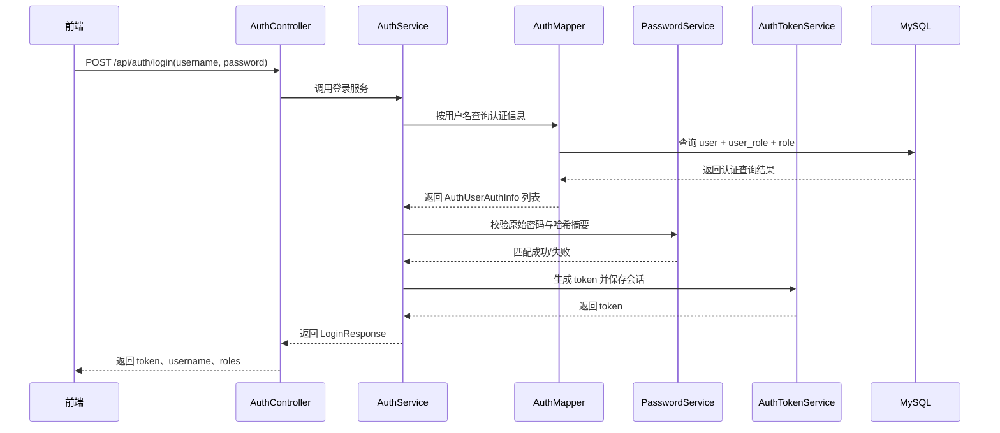
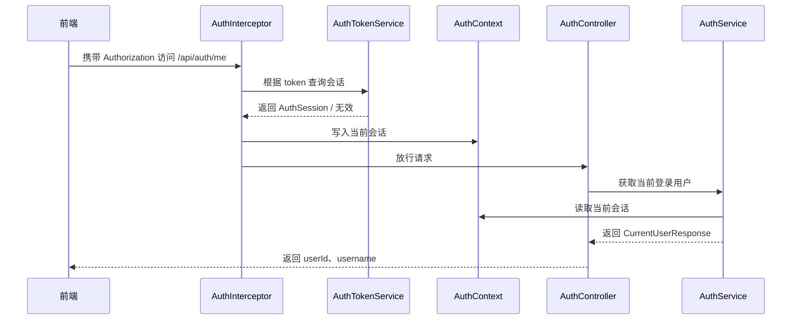

# Auth 模块实现说明

## 一、模块概述（Module Overview）

`auth` 模块是超市库存管理系统中的认证基础模块，主要负责系统登录身份识别、Token 发放与校验、当前登录用户识别，以及登录会话失效处理。

本模块当前已经完成的工作如下：

- 用户登录
- 用户登出
- Token 生成
- Token 有效性校验
- 当前登录用户识别
- 密码哈希匹配

本模块当前**不负责**的内容如下：

- 不负责商品、库存、入库、出库、盘点等业务处理
- 不负责用户资料维护的完整业务流程
- 不负责复杂权限控制与菜单权限控制
- 不负责 JWT、Redis、OAuth2 等重型认证方案

因此，本模块当前定位为：

**一个面向毕业设计阶段、实现清晰、结构轻量、可支撑后续模块认证链路的基础认证模块。**

---

## 二、相关数据表设计（Database Dependency）

`auth` 模块依赖以下 3 张数据表：

### 1. `user`

作用：

- 保存登录账号
- 保存密码哈希摘要
- 保存用户状态

当前认证中使用的关键字段：

- `id`
- `username`
- `password`
- `status`

说明：

- `password` 字段只保存密码哈希摘要，不保存明文密码
- `status` 用于控制用户是否可登录，当前约定 `1` 为启用，`0` 为禁用

### 2. `role`

作用：

- 保存角色名称与角色编码

当前认证中使用的关键字段：

- `id`
- `role_code`
- `role_name`

说明：

- 当前登录成功后会返回当前用户拥有的角色编码列表
- 当前阶段角色主要用于表达“用户身份信息”，还没有进入细粒度权限控制阶段

### 3. `user_role`

作用：

- 建立用户与角色的关联关系

当前认证中使用的关键字段：

- `user_id`
- `role_id`

说明：

- 通过 `user`、`user_role`、`role` 联表查询，系统可以获取某个用户的认证信息及角色列表

---

## 三、核心功能说明（Core Functions）

### 1. 登录认证

用户通过用户名和密码调用登录接口后，系统会先根据用户名查询数据库中的认证信息，再使用统一密码服务对原始密码与数据库中的密码哈希摘要进行匹配。若匹配成功，则生成 token 并返回给前端。

### 2. 登出失效

用户调用登出接口后，系统会将当前 token 对应的内存会话移除。这样一来，该 token 后续再访问受保护接口时，就会被判定为未登录或认证失败。

### 3. Token 校验

系统当前采用轻量级内存 token 方案。每次登录成功后，系统在内存中保存 token 与当前登录会话的映射关系。访问受保护接口时，拦截器会先校验 token 是否存在、是否有效，校验通过后才允许继续访问。

### 4. 当前用户识别

在 token 校验通过后，系统会把当前登录会话写入 `AuthContext`。这样业务层就可以在不直接读取请求头的前提下，拿到当前用户的 `userId` 和 `username`，从而识别“当前是谁在访问系统”。

### 5. 用户禁用拦截

登录时如果查询到用户状态不是启用状态，则系统直接拒绝登录，并返回 `403` 语义的业务异常。这体现了系统对账号状态的基本控制能力。

---

## 四、认证流程设计（Authentication Flow）

当前系统对“识别当前用户”的处理流程如下。

### 1. 登录流程



### 2. 访问受保护接口流程



### 3. 系统如何识别当前用户

系统识别当前用户的关键不在于再次查数据库，而在于以下链路：

1. 用户登录成功时生成 token
2. token 与 `AuthSession` 保存在内存中
3. 请求访问受保护接口时，由 `AuthInterceptor` 校验 token
4. 校验成功后，将当前会话写入 `AuthContext`
5. 后续业务逻辑通过 `AuthContext` 获取当前用户信息

这种方式结构简单，便于毕业设计阶段实现与展示。

---

## 五、密码安全设计（Password Security）

### 1. 当前方案

当前密码方案正式采用 `BCrypt`，并通过统一的 `PasswordService` 进行封装。

### 2. 为什么不保存明文密码

如果数据库泄露，明文密码会直接暴露用户原始口令，风险极高。因此系统只保存密码哈希摘要，不保存原始密码。

### 3. 为什么统一走 PasswordService

为了避免密码加密逻辑散落在登录、用户新增、密码重置等不同位置，系统统一通过 `PasswordService` 完成：

- 密码编码
- 密码匹配

这样做的好处是：

- 逻辑集中
- 便于维护
- 后续升级算法时修改点少

### 4. 后续升级空间

当前虽然使用的是 `BCrypt`，但系统已经通过 `PasswordService` 做了抽象。后续如果需要升级到 `Argon2id`，可以在不大量修改业务代码的情况下完成替换。

### 5. 密码返回控制

当前模块严格遵循以下规则：

- 登录响应不返回密码
- 当前用户接口不返回密码
- 内部认证查询结果不直接返回前端
- 业务代码中不打印原始密码

---

## 六、系统架构与分层设计（Architecture Design）

当前 `auth` 模块采用轻量分层设计，重点是职责清晰。

### 1. `controller`

作用：

- 接收 HTTP 请求
- 做请求参数绑定
- 调用服务层
- 返回统一响应结构

当前类：

- `AuthController`

### 2. `service`

作用：

- 编排认证业务流程
- 控制登录、登出、当前用户获取
- 管理 Token 生命周期

当前类：

- `AuthService`
- `AuthServiceImpl`
- `AuthTokenService`

### 3. `mapper`

作用：

- 负责数据库查询
- 当前只负责认证所需的联表读取

当前类：

- `AuthMapper`

### 4. `password`

作用：

- 封装密码哈希逻辑
- 保持算法实现与业务代码解耦

当前类：

- `PasswordService`
- `BcryptPasswordService`

### 5. `interceptor`

作用：

- 对受保护接口进行 token 校验
- 成功后建立当前请求会话上下文

当前类：

- `AuthInterceptor`

### 6. `context`

作用：

- 保存当前请求线程中的登录会话

当前类：

- `AuthContext`

### 7. `model`

作用：

- 保存模块内部使用的认证模型
- 不直接面向前端

当前类：

- `AuthSession`
- `AuthUserAuthInfo`

### 8. `dto`

作用：

- 接收请求参数

当前类：

- `LoginRequest`

### 9. `vo`

作用：

- 返回给前端的响应对象

当前类：

- `LoginResponse`
- `CurrentUserResponse`

---

## 七、接口设计说明（API Design）

### 1. `POST /api/auth/login`

功能：

- 用户登录

输入：

- `username`
- `password`

输出：

- `token`
- `username`
- `roles`

说明：

- 密码错误时返回 `401`
- 用户不存在时返回 `401`
- 用户被禁用时返回 `403`
- 不返回密码明文和哈希摘要

### 2. `POST /api/auth/logout`

功能：

- 用户登出并失效 token

输入：

- 请求头中的 `Authorization`

输出：

- 统一成功响应

说明：

- token 失效后，再访问受保护接口应返回 `401`

### 3. `GET /api/auth/me`

功能：

- 获取当前登录用户信息

输入：

- 请求头中的 `Authorization`

输出：

- `userId`
- `username`

说明：

- 这是当前 `auth` 模块的受保护接口
- token 有效时可获取当前会话中的用户信息
- token 无效或缺失时返回 `401`

---

## 八、异常处理与响应结构（Error Handling）

### 1. 统一响应结构

当前系统统一采用如下结构：

```json
{
  "code": 0,
  "message": "success",
  "data": {}
}
```

### 2. 当前使用的状态语义

- `0`：成功
- `400`：请求参数错误
- `401`：未登录或认证失败
- `403`：已登录但无权限，或当前用户被禁用
- `500`：系统内部异常

### 3. 当前 auth 模块中的异常处理方式

- 登录用户名不存在：抛出 `BusinessException(401, "用户名或密码错误")`
- 登录密码错误：抛出 `BusinessException(401, "用户名或密码错误")`
- 用户禁用：抛出 `BusinessException(403, "当前用户已被禁用")`
- token 无效或未携带：抛出 `BusinessException(401, "未登录或认证失败")`

所有异常最终由全局异常处理器统一转换为 `ApiResponse` 返回给前端。

---

## 九、测试与验证（Testing）

当前已经完成的测试包括：

### 1. 登录成功测试

验证点：

- 正确用户名密码可登录成功
- 能正常返回 token、username、roles

### 2. 用户不存在测试

验证点：

- 用户名不存在时返回 `401`

### 3. 密码错误测试

验证点：

- 密码错误时返回 `401`

### 4. 用户禁用测试

验证点：

- 用户状态为禁用时返回 `403`

### 5. 当前用户接口测试

验证点：

- 携带有效 token 时，`/api/auth/me` 返回当前用户信息
- 不带 token 时，`/api/auth/me` 返回 `401`
- token 无效时，`/api/auth/me` 返回 `401`

### 6. 登出失效测试

验证点：

- 登出后原 token 失效
- 原 token 再访问 `/api/auth/me` 返回 `401`

### 7. 哈希生成测试

验证点：

- 可通过 `PasswordEncodeTest` 生成测试使用的 `BCrypt` 哈希值

### 8. 编译与测试验证

当前已通过：

- Maven 编译验证
- `auth` 模块相关测试执行验证

说明：

- 当前测试以服务层测试和 Web 层测试为主
- 由于当前 token 使用内存方案，因此测试链路简单、可控

---

## 十、当前实现特点与设计取舍（Design Decisions）

### 1. 为什么当前使用内存 token

这是毕业设计阶段的轻量化取舍。

优点：

- 实现简单
- 便于理解
- 便于答辩展示

缺点：

- 服务重启后会话失效
- 不适合分布式部署

### 2. 为什么没有直接上 Spring Security 全套框架

当前项目明确不追求企业级重型认证方案，而是追求：

- 可控
- 清晰
- 够用

因此选择自定义轻量实现，更适合当前毕业设计复杂度。

### 3. 为什么把会话写入 AuthContext

这样业务层在识别当前用户时，不需要每次都重新解析请求头，也不需要让 Controller 直接处理认证细节，层次更清晰。

### 4. 为什么把内部认证查询模型单独放在 model

这样可以避免 DTO、VO 与内部查询模型混用，增强结构清晰度，也更符合分层职责。

### 5. 为什么密码服务单独封装

这是为了保证密码逻辑的统一性，并为后续升级 `Argon2id` 预留空间。

---

## 十一、存在的不足与后续优化方向（Future Work）

当前 `auth` 模块虽然已经具备基本可用能力，但仍存在以下不足：

### 1. Token 方案仍为轻量内存实现

不足：

- 服务重启后 token 会失效
- 不能跨实例共享

后续优化方向：

- 若项目后期确有需要，可升级到 Redis 或 JWT 方案

### 2. 当前只有认证，没有细粒度权限控制

不足：

- 当前只做到“是否登录”
- 还未做到“角色是否可访问某接口”

后续优化方向：

- 增加角色级接口权限校验

### 3. 当前缺少 token 过期时间与刷新机制

不足：

- token 目前没有主动过期控制

后续优化方向：

- 为 token 增加生命周期管理

### 4. 当前没有接入完整用户模块密码复用链路

不足：

- 当前密码服务已经具备，但用户新增、重置密码等完整场景仍需在后续 `user` 模块中复用

后续优化方向：

- 在 `user` 模块中统一复用 `PasswordService`

### 5. HTTPS 目前属于部署要求

不足：

- 本地开发阶段未强制启用 HTTPS

后续优化方向：

- 在部署说明与最终上线环境中明确强制使用 HTTPS

---

## 结语

当前 `auth` 模块已经形成一条完整的基础认证链路：

- 能登录
- 能登出
- 能生成 token
- 能校验 token
- 能识别当前登录用户
- 能统一处理密码哈希
- 能通过统一响应与异常处理保持接口规范

这使得 `auth` 模块已经可以作为后续其它业务模块访问控制的基础支撑模块，同时又保持了适合毕业设计阶段的实现复杂度与可讲解性。
